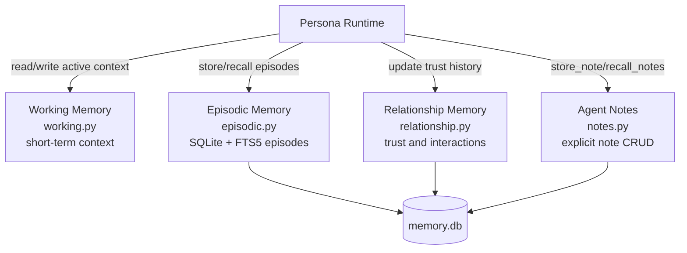

# RFC 0005 Memory Architecture

RFC 0005 introduces four complementary memory tiers with different lifetimes and purposes.

Read/write paths:
- Read: agent injects relevant working, episodic, and relationship context before LLM calls.
- Write: outcomes and reflections are persisted to episodic/notes; interactions update relationship trust.

> **Note**: Working Memory (`W`) does not persist to `memory.db` — it is volatile in-process state
> cleared on agent shutdown. Only Episodic, Relationship, and Notes stores write to SQLite.
> (F-69-04: clarify Working Memory volatility to explain the missing DB edge.)
