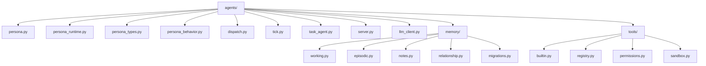

# RFC 0005 Module Structure (Post Refactor)

Python agent package layout after PRs 8a, 8b, 8c, and 8d.

Responsibilities:
- persona.py: PersonaAgent ABC, factory, compatibility re-exports.
- persona_runtime.py: concrete LLM persona runtime implementation.
- dispatch.py and tick.py: event execution and autonomous scheduling.
