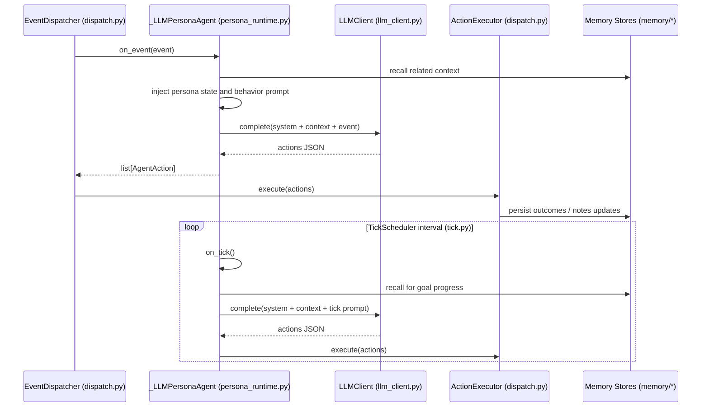

# RFC 0005 Persona Runtime Flow

This sequence describes how persona agents process events and autonomous ticks.

Key points:
- Event-driven execution and tick-driven execution both converge on action execution.
- Memory context is injected before each LLM decision step.
- The tick loop intentionally bypasses `EventDispatcher` — `TickScheduler` calls `ActionExecutor`
  directly after receiving actions from `on_tick()`. This is by design: ticks are autonomous
  self-initiated cycles, not inbound events. Verified against `agents/tick.py`. (F-69-05)
