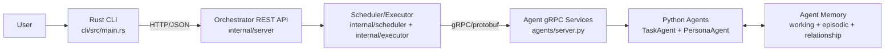

# RFC 0005 System Overview

This diagram shows the top-level runtime boundaries and protocols after RFC 0005.

Notes:
- CLI talks only to the orchestrator over REST.
- Orchestrator dispatches work to Python agents over gRPC.
- Memory is owned and managed by the Python agent runtime.
