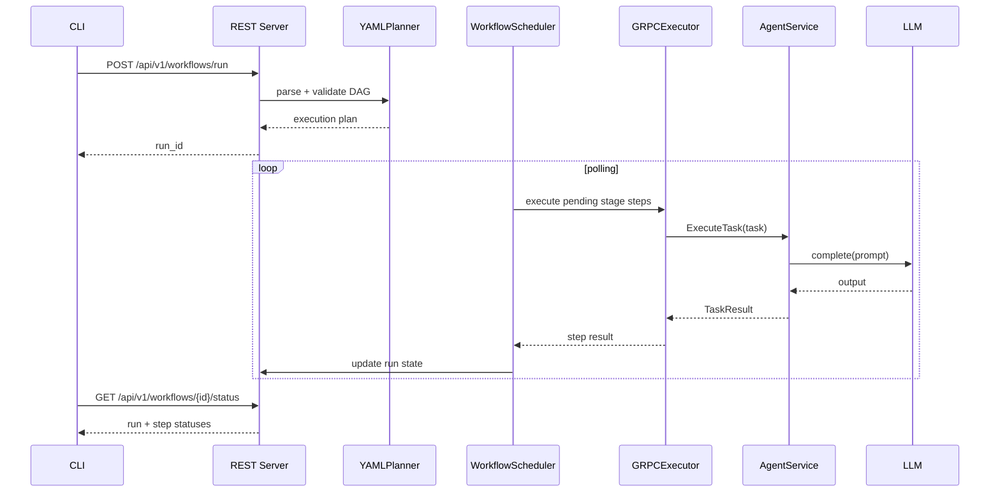

# RFC 0005 Workflow Execution Sequence

End-to-end execution from workflow submission to step completion.

This flow is unchanged by RFC 0005 at the transport boundary; RFC 0005 expands agent internals (persona, memory, autonomy).
