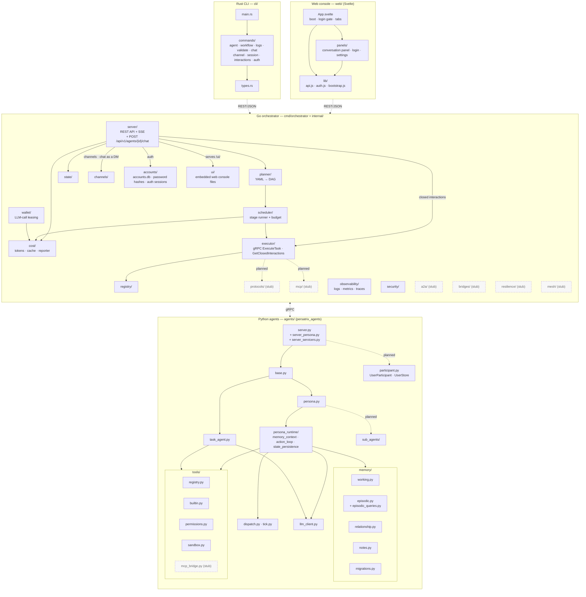

# Component Architecture

Package-level view of the four source trees: the Rust CLI, the web console,
the Go orchestrator and the Python agents. Every directory directly under
`internal/` is either drawn or listed under
[Packages without a box](#packages-without-a-box); the other trees show their
main modules only. Shipped packages are shown as solid boxes; intentional TODO
stubs reserved for later phases are shown with dashed borders.

Inside the Go group, arrows follow a request from one package to the next;
they are not the import graph, and `security/` and `observability/` have no
arrows yet. Dotted arrows between the language groups are network calls; the
other dotted arrows are planned links.

## Phase ownership

| Phase | Shipped components |
|-------|--------------------|
| v0.1 | `planner/`, `scheduler/`, `executor/`, `registry/`, `state/`, `server/`, `agents/tools/` |
| v0.2 | `cost/`, `agents/task_agent.py`, `agents/persona*`, `agents/persona_runtime/`, `agents/memory/` |
| v0.2.1 | `agents/participant.py` (`UserParticipant`, `UserStore`), `internal/server/chat_handler.go` (`POST /api/v1/agents/{id}/chat`), `internal/executor/` chat path (`SendChatMessage` gRPC), `cli/src/commands/chat` (`persatrix chat`) |
| v0.2.3 | `internal/observability/` (RFC 0018 + RFC 0019 — telemetry: structured logs, metrics and traces; renamed from `internal/telemetry/`, which had OpenTelemetry tracing since v0.2) |
| v0.3.0 | `internal/channels/` (RFC 0011 — internal agent-to-agent messaging), `internal/security/` (RFC 0009 Phases 1–2 — redactor, audit log, rate limiter), `agents/sub_agents/` (RFC 0008 — delegation contract and result merge), `cli/src/commands/channel` (`persatrix channel`) |
| v0.3.2 | `internal/wallet/` (RFC 0023 — LLM-call leasing `WalletService`; Phases 1–6 implemented: enforcement + TTL reaper + per-agent active-lease cap composed over `cost/`, with the Python `WalletClient` wired into all five LLM-call origins — workflow task, chat, autonomous TICK, sub-agent, channel-message) |
| v0.3.5 | `cli/src/commands/session` (`persatrix session` — RFC 0031 persona-memory sessions) |
| v0.3.6 | `web/` and `internal/ui/` (RFC 0048 — the web console, compiled into the orchestrator and served at `/ui/` when it starts with `--enable-ui`) |
| v0.3.8 | `cli/src/commands/interactions` (`persatrix agent interactions` — RFC 0020 summaries of closed interactions) |
| v0.3.12 | `internal/accounts/` (RFC 0039 — accounts, password hashes and auth sessions in `accounts.db`), `cli/src/commands/auth` (`persatrix login` · `logout` · `whoami`) |
| v0.3+ (stubs) | `a2a/`, `bridges/`, `resilience/`, `mesh/`, `mcp/`, `protocols/`, `agents/tools/mcp_bridge.py` |

The `SERVER -->|channels · chat as a DM| CHAN` edge carries chat as well as
the channel routes: since v0.3.0, `POST /api/v1/agents/{id}/chat` posts the
message to the caller's DM channel and waits for the agent's reply, and the
channel router reaches the agent over `ReceiveChannelMessage` gRPC. The
executor's v0.2.1 `SendChatMessage` path is still built but never called
([ISSUE-0035](../issues/ISSUE-0035-chat-executor-dead-but-wired-cleanup.md)).
The `SERVER -->|closed interactions| EXECUTOR` edge is
`persatrix agent interactions` fetching an agent's closed-conversation
summaries (`GetClosedInteractions` gRPC). The workflow path still flows
`SERVER → PLANNER → SCHEDULER → EXECUTOR`.

The `Go <-.->|gRPC| Py` edge runs both ways: the orchestrator calls agents
(`ExecuteTask`, `ReceiveChannelMessage`, `GetClosedInteractions`), and agents
call back to lease LLM calls from `wallet/` and to stream their logs to
`observability/`.

The `SRV -. planned .-> PART` edge is dashed because `agents/server.py` /
`agents/server_servicers.py` ship `participant.py` in v0.2.1 but do not yet
route chat traffic through `UserStore`. Only the pure validator
`validate_participant_type` is imported today; relationship memory is keyed on
`(agent_id, user_id)` and written when a DM conversation closes. The dashed
edge mirrors the `AGSVC -. planned .-> PART` treatment in
[system-overview.md](system-overview.md) so the two diagrams agree about the
v0.2.1 wiring gap.

The `PERSONA -. planned .-> SUB` edge is dashed for a similar reason.
`agents/sub_agents/` holds tested code for handing a task to a
[sub-agent](../ai-glossary.md#sub-agent) and merging its result back
(RFC 0008), so the box is solid. But nothing starts a sub-agent yet: a
persona's `SPAWN_SUB_AGENT` action returns `not_implemented`, and ROADMAP
plans spawning for [v0.4.0](../../ROADMAP.md#planned-components-v040).

The `WALLET --> COST` edge is solid: RFC 0023 PR 2 ([#384](https://github.com/mkhomutov/Persatrix/pull/384))
composes `cost.BudgetEnforcer` and `cost.TokenCounter` into the
`WalletService`, so every lease acquire/settle reads through `cost/` for
budget enforcement and reconciles into the shared token counter. The
Python `WalletClient` is wired into all five LLM-call origins (workflow
task → PR 3 #385, chat → PR 4 #387, autonomous TICK + sub-agent → PR 5
#388, channel-message → PR 6 #389); the chat-error publish path for
budget denial + RESOURCE_EXHAUSTED is finalised by [#395](https://github.com/mkhomutov/Persatrix/pull/395) / [#396](https://github.com/mkhomutov/Persatrix/pull/396) / [#398](https://github.com/mkhomutov/Persatrix/pull/398).

The `SERVER -->|auth| ACCOUNTS` edge is the REST server checking passwords
and auth sessions against `accounts.db`
([RFC 0039](../rfcs/0039-user-accounts-authentication.md)); auth ships
switched off, so the server only turns callers away once
`config/security.yaml` sets `auth.mode: enabled`
([auth guide](../guides/auth.md#the-switch-authmode)).

The `SERVER -->|serves /ui/| UI` edge is how the web console reaches a
browser: `make ui` builds `web/` into `internal/ui/assets/`, those files are
compiled into the orchestrator binary, and the server hands them out at `/ui/`
only when the orchestrator starts with `--enable-ui`. The flag is off by
default, but the Docker demo stack turns it on and builds the console inside
the orchestrator image, so it needs no `make ui`
([web console guide](../guides/web-console.md#quick-start-docker-demo)).

The `Web -.->|REST/JSON| Go` edge is the console, once loaded in the browser,
calling the same `/api/v1` REST API as the CLI, plus two read-only routes that
exist only under `--enable-ui` (`/api/v1/ui/config` and `/api/v1/ui/context`).
It polls for new messages rather than streaming them.

The `EXECUTOR -. planned .-> MCPG` and `EXECUTOR -. planned .-> PROTOS` edges
are dashed, and those two boxes and `mcp_bridge.py` are stubs, because none of
them is built. The [MCP bridge](../ai-glossary.md#mcp-bridge) is planned, and
`protocols/` holds only `TODO` comments that no Go code imports yet. ROADMAP
lists both among the
[v0.4.0 planned components](../../ROADMAP.md#planned-components-v040).

The stub packages are placeholders with `TODO` comments that compile but do not
implement behaviour. They are intentional — removing them is a policy violation
per [CLAUDE.md](../../CLAUDE.md).

## Packages without a box

Three directories under `internal/` hold real code but have no box on purpose:

- `internal/generated/` — three packages (`logpb`, `taskpb`, `walletpb`)
  generated from the `.proto` files; see the import rules below.
- `internal/defaults/` (since v0.2.0) — shared default limits, such as how many
  LLM calls one workflow step may make and how long it may run. It holds
  constants only, which `scheduler/`, `executor/` and `channels/` read.
- `internal/archpolicy/` (since v0.3.10) — a licence check that runs as a Go
  test. It fails if a package meant to be published on its own under the MIT
  licence imports orchestrator code that stays under the stricter Business
  Source License 1.1
  ([RFC 0045](../rfcs/0045-open-core-extraction-policy.md#b-the-dependency-direction-invariant)).
  Nothing imports it at run time;
  [open-core-reserved-seams.md](../open-core-reserved-seams.md#the-mechanical-half)
  says which packages it guards.

Outside `internal/`, three more have no box: `cmd/genpatterns`, a build-time
tool that writes the Python copies of the orchestrator's security patterns and
enums, and the Python packages `agents/observability/` (including the log
shipper — see [observability-stack.md](observability-stack.md)) and
`agents/temporal/` (time-awareness helpers, RFC 0021). The Python group shows
selected modules, not every file.

## Package import rules

- **No import cycles** across language boundaries. CLI never imports from
  `internal/`; agents never import from `internal/`.
- **Generated code** (`internal/generated/`, `agents/generated/`) is produced
  from `proto/*.proto` by `make proto` and is never edited directly.
- **Python package path** is `persatrix_agents` (configured via
  `agents/pyproject.toml` `tool.setuptools.package-dir`).
