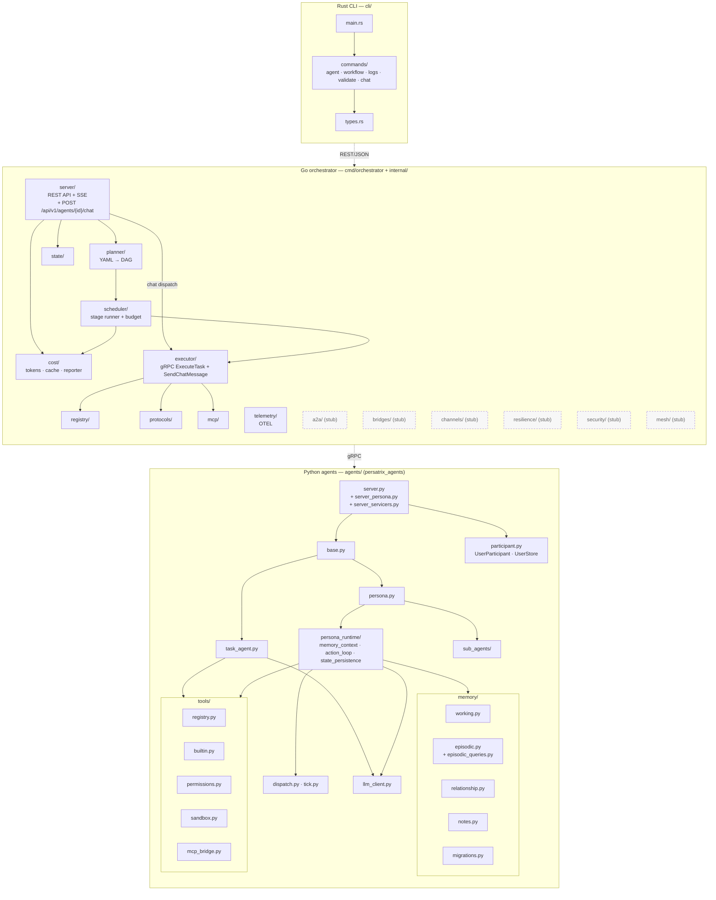

# Component Architecture

Package-level view across the three languages. Shipped packages are shown
as solid boxes; intentional TODO stubs reserved for later phases are shown
with dashed borders.

## Phase ownership

| Phase | Shipped components |
|-------|--------------------|
| v0.1 | `planner/`, `scheduler/`, `executor/`, `registry/`, `state/`, `server/`, `mcp/`, `protocols/`, `agents/task_agent.py`, `agents/tools/` |
| v0.2 | `cost/`, `telemetry/`, `agents/persona*`, `agents/persona_runtime/`, `agents/memory/`, `agents/sub_agents/` |
| v0.2.1 | `agents/participant.py` (`UserParticipant`, `UserStore`), `internal/server/chat_handler.go` (`POST /api/v1/agents/{id}/chat`), `internal/executor/` chat path (`SendChatMessage` gRPC), `cli/src/commands/chat` (`persatrix chat`) |
| v0.3+ (stubs) | `a2a/`, `bridges/`, `channels/`, `resilience/`, `security/`, `mesh/` |

The stub packages are placeholders with `TODO` comments that compile but do not
implement behaviour. They are intentional — removing them is a policy violation
per [CLAUDE.md](../../.github/CLAUDE.md).

## Package import rules

- **No import cycles** across language boundaries. CLI never imports from
  `internal/`; agents never import from `internal/`.
- **Generated code** (`internal/generated/`, `agents/generated/`) is produced
  from `proto/*.proto` by `make proto` and is never edited directly.
- **Python package path** is `persatrix_agents` (configured via
  `agents/pyproject.toml` `tool.setuptools.package-dir`).
