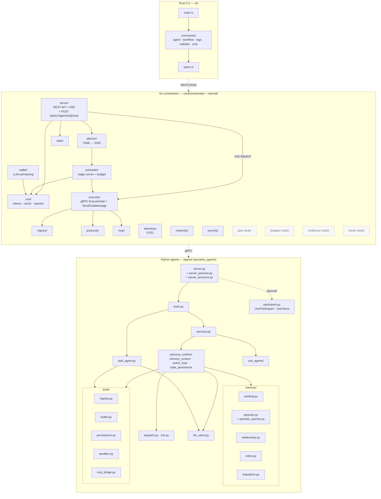

# Component Architecture

Package-level view across the three languages. Shipped packages are shown
as solid boxes; intentional TODO stubs reserved for later phases are shown
with dashed borders.

## Phase ownership

| Phase | Shipped components |
|-------|--------------------|
| v0.1 | `planner/`, `scheduler/`, `executor/`, `registry/`, `state/`, `server/`, `mcp/`, `protocols/`, `agents/task_agent.py`, `agents/tools/` |
| v0.2 | `cost/`, `telemetry/`, `agents/persona*`, `agents/persona_runtime/`, `agents/memory/`, `agents/sub_agents/` |
| v0.2.1 | `agents/participant.py` (`UserParticipant`, `UserStore`), `internal/server/chat_handler.go` (`POST /api/v1/agents/{id}/chat`), `internal/executor/` chat path (`SendChatMessage` gRPC), `cli/src/commands/chat` (`persatrix chat`) |
| v0.3.0 | `internal/channels/` (RFC 0011 — internal agent-to-agent messaging), `internal/security/` (RFC 0009 Phases 1–2 — redactor, audit log, rate limiter) |
| v0.3.2 | `internal/wallet/` (RFC 0023 — LLM-call leasing `WalletService`; Phases 1–6 implemented: enforcement + TTL reaper + per-agent active-lease cap composed over `cost/`, with the Python `WalletClient` wired into all five LLM-call origins — workflow task, chat, autonomous TICK, sub-agent, channel-message) |
| v0.3+ (stubs) | `a2a/`, `bridges/`, `resilience/`, `mesh/` |

The labeled `SERVER -->|chat dispatch| EXECUTOR` edge represents the chat
path (`POST /api/v1/agents/{id}/chat` → `GRPCChatExecutor.SendChatMessage`);
the workflow path still flows `SERVER → PLANNER → SCHEDULER → EXECUTOR` and
is unaffected by the chat surface.

The `SRV -. planned .-> PART` edge is dashed because `agents/server.py` /
`agents/server_servicers.py` ship `participant.py` in v0.2.1 but do not yet
route chat traffic through `UserStore`. Only the pure validator
`validate_participant_type` is imported today; relationship memory is keyed on
`(agent_id, user_id)` and written directly. The dashed edge mirrors the
`AGSVC -. planned .-> PART` treatment in [system-overview.md](system-overview.md)
so the two diagrams agree about the v0.2.1 wiring gap.

The `WALLET --> COST` edge is solid: RFC 0023 PR 2 ([#384](https://github.com/mkhomutov/Persatrix/pull/384))
composes `cost.BudgetEnforcer` and `cost.TokenCounter` into the
`WalletService`, so every lease acquire/settle reads through `cost/` for
budget enforcement and reconciles into the shared token counter. The
Python `WalletClient` is wired into all five LLM-call origins (workflow
task → PR 3 #385, chat → PR 4 #387, autonomous TICK + sub-agent → PR 5
#388, channel-message → PR 6 #389); the chat-error publish path for
budget denial + RESOURCE_EXHAUSTED is finalised by [#395](https://github.com/mkhomutov/Persatrix/pull/395) / [#396](https://github.com/mkhomutov/Persatrix/pull/396) / [#398](https://github.com/mkhomutov/Persatrix/pull/398).

The stub packages are placeholders with `TODO` comments that compile but do not
implement behaviour. They are intentional — removing them is a policy violation
per [CLAUDE.md](../../CLAUDE.md).

## Package import rules

- **No import cycles** across language boundaries. CLI never imports from
  `internal/`; agents never import from `internal/`.
- **Generated code** (`internal/generated/`, `agents/generated/`) is produced
  from `proto/*.proto` by `make proto` and is never edited directly.
- **Python package path** is `persatrix_agents` (configured via
  `agents/pyproject.toml` `tool.setuptools.package-dir`).
