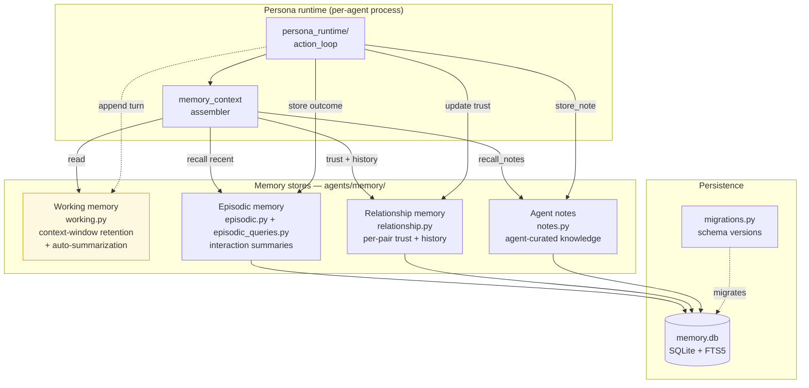

# Memory Architecture

Persona agents have four complementary memory stores with different lifetimes,
purposes, and persistence characteristics. Working memory lives in-process;
the other three are backed by a shared SQLite database.

## Tier characteristics

| Tier | Lifetime | Backing store | Primary use |
|------|----------|--------------|-------------|
| **Working** | Volatile — cleared on agent shutdown | In-process (Python) | Assemble the current prompt; priority-weighted retention; summarizes low-priority sections when the token budget is exceeded |
| **Episodic** | Persistent | SQLite + FTS5 | Recall past interactions by relevance; outcome + decision log |
| **Relationship** | Persistent | SQLite | Per-agent-pair trust score, bidirectionally decayed toward neutral (0.5) so grudges don't calcify |
| **Notes** | Persistent | SQLite | Agent-authored structured knowledge, reached via tool calls (`store_note`, `recall_notes`) |

## Context assembly order

On every LLM call, `memory_context.py` composes the system prompt by layering
(in order):

1. Persona identity + behaviour (static from `config/agents.yaml`).
2. Relationship snapshot for participants in the current interaction.
3. Episodic recall — top-K semantically relevant past episodes.
4. Selected notes (if referenced by the event/goal).
5. Working memory (most recent turns, priority-weighted).

If the assembled context exceeds the model's window, `working.py` runs
automatic summarization on the lowest-priority sections.

## Schema & migrations

`agents/memory/migrations.py` owns the schema for `memory.db`. All three
persistent stores share the same database and migration runner — a single
schema version covers episodic, relationship, and notes tables.

`NoteStore` explicitly piggybacks on the connection managed by
`EpisodicMemory` and does not run its own migrations.

## Token counting

`working.py::estimate_tokens` defaults to `chars/4` (≈85% accurate for English
prose). Callers that need higher fidelity pass `accurate=True` to use
`tiktoken cl100k_base` if available, falling back to `chars/4` if not
installed.

See [persona-runtime.md](persona-runtime.md) for how the context assembler
is invoked on each tick / event.
