# Observability Stack

Signal flow for the v0.2.3 Observability Foundation (RFCs 0018 + 0019). Two
complementary pipelines share the same processes and the same W3C baggage +
trace-context propagation across the gRPC boundary:

1. **Structured logs** → agent shippers → orchestrator `LogService` →
   in-memory ring buffer + per-execution disk store → REST/SSE →
   `persatrix logs` CLI.
2. **Traces + metrics** (OTLP) → OpenTelemetry Collector → tail-sampling →
   per-signal backends (Jaeger / Prometheus / Loki).

```mermaid
graph LR
    subgraph Runtimes["Persatrix runtimes"]
        ORCH["Orchestrator (Go)<br/>zap (RFC 0018 schema)<br/>internal/observability"]
        AG["Persona/Task Agent (Python)<br/>structlog (RFC 0018 schema)<br/>agents/observability"]
        CLI["Rust CLI<br/>persatrix logs / run"]
    end

    subgraph Correlation["gRPC metadata (RFC 0018 § 8 + RFC 0019 § E)"]
        MD["persatrix-execution-id<br/>persatrix-step-id<br/>persatrix-agent-id<br/>persatrix-workflow-id<br/>+ W3C traceparent + baggage"]
    end

    subgraph LogPipeline["Log pipeline (RFC 0018 PRs 4–6)"]
        SHIP["log_shipper (Python)<br/>agents/observability/log_shipper.py"]
        LS["LogService gRPC server<br/>internal/observability/logbuffer"]
        RING["Ring buffer<br/>(in-memory, per-execution)"]
        DISK["Disk store<br/>/var/lib/persatrix/logs/&lt;run_id&gt;"]
        REST["REST + SSE<br/>GET /api/v1/executions/&#123;id&#125;/logs<br/>GET /api/v1/executions/&#123;id&#125;/logs/stream"]
        PLOGS["persatrix logs &lt;id&gt;<br/>--follow / --trace / --level / --since"]
    end

    subgraph OtelPipeline["OTLP pipeline (RFC 0019 PRs 3–4)"]
        COLL["OpenTelemetry Collector<br/>config/observability/otel-collector.yaml<br/>tail_sampling + batch"]
        JAEGER["Jaeger<br/>:16686"]
        PROM["Prometheus<br/>:9091<br/>(histogram exemplars)"]
        LOKI["Loki<br/>:3100"]
    end

    ORCH -->|"gRPC ExecuteTask<br/>(otelgrpc + grpcmeta)"| MD
    MD -->|"Python interceptor<br/>binds contextvars"| AG

    AG -->|"zapcore.Entry-like records"| SHIP
    SHIP -->|"gRPC LogService.Publish"| LS
    ORCH -->|"direct Append<br/>(local zap core)"| RING
    LS --> RING
    RING -->|"flush on eviction/seal"| DISK
    RING --> REST
    DISK -. "warm-load<br/>(no-op today — RFC 0018 PR 7 wires Seal)" .-> RING
    REST --> CLI
    CLI -->|"--follow → SSE reconnect"| REST
    REST -. rendered .-> PLOGS

    ORCH -->|"OTLP HTTP :4318"| COLL
    AG -->|"OTLP HTTP :4318"| COLL
    COLL -->|"traces<br/>(errors + ≥5s + workflow-tagged + 1% sample)"| JAEGER
    COLL -->|"metrics scrape"| PROM
    COLL -->|"logs (OTLP push)"| LOKI

    PROM -. "exemplar → trace_id" .-> JAEGER
    JAEGER -. "trace_id → persatrix logs --trace" .-> CLI

    classDef store fill:#fff8e1,stroke:#d39e00
    classDef correlation fill:#e8f4fd,stroke:#1f6feb
    class RING,DISK store
    class MD correlation
```

## What's in which process

| Concern | Go orchestrator | Python agent | Collector | CLI |
|---------|-----------------|--------------|-----------|-----|
| Log encoder | `internal/observability/zapenc` | `agents/observability/logging` (structlog) | — | — |
| Correlation ID propagation | `internal/observability/grpcmeta.InjectIDs` | `LoggingMetadataInterceptor` | — | — |
| Trace context | `otelgrpc.NewClientHandler()` + `otelhttp.NewHandler` | `GrpcInstrumentorServer` + `CompositePropagator` | `tail_sampling` processor | — |
| Metrics | `internal/observability/metrics` (orchestrator.*) | `agents/observability/metrics` (agent.*) | passes through to Prometheus | — |
| Log storage | `internal/observability/logbuffer` (ring + disk) | — | — | — |
| Log ingress | `LogService` gRPC (agents push here) | `agents/observability/log_shipper` (client) | — | — |
| Log egress | REST snapshot + SSE `/stream` | — | — | `cli/src/commands/logs.rs` |

## Signal-to-backend mapping

| Signal | Emitter | Wire | Landing place |
|--------|---------|------|---------------|
| Structured log line | zap (Go) / structlog (Python) | gRPC `LogService.Publish` (agent→orch) + in-process append (orch) | Ring buffer → REST/SSE → `persatrix logs` |
| Structured log line (mirrored) | zap / structlog | OTLP logs | Collector → Loki |
| Trace span | OTEL SDK (Go + Python) | OTLP HTTP `:4318` | Collector → Jaeger |
| Metric point | OTEL SDK (Go + Python) | OTLP HTTP `:4318` | Collector → Prometheus (with histogram exemplars) |

## Cross-signal correlation

Every in-flight gRPC call carries both W3C trace context and the RFC 0018
reserved correlation IDs in its metadata (see the **Correlation** node in the
diagram above). Handlers rebind them into structlog contextvars / zap logger
context at entry and clean up at exit, so:

- A trace ID found in Jaeger produces the exact same record set through
  `persatrix logs --trace <trace_id>` (CLI) and `{trace_id="<id>"}` (Loki).
- A Prometheus histogram exemplar carries an active-span `trace_id` /
  `span_id` that links directly to the originating trace in Jaeger.
- A workflow ID lookup (`persatrix.workflow_id=<id>` in Jaeger) returns every
  span in that workflow across both `persatrix-server` and `persatrix-agent`.

See [../observability.md § 11.4](../observability.md#114-correlated-debugging-from-a-trace-id)
for the step-by-step walkthrough.

## Related diagrams

- [system-overview.md](system-overview.md) — top-level runtime context.
- [workflow-execution.md](workflow-execution.md) — the workflow dispatch
  sequence that produces the trace tree rendered here.
- [persona-runtime.md](persona-runtime.md) — where the per-span events
  (`agent.persona.tick`, `agent.persona.event`) originate.
