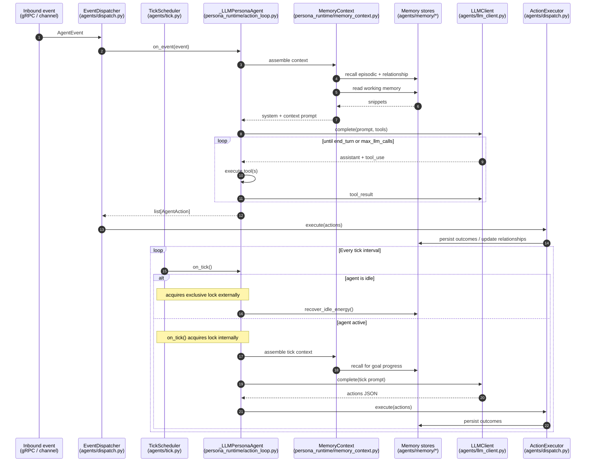

# Persona Runtime

Persona agents (v0.2) run two concurrent loops that both converge on the same
action executor: an **event-driven** loop (inbound messages/stimuli) and an
**autonomous tick** loop (self-initiated cycles on an interval).

## Two paths, one executor

Event dispatch and tick scheduling **both** terminate at `ActionExecutor`, but
they reach it differently:

- **Event path**: `EventDispatcher.on_event()` → persona → `ActionExecutor`.
- **Tick path**: `TickScheduler.tick()` → persona → `ActionExecutor` (bypasses
  `EventDispatcher` — ticks are self-initiated, not inbound events).

This asymmetry is intentional and verified in `agents/tick.py`.

## Lock protocol

`agents/tick.py` has two branches with different locking strategies:

| Branch | Lock acquired by |
|--------|------------------|
| Idle (`is_idle == True`) | `TickScheduler` wraps the call in `agent.exclusive()` because `recover_idle_energy()` does not self-lock |
| Active | `agent.on_tick()` acquires the per-agent lock internally; wrapping externally would deadlock (`asyncio.Lock` is not reentrant) |

Any refactor to the lock strategy must preserve this asymmetry.

## Action loop termination

The multi-turn LLM loop in `persona_runtime/action_loop.py` terminates on any
of:

- `stop_reason == "end_turn"` from the provider,
- `max_llm_calls` budget exhausted (default **5** as of v0.2 — the v0.1
  default of 10 was lowered; see `CHANGELOG.md`),
- Workflow-level budget abort signalled from the orchestrator's cost tracker.

See [memory-architecture.md](memory-architecture.md) for how the context
assembly step pulls from the three memory tiers, and
[workflow-execution.md](workflow-execution.md) for how budget enforcement
reaches the agent.
