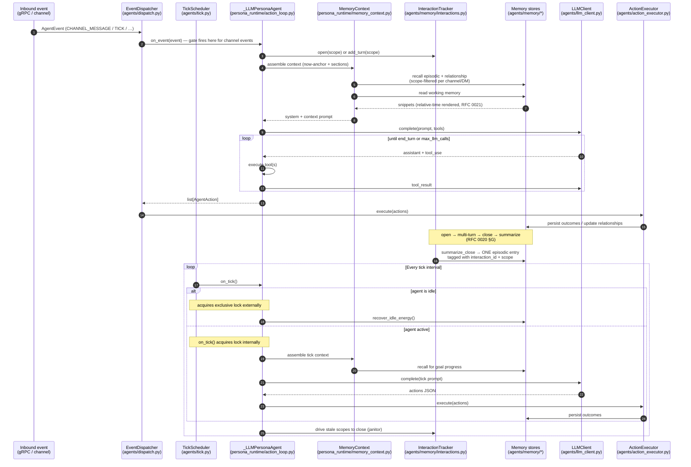

# Persona Runtime

Persona agents run two concurrent loops that both converge on the same
action executor: an **event-driven** loop (inbound messages/stimuli) and an
**autonomous tick** loop (self-initiated cycles on an interval). v0.3.0
also introduces an **interaction lifecycle** that sits between the event
loop and the episodic store ([RFC 0020](../rfcs/0020-interaction-lifecycle.md)):
inbound turns no longer write one episodic entry each — they accumulate
under an `InteractionTracker` scope and collapse into one summary on
close.

## Interaction lifecycle (v0.3.0, RFC 0020)

`InteractionTracker` ([agents/memory/interactions.py](../../agents/memory/interactions.py))
sits between the event handler and the episodic store. The four stages:

| Stage | Trigger | What happens |
|-------|---------|--------------|
| **open** | First inbound turn under a new scope (e.g. `dm:alice:ember-owl`, `group:planning`, or per-workflow id) | New `interaction_id` allocated, scope registered |
| **multi-turn** | Each subsequent `add_turn` under the same **record key** — `(principal, speaker, scope)` since v0.3.15, so a group room holds one record per speaker per tenant | Turn appended to that record's in-memory transcript; **no episodic write** |
| **close** | Quiescence timeout via the janitor on `on_tick` cadence, **or** explicit close signal | Summary generation kicks off |
| **summarize** | After close — runs in [`agents/persona_runtime/summarize_close.py`](../../agents/persona_runtime/summarize_close.py) | One episodic entry written **per closed record**, tagged with `interaction_id` + scope (a room-wide close fans, so N speakers → N entries) |

Per-scope recall (`recall_with_scope_filter` in
[agents/memory/scope_recall.py](../../agents/memory/scope_recall.py)) reads
back from the same scope the channels write under, so an agent in many
channels does not pull unrelated history into its prompt for a
single-channel turn — see
[memory-architecture.md](memory-architecture.md) for the read-side detail.

## Two paths, one executor

Event dispatch and tick scheduling **both** terminate at `ActionExecutor`
(now in [agents/action_executor.py](../../agents/action_executor.py); the
extraction landed under RFC 0011 PR 4a-ii-β-1), but they reach it
differently:

- **Event path**: `EventDispatcher.on_event()` → response gate (RFC 0011 §D
  for channel events) → persona → `ActionExecutor`.
- **Tick path**: `TickScheduler.tick()` → persona → `ActionExecutor`
  (bypasses `EventDispatcher` — ticks are self-initiated, not inbound
  events).

This asymmetry is intentional and verified in `agents/tick.py`.

## Lock protocol

`agents/tick.py` has two branches with different locking strategies:

| Branch | Lock acquired by |
|--------|------------------|
| Idle (`is_idle == True`) | `TickScheduler` wraps the call in `agent.exclusive()` because `recover_idle_energy()` does not self-lock |
| Active | `agent.on_tick()` acquires the per-agent lock internally; wrapping externally would deadlock (`asyncio.Lock` is not reentrant) |

Any refactor to the lock strategy must preserve this asymmetry.

## Action loop termination

The multi-turn LLM loop in `persona_runtime/action_loop.py` terminates on any
of:

- `stop_reason == "end_turn"` from the provider,
- `max_llm_calls` budget exhausted (default **5** as of v0.2 — the v0.1
  default of 10 was lowered; see `CHANGELOG.md`),
- Workflow-level budget abort signalled from the orchestrator's cost tracker.

See [memory-architecture.md](memory-architecture.md) for how the context
assembly step pulls from the three memory tiers, and
[workflow-execution.md](workflow-execution.md) for how budget enforcement
reaches the agent.
