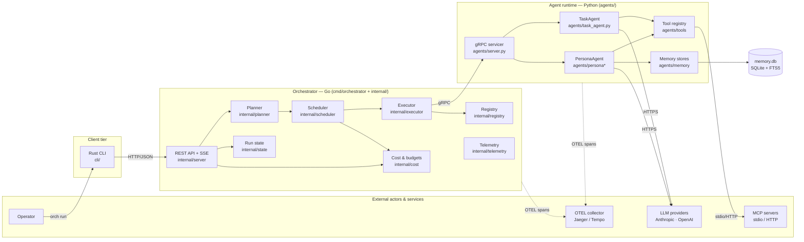

# System Overview

Top-level runtime context for Persatrix: which components exist, what they own,
and what external systems they integrate with. This diagram describes the
current state of the whole system — both the v0.1 workflow surface and the v0.2
persona/memory/cost additions.

## Boundaries

- **CLI ↔ Orchestrator**: REST + Server-Sent Events over HTTP/JSON. No gRPC
  leaks across this boundary.
- **Orchestrator ↔ Agents**: gRPC/protobuf (`proto/task.proto`,
  `proto/agent_message.proto`). The orchestrator never calls LLMs directly.
- **Agents ↔ External**: LLM providers (HTTPS) and MCP servers (stdio or HTTP).
  Both are initiated by the agent runtime, never by the orchestrator.

## Ownership

| Concern | Owner |
|---------|-------|
| Workflow planning, DAG validation, scheduling, retry | Orchestrator (Go) |
| Cost accounting, budget enforcement, response cache | Orchestrator (Go) |
| LLM prompting, tool execution, persona behaviour | Agents (Python) |
| Episodic / relationship / working memory | Agents (Python) |
| Agent discovery, secrets, gRPC transport | Orchestrator (Go) |
| User-facing commands | CLI (Rust) |

See [component-architecture.md](component-architecture.md) for the module-level
view of each component.
