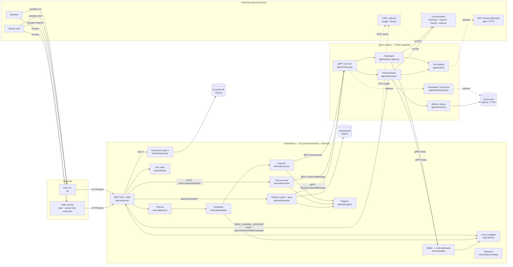

# System Overview

Top-level runtime context for Persatrix: which components exist, what they own,
and what external systems they integrate with. This diagram describes the
current state of the whole system — the v0.1 workflow surface, the v0.2
persona/memory/cost additions, the v0.2.1 human-agent chat surface, the v0.3.0
channels surface (RFC 0011), the v0.3.2 wallet that leases each LLM call
(RFC 0023), the v0.3.6 web console (RFC 0048), and the v0.3.12 accounts and
sign-in (RFC 0039).

## Boundaries

- **Clients ↔ Orchestrator**: the CLI and the web console both call the REST
  API over HTTP/JSON, and both poll for new channel messages; `persatrix logs`
  also streams over Server-Sent Events. No gRPC leaks across this boundary.
- **Orchestrator ↔ Agents**: gRPC/protobuf (`proto/task.proto`). The
  orchestrator never calls LLMs directly. v0.3.0 adds
  `ReceiveChannelMessage` for channel fan-out.
- **Agents → Orchestrator (wallet)**: the two `gRPC lease` edges. Before
  calling an LLM, an agent asks the orchestrator's wallet for a lease —
  permission to spend up to a set number of tokens — over gRPC
  (`proto/wallet.proto`), then settles it with the tokens actually used; the
  wallet checks and records that spending through `internal/cost`
  ([RFC 0023](../rfcs/0023-llm-call-leasing.md)). The orchestrator runs the
  wallet whenever it loads its cost settings from `config/optimization.yaml`,
  and an agent that cannot reach it fails the LLM call rather than run it
  unchecked.
- **Agents ↔ External**: LLM providers over HTTPS, always called by the agent
  runtime, never by the orchestrator. MCP servers (stdio or HTTP) are planned
  but not connected yet — see the note below.
- **Agent → Orchestrator (publish)**: a persona's `SEND_CHANNEL_MESSAGE`
  action publishes back over REST (`POST /api/v1/channels/{id}/messages`)
  rather than calling a Go function in-process — the same wire surface
  external clients use.

## Ownership

| Concern | Owner |
|---------|-------|
| Workflow planning, DAG validation, scheduling, retry | Orchestrator (Go) |
| Cost accounting, budget enforcement, response cache | Orchestrator (Go) |
| LLM-call leases (the wallet) | Orchestrator (Go) |
| Accounts, password hashes, sign-in sessions | Orchestrator (Go) |
| LLM prompting, tool execution, persona behaviour | Agents (Python) |
| Episodic / relationship / working memory | Agents (Python) |
| Human participant identity, user store | Agents (Python) |
| Chat message routing (REST → gRPC) | Orchestrator (Go) |
| Channel store + fan-out routing (REST + gRPC) | Orchestrator (Go) |
| Channel response gate + memory ingest | Agents (Python) |
| Agent discovery, secrets, gRPC transport | Orchestrator (Go) |
| User-facing commands (workflow run, chat, channels, sessions, interactions, sign-in) | CLI (Rust) |
| Browser UI for operators and testers | Web console (Svelte), served by the Orchestrator (Go) |

`EXEC`, `CHATEXEC`, and `CHANROUTE` are sibling Go nodes, drawn separately to
make the three gRPC dispatch shapes visible — workflow (`ExecuteTask`), chat
(`SendChatMessage`), and channels (`ReceiveChannelMessage`).

The persona ↔ REST edge (`SEND_CHANNEL_MESSAGE`) is drawn back to the REST
node rather than a direct in-process hop because that is the actual wire path
for channel publish — the chat-as-DM unification (RFC 0011 amendment, 2026-05-04)
made this the single ingest path for both human-driven and persona-driven
channel writes.

The web console is a second client beside the CLI: `make ui` builds `web/`
into `internal/ui/`, the orchestrator serves those files at `/ui/` when it
starts with `--enable-ui` (off by default), and the page then calls the same
REST API ([web console guide](../guides/web-console.md)).

The `REST -->|sign-in| ACCOUNTS` edge is where `persatrix login` and the
console's sign-in panel exchange a password for a sign-in session, which
`accounts.db` records ([RFC 0039](../rfcs/0039-user-accounts-authentication.md)).
Auth ships switched off: until `config/security.yaml` sets
`auth.mode: enabled`, every caller is treated as the same anonymous `local`
user ([auth guide](../guides/auth.md)). An account is not the participant the
agents remember — it proves who is connecting, and Persatrix then acts as the
participant bound to it.

The `AGSVC -. planned .-> PART` and `PART -. planned .-> DB` edges remain
dashed because `agents/participant.py` (`UserParticipant`, `UserStore`) is
exported but **not yet invoked from any runtime path** as of v0.3.0. The chat
servicer still uses `validate_participant_type` only; `SendChatMessage`
records relationships directly via
`agent.memory.relationship.record_interaction(...)` keyed on
`(agent_id, user_id)` without going through `UserStore.get_or_create()`. The
channels surface accepts arbitrary participant ids that satisfy
`validate_participant_id` without persisting them as users either. Wiring the
participant store into both paths is tracked as a v0.3.x follow-up; the
diagram keeps the nodes visible so the architectural intent is preserved.

The `TOOLS -. planned .-> MCP` edge is dashed because the
[MCP bridge](../ai-glossary.md#mcp-bridge) is planned, not built: no agent
reaches an MCP server today.

See [component-architecture.md](component-architecture.md) for the module-level
view of each component.
