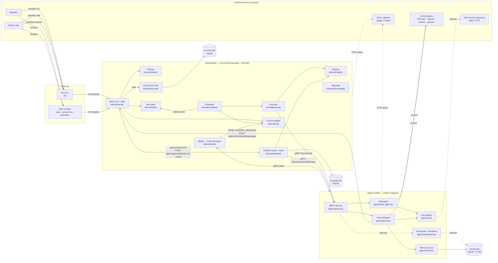

# System Overview

Top-level runtime context for Persatrix: which components exist, what they own,
and what external systems they integrate with. This diagram describes the
current state of the whole system; [Phase ownership](component-architecture.md#phase-ownership)
lists the release that added each package.

## Boundaries

- **Clients ↔ Orchestrator**: the CLI and the web console both call the REST
  API over HTTP/JSON, and both poll for new channel messages; `persatrix logs`
  also streams over Server-Sent Events. No gRPC leaks across this boundary.
- **Orchestrator ↔ Agents**: gRPC/protobuf (`proto/task.proto`). The
  orchestrator never calls LLMs directly. v0.3.0 adds
  `ReceiveChannelMessage` for channel fan-out, which also carries chat.
  Agents stream their logs back to the orchestrator over gRPC
  (`proto/log_service.proto`).
- **Agents → Orchestrator (wallet)**: the `gRPC lease` edge. Before most LLM
  calls, an agent asks the orchestrator's wallet over gRPC
  (`proto/wallet.proto`) for a lease — permission to spend up to a set number
  of tokens — and settles it afterwards with the tokens used. The wallet
  checks and records that spending through `internal/cost`
  ([RFC 0023](../rfcs/0023-llm-call-leasing.md#b-lease-lifecycle)). If an agent
  cannot reach the wallet, the call fails. The orchestrator runs the wallet
  only once it has loaded `config/optimization.yaml`; without that file,
  every leased call fails. One call skips the lease: the summary a persona
  writes when a conversation closes, unless the orchestrator itself closed
  the conversation at one of its limits.
- **Agents ↔ External**: LLM providers over HTTPS, always called by the agent
  runtime, never by the orchestrator. MCP servers (stdio or HTTP) are planned
  but not connected yet — see the note below.
- **Agent → Orchestrator (publish)**: a persona's `SEND_CHANNEL_MESSAGE`
  action publishes back over REST (`POST /api/v1/channels/{id}/messages`)
  rather than calling a Go function in-process — the same wire surface
  external clients use.

## Ownership

| Concern | Owner |
|---------|-------|
| Workflow planning, DAG validation, scheduling, retry | Orchestrator (Go) |
| Cost accounting, budget enforcement, response cache | Orchestrator (Go) |
| LLM-call leases (the wallet) | Orchestrator (Go) |
| Accounts, password hashes, auth sessions | Orchestrator (Go) |
| LLM prompting, tool execution, persona behaviour | Agents (Python) |
| Episodic / relationship / working memory | Agents (Python) |
| Human participant identity, user store | Agents (Python) |
| Chat message routing (REST → DM channel → gRPC) | Orchestrator (Go) |
| Channel store + fan-out routing (REST + gRPC) | Orchestrator (Go) |
| Channel response gate + memory ingest | Agents (Python) |
| Agent discovery, secrets, gRPC transport | Orchestrator (Go) |
| User-facing `persatrix` commands | CLI (Rust) |
| Browser UI for operators and testers | Web console (Svelte), served by the Orchestrator (Go) |

`EXEC` and `CHANROUTE` are sibling Go nodes, drawn separately to make the two
gRPC dispatch shapes visible — workflow (`ExecuteTask`) and channels
(`ReceiveChannelMessage`). Chat has used the channel shape since v0.3.0:
`POST /api/v1/agents/{id}/chat` posts the message to the caller's DM channel
and waits for the agent's reply there. The older `SendChatMessage` RPC is
still defined, but nothing calls it
([ISSUE-0035](../issues/ISSUE-0035-chat-executor-dead-but-wired-cleanup.md)).

A workflow run changes hands through run state. The REST API checks the
workflow file with the planner and stores the run as pending; the scheduler
checks `internal/state` every second, picks the run up
(`SCHED -->|pending runs| STATE`) and sends its steps to the executor. Nothing
calls the scheduler directly. This overview leaves out the scheduler's call to
the planner, which works out each step's inputs;
[component-architecture.md](component-architecture.md) draws it.

The persona ↔ REST edge (`SEND_CHANNEL_MESSAGE`) is drawn back to the REST
node rather than a direct in-process hop because that is the actual wire path
for channel publish — the chat-as-DM unification (RFC 0011 amendment, 2026-05-04)
made this the single ingest path for both human-driven and persona-driven
channel writes.

The web console is a second client beside the CLI: the orchestrator serves it
at `/ui/` when it starts with `--enable-ui`, and the page then calls the same
REST API. The flag is off by default, but the Docker demo stack turns it on
([web console guide](../guides/web-console.md#quick-start-docker-demo)).

The `REST -->|auth| ACCOUNTS` edge is where `persatrix login` and the
console's login form exchange a password for an auth session, which
`accounts.db` records ([RFC 0039](../rfcs/0039-user-accounts-authentication.md)).
No REST route creates accounts: `persatrix-server account bootstrap` writes the
first operator straight into `accounts.db`.

Auth ships switched off. Until `config/security.yaml` sets
`auth.mode: enabled`, nobody has to log in, every caller shares one anonymous
`local` tenant, and each caller names its own participant ID with no check —
the CLI sends the OS user name by default, the console `local`
([auth guide](../guides/auth.md#the-switch-authmode)). An account is not the
participant the agents remember: once auth is on, it proves who is connecting,
and chat then acts as the participant bound to it. A channel send still
carries whatever sender ID the caller names.

The `AGSVC -. planned .-> PART` and `PART -. planned .-> DB` edges remain
dashed because `agents/participant.py` (`UserParticipant`, `UserStore`) is
exported but **not yet invoked from any runtime path**. Relationship memory for
a chat DM is written once, when the conversation closes
(`agents/persona_runtime/record_close.py`), keyed on the other participant in
the `dm:` channel ID, without going through `UserStore.get_or_create()`. The
channels surface accepts arbitrary participant ids that satisfy
`validate_participant_id` without persisting them as users either. Wiring the
participant store into both paths is tracked as a v0.3.x follow-up; the
diagram keeps the nodes visible so the architectural intent is preserved.

The `TOOLS -. planned .-> MCP` edge is dashed because the
[MCP bridge](../ai-glossary.md#mcp-bridge) is planned, not built: no agent
reaches an MCP server today.

See [component-architecture.md](component-architecture.md) for the module-level
view of each component.
