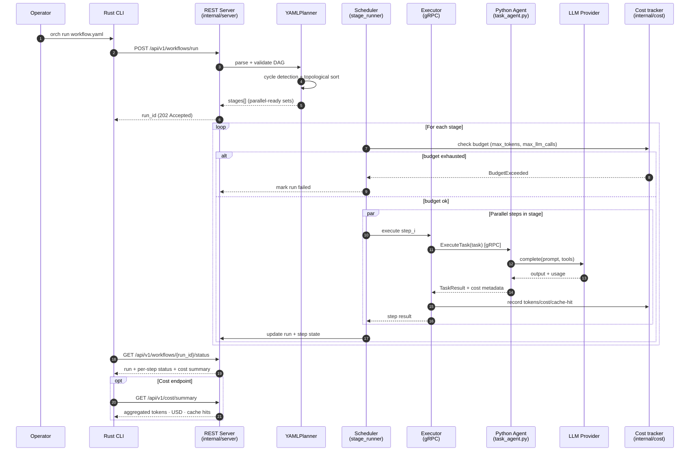

# Workflow Execution

End-to-end sequence for a task-style workflow: from CLI submission, through
DAG planning and stage-level scheduling, to per-step gRPC dispatch. This is
the v0.1 surface; v0.2 layered cost accounting and budget enforcement onto
the same path (highlighted below).



## Step output templating

Downstream steps reference upstream outputs with Jinja2-like syntax:

```yaml
steps:
  - id: research
    agent: researcher
    input: { topic: "{{ workflow.inputs.topic }}" }
  - id: draft
    agent: writer
    depends_on: [research]
    input: { context: "{{ steps.research.output }}" }
```

The planner resolves these references at stage-entry time, after all
`depends_on` steps in earlier stages have produced output.

## Retry semantics

Retries happen inside the **Executor** (not the Scheduler). An individual step
may retry with backoff on transient gRPC or LLM errors before surfacing failure
to the scheduler. Retry counts are folded into the step's cost metadata.

## What v0.2 added on this path

- `internal/cost/` — tokens/USD/cache-hit accounting and response cache.
- Per-step metadata: `EstimatedCostUSD`, `TokensUsed`, `LLMCallCount`,
  `RetryCount`, `CacheHit`, `WallTimeMs`.
- Pre-stage budget checks in `internal/scheduler/budget.go`. Exceeding
  `max_tokens` or `max_llm_calls` aborts the run with a structured error.
- `GET /api/v1/cost/summary` endpoint for post-hoc inspection.

Cost tracking is orthogonal to the persona runtime — persona agents hit the
same cost tracker when they call `LLMClient.complete()`. See
[persona-runtime.md](persona-runtime.md) for the autonomous/event-driven flow.
