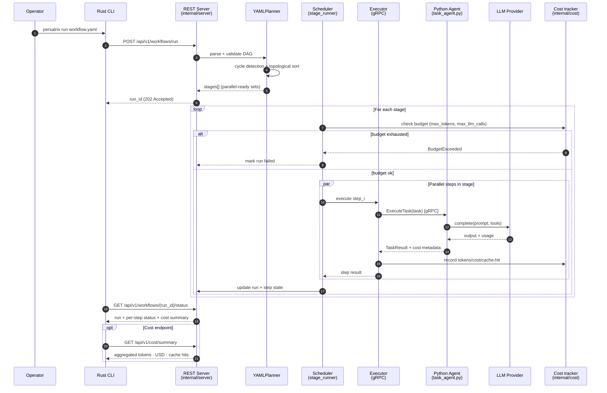
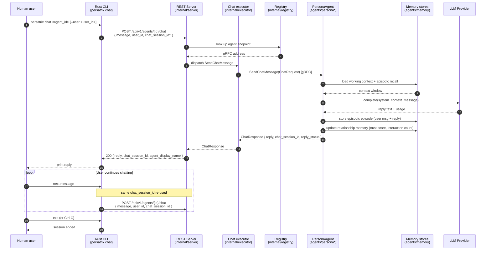

# Workflow Execution

End-to-end sequence for a task-style workflow: from CLI submission, through
DAG planning and stage-level scheduling, to per-step gRPC dispatch. This is
the v0.1 surface; v0.2 layered cost accounting and budget enforcement onto
the same path. v0.2.1 added a separate chat-message path, shown in the second
diagram below. v0.3.11 added the autonomous-brainstorm path — a channel
discussion that convenes, runs, terminates, and synthesizes with no human in
the loop — shown in the third diagram.

## Workflow execution sequence



## Chat message sequence (v0.2.1)



## Autonomous brainstorm sequence (v0.3.11, RFC 0052)

A channel armed with the `autonomous` block runs a bounded, human-free
brainstorm: the operator convenes once (CLI, REST, or the web button) and walks
away; the convener opens the discussion, the roster carries it through the
ordinary governed wake chain, and the deterministic bounded close terminates it
with a goal-directed chair synthesis plus one metered RFC 0020 summary per
persona — all under the mandatory per-interaction cost cap (a roster-scaled
`1 + R` reserve (one chair turn + one summary per close-derived
record) is held back so the close path's leases survive a
budget-exhausted close).

```mermaid
sequenceDiagram
    autonumber
    participant Op as Operator
    participant Srv as REST Server<br/>(internal/server)
    participant Router as Channel Router<br/>(internal/channels)
    participant Wallet as Wallet<br/>(internal/wallet)
    participant Conv as Convener persona<br/>(nova-sparrow)
    participant Roster as Roster personas
    participant Chair as Escalation chair<br/>(iron-fox)
    participant LLM as LLM Provider

    Op->>Srv: persatrix channel convene / web button<br/>POST /api/v1/channels/{id}/convene
    Srv->>Router: ConveneChannel(id)
    Router->>Router: gates: armed · idle · convener valid ·<br/>open-floor audience · topic present
    Router->>Conv: convene forced turn<br/>(synthetic sender; topic/agenda/goal in external_data)
    Srv-->>Op: 202 { convener, status: convening }

    Conv->>LLM: author opening turn (lease resolves uncapped — pre-snapshot, §B)
    Conv->>Router: Publish(opening turn)
    Router->>Router: mint fresh interaction_id;<br/>snapshot interaction_budget_tokens at first commit

    loop Governed floor rounds (InboundEventWake chain — no human)
        Router->>Roster: fan out stimulus (floor-serialized)
        Roster->>Wallet: AcquireLease(interaction_id)
        Wallet-->>Roster: grant (hard cap enforced, fail-closed)
        Roster->>LLM: compose reply (RFC 0051 reasoning)
        Roster->>Router: Publish(reply, echoing interaction_id)
        Router->>Wallet: InteractionSpend(interaction_id)
        Router->>Router: fanout tail: round tally vs max_rounds ·<br/>spend vs soft budget (cap − the `1 + R` reserve)
    end

    Note over Router: bound crossed (trigger = structural | cost)
    Router->>Chair: synthesis forced turn against autonomous.goal<br/>(claims the closing interaction_id; timeout net armed)
    Chair->>Wallet: AcquireLease(interaction_id)
    Wallet-->>Chair: grant — funded by the held-back reserve
    Chair->>LLM: goal-directed synthesis over the discussion
    Chair->>Router: Publish(marked synthesis reply)
    Router->>Router: close-on-reply: retire id ·<br/>interaction_closed{trigger} · no reopen
    Router->>Roster: close notification carrying the synthesis<br/>(sole delivery; truthful trigger)

    par Per-persona RFC 0020 close (each member, sender included)
        Roster->>Roster: ingest synthesis as final turn ·<br/>close scope (cost | structural)
        Roster->>Wallet: AcquireLease(interaction_id) — OQ #6 metered summary
        Wallet-->>Roster: grant — the R of the 1 + R reserve
        Roster->>LLM: summarize interaction
        Roster->>Roster: persist real summary (never the placeholder)
    end

    Op->>Srv: persatrix agent interactions <persona><br/>GET /api/v1/agents/{id}/interactions/closed
    Srv-->>Op: closed interaction · close_reason · readable summary
```

A chair that never replies (gate suppression, provider error) is caught by the
synthesis **timeout net**: the router falls back to the immediate
artifact-bearing close, so termination never waits on a model — the summaries
still produce, only the goal-directed synthesis message is missing. The wallet
residue eviction for standing channels is deliberately deferred to the RFC 0052
standing-schedule PR (see the [PR plan](../rfcs/0052-pr-plan.md)).

**What v0.3.11 adds on this path**

- `internal/channels/convene.go` + `POST /api/v1/channels/{id}/convene` + the
  `persatrix channel convene` verb and web Convene button — self-convening
  over the existing publish path (no new transport or wake type).
- `internal/channels/bounded_close.go` — the deterministic terminator
  (`max_rounds` / wallet soft budget) with the `interaction_closed{trigger=structural|cost}`
  vocabulary; `internal/channels/synthesis_close.go` — the close-on-reply chair
  synthesis turn with its timeout net.
- `internal/wallet/synthesis_reserve.go` — the record-scaled `1 + R` reserve /
  soft-budget accounting, coupled to the router in both directions
  (`SetInteractionSpender` ↔ `SetInteractionBudgetResolver`).
- `agents/persona_runtime/convener.py` / `synthesis_turn.py` /
  `close_notification.py` + the OQ #6 metering edit in `summarize_close.py` —
  the agent halves: directed-turn admission, `<external_data>` wrapping, the
  truthful close reason, and the metered per-persona summary.
- The Phase-1 acceptance suite: `internal/channels/autonomous_acceptance_test.go`
  (full cycle, no-runaway, close-by-budget — against a real wallet) and
  `tests/unit/python/test_autonomous_phase1_acceptance.py` (the per-persona
  close-artifact chain); the live acceptance is
  [MT-AUTONOMOUS-001](../manual-tests/MT-AUTONOMOUS-001.md).

## Step output templating

Downstream steps reference upstream outputs with Jinja2-like syntax:

```yaml
steps:
  - id: research
    agent: researcher
    input: { topic: "{{ workflow.inputs.topic }}" }
  - id: draft
    agent: writer
    depends_on: [research]
    input: { context: "{{ steps.research.output }}" }
```

The planner resolves these references at stage-entry time, after all
`depends_on` steps in earlier stages have produced output.

## Retry semantics

Retry **policy** lives inside the `Executor` — it owns the backoff loop for
transient gRPC and LLM errors and only surfaces failure to the `Scheduler`
once the attempts are exhausted ([internal/executor/executor.go:369](../../internal/executor/executor.go#L369)
sets `result.RetryCount = attempt`). The `Scheduler` still consumes that count
when it folds step results into cost metadata and span attributes
([internal/scheduler/stage_runner.go:192](../../internal/scheduler/stage_runner.go#L192),
[internal/scheduler/budget.go:236](../../internal/scheduler/budget.go#L236)) —
so the retry is invisible to scheduling, but the *outcome* is not.

## What v0.2 added on this path

- `internal/cost/` — tokens/USD/cache-hit accounting and response cache.
- Per-step metadata: `EstimatedCostUSD`, `TokensUsed`, `LLMCallCount`,
  `RetryCount`, `CacheHit`, `WallTimeMs`.
- Pre-stage budget checks in `internal/scheduler/budget.go`. Exceeding
  `max_tokens` or `max_llm_calls` aborts the run with a structured error.
- `GET /api/v1/cost/summary` endpoint for post-hoc inspection.

Cost tracking is orthogonal to the persona runtime — persona agents hit the
same cost tracker when they call `LLMClient.complete()`. See
[persona-runtime.md](persona-runtime.md) for the autonomous/event-driven flow.

## What v0.2.1 added on this path

- `POST /api/v1/agents/{id}/chat` REST endpoint in `internal/server/chat_handler.go`.
- `SendChatMessage` gRPC RPC in `proto/task.proto` dispatched by `internal/executor/`.
- `agents/participant.py` — `UserParticipant` and `UserStore` for per-user
  identity persistence and relationship memory keyed on `(agent_id, user_id)`.
- `persatrix chat <agent_id>` CLI command (interactive REPL).

## Known gaps on the chat path

These are intentionally documented in prose rather than the sequence diagram
above so the diagram stays a description of the *runtime* shape, not a list of
open tickets.

- **`UserStore` is not yet invoked from the chat path.** `SendChatMessage` in
  `agents/server_servicers.py` only calls `validate_participant_type` from
  `agents/participant.py`; relationship memory is written via
  `agent.memory.relationship.record_interaction(...)` keyed on `user_id`
  directly, without going through `UserStore.get_or_create()`. The store ships
  in v0.2.1 and is exercised by its own unit tests, but wiring it into the
  servicer is a follow-up. This is also the reason the `AGSVC --> PART` and
  `SRV --> PART` edges are drawn dashed in [system-overview.md](system-overview.md)
  and [component-architecture.md](component-architecture.md).
- **Chat is not on the cost-tracking path.** The workflow sequence above
  records tokens, USD and cache-hits via `internal/cost/` after every
  `ExecuteTask`. The chat path does not: `internal/executor/chat.go` and
  `agents/server_servicers.py` do not reference the cost tracker, and
  `ChatResponse` carries no `usage` field today. Chat token spend is therefore
  invisible to `GET /api/v1/cost/summary`. Closing this gap is tracked
  separately from this diagram refresh.
