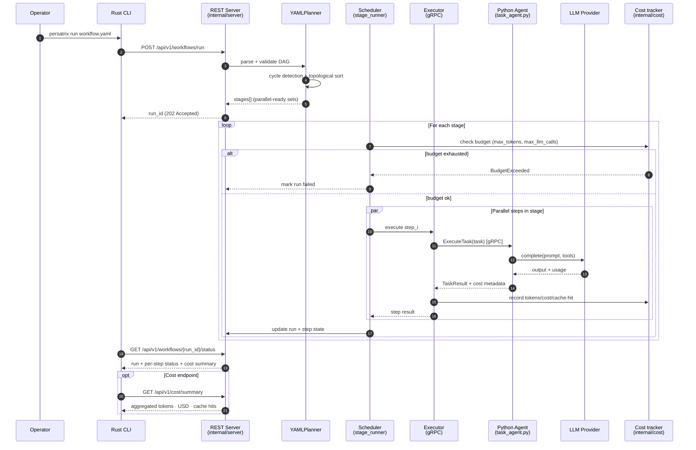
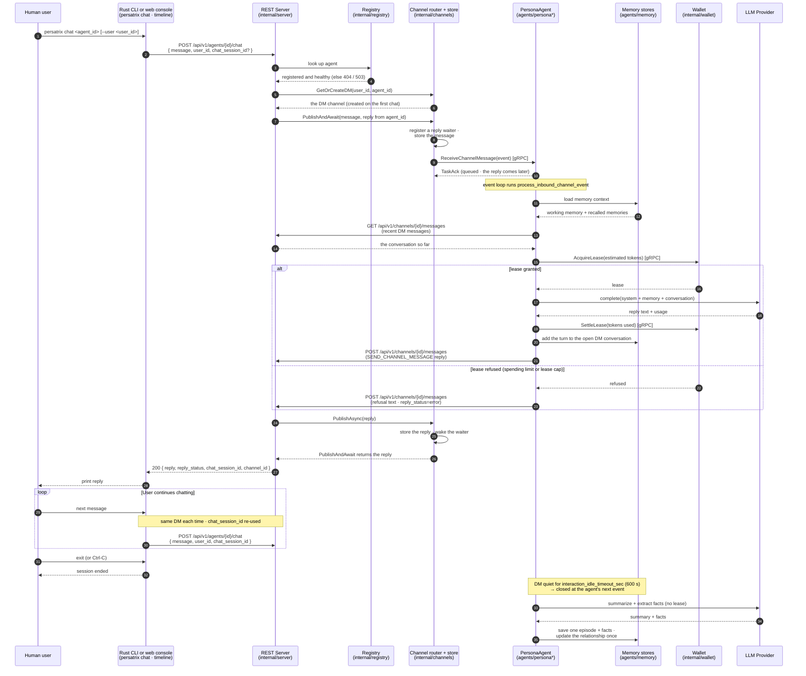
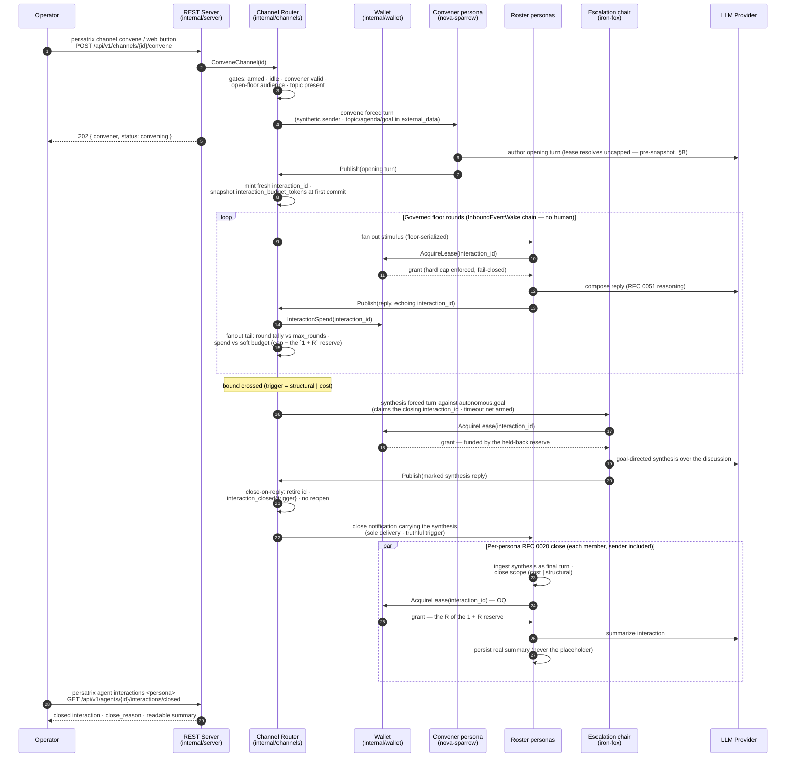

# Workflow Execution

End-to-end sequence for a task-style workflow: from CLI submission, through
DAG planning and stage-level scheduling, to per-step gRPC dispatch. This is
the v0.1 surface; v0.2 layered cost accounting and budget enforcement onto
the same path. v0.2.1 added a chat path, and v0.3.0 moved it onto
direct-message (DM) channels; the second diagram shows chat as it runs today.
v0.3.11 added the autonomous-brainstorm path — a channel discussion that
convenes, runs, terminates, and synthesizes with no human in the loop — shown
in the third diagram.

## Workflow execution sequence



## Chat message sequence (chat as a DM, since v0.3.0)

Talking to a persona is a direct message (DM) on the channels subsystem
([Chat-as-DM](../ai-glossary.md#chat-as-dm)). Since v0.3.0
([#251](https://github.com/mkhomutov/Persatrix/pull/251)),
`POST /api/v1/agents/{id}/chat` posts your message to your DM with the agent
and holds the HTTP request open until the agent's reply lands in the same
channel. The agent answers as it answers any channel message, by posting its
reply back through the REST API. `persatrix chat` and the web console's
timeline both use this endpoint.



How the pieces fit:

- **One DM per person and agent.** `GetOrCreateDM` finds the channel, or
  creates it on the first chat, so every message from you to that agent lands
  in the same conversation, even after the CLI restarts. With auth on, the
  handler uses the logged-in account's participant ID instead of the
  `user_id` in the body. `chat_session_id` is stored with each message and
  sent back, but the agent never receives it.
- **The request waits for the reply.** `PublishAndAwait` sets up its reply
  waiter before it stores your message, so even an instant reply is caught.
  It waits 30 s by default; a request can ask for 1–300 s with
  `timeout_seconds`. If no reply comes in time, the handler returns 504 and
  your message stays stored.
- **The agent answers later.** `ReceiveChannelMessage` only queues the
  message and acknowledges it. The agent's event loop then handles it in
  `process_inbound_channel_event` (`agents/chat_reply.py`), reading the
  recent messages of the DM so the model sees the conversation so far.
- **Every reply call is leased.** The agent asks the wallet for a lease
  before each LLM call ([RFC 0023](../rfcs/0023-llm-call-leasing.md)). The
  lease is labeled `CAUSE_CHANNEL_MESSAGE`, as for any channel message,
  because the `chat_session_id` that would label it `CAUSE_CHAT` never
  reaches the agent; the wallet only writes the label to its logs
  ([ISSUE-0155](../issues/ISSUE-0155-rest-chat-leased-as-channel-message.md)).
  If the wallet refuses — a spending limit is reached, or the agent already
  holds too many leases — the agent posts the refusal as its reply, marked
  `reply_status="error"`. The handler then returns HTTP 200 with
  `reply_status="error"` and the refusal text in `reply`.
- **Memory is written once per conversation.** Each turn joins the open DM
  conversation, which the agent keeps in its own process. Once the DM has
  been quiet for `interaction_idle_timeout_sec` (600 s by default), the agent
  closes the conversation the next time it handles any event, such as a new
  message. One LLM call then summarizes it and extracts facts; the agent
  saves the summary as one episode and updates its relationship record for
  you once ([`record_close.py`](../../agents/persona_runtime/record_close.py)).

## Autonomous brainstorm sequence (v0.3.11, RFC 0052)

A channel armed with the `autonomous` block runs a bounded, human-free
brainstorm: the operator convenes once (CLI, REST, or the web button) and walks
away; the convener opens the discussion, the roster carries it through the
ordinary governed wake chain, and the deterministic bounded close terminates it
with a goal-directed chair synthesis plus one metered RFC 0020 summary per
persona — all under the mandatory per-interaction cost cap (a roster-scaled
`1 + R` reserve (one chair turn + one summary per close-derived
record) is held back so the close path's leases survive a
budget-exhausted close).



A chair that never replies (gate suppression, provider error) is caught by the
synthesis **timeout net**: the router falls back to the immediate
artifact-bearing close, so termination never waits on a model — the summaries
still produce, only the goal-directed synthesis message is missing. The wallet
residue eviction for standing channels is deliberately deferred to the RFC 0052
standing-schedule PR (see the [PR plan](../rfcs/0052-pr-plan.md)).

**What v0.3.11 adds on this path**

- `internal/channels/convene.go` + `POST /api/v1/channels/{id}/convene` + the
  `persatrix channel convene` verb and web Convene button — self-convening
  over the existing publish path (no new transport or wake type).
- `internal/channels/bounded_close.go` — the deterministic terminator
  (`max_rounds` / wallet soft budget) with the `interaction_closed{trigger=structural|cost}`
  vocabulary; `internal/channels/synthesis_close.go` — the close-on-reply chair
  synthesis turn with its timeout net.
- `internal/wallet/synthesis_reserve.go` — the record-scaled `1 + R` reserve /
  soft-budget accounting, coupled to the router in both directions
  (`SetInteractionSpender` ↔ `SetInteractionBudgetResolver`).
- `agents/persona_runtime/convener.py` / `synthesis_turn.py` /
  `close_notification.py` + the OQ #6 metering edit in `summarize_close.py` —
  the agent halves: directed-turn admission, `<external_data>` wrapping, the
  truthful close reason, and the metered per-persona summary.
- The Phase-1 acceptance suite: `internal/channels/autonomous_acceptance_test.go`
  (full cycle, no-runaway, close-by-budget — against a real wallet) and
  `tests/unit/python/test_autonomous_phase1_acceptance.py` (the per-persona
  close-artifact chain); the live acceptance is
  [MT-AUTONOMOUS-001](../manual-tests/MT-AUTONOMOUS-001.md).

## Step output templating

Downstream steps reference upstream outputs with Jinja2-like syntax:

```yaml
steps:
  - id: research
    agent: researcher
    input: { topic: "{{ workflow.inputs.topic }}" }
  - id: draft
    agent: writer
    depends_on: [research]
    input: { context: "{{ steps.research.output }}" }
```

The planner resolves these references at stage-entry time, after all
`depends_on` steps in earlier stages have produced output.

## Retry semantics

Retry **policy** lives inside the `Executor` — it owns the backoff loop for
transient gRPC and LLM errors and only surfaces failure to the `Scheduler`
once the attempts are exhausted ([internal/executor/executor.go:369](../../internal/executor/executor.go#L369)
sets `result.RetryCount = attempt`). The `Scheduler` still consumes that count
when it folds step results into cost metadata and span attributes
([internal/scheduler/stage_runner.go:192](../../internal/scheduler/stage_runner.go#L192),
[internal/scheduler/budget.go:236](../../internal/scheduler/budget.go#L236)) —
so the retry is invisible to scheduling, but the *outcome* is not.

## What v0.2 added on this path

- `internal/cost/` — tokens/USD/cache-hit accounting and response cache.
- Per-step metadata: `EstimatedCostUSD`, `TokensUsed`, `LLMCallCount`,
  `RetryCount`, `CacheHit`, `WallTimeMs`.
- Pre-stage budget checks in `internal/scheduler/budget.go`. Exceeding
  `max_tokens` or `max_llm_calls` aborts the run with a structured error.
- `GET /api/v1/cost/summary` endpoint for post-hoc inspection.

Cost tracking is orthogonal to the persona runtime — persona agents hit the
same cost tracker when they call `LLMClient.complete()`. See
[persona-runtime.md](persona-runtime.md) for the autonomous/event-driven flow.

## What v0.2.1 added on this path

- `POST /api/v1/agents/{id}/chat` REST endpoint in `internal/server/chat_handler.go`.
- `SendChatMessage` gRPC RPC in `proto/task.proto` dispatched by
  `internal/executor/` — unused since v0.3.0 (next section).
- `agents/participant.py` — `UserParticipant` and `UserStore` for per-user
  identity persistence and relationship memory keyed on `(agent_id, user_id)`.
- `persatrix chat <agent_id>` CLI command (interactive REPL).

## What v0.3.0 changed on this path

- Chat became a DM ([RFC 0011 amendment](../rfcs/0011-amendment-chat-as-dm.md)).
  `handleChat` in `internal/server/chat_handler.go` finds the DM with
  `GetOrCreateDM` and calls `ChannelRouter.PublishAndAwait`
  (`internal/channels/publish_and_await.go`).
- The agent receives chat over `ReceiveChannelMessage`
  (`agents/server_servicers.py`), like any channel message, and replies with a
  `SEND_CHANNEL_MESSAGE` action. `HTTPChannelPublisher`
  (`agents/channel_publisher.py`) posts that reply to
  `POST /api/v1/channels/{id}/messages`.
- The v0.2.1 chat executor is still built — `cmd/orchestrator/main.go` calls
  `executor.NewGRPCChatExecutor` — but nothing calls it or `SendChatMessage`
  any more. [ISSUE-0035](../issues/ISSUE-0035-chat-executor-dead-but-wired-cleanup.md)
  tracks removing them.

## Known gaps on the chat path

These are intentionally documented in prose rather than the sequence diagram
above so the diagram stays a description of the *runtime* shape, not a list of
open tickets.

- **`UserStore` is not yet invoked from the chat path.** Nothing outside the
  tests creates a `UserStore`, and only the unused `SendChatMessage` servicer
  imports `validate_participant_type` from `agents/participant.py`.
  Relationship memory is written when a DM conversation closes
  ([`record_close.py`](../../agents/persona_runtime/record_close.py)), keyed on
  the other participant in the `dm:` channel ID, without going through
  `UserStore.get_or_create()`. The store has shipped since v0.2.1 and is
  exercised by its own unit tests, but wiring it into the chat path is a
  follow-up. This is also why the `AGSVC -. planned .-> PART` edge in
  [system-overview.md](system-overview.md) and the `SRV -. planned .-> PART`
  edge in [component-architecture.md](component-architecture.md) are dashed.
- **The closing summary is not on the cost-tracking path.** Chat replies are.
  Since v0.3.2 every LLM call the agent makes to answer takes a wallet lease,
  and the wallet charges it to the same token counter (`internal/cost`) that
  `GET /api/v1/cost/summary` reads. Chat tokens therefore count toward the
  daily totals and appear under the persona's ID in `top_agents`. The call
  that summarizes a DM conversation when it closes runs without a lease, so
  the cost summary never sees its tokens. Only the autonomous brainstorm's
  bounded close leases its summaries (above).
