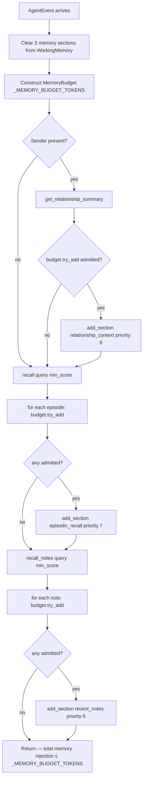
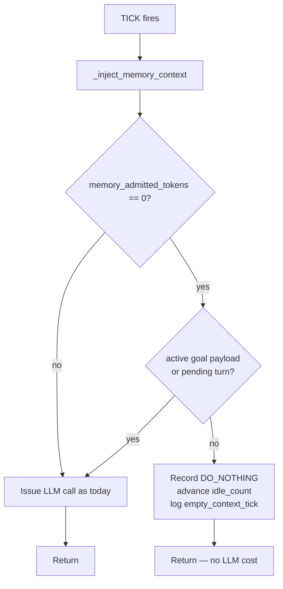

# RFC 0017 — Persona Memory Injection Token Budget

**Type**: architecture
**Status**: 🚧 Implementing
**Author**: Maksim Khomutov
**Date**: 2026-04-21
**Accepted**: 2026-04-21
**Target**: v0.2.2
**Depends on**: RFC 0005
**Feeds into**: RFC 0008

---

## Table of Contents

- [Summary](#summary)
- [Motivation](#motivation)
- [Goals](#goals)
- [Non-Goals](#non-goals)
- [Design / Implementation](#design--implementation)
  - [A. Current State and Gaps](#a-current-state-and-gaps)
  - [B. Memory Budget Allocator](#b-memory-budget-allocator)
  - [C. Relevance Threshold in the Recall Layer](#c-relevance-threshold-in-the-recall-layer)
  - [D. Token-Aware Truncation](#d-token-aware-truncation)
  - [E. Forward Compatibility with RFC 0008](#e-forward-compatibility-with-rfc-0008)
  - [F. Empty-Context TICK Short-Circuit](#f-empty-context-tick-short-circuit)
- [Security Considerations](#security-considerations)
- [Phased Implementation Plan](#phased-implementation-plan)
- [Files Touched (Estimated)](#files-touched-estimated)
- [Test Strategy](#test-strategy)
- [Open Questions](#open-questions)
- [Decision / Next Steps](#decision--next-steps)
- [Related Documentation](#related-documentation)

---

## Summary

This RFC replaces the three uncoordinated per-tier character caps in persona memory injection with a single token-denominated budget allocator, and pushes relevance filtering down into `EpisodicMemory.recall*` so the persona runtime stops making per-event-type relevance decisions. The result: a hard, token-expressed bound on memory context per event; a smaller, simpler `_MemoryContextMixin`; and a stable allocator/recall interface that RFC 0008's scheduler-level context budget can compose with in v0.3.

## Motivation

`agents/persona_runtime/memory_context.py` has been patched in three successive review rounds (PR #60, #120, #131) to mitigate prompt growth from the three memory tiers (episodic recall, relationship summary, recent notes). The current state works but the structure has reached the limits of point-fixes:

1. **Three uncoordinated caps.** `_MAX_EPISODE_SUMMARY_CHARS = 200`, `_MAX_RELATIONSHIP_NOTES_CHARS = 300`, `_MAX_NOTE_CONTENT_CHARS = 500` are picked independently. There is no notion of a shared budget across tiers — when two tiers are both full, neither yields to the other.
2. **Wrong unit.** Caps are in characters; the LLM bills and limits in tokens. The chars→tokens ratio drifts on code, JSON, and CJK content, so the "bound" is loose by construction.
3. **Special-case gates encode missing capability.** Two branches in `_inject_memory_context` work around the recall layer not filtering by relevance:
   - Skip episodic recall entirely on `EventType.TICK` because the boilerplate query produces low-signal FTS5 matches.
   - Suppress the recency-fallback for notes unless `event_type == MESSAGE_RECEIVED` and episodic recall returned nothing.
   Both gates exist because the recall function returns `limit` rows regardless of how well they match. The persona runtime should not be making relevance decisions; the recall layer should.
4. **Hard to extend.** Adding a fourth memory tier (vector recall in v0.3, per RFC 0008) would require another magic constant and another set of interaction rules with the existing tiers. The current shape does not scale.

What happens if we do nothing: the next time we add or tune a memory tier, we add a fifth review-round patch to the same file. The TODOs at [memory_context.py L235](../../agents/persona_runtime/memory_context.py) (peer-supplied note sanitisation) and [memory_context.py L275](../../agents/persona_runtime/memory_context.py) (low-relevance TICK notes) accumulate. RFC 0008's scheduler-level budget work in v0.3 has no per-agent budget primitive to compose with, so it has to invent one and migrate the persona runtime to it after the fact.

This RFC is the structural fix that prior patches were approximating, and it lands the budget primitive in v0.2.2 so RFC 0008 starts on solid ground.

## Goals

1. Memory injection per event has a hard, deterministic upper bound expressed in tokens. The bound is enforced inside `_inject_memory_context`, not as an after-the-fact drop in `WorkingMemory.build_context`.
2. The three `_MAX_*_CHARS` constants are replaced by a single tunable `_MEMORY_BUDGET_TOKENS`.
3. The `EventType.TICK` skip and the `should_fall_back` gate in `_inject_memory_context` are deleted. Behaviour equivalent to today's gating is achieved by the recall layer's relevance threshold.
4. `EpisodicMemory.recall` and `EpisodicMemory.recall_notes` accept a `min_score` parameter (single float, normalised) that callers use to express a relevance floor. The default value is calibrated against the existing FTS5 BM25 distribution before merge.
5. `_truncate_with_ellipsis` operates in tokens, not characters, when the budget is the controlling constraint.
6. Existing memory-context unit and integration tests pass. New tests assert the token bound holds across a synthetic event stream, including the cases that previously needed gating (TICK, low-keyword "hi"-style messages).
7. The allocator and `min_score` interfaces are documented as stable and forward-compatible with RFC 0008's scheduler budget and a future vector-recall implementation.
8. **Empty-context TICK events do not invoke the LLM.** When the budget allocator admits zero memory items on a `TICK` event AND no other event-specific context (recent conversation turn, active goal payload) is present, the persona runtime short-circuits the tick: no LLM call is issued and the tick is counted toward `idle_after_ticks`. This closes the cost-drain window of up to `idle_after_ticks * interval` seconds (default 10 ticks × 60 s = 10 minutes) during which a freshly-loaded but contextually-idle agent currently issues full-cost LLM calls before idle suppression engages.

## Non-Goals

- **Conversation-history windowing.** Conversation history is the primary monotonic-growth vector in working memory. Bounding it requires sliding-window summarisation or turn caps and is RFC 0008 territory (Section D, "Context Packaging and Compression Pipeline"). `WorkingMemory.compress_if_needed` remains the backstop unchanged.
- **Task-agent memory.** RFC 0008 Section B covers extending memory primitives to non-persona agents.
- **Cross-agent shared memory.** RFC 0008 Section H.
- **Semantic / vector-based recall.** Deferred to a dedicated v0.3 RFC. The `min_score` parameter and recall return contract added here are designed to accommodate vector scoring without API churn (see [Section E](#e-forward-compatibility-with-rfc-0008)).
- **Changes to `WorkingMemory.compress_if_needed`.** Compression remains the backstop for conversation history; this RFC does not modify it.
- **Changes to `RelationshipMemory`.** The relationship tier participates in the budget but its query path is unchanged.
- **Resolving the peer-supplied prompt-injection TODO.** The TODO at [memory_context.py L235](../../agents/persona_runtime/memory_context.py) remains a v0.3 concern when A2A protocol allows external agents.
- **Changes to schemas, protos, REST API, or CLI surfaces.** This is a Python-only refactor.

---

## Design / Implementation

### A. Current State and Gaps

The flow today, per event, in `_MemoryContextMixin._inject_memory_context`:

1. Remove three named sections from `WorkingMemory` (defensive symmetric clear, F-60-R1).
2. Episodic tier: skip on `TICK`; otherwise call `recall(query, limit=5)`; per-item truncate to 200 chars; `add_section(priority=7)`.
3. Relationship tier: lookup sender; if `interaction_count > 0` build a summary; truncate notes to 300 chars; `add_section(priority=8)`.
4. Notes tier: call `recall_notes(query, limit=5)`; if empty AND `MESSAGE_RECEIVED` AND no episodes were found, fall back to `recall_notes("", limit=3)`; per-item truncate to 500 chars; `add_section(priority=6)`.

Worst-case per-event memory injection is ≈ 1000 tokens (estimated chars/4); typical case 400–800 tokens. The bound is loose because:

- Char caps drift versus token cost.
- The three tiers cannot trade space; if relationship is empty, the freed budget does not flow to episodic.
- `WorkingMemory.build_context` enforces the overall section budget by *dropping whole sections* — when budget is tight, an entire memory tier silently disappears from the prompt. The truncate-then-pray pattern hides this.

### B. Memory Budget Allocator

A new `agents/persona_runtime/memory_budget.py` module exports a `MemoryBudget` class with the following contract:

```python
class MemoryBudget:
    """Token budget allocator for per-event memory injection.

    Greedy-fills items in the order presented (callers pre-sort by tier
    priority). Per-item shrink-to-fit uses token-aware truncation. No I/O,
    no LLM calls — allocation is pure and deterministic.
    """

    def __init__(self, total_tokens: int) -> None: ...

    @property
    def remaining(self) -> int: ...

    def try_add(self, text: str, *, min_tokens: int = 32) -> str | None:
        """Attempt to fit *text*. Returns the (possibly truncated) text
        that was admitted, or None if even the *min_tokens* prefix does
        not fit. Updates remaining budget accordingly."""
```

Invariants:

- **Deterministic.** No LLM calls, no I/O. Pure function of inputs.
- **Greedy in priority order.** Callers present items highest-priority first; the allocator never reorders.
- **Shrink before drop.** An item too large to admit whole is truncated (token-aware) to fit the remaining budget, but only if the truncated form is at least `min_tokens` tokens long. Below that floor the item is dropped — a 5-token sliver is noise.
- **No fairness across tiers.** The budget is greedy by design. If episodic fills the budget there is nothing left for notes. This is preferable to forced fairness because tier priority already encodes which tier matters most.

`_inject_memory_context` becomes a uniform allocate-loop:

1. Clear the three sections (unchanged).
2. Construct `budget = MemoryBudget(_MEMORY_BUDGET_TOKENS)`.
3. Query relationship → if present, `budget.try_add(rel_text)`; if admitted, `add_section(priority=8)`.
4. Query episodic with `min_score` → for each item, `budget.try_add(line)` until exhausted; if any admitted, build the section.
5. Query notes with `min_score` → same pattern.

The `EventType.TICK` skip and `should_fall_back` heuristic are deleted. The recall layer's relevance threshold (Section C) replaces them.



#### Implemented shape (PR 2 follow-up — RFC amendment)

PR 2 implementation added per-field char caps *in addition to* the token budget, retained from the pre-RFC structure:

| Constant | Value | Where applied |
|----------|-------|---------------|
| `_REL_NOTES_INTERIM_CHARS` | `400` | Relationship-notes char ceiling, applied **before** `budget.try_add` |
| `_MAX_EPISODE_SUMMARY_CHARS` | `200` | Per-episode summary char ceiling, applied **before** `budget.try_add` |
| `_MAX_NOTE_CONTENT_CHARS` | `500` | Per-note content char ceiling, applied **before** `budget.try_add` |

**Rationale for the hybrid.** A pure token budget is sufficient to bound *total* memory injection, but per-field caps cheaply bound the **worst-case input** to `MemoryBudget.try_add` so a single malicious or pathological item (e.g., a 50 kB peer note) never reaches the token-aware truncator. The caps are deliberately permissive — at ~4 chars/token they correspond to roughly 100/50/125 tokens respectively, all comfortably below the ~1500-token total budget — so they almost never bind in practice, but they cap allocator CPU on adversarial input.

The original §B description (pure allocate-loop, no per-field caps) remains the *normative shape* of the budget allocator. The char caps are an **implementation hardening** layer above the allocator and are documented here so future contributors do not mistake them for a regression to the pre-RFC `_MAX_*_CHARS` design.

### C. Relevance Threshold in the Recall Layer

Both `EpisodicMemory.recall` and `EpisodicMemory.recall_notes` gain an optional `min_score: float | None` parameter:

- **Range.** `[0.0, 1.0]`, normalised. `None` (the default for backwards compatibility) preserves current behaviour.
- **FTS5 backend.** BM25 raw scores are negative-monotonic (lower = more relevant in SQLite's FTS5). The recall implementation normalises into `[0, 1]` via `1.0 / (1.0 + abs(bm25))` (or an empirically tuned variant — calibration script will pick the form). Items below `min_score` are filtered out before `limit` is applied.
- **LIKE fallback backend.** When FTS5 is unavailable, `min_score` is best-effort: LIKE matching is binary (match or not). The implementation treats any LIKE match as score `1.0` and applies `limit` normally. This is documented as a known limitation of the fallback path; production deployments should have FTS5.
- **Default value.** A short throwaway calibration script (run against a populated agent SQLite DB) picks the default. Not committed; the value is committed.
- **Override.** Persona-runtime callers can pass an explicit value; the budget allocator works with whatever the recall layer returns.

This change deletes both gates in `_inject_memory_context`:

- **TICK skip.** With `min_score` filtering, the boilerplate "Autonomous tick: review your goals…" query naturally returns zero or few results because its terms barely match anything in FTS5 above the threshold. No special case needed.
- **Recency fallback gate.** The fallback to `recall_notes("", limit=3)` is removed entirely. If a query has no relevant notes, the agent gets no notes for that event — which is the correct behaviour. Recency-without-relevance was injecting noise.

### D. Token-Aware Truncation

`_truncate_with_ellipsis` currently slices by characters with a word-boundary attempt. The budget allocator needs to truncate to a *token* count, not a character count. The function gains a token-aware mode:

- Use `estimate_tokens(text, accurate=True)` (already in [agents/memory/working.py](../../agents/memory/working.py)) to decide cuts.
- When `tiktoken` is installed, truncation respects token boundaries via the `cl100k_base` encoding.
- Without `tiktoken`, fall back to the existing chars/4 approximation. The bound is then approximate but never worse than today.
- Word-boundary cleanup remains the same: prefer ending at a space.

Char-only callers (none in tree, but the function is exported in `__all__`) keep working unchanged via a default flag.

### E. Forward Compatibility with RFC 0008

The two interfaces this RFC adds — `MemoryBudget` and `min_score` — are explicitly designed so RFC 0008 can compose with them rather than replace them.

- **`MemoryBudget` composes under a scheduler budget.** RFC 0008 introduces a per-step context budget owned by the scheduler. In that model, `_inject_memory_context` will receive its `_MEMORY_BUDGET_TOKENS` slice from the scheduler instead of a module-level constant. The allocator API stays unchanged; only the constructor argument's source moves.
- **`min_score` is retrieval-mechanism agnostic.** The parameter is a normalised float in `[0, 1]`. For FTS5 it normalises BM25; for a future cosine-similarity vector recall it's the cosine value directly; for a hybrid scorer it's the fused score. The persona runtime never sees the underlying mechanism. This locks the answer to what would otherwise be a v0.3 open question (per-mechanism struct vs single float — single float, normalised, recall implementation owns normalisation).

The forward-compatibility commitment is: code written against `MemoryBudget` and `min_score` in v0.2.2 will not need API changes when RFC 0008 lands.

### F. Empty-Context TICK Short-Circuit

**Problem.** [`TickScheduler`](../../agents/tick.py) only suppresses LLM calls after `idle_after_ticks` (default 10) consecutive `DO_NOTHING` actions. At the default `interval=60.0`, a freshly-loaded persona agent that has nothing meaningful to think about still issues up to **10 full LLM calls over ~10 minutes** before idle detection engages. With the budget allocator and relevance threshold from Sections B–C, those calls now provably carry zero memory tokens (the `min_score` threshold filters out the boilerplate tick query and the relationship/notes tiers contribute nothing without an interlocutor). Issuing an LLM call whose entire memory contribution is empty is a budget bug — the model has nothing to reason about beyond the static persona prompt.

**Fix.** Extend `_inject_memory_context` (or its caller in the persona runtime) to expose a single signal: `memory_admitted_tokens` (the sum of tokens admitted by `MemoryBudget` for this event). The persona runtime's TICK handler checks:

```
if event.type == TICK
   and memory_admitted_tokens == 0
   and no active goal payload
   and no pending conversation turn:
       record DO_NOTHING (advances idle_count)
       skip LLM call
       return
```

The "no active goal payload" and "no pending conversation turn" guards prevent suppressing legitimately context-bearing ticks (e.g., a tick that is meant to advance a long-running goal stored outside the three memory tiers). The exact attributes the predicate reads are pinned at PR-plan time once the persona-runtime TICK handler module is named; if the existing runtime state is not directly inspectable, Phase 2 may introduce a small read-only accessor pair (no new persisted state).

**Effects.**

- **Cost.** Eliminates the 10-call cold-start drain for idle agents loaded into memory but not engaged. At a representative ~2 k-token persona prompt × 10 calls × $0.50/M input tokens = ~$0.01 saved per cold-loaded idle agent. Negligible per agent; meaningful at fleet scale and during long-running test/dev sessions where the same agent process stays resident across many minutes of inactivity.
- **Idle latency.** Idle suppression engages immediately on cold-start instead of after `idle_after_ticks * interval` seconds. The first meaningful event still wakes the scheduler via the existing `wake()` path — no behavioural regression.
- **Telemetry.** A short-circuited tick logs at `DEBUG` with reason `empty_context_tick` so operators can distinguish suppression-by-emptiness from suppression-by-idle-count. No new metrics in this RFC; RFC 0019 (OTEL Completion) will pick up the counter if needed.

**Why this belongs in RFC 0017.** The signal that makes the short-circuit safe — *zero memory items admitted at the budget layer* — only exists once Sections B–C land. Implementing the short-circuit independently would have to re-derive that signal by inspecting tier outputs separately, duplicating logic that the allocator already centralises. Folding it into Phase 2 (where the gates are removed and the relevance threshold is committed) keeps the change atomic.



---

## Security Considerations

- **Budget exhaustion is deterministic.** The allocator does no I/O and no LLM calls. A peer agent that stuffs one tier with maximum-length content cannot DoS another tier's budget allocation by inducing compression-cascade load, because allocation never triggers compression. `WorkingMemory.compress_if_needed` is unaffected and is a separate (event-loop-scheduled) backstop.
- **Relevance threshold cannot be used to suppress injection by a peer.** `min_score` is set by the persona runtime, not by event content. A malicious sender cannot lower a peer's threshold.
- **Carry-forward TODO.** The peer-supplied prompt-injection concern at [memory_context.py L235](../../agents/persona_runtime/memory_context.py) (relationship notes from compromised peers when A2A allows external agents in v0.3) is **not** addressed by this RFC. It is preserved as a v0.3 follow-up. Sanitising note content before LLM injection is the right fix and belongs with the A2A trust-boundary work.
- **No new attack surfaces.** No new endpoints, no new permissions, no new external dependencies (token-aware truncation reuses the optional `tiktoken` already documented in `WorkingMemory`).

---

## Phased Implementation Plan

### Phase 1: Memory Budget Allocator + `_inject_memory_context` Rewrite

**Summary.** Introduce `MemoryBudget`, port `_MemoryContextMixin._inject_memory_context` to use it, and switch `_truncate_with_ellipsis` to token-aware mode for budget callers. The TICK skip and `should_fall_back` heuristic stay in place during this phase to keep the change reviewable; they are removed in Phase 2 once the recall layer can stand in for them.

**Deliverables.**

1. `agents/persona_runtime/memory_budget.py` with `MemoryBudget` class and unit tests.
2. `_truncate_with_ellipsis` token-aware mode + tests.
3. `_MEMORY_BUDGET_TOKENS` constant replacing the three `_MAX_*_CHARS` constants.
4. `_inject_memory_context` rewritten as a uniform allocate-loop.
5. Updated unit tests for `_MemoryContextMixin` asserting the token bound.

**Dependencies.** None.

### Phase 2: Relevance Threshold in Recall Layer + Gate Removal

**Summary.** Add `min_score` to `EpisodicMemory.recall` and `recall_notes` with FTS5 BM25 normalisation. Calibrate the default value against a populated DB. Delete the TICK skip and `should_fall_back` heuristic from `_inject_memory_context`.

**Deliverables.**

1. `min_score` parameter on both recall methods, with FTS5 normalisation and documented LIKE-fallback behaviour.
2. Calibration script (throwaway, not committed) producing a default value; the value itself committed as a constant.
3. `_inject_memory_context` gates removed.
4. **Empty-context TICK short-circuit** ([Section F](#f-empty-context-tick-short-circuit)): `_inject_memory_context` exposes `memory_admitted_tokens`; persona runtime's TICK path skips the LLM call when admitted tokens are zero AND no goal/turn payload is present, recording `DO_NOTHING` and a `DEBUG` log entry with reason `empty_context_tick`.
5. Unit tests for `recall` / `recall_notes` low-score / high-score boundaries.
6. Unit test for the TICK short-circuit. Required cases: (a) empty-context TICK with no goal/turn → no LLM call, `idle_count` increments; (b) non-empty TICK → LLM call still issued; (c) empty-context TICK **with active goal payload** → LLM call still issued (positive guard); (d) empty-context TICK **with pending conversation turn** → LLM call still issued (positive guard); (e) **non-TICK** event with `memory_admitted_tokens == 0` (e.g., low-keyword `MESSAGE_RECEIVED`) → LLM call still issued (the short-circuit must not fire outside TICK).
7. Integration test: synthetic event stream including TICK and "hi"-style messages, asserting `working_memory.total_tokens()` stays below ceiling AND that low-signal events inject ~zero memory tokens.

**Dependencies.** Phase 1.

### Phase 3 (reserved): Review Follow-Ups + RFC Close

**Summary.** Review feedback application, ROADMAP and RFC status updates, RFC close. Per [development-workflow.md](../development-workflow.md) Phase 5–8.

**Deliverables.**

1. Review-finding follow-ups batched from Phases 1–2.
2. ROADMAP RFC tracker updated to ✅ Implemented.
3. RFC status to ✅ Implemented.

**Dependencies.** Phase 2.

---

## Files Touched (Estimated)

| Component | Files | Change |
|-----------|-------|--------|
| Python agents | `agents/persona_runtime/memory_budget.py` | Add (new module, `MemoryBudget` class) |
| Python agents | `agents/persona_runtime/memory_context.py` | Rewrite (allocate-loop, gate removal, token-aware truncate, expose `memory_admitted_tokens`) |
| Python agents | `agents/memory/episodic.py` | Add `min_score` parameter to `recall` and `recall_notes`; FTS5 BM25 normalisation |
| Python agents | `agents/persona_runtime/__init__.py` (or TICK handler module) | Empty-context TICK short-circuit guard ([Section F](#f-empty-context-tick-short-circuit)) |
| Tests | `agents/tests/test_persona_runtime_memory_context.py` (or equivalent) | Update for token-bound assertions; add allocator tests |
| Tests | `agents/tests/test_episodic.py` (or equivalent) | Add `min_score` boundary tests |
| Docs | [ROADMAP.md](../../ROADMAP.md) | Status transitions across implementation: 👍 Accepted → 🚧 Implementing on first Phase 1 PR open → ✅ Implemented on final Phase 2 PR merge. (The v0.2.2 milestone row, the RFC 0017 tracker row, and the RFC 0008 dependency note are already in main.) |

No changes to: protos, Go orchestrator, Rust CLI, configs, schemas, JSON schemas.

---

## Test Strategy

- **Unit tests — `MemoryBudget`**:
  - Empty input → `remaining` unchanged.
  - Item smaller than budget → admitted whole, `remaining` decremented exactly.
  - Item larger than budget → admitted truncated, `remaining` reaches expected value.
  - Item smaller than `min_tokens` floor when truncated → dropped, `remaining` unchanged.
  - Sequence of items fills budget → later items dropped, earlier items intact (greedy in order).
- **Unit tests — `_truncate_with_ellipsis` token mode**:
  - Token count below limit → unchanged.
  - Token count above limit, `tiktoken` available → truncated to token boundary.
  - Token count above limit, `tiktoken` unavailable → falls back to chars/4 approximation, never panics.
- **Unit tests — `EpisodicMemory.recall` / `recall_notes`**:
  - `min_score=None` → behaviour identical to today (regression guard).
  - `min_score=0.0` → behaviour identical to `None`.
  - `min_score=1.0` → returns empty unless there's an exact match.
  - `min_score=<calibrated default>` → returns the same set as the gated TICK behaviour did pre-RFC for representative event queries.
  - LIKE-fallback path: `min_score` is best-effort, all matches return as score 1.0.
- **Integration test — token bound under synthetic load**:
  - Construct a populated `EpisodicMemory` and `RelationshipMemory`.
  - Drive `_inject_memory_context` with a sequence of 50 events covering all `EventType` values, including TICK, MESSAGE_RECEIVED with low-keyword content, and high-relevance queries.
  - After every event, assert `sum(token_count for s in working_memory._sections if s.name in MEMORY_SECTION_NAMES) <= _MEMORY_BUDGET_TOKENS`.
  - Assert TICK and "hi"-style events inject zero memory tokens (current gates' behaviour, now via threshold).
- **Manual smoke test**: Run an `ember-owl` chat session against a populated DB with verbose prompt logging; eyeball memory-section sizes before and after.

---

## Open Questions

> Acceptance status (2026-04-21): OQ1, OQ3, OQ4 resolved at acceptance time. OQ2 remains an empirical task scoped to Phase 2 (calibration script). OQ5 remains explicitly out of scope and deferred to RFC 0008.

1. **Default value for `_MEMORY_BUDGET_TOKENS`.** ✅ **Resolved at acceptance.**
   The committed default is **1500 tokens** for Phase 1. Rationale: ~6× the current 300-char relationship cap and ~3× the 500-char note cap when converted at ~4 chars/token, leaving headroom for typical 3-tier worst-case while staying well under any production model's context window. The smoke-test step in Phase 1's manual test plan may propose a tuned value before Phase 1 merges; any retune is a one-line constant change and does not require re-acceptance of the RFC.

2. **Default value for `min_score` in `recall*`.** ⏳ **Deferred to Phase 2 (empirical).**
   Depends on FTS5 BM25 score distribution in a representative populated DB. Resolved by the throwaway calibration script in Phase 2. The committed default is the calibrated value; the script is not committed. Acceptance does not gate on this — the API contract (`min_score: float | None` in `[0, 1]`, `None` = current behaviour) is what's stable and forward-compatible per [Section E](#e-forward-compatibility-with-rfc-0008).

3. **Should `min_score` be per-tier or global in `_inject_memory_context`?** ✅ **Resolved at acceptance: per-tier.**
   Episodic and notes get separate thresholds. Rationale: notes are agent-authored prose with longer tokens; episodes are summaries with terser tokens — their BM25 distributions differ enough that a single global threshold would either over-filter notes or under-filter episodes. The Phase 2 calibration script produces two values (`_DEFAULT_EPISODIC_MIN_SCORE`, `_DEFAULT_NOTES_MIN_SCORE`).

4. **Fairness mode for the allocator?** ✅ **Resolved at acceptance: no.**
   Greedy in priority order is the committed behaviour. Tier priorities (relationship=8, episodic=7, notes=6) already encode the right ordering. Revisit only if Phase 2 telemetry shows persistent low-tier starvation; that revisit is a future RFC, not a v0.2.2 concern.

5. **Per-event vs per-turn budget?** ⏳ **Out of scope — deferred to RFC 0008.**
   This RFC scopes per-event. Multi-step LLM reasoning that triggers multiple `_inject_memory_context` calls within a single turn could blow the per-event budget cumulatively. Per-turn budgeting is RFC 0008 territory (scheduler-level) and the per-event allocator composes under it (see [Section E](#e-forward-compatibility-with-rfc-0008)).

---

## Decision / Next Steps

**Accepted on 2026-04-21.** v0.2.2 confirmed as target milestone. The `MemoryBudget` API ([Section B](#b-memory-budget-allocator)) and `min_score` contract ([Section C](#c-relevance-threshold-in-the-recall-layer)) are the stable forward-compatible interface for RFC 0008. Open Questions 1, 3, and 4 are resolved at acceptance ([Open Questions](#open-questions)); OQ2 is an empirical Phase 2 task; OQ5 is out of scope.

**Next steps:**

1. Author `docs/rfcs/0017-pr-plan.md` per [development-workflow.md](../development-workflow.md) Phase 3 with PR breakdown, dependencies, and size estimates. Phase 1 and Phase 2 from this RFC each likely split into 2 PRs to stay under the 500-line limit; the [empty-context TICK short-circuit](#f-empty-context-tick-short-circuit) is one of the Phase 2 PRs.
2. On opening the first implementation PR: status → 🚧 Implementing; ROADMAP updated.
3. Begin Phase 1 implementation.

---

## Related Documentation

- [RFC 0005 — Persona Agent & Memory System](0005-persona-agent-memory.md) (the memory subsystem this RFC tunes)
- [RFC 0008 — Agent Memory & Context Optimization](0008-agent-memory-context-optimization.md) (the v0.3 RFC this RFC unblocks)
- [Development Workflow](../development-workflow.md)
- [Branching Strategy](../BRANCHING.md)
- [agents/persona_runtime/memory_context.py](../../agents/persona_runtime/memory_context.py) (the file being rewritten)
- [agents/memory/working.py](../../agents/memory/working.py) (`WorkingMemory`, `estimate_tokens`)
- [agents/memory/episodic.py](../../agents/memory/episodic.py) (`recall`, `recall_notes` — gain `min_score`)
