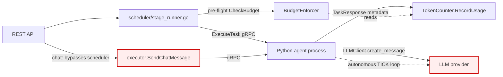
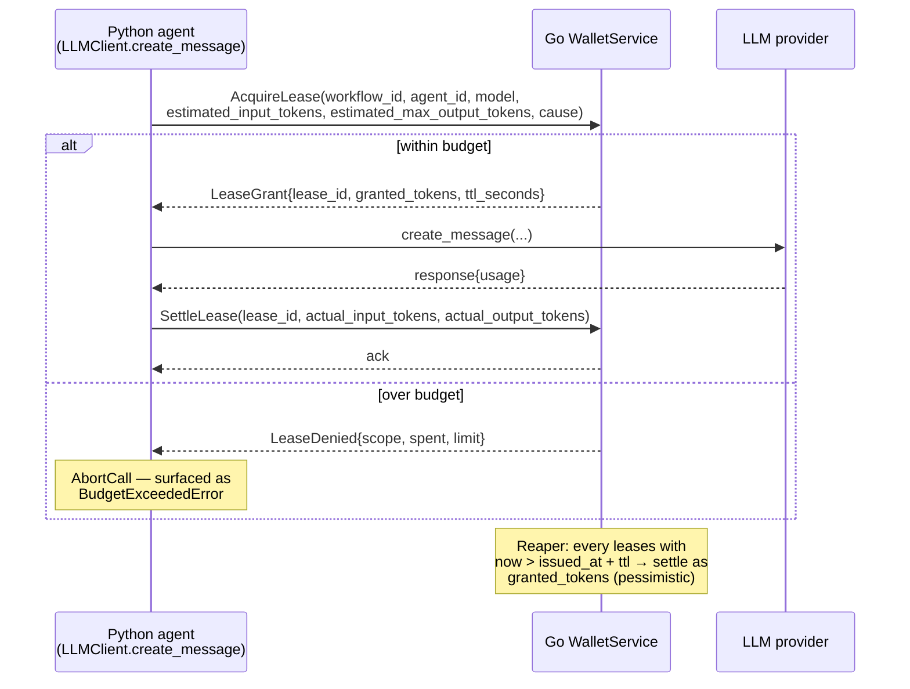

# RFC 0023 — LLM Call Leasing

**Type**: architecture
**Status**: 📋 Proposed
**Author**: Maksim Khomutov
**Date**: 2026-05-09
**Target**: v0.3.x (TBD)
**Depends on**: RFC 0006 (Efficiency & Execution Limits), RFC 0017 (Memory Injection Budget)

---

## Table of Contents

- [Summary](#summary)
- [Motivation](#motivation)
- [Goals](#goals)
- [Non-Goals](#non-goals)
- [Design / Implementation](#design--implementation)
  - [A. Current State and Gaps](#a-current-state-and-gaps)
  - [B. Lease Lifecycle](#b-lease-lifecycle)
  - [C. Proto Surface](#c-proto-surface)
  - [D. Go Wallet Service](#d-go-wallet-service)
  - [E. Python Client Integration](#e-python-client-integration)
  - [F. Failure Modes](#f-failure-modes)
  - [G. Migration of Existing `CheckBudget`](#g-migration-of-existing-checkbudget)
- [Security Considerations](#security-considerations)
- [Phased Implementation Plan](#phased-implementation-plan)
- [Files Touched (Estimated)](#files-touched-estimated)
- [Test Strategy](#test-strategy)
- [Open Questions](#open-questions)
- [Decision / Next Steps](#decision--next-steps)
- [Related Documentation](#related-documentation)

---

## Summary

Today the budget enforcer (`internal/cost/BudgetEnforcer`) lives in the Go orchestrator and the LLM call lives in the Python agent process — and there is no synchronous coupling between them. The only enforcement point is a single pre-dispatch `CheckBudget` per `ExecuteTask` ([stage_runner.go:155](../../internal/scheduler/stage_runner.go)); every LLM call that originates outside the workflow path (chat, autonomous TICK, sub-agent spawn) bypasses it entirely. This RFC moves the orchestrator from a post-hoc accountant to an in-line gatekeeper by introducing a per-call lease protocol: every LLM invocation acquires a token grant from a Go-side `WalletService` over gRPC before issuing, and settles actual usage afterward. Runaway-cost prevention becomes a code-review-able invariant ("does this path acquire a lease?") rather than an architectural assumption that each new code path can quietly invalidate.

## Motivation

Cost is the recurring failure class on this project. The README's [Cost Warning](../../README.md#%EF%B8%8F-cost-warning--read-before-running) documents a real $35 incident from v0.2.1 testing; v0.2.2's [empty-context TICK short-circuit](0017-persona-memory-injection-budget.md#f-empty-context-tick-short-circuit) closed one specific leak; v0.2.3 still lists "chat traffic bypasses `BudgetEnforcer`" as a [known limitation](../../README.md#known-limitations-in-v023). Each fix targets a symptom; the structural cause is unchanged.

The structural cause is that the wallet sits downstream of the spender. Concretely:

1. **`BudgetEnforcer.CheckBudget` is invoked exactly once per `TaskRequest`**, in [`scheduler/stage_runner.go:155`](../../internal/scheduler/stage_runner.go), with a worst-case `step.MaxTokens` heuristic. Inside the dispatched task, the Python agent is free to make any number of LLM calls; the orchestrator only learns about them after the fact via `TaskResponse.Metadata["input_tokens"]/["output_tokens"]`.
2. **The persona TICK loop is not a `TaskRequest` at all.** [`agents/persona_runtime/action_loop.py`](../../agents/persona_runtime/action_loop.py) drives autonomous LLM calls inside the agent process. The orchestrator is not on the path. The empty-context bug in v0.2.1 went undetected for the duration of the test session because no orchestrator-side check could have fired.
3. **The chat path bypasses the scheduler entirely.** `POST /api/v1/agents/{id}/chat` routes through `internal/server/chat_handler.go` → `executor.SendChatMessage` → agent gRPC, never crossing `stage_runner.go`. The bypass is documented but unfixed across three releases.
4. **Sub-agent spawns** ([`agents/sub_agents/`](../../agents/sub_agents/)) compound the problem: a parent agent's task may transitively trigger child agents with their own LLM calls, none accounted against the parent's pre-flight estimate.

What happens if we do nothing: the v0.3 channels work (RFC 0011) introduces inter-agent message dispatch — yet another LLM-call origin point that defaults to bypassing the wallet. The v0.4 organisational topology (RFC 0007 family) compounds it further. The cost-leak class scales linearly with new event sources. Each new RFC has to remember to wire its call paths through `BudgetEnforcer`, and the omission is silent until someone notices a charge on the provider's invoice.

The fix is to make the wallet a hard gate on the call itself. If a path forgets to acquire a lease, the LLM call fails closed. Adding a new call path becomes a positive action ("call `WalletService.AcquireLease`") rather than a negative one ("remember to plumb `BudgetEnforcer` through this new code"), and the failure mode flips from "silent overspend" to "loud rejection."

## Goals

1. Every LLM invocation in the system — workflow task, chat, autonomous TICK, sub-agent — acquires a token grant from a Go-side `WalletService` before issuing, and settles actual usage after.
2. The `WalletService` is the single source of truth for spending decisions. No code path can issue an LLM call without a server-issued `lease_id`.
3. Failure is closed: a `WalletService` outage, a denied lease, or an unsettled-and-expired lease prevents the call from happening (or from being repeatable).
4. Budget rejection is observable and structured: agents receive a typed `LeaseDenied` error with `scope` and `reason` matching today's [`BudgetError`](../../internal/cost/cost.go) shape, and emit a span attribute + metric.
5. Existing `BudgetEnforcer.CheckBudget` becomes an internal implementation detail of `WalletService`; the workflow path's pre-dispatch check is preserved as an early-fail optimisation but is no longer the enforcement point.
6. The added latency budget per LLM call is ≤ 5 ms p99 in the local dev stack (gRPC round-trip orchestrator ↔ agent on loopback). Network-distant deployments are out of scope for v0.3.x.
7. The lease protocol is forward-compatible with RFC 0011 channel-message-driven LLM calls and the v0.4 multi-agent topology — each origin tags its lease with a `cause` enum so spend can be attributed and policy can differ per origin.

## Non-Goals

- **Distributed wallet / multi-orchestrator coordination.** Single-node enforcement only. RFC 0006 (mesh) territory.
- **Replacing the existing `TokenCounter` storage.** The lease ledger reuses today's per-workflow / per-agent / global counters; only the *check point* moves.
- **Replacing pricing logic.** [`CostConfig.EstimateCost`](../../internal/cost/config.go) stays as-is and is invoked inside `WalletService` for both the lease grant and the settlement.
- **Tool-call cost accounting.** Only LLM-provider calls are leased in this RFC. Tool execution is gated separately by [`agents/tools/permissions.py`](../../agents/tools/permissions.py) and is out of scope.
- **Provider-side rate-limit handling.** Provider 429s are still surfaced as `_classify_llm_error → "rate_limit"` ([`agents/llm_client.py:81`](../../agents/llm_client.py)). The wallet does not pre-emptively rate-limit against provider quotas.
- **Streaming-response token accounting.** Persatrix does not yet stream LLM responses; when it does, settlement semantics for partial completions become a follow-up RFC.
- **Removing `TaskConfig.max_llm_calls` / `max_tokens`.** These remain as per-task hints used by the scheduler and the agent's own loop bound; the wallet check is independent.

---

## Design / Implementation

### A. Current State and Gaps



Three call origins reach `LLM provider` from inside `AGENT`:

| Origin | Reaches `BudgetEnforcer` today? | Where it lives |
|---|---|---|
| Workflow task (`ExecuteTask`) | Yes — once, pre-dispatch, with worst-case estimate | [`stage_runner.go:155`](../../internal/scheduler/stage_runner.go) |
| Chat (`SendChatMessage`) | **No** — documented bypass | [`internal/server/chat_handler.go`](../../internal/server/chat_handler.go) |
| Autonomous TICK | **No** — agent-internal loop | [`agents/persona_runtime/action_loop.py`](../../agents/persona_runtime/action_loop.py) |

The pre-dispatch check is also coarse: a single estimate per `TaskRequest`, not per LLM call. A long-running task that exceeds its estimate mid-flight is not interrupted; the overrun is only recorded on completion via `TaskResponse.Metadata`.

### B. Lease Lifecycle

The wallet exposes three operations and one daemon. Every LLM call is bracketed by `Acquire` ↔ `Settle` (or `Release` for an aborted call). Unsettled leases are reaped by the daemon on TTL expiry.



**Acquire** records a *provisional* charge equal to the estimated worst-case cost of the call against all three scopes (global, per-workflow, per-agent). The check uses the same `EstimateCost` formula as today.

**Settle** replaces the provisional charge with the actual charge derived from the provider's reported usage. The delta (positive or negative) is applied to all three scopes atomically.

**Release** is `Settle` with `actual_*_tokens = 0` — used when the call did not happen (e.g. agent-side abort before send, provider connection failure pre-request). It removes the provisional charge.

**Reaper** is a goroutine inside `WalletService` that scans for unsettled leases older than `ttl_seconds` (default: 2× the agent's per-call timeout, so 60 s for a 30 s default) and settles them at the granted amount. This guarantees that an agent crash mid-call does not leave a permanent provisional hold *and* does not silently free spend.

### C. Proto Surface

A new `proto/wallet.proto` is added. The shape mirrors today's `BudgetError` and `RecordUsage`.

```protobuf
syntax = "proto3";
package persatrix.v1;
option go_package = "github.com/mkhomutov/persatrix/internal/generated/walletpb";

service WalletService {
  rpc AcquireLease(LeaseRequest) returns (LeaseResponse);
  rpc SettleLease(SettlementRequest) returns (SettlementAck);
  rpc ReleaseLease(ReleaseRequest) returns (SettlementAck);
}

message LeaseRequest {
  string workflow_id = 1;            // empty for chat / TICK
  string agent_id = 2;
  string model = 3;                  // for EstimateCost lookup
  int64 estimated_input_tokens = 4;
  int64 estimated_max_output_tokens = 5;
  Cause cause = 6;                   // origin attribution
  string trace_id = 7;               // for span linking; OTEL baggage
}

enum Cause {
  CAUSE_UNSPECIFIED = 0;
  CAUSE_WORKFLOW_TASK = 1;
  CAUSE_CHAT = 2;
  CAUSE_AUTONOMOUS_TICK = 3;
  CAUSE_SUB_AGENT = 4;
  CAUSE_CHANNEL_MESSAGE = 5;         // RFC 0011 forward-compat
}

message LeaseResponse {
  oneof outcome {
    LeaseGrant grant = 1;
    LeaseDenied denied = 2;
  }
}

message LeaseGrant {
  string lease_id = 1;               // ULID, server-issued
  int64 granted_input_tokens = 2;    // == estimated_input_tokens
  int64 granted_output_tokens = 3;   // == estimated_max_output_tokens
  int32 ttl_seconds = 4;
}

message LeaseDenied {
  string scope = 1;                  // "global" | "per_workflow" | "per_agent"
  double spent_usd = 2;
  double limit_usd = 3;
  double estimated_usd = 4;
  string message = 5;                // human-readable reason
}

message SettlementRequest {
  string lease_id = 1;
  int64 actual_input_tokens = 2;
  int64 actual_output_tokens = 3;
}

message ReleaseRequest {
  string lease_id = 1;
  string reason = 2;                 // "aborted" | "provider_error" | "timeout"
}

message SettlementAck {
  bool success = 1;
  string error_message = 2;
}
```

The wallet service is registered on the same gRPC server the orchestrator already exposes for the agent → orchestrator direction. (Today the agent → orchestrator direction has no RPCs; this RFC adds the first ones. The transport already exists because the orchestrator dials the agent for `ExecuteTask`; the reverse dial uses the same connection in reverse via gRPC bidirectional streaming, or — simpler — a new outbound dial on agent startup. See [Open Questions §1](#open-questions).)

### D. Go Wallet Service

A new package `internal/wallet/` houses the gRPC servicer. It composes today's `cost.TokenCounter` and `cost.BudgetEnforcer` rather than replacing them:

```go
// internal/wallet/wallet.go
type WalletService struct {
    counter  *cost.TokenCounter
    enforcer *cost.BudgetEnforcer
    pricer   *cost.CostConfig
    logger   *zap.Logger

    mu     sync.Mutex
    active map[string]*lease  // lease_id → in-flight lease
}

type lease struct {
    workflowID, agentID, model string
    grantedInput, grantedOutput int64
    grantedUSD                 float64
    issuedAt                   time.Time
    ttl                        time.Duration
    cause                      walletpb.Cause
}

func (w *WalletService) AcquireLease(ctx context.Context, req *walletpb.LeaseRequest) (*walletpb.LeaseResponse, error) {
    decision := w.enforcer.CheckBudget(req.WorkflowId, req.AgentId, req.Model,
        req.EstimatedInputTokens + req.EstimatedMaxOutputTokens)
    if decision.Decision == cost.BudgetReject {
        return &walletpb.LeaseResponse{Outcome: &walletpb.LeaseResponse_Denied{...}}, nil
    }
    // Apply provisional charge to TokenCounter (new RecordProvisional API).
    leaseID := ulid.Make().String()
    w.counter.RecordProvisional(cost.UsageRecord{...})
    w.mu.Lock()
    w.active[leaseID] = &lease{...}
    w.mu.Unlock()
    return &walletpb.LeaseResponse{Outcome: &walletpb.LeaseResponse_Grant{...}}, nil
}
```

`TokenCounter` gains two new methods:

- `RecordProvisional(rec UsageRecord)` — adds to all three scope totals using the worst-case estimate, marked as provisional.
- `Reconcile(leaseID, actualInput, actualOutput)` — replaces the provisional with the actual; the delta is applied atomically. Settled and released leases both go through this; `Release` passes `(0, 0)`.

The reaper is `func (w *WalletService) reapLoop(ctx context.Context, interval time.Duration)`, running every `interval` (default 5 s).

### E. Python Client Integration

A new module `agents/wallet_client.py` wraps the gRPC stub and exposes a single async context manager:

```python
class WalletClient:
    async def lease(
        self,
        *,
        agent_id: str,
        model: str,
        estimated_input_tokens: int,
        estimated_max_output_tokens: int,
        cause: Cause,
        workflow_id: str = "",
    ) -> AsyncContextManager[Lease]:
        """Acquire a lease, yield it, and settle on exit.

        Raises BudgetExceededError if the wallet denies the lease.
        Settles with actual usage on normal exit.
        Releases (settles with 0 tokens) on exception before the LLM call.
        Settles with granted amount on exception after the LLM call (pessimistic).
        """
```

`LLMClient.create_message` ([`agents/llm_client.py:97`](../../agents/llm_client.py)) wraps its existing body in `async with wallet.lease(...) as lease:`; on success, it calls `lease.settle(input_tokens=response.usage.input_tokens, output_tokens=response.usage.output_tokens)`. The lease ID is propagated as a span attribute (`persatrix.lease_id`) for trace correlation with the wallet-side logs.

Estimating `estimated_input_tokens` pre-call requires tokenising the prompt; Persatrix already does this in [`internal/cost/`](../../internal/cost/) using the model-specific tokeniser config. The Python client mirrors that estimation locally rather than round-tripping the prompt to Go (privacy + bandwidth).

`BudgetExceededError` is a new typed exception that propagates up the agent's call stack. For workflow tasks, the executor surfaces it as `TaskStatus.FAILED` with a structured `error_message`. For chat, the agent returns `ChatResponse.reply_status = "error"` with the wallet's `LeaseDenied.message`. For autonomous TICK, the loop logs a warning and treats the tick as idle (incrementing `idle_count` per the v0.2.2 short-circuit).

### F. Failure Modes

| Failure | Behaviour | Rationale |
|---|---|---|
| Wallet RPC unreachable from agent | Call fails closed — `BudgetExceededError(reason="wallet_unreachable")` | Cost safety > availability. An agent that cannot reach the wallet cannot prove it has budget. |
| Lease granted but Python crashes pre-call | Reaper settles at granted amount on TTL expiry | Pessimistic: prevents the crash from "freeing" budget that may have been spent on an in-flight provider request. |
| Lease granted, provider 5xx before any usage reported | Agent calls `ReleaseLease(reason="provider_error")`; provisional reversed | Optimistic: provider rejected the request, no real spend occurred. |
| Lease granted, agent crash mid-stream | Reaper at TTL expiry settles at granted amount | Same as crash pre-call — the in-flight request may have completed on provider side. |
| Settlement RPC fails after a successful provider call | Agent retries Settle with backoff; if all retries fail, lease eventually reaped at granted amount | Granted amount ≥ actual (by construction), so the worst case is over-accounting, not under-accounting. |
| Clock skew between agent and orchestrator | TTL is enforced by orchestrator clock only; agent does not reason about TTL | Single source of truth removes a class of subtle bugs. |

The closed-failure default is the load-bearing decision. It is the inverse of today's behaviour (a `BudgetEnforcer` outage today would manifest as the orchestrator failing entirely, but in-process LLM calls in already-dispatched tasks would continue spending).

### G. Migration of Existing `CheckBudget`

The pre-dispatch `CheckBudget` call in [`scheduler/stage_runner.go:155`](../../internal/scheduler/stage_runner.go) is preserved as an *early-fail* optimisation — if the worst-case for the whole task already exceeds budget, fail the task before paying the gRPC dispatch + lease-acquire cost. It is no longer the enforcement point; the agent-side per-call lease is.

The chat and TICK paths gain enforcement they did not have. The workflow path gains *per-call* enforcement on top of the existing per-task pre-check.

`BudgetEnforcer` itself is unchanged in this RFC; it is composed by `WalletService` rather than called directly by `stage_runner`. A follow-up RFC may collapse `BudgetEnforcer` into `WalletService` once all callers have migrated.

## Security Considerations

- **Spoofed lease IDs.** Lease IDs are server-issued ULIDs. The wallet rejects `Settle`/`Release` for unknown IDs. There is no value to an attacker in spoofing one (the only effect is to free budget that does not exist, which is detected on next reaper pass).
- **Replay of `Settle` requests.** Settling a lease twice is rejected (the lease is removed from `active` on first settlement). Idempotency for the agent-side retry case is provided by the agent retrying the *same* `lease_id`; the wallet returns `success=true` with a `noop` indicator if the lease has already been settled with the same actual values.
- **Lease exhaustion / DoS.** A buggy or malicious agent could acquire many leases and never settle. The reaper bounds the damage at `(active_lease_count_max × ttl)`; in addition, `WalletService` enforces a per-agent `max_active_leases` (default 16, configurable) and rejects new acquisitions above that cap.
- **mTLS between agent and orchestrator.** Today's gRPC transport is cleartext and assumed local-only (see [`proto/task.proto:131`](../../proto/task.proto) sender-spoofing comment). The wallet RPCs inherit this assumption. Production deployments require RFC 0009 (security & sandboxing) to land first.
- **Information leakage in `LeaseDenied`.** Returning `spent_usd` and `limit_usd` to the agent reveals operational financial information to agent code that may execute attacker-controlled prompts. For v0.3.x this is accepted risk (single-tenant, single-operator); a follow-up RFC may scrub these fields when the agent is sub-agent-spawned or runs untrusted prompt content.

## Phased Implementation Plan

### Phase 1: Proto + Wallet skeleton (PR 1)

Land `proto/wallet.proto`, generate stubs for Go and Python, scaffold `internal/wallet/` with `AcquireLease` always granting and `SettleLease` always succeeding. No call-site wiring. Establishes the contract; reviewable in isolation.

### Phase 2: Real enforcement in `WalletService` (PR 2)

Implement `RecordProvisional` / `Reconcile` on `TokenCounter`. Wire `BudgetEnforcer` into `AcquireLease`. Add the reaper. Unit tests on the wallet in isolation; no agent integration yet.

### Phase 3: Wire workflow path through wallet (PR 3)

Add `WalletClient` to `agents/wallet_client.py`. Wrap `LLMClient.create_message` in the lease context manager when invoked from a workflow task (cause = `WORKFLOW_TASK`). Keep the pre-dispatch `CheckBudget` as the early-fail optimisation. End-to-end test: an over-budget workflow now fails on the *second* LLM call inside a task, not just the pre-dispatch check.

### Phase 4: Wire chat path (PR 4)

Cause = `CHAT`. Closes the v0.2.3 documented bypass. New manual test `MT-COST-003` (chat budget exceed). Surfaces `LeaseDenied` as `ChatResponse.reply_status = "error"`.

### Phase 5: Wire autonomous TICK + sub-agent (PR 5)

Cause = `AUTONOMOUS_TICK` and `SUB_AGENT`. The TICK path treats `LeaseDenied` as an idle tick (consistent with v0.2.2 short-circuit). Sub-agent spawns acquire leases against the *parent's* `agent_id` so spend is attributed to the originating persona.

### Phase 6: Channel-message origin (RFC 0011 follow-up)

When RFC 0011 channels deliver a message and the recipient agent generates an LLM-backed reply, the lease is acquired with cause = `CHANNEL_MESSAGE`. This phase ships alongside RFC 0011 PR 4b's response gate so the gate runs *before* lease acquisition (no lease held during gate evaluation).

## Files Touched (Estimated)

| Component | Files | Change |
|-----------|-------|--------|
| Protos | `proto/wallet.proto` | New file (~80 lines) |
| Protos | `proto/task.proto` | No change (orthogonal) |
| Go orchestrator | `internal/wallet/wallet.go` (new) | `WalletService` gRPC servicer + lease state + reaper |
| Go orchestrator | `internal/wallet/wallet_test.go` (new) | Unit tests for grant/deny/settle/release/reap |
| Go orchestrator | `internal/cost/cost.go` | Add `RecordProvisional`, `Reconcile`; mark `CheckBudget` as composed-by-wallet |
| Go orchestrator | `internal/cost/cost_provisional_test.go` (new) | Unit tests for provisional/reconcile semantics |
| Go orchestrator | `internal/scheduler/stage_runner.go` | Comment: `CheckBudget` is now an early-fail optimisation |
| Go orchestrator | `cmd/orchestrator/main.go` | Register `WalletService` on the gRPC server |
| Python agents | `agents/wallet_client.py` (new) | gRPC client + `lease()` async context manager |
| Python agents | `agents/llm_client.py` | Wrap `create_message` in lease context |
| Python agents | `agents/persona_runtime/action_loop.py` | Treat `BudgetExceededError` on TICK as idle |
| Python agents | `agents/server_servicers.py` | Surface `BudgetExceededError` on chat as `reply_status="error"` |
| Python agents | `agents/tests/test_wallet_client.py` (new) | Unit + integration tests |
| Config | `config/optimization.yaml` | New `wallet:` block (TTL, max active leases, reaper interval) |
| Docs | `docs/observability.md` | Document `persatrix.lease_id` span attribute + new wallet metrics |
| Docs | `docs/manual-tests/MT-COST-003.md` (new) | Chat budget-exceed manual test |
| Docs | `docs/diagrams/component-architecture.md` | Add `wallet/` package box |

## Test Strategy

- **Unit tests (Go)**: `WalletService` grant/deny across all three scopes; provisional → settle delta correctness; reaper idempotency; lease-ID collision rejection; `max_active_leases` enforcement.
- **Unit tests (Python)**: `WalletClient.lease()` happy path, exception-before-call → release, exception-after-call → settle-at-granted, retry on transient settle failures.
- **Integration tests**: end-to-end workflow run with `max_daily_usd` set so the second LLM call inside a single task is denied; assert task fails with structured `BudgetError` *and* the provisional charge from the denied call is reversed.
- **Integration tests**: chat session that exceeds `per_agent` budget mid-conversation; assert `reply_status="error"`; assert subsequent chats are also denied until budget resets.
- **Integration tests**: persona TICK loop with `per_agent` budget exhausted; assert ticks are recorded as idle, no LLM calls reach the provider, `idle_count` increments.
- **Integration tests**: simulate agent crash mid-call (kill -9 between `Acquire` and `Settle`); assert reaper settles at granted amount within TTL+5 s.
- **Manual tests**: `MT-COST-003` (chat budget exceed), `MT-COST-004` (TICK budget exhaustion → idle).
- **Load test (informational, not gating)**: 1000 concurrent leases on loopback; assert p99 acquire+settle round-trip ≤ 5 ms.

## Open Questions

1. **Transport: outbound dial from agent, or reverse direction on existing connection?** The orchestrator already maintains a gRPC connection to each agent for `ExecuteTask`. Reusing it via bidirectional streaming avoids a second listener on the orchestrator; a new outbound dial from the agent is simpler but doubles the connection count. **Provisional answer**: new outbound dial — simpler, mirrors the log-buffer SSE pattern, and the connection count is bounded by the agent count.
2. **Default TTL.** Proposed default: `2 × max(timeout_seconds across configs)`, capped at 120 s. Open to feedback — too long delays reaper recovery, too short risks settling live calls as crashed.
3. **Should `LeaseDenied` carry `spent_usd` / `limit_usd`?** See [Security Considerations](#security-considerations). Leaving in for v0.3.x with a follow-up RFC to scrub for untrusted prompt contexts.
4. **Per-cause budget policies.** Today all causes share the same `BudgetEnforcer` thresholds. A future extension is per-cause caps (e.g. "autonomous TICKs may use at most 20% of the per-agent daily budget"). Out of scope here but the `Cause` enum reserves the design space.
5. **Tokeniser parity between Go and Python for the input estimate.** Both sides must agree on the input-token count, or settlement deltas will be systematically biased. Need to confirm whether [`internal/cost/`](../../internal/cost/) and the Python agent share a tokeniser implementation today, or whether a shared library / WASM binding is needed.
6. **Interaction with the response cache** ([`internal/cost/cache.go`](../../internal/cost/cache.go)). A cache hit issues no provider call and incurs no cost; should the cache lookup happen before lease acquisition (no lease at all on hit) or after (lease acquired then released on hit)? **Provisional answer**: before — a cache hit should not consume a lease slot.

## Decision / Next Steps

This RFC is in `📋 Proposed`. Next step: review and acceptance. On acceptance, file PR plan as `docs/rfcs/0023-pr-plan.md` per the project convention (mirroring [`0017-pr-plan.md`](0017-pr-plan.md), [`0018-pr-plan.md`](0018-pr-plan.md), etc.) and begin Phase 1.

Open Questions §1 (transport) and §5 (tokeniser parity) should be resolved before Phase 1 lands so the proto contract and the Python client share the same assumptions.

## Related Documentation

- [RFC 0006 — Efficiency & Execution Limits](0006-efficiency-execution-limits.md) — defines `max_llm_calls`, the per-task budget shape this RFC complements.
- [RFC 0017 — Persona Memory Injection Token Budget](0017-persona-memory-injection-budget.md) — closes one specific cost leak; this RFC removes the class.
- [RFC 0011 — Channels & Bridges](0011-channels-bridges.md) — introduces a new LLM-call origin (channel messages) that this RFC's `Cause` enum reserves space for.
- [README — Cost Warning](../../README.md#%EF%B8%8F-cost-warning--read-before-running) — operational context and the v0.2.1 incident this RFC addresses structurally.
- [`internal/cost/cost.go`](../../internal/cost/cost.go) — `BudgetEnforcer` and `TokenCounter`, composed by the new `WalletService`.
- [`agents/llm_client.py`](../../agents/llm_client.py) — the call site that gains lease wrapping.
