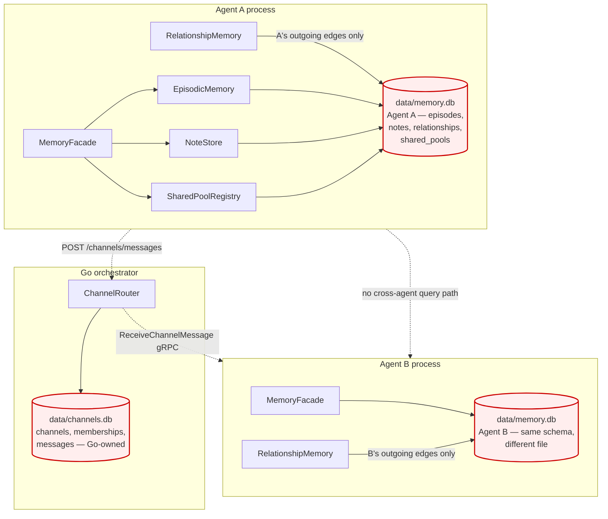

# RFC 0029 — Personal/Society Storage Split

> **Numbering note (2026-05-10).** This RFC was originally filed as RFC 0025 (PR #309). The 0025 slot is reserved as `superseded by RFC 0027` (per [docs/rfcs/README.md §Reserved RFC Numbers](README.md#reserved-rfc-numbers) and [ROADMAP.md RFC Master Index](../../ROADMAP.md#rfc-master-index) — RFC 0027 explicitly says "supersedes the user's draft RFC 0025"). Reusing slot 0025 for an unrelated topic would invalidate that supersession edge and the README's "slot retained for historical record" semantic, so this RFC was renumbered to the next free slot. Slots 0023 (narrowed) and 0024 (deferred) had no superseding RFC pointing at them and so were not renumbered when their files landed under different topics — only 0025 had an active supersession breadcrumb that this rename preserves. (The reasoning was first recorded in the PR #309 deep-review process; review reports themselves live under `docs/pr-reviews/`, which is `.gitignore`'d per repo convention, so this note is the canonical record.)

**Type**: architecture
**Status**: 🚧 Implementing
**Author**: Maksim Khomutov
**Date**: 2026-05-10
**Target**: Phase 1 v0.3.2 (facade + tier rename) — see [v0.3.2 plan](../v0.3.2-plan.md) and [PR plan](0029-pr-plan.md); Phases 2–6 v0.4.0 (Postgres society store, migration tooling)
**Depends on**: RFC 0005 (Persona Agent + Memory), RFC 0008 (Memory & Context Optimization), RFC 0011 (Channels & Bridges)
**Soft-depends on (Phase 2+)**: RFC 0009 Phase 4 (Agent Identity Tokens & HITL Gates) — Phase 2 of this RFC consumes the token-verifier API for cross-agent reads (§E); a mock verifier is acceptable for unit tests until 0009 Phase 4 ships.
**Relates to**: RFC 0009 (Security & Sandboxing), RFC 0013 (Legal & Ethical Compliance), RFC 0026 (Declarative Facts Tier), RFC 0027 (Reflection-Driven Consolidation), RFC 0028 (Agent Decision Policy Engine)
**Spawned from**: [docs/storage-architecture-roadmap.md](../storage-architecture-roadmap.md) — SA-1

---

## Table of Contents

- [Summary](#summary)
- [Motivation](#motivation)
- [Goals](#goals)
- [Non-Goals](#non-goals)
- [Design / Implementation](#design--implementation)
  - [A. Current State and Gaps](#a-current-state-and-gaps)
  - [B. The Personal/Society Boundary](#b-the-personalsociety-boundary)
  - [C. MemoryStore Facade](#c-memorystore-facade)
  - [D. Society Store: Schema and Backend](#d-society-store-schema-and-backend)
  - [E. Cross-Agent Read Path and Capability Tokens](#e-cross-agent-read-path-and-capability-tokens)
  - [F. Vectors-as-Accelerator-Only](#f-vectors-as-accelerator-only)
  - [G. Migration of Existing `memory.db` and `channels.db`](#g-migration-of-existing-memorydb-and-channelsdb)
- [Security Considerations](#security-considerations)
- [Phased Implementation Plan](#phased-implementation-plan)
- [Files Touched (Estimated)](#files-touched-estimated)
- [Test Strategy](#test-strategy)
- [Open Questions](#open-questions)
- [Decision / Next Steps](#decision--next-steps)
- [Related Documentation](#related-documentation)

---

## Summary

Today every memory tier — episodes, notes, relationships, shared pools — is a table in a single per-agent SQLite file at `data/memory.db` ([`agents/memory/episodic.py:98`](../../agents/memory/episodic.py#L98), [`agents/memory/relationship.py:73`](../../agents/memory/relationship.py#L73), [`agents/memory/facade.py:128`](../../agents/memory/facade.py#L128)). That model fits v0.2's per-agent private memory exactly. It does not fit v0.3 channels (RFC 0011 already carved out a separate `data/channels.db` because the agent-DB shape was wrong) and it actively obstructs v0.4 organisational topology, decision audit (RFC 0028), and compliance erasure (RFC 0013): each lands as "another table in `memory.db`" and the cost of carving the society state out grows with every PR.

This RFC formalises the personal/society storage boundary recommended by [`docs/storage-architecture-roadmap.md`](../storage-architecture-roadmap.md) (SA-1) into an actionable implementation plan. **Personal memory** (one writer, one logical owner — the persona's brain) stays in per-agent SQLite. **Society state** (cross-agent consistency, external query, compliance erasure) moves to a Postgres society store. A `MemoryStore` facade owns both — callers see a typed API and never reach into a tier-specific DSN. Phase 1 (v0.3.x) ships the facade and locks in the API surface so v0.3 channels integrate against a stable boundary; Phases 2–4 (v0.4.0) add the Postgres backend, capability-token-mediated cross-agent reads, and the `persatrix memory migrate` one-shot.

## Motivation

Cross-agent state is already escaping the per-agent SQLite assumption — informally, by carving out side files. The roadmap calls this out plainly: "without a policy decision now about *where the personal/society boundary lives*, each [v0.3+] RFC will independently pick 'another table in `memory.db`,' and the cost of carving the society state out grows with every PR that lands" ([storage-architecture-roadmap.md §Why this doc exists](../storage-architecture-roadmap.md#why-this-doc-exists)).

Concretely, four problems compound:

1. **The "one SQLite per agent" assumption was already broken by RFC 0011.** Channels live in a separate Go-owned SQLite at `data/channels.db` ([`internal/channels/sqlite.go`](../../internal/channels/sqlite.go), [RFC 0011 §B](0011-channels-bridges.md#b-channel-store)) precisely because channel state is multi-writer and cross-agent — properties WAL-mode SQLite serialises poorly and that the per-agent DB has no schema for. The carve-out happened ad-hoc; there is no overarching policy for what else should follow it. The next RFC that needs cross-agent state will face the same choice with no precedent guiding it.
2. **Relationships are already an N×M graph stored as N independent files.** [`RelationshipMemory`](../../agents/memory/relationship.py) is keyed on `(agent_id, other_participant_id)` and lives inside the agent's own SQLite ([`relationship_types.py`](../../agents/memory/relationship_types.py)). v0.2's one-on-one chat hides the problem: each agent only stores its own outgoing edges. v0.3 channels promote agents to first-class participants who form opinions over time; queries like "show me every agent who trusts code-reviewer above 0.7" require either reading every agent's SQLite file or duplicating the edges at write time. Neither is acceptable.
3. **Compliance erasure ([RFC 0013](0013-legal-ethical-compliance.md)) is unimplementable on the current shape.** Right-to-erasure for a participant requires deleting every row mentioning that participant from every store. Today that is a `foreach` over N agent SQLite files plus the Go-side `channels.db` plus any future tables. There is no transactional boundary spanning them. The roadmap's Postgres recommendation collapses this to a single `JOIN`-and-`DELETE`.
4. **The decision is much cheaper before v0.3 channels ship.** Once channels go GA, every cross-agent feature (RFC 0028 `DecisionRecord`s on every checkpoint, RFC 0014 skill grants, RFC 0010 sub-agent spawn topology, the v0.4 org graph) inherits the "another table in `memory.db`" default. The roadmap explicitly orders SA-1 *before* RFC 0028 implementation begins so `DecisionRecord` schema lands in the right store the first time.

What happens if we do nothing: each subsequent RFC re-litigates the personal/society boundary on its own scope, picks a different answer, and the system ends up with three disjoint storage idioms (per-agent SQLite, side-file SQLite à la `channels.db`, ad-hoc JSON in `data/`) with no migration story between them. The current `internal/channels/` carve-out is the warning shot. Drawing the boundary now — on paper, with a single facade — is the affordance that lets every future cross-agent RFC pin against one decision.

## Goals

1. **One stable typed API for memory access.** Every persona-runtime, sub-agent, and orchestrator-side caller goes through `MemoryStore`. No caller reaches into `aiosqlite` or constructs an `EpisodicMemory` / `RelationshipMemory` directly.
2. **Personal vs society is a property of the data, not the deployment.** Each tier declares which side of the boundary it lives on (Section B). Routing is the facade's job; callers never specify a backend.
3. **Per-agent SQLite remains the personal-memory backend indefinitely.** No regression in tick-loop latency, no Postgres dependency for single-agent mode (Risk #1 in the roadmap).
4. **Society state has exactly one backend.** Postgres in production. The `internal/channels/sqlite.go` side-file is folded in as part of Phase 3.
5. **Cross-agent reads go through capability tokens.** The facade enforces "agent A may only read agent B's `bonds` if A holds a token granting that scope" — RFC 0009 boundary, applied at the storage layer.
6. **Vectors are accelerators, not tiers.** When `pgvector` lands, a similarity hit returns a row ID; the truth still lives in `facts` / `episodes` / `bonds`. Erasure of an underlying row deletes the index entry transitively (Section F).
7. **Migration is a one-shot, fully reversible during a deprecation window.** `persatrix memory migrate` reads the current `data/memory.db` files and `data/channels.db`, populates the new layout, and leaves the originals in place as a read-only fallback for one minor version (Risk #3).
8. **The boundary is stable across v0.4 RFCs.** RFC 0028 `DecisionRecord`s, RFC 0010 sub-agent state, RFC 0014 skill registry, and any future society-scope RFC each pick a side at design time and the facade gives them a consistent shape.

## Non-Goals

- **Mesh / multi-node storage.** v0.6.0 territory (roadmap §Where Persatrix is now and where it is going).
- **Choice of Postgres extensions (`pgvector` vs alternatives).** Deferred to follow-up; this RFC commits to "vectors live in the society Postgres when they exist" only.
- **Replacing FTS5 for personal-memory recall.** Episodic recall stays SQLite + FTS5 ([`agents/memory/migrations.py:201-224`](../../agents/memory/migrations.py#L201-L224) — the `_FTS5_DDL` virtual-table declaration). The `MemoryStore` facade does not change recall semantics; it changes who calls them.
- **Re-tier vocabulary work.** SA-2 from the roadmap (renaming working→scratchpad, relationships→bonds, etc.) is a docs-only PR and ships independently. *This RFC adopts the SA-2 vocabulary in advance of that PR* — "bonds" appears in §B/§C/§D and the projection table is named `bonds_inbound`. If SA-2's wording diverges, this RFC's prose terminology updates with it; the schema names (`bonds_inbound`, `pool_entries`) are stable regardless because they ship as code in Phase 3.
- **Per-tier SQLite file split.** SA-5 is conditional on contention measurement; this RFC keeps one file per agent.
- **Migrating in-flight production data.** v0.3.x is pre-1.0; the migration tool ships in v0.4.0 alongside the Postgres backend, not before.
- **Authoring `pgvector` schema or embedding-model selection.** Vectors are a follow-up RFC; this RFC only commits the policy.
- **Replacing `data/channels.db` in Phase 1.** The Go-side SQLite store stays untouched until Phase 3; Phase 1 is facade-only.

---

## Design / Implementation

### A. Current State and Gaps



Concretely:

| Concern | Today | Why it doesn't survive v0.3+ |
|---|---|---|
| Episodes | Per-agent SQLite ([`episodic.py:98`](../../agents/memory/episodic.py#L98)) | Stays — personal memory, single writer |
| Notes | Per-agent SQLite ([`notes.py`](../../agents/memory/notes.py)) | Stays — personal memory |
| Relationships (bonds) | Per-agent SQLite ([`relationship.py:73`](../../agents/memory/relationship.py#L73)) | Personal slice stays; society projection (Section D) lands in Postgres |
| Shared pools | Per-agent SQLite ([`shared_pool.py`](../../agents/memory/shared_pool.py)) | Society — the name says it. Currently per-agent in physical layout despite the cross-agent semantics |
| Channels | Go-side SQLite at `data/channels.db` ([`internal/channels/sqlite.go`](../../internal/channels/sqlite.go)) | Society — already carved out, awaiting Postgres in Phase 3 |
| Decision records (RFC 0028) | Not yet implemented | Society — must land in Postgres on first write |
| Org graph (v0.4 RFC) | Not yet implemented | Society — recursive CTEs, multi-writer |
| Compliance audit chain (RFC 0013) | Not yet implemented | Society — single store, transactional erasure |

The asymmetry between "agent state lives in N SQLite files" and "channel state lives in one SQLite file owned by Go" is the existing precedent that this RFC generalises.

### B. The Personal/Society Boundary

A tier is **personal** when it has exactly one writer (the agent itself) and exactly one logical reader on the hot path (the same agent). A tier is **society** when it has multiple writers, or when readers other than the owning agent need consistent access without round-tripping through the owner's process.

| Tier | Side | Backend | Rationale |
|---|---|---|---|
| Episodes | Personal | Per-agent SQLite + FTS5 | Persona reads on every tick; microsecond latency budget; `rm -rf agent-{id}/` is the natural erasure boundary |
| Notes | Personal | Per-agent SQLite | Agent-authored prose, never read by other agents |
| Bonds (relationships) | **Personal slice + society projection** | SQLite for own outgoing edges; Postgres `bonds_inbound` projection for cross-agent queries | "Who do I trust" is personal; "who trusts X" is society. Section D specifies the projection (a maintained table, not a SQL `VIEW`) |
| Scratchpad (working memory) | Personal | RAM + small SQLite snapshot | Per the roadmap's "scratchpad bridges one interaction-close boundary" |
| Facts (RFC 0026) | Personal | Per-agent SQLite | The persona's declarative truth; `subject="self"` is identity |
| Commitments (RFC 0021 Phases 2–4) | Personal | Per-agent SQLite | Agent's own promises |
| Shared pools | **Society** | Postgres | Multi-agent by definition; current per-agent layout is a v0.2 artifact |
| Channels (messages, memberships) | **Society** | Postgres (Phase 3) | Multi-writer fanout; today in `data/channels.db` |
| Decision records (RFC 0028) | **Society** | Postgres | Append-only audit chain, cross-agent replay |
| Approval queue (RFC 0028 HITL) | **Society** | Postgres | Cross-process locks, TTLs |
| Procedural patterns (RFC 0015) | **Society** | Postgres | Cross-agent skill catalogue |

The boundary is **the same boundary** that capability tokens ([RFC 0009 Phase 4](0009-security-sandboxing.md)) and HITL gates ([RFC 0028](0028-agent-decision-policy-engine.md)) enforce. One line, three enforcement points: storage routing, capability check, audit logging.

### C. MemoryStore Facade

A single Python class — `agents.memory.MemoryStore` — owns every backend connection and exposes a typed API. Today's `MemoryFacade` ([`agents/memory/facade.py:109`](../../agents/memory/facade.py#L109)) is the closest thing; this RFC promotes it. The construction signature names the agent and *optionally* the society backend; absence of a society DSN means single-agent mode and society-tier writes raise `SocietyBackendUnavailable` on attempt.

```python
# agents/memory/store.py — Phase 1 sketch

@dataclass(frozen=True)
class StoreConfig:
    agent_id: str
    personal_db_path: str = "data/memory.db"
    society_dsn: str | None = None       # postgres://... or None for single-agent
    capability_token: bytes | None = None  # RFC 0009; required for cross-agent reads


class MemoryStore:
    """Single entry point for every memory access in the agent process.

    Personal-tier methods (episodes, notes, facts, bonds_self, commitments)
    hit per-agent SQLite. Society-tier methods (shared_pools, channels_history,
    bonds_inbound, decision_records) hit Postgres if configured, raise
    SocietyBackendUnavailable otherwise. Capability tokens scope cross-agent
    reads (Section E).
    """

    # ─── Personal tier ──
    async def store_episode(...) -> str: ...
    async def recall_episodes(...) -> list[Episode]: ...
    async def get_self_trust(other_id: str) -> float: ...
    # Reserved for SA-7 / RFC 0028 audit path — Phase 1 does NOT write
    # action logs (the choice between per-agent JSONL vs SQLite append-only
    # table is OQ §3 / SA-7's call), but the facade reserves the method
    # name so SA-7 can extend the personal-tier API without re-versioning.
    # Phase 1 raises NotImplementedError on call rather than leaving an
    # ambiguous `...` body that types as a no-op `None` return — callers
    # see an explicit "backend not chosen yet" error instead of silently
    # losing audit writes.
    async def record_action(...) -> str:
        raise NotImplementedError(
            "record_action backend chosen by SA-7 (RFC 0028 spawn); not in Phase 1"
        )

    # ─── Society tier ──
    async def publish_to_pool(pool: str, content: str, *, confidence: float) -> str: ...
    async def read_pool(pool: str, *, min_confidence: float | None = None) -> list[PoolEntry]: ...
    async def query_inbound_trust(threshold: float = 0.7) -> list[InboundTrust]:
        """Returns agents whose trust in *this agent* is ≥ threshold.
        Society-side query — requires Postgres backend and a capability token
        scoped to cross-agent bond reads.
        """
```

Three properties matter:

1. **No tier-specific DSN escapes the facade.** Callers never see `aiosqlite` or `asyncpg`. This is the v0.4-readiness invariant — when Phase 3 swaps the society backend from `internal/channels/sqlite.go` to Postgres, no caller breaks.
2. **Single-agent mode is first-class, and "society unavailable" is named explicitly.** The facade distinguishes three modes for society-tier calls so the deprecation-window read-fallback (§G) does not collide with the typed-error promise here. The exception hierarchy is `SocietyBackendUnavailable` (abstract base) → `SocietyDisabled` (intentional) | `SocietyTransientError` (connectivity). Catch-all `except SocietyBackendUnavailable` keeps the original §Test Strategy single-agent test working.

   | Mode | Trigger | Read behaviour | Write behaviour |
   |---|---|---|---|
   | Intentional disable | `society_dsn=None` (single-agent mode) | Raise `SocietyDisabled` | Raise `SocietyDisabled` |
   | Transient outage | DSN set, pool unhealthy / Postgres unreachable | If `--keep-source` migration window active: return a result tagged `is_partial=True` from the read-only SQLite source (caller's own slice only — no cross-agent rows) with a structured warning. Otherwise raise `SocietyTransientError`. | Always raise `SocietyTransientError`; never silently fall back, never silently buffer. |
   | Available | Normal | Postgres; result tagged `is_partial=False` | Postgres |

   The `--single-agent` deployment shape stays a one-binary, one-SQLite experience. A society-tier *write* during a Postgres outage is the case the original sketch did not cover; it raises a transient error and the caller decides whether to back off, queue (via the §D outbox for the bonds projection specifically), or surface to a human — the facade does not silently buffer because that hides outages from operators.

   **Reads carry a partial-result flag so degraded cross-agent visibility is not silent.** Society-tier read results (`list[PoolEntry]`, `list[InboundTrust]`, etc.) are wrapped in a typed envelope with an `is_partial: bool` field. Under the `Available` mode the field is `False`. Under `Transient outage` with `--keep-source` fallback, the field is `True` and the rows are the caller's own slice only — never B's, never C's. Callers whose correctness depends on cross-agent completeness (the `bonds_inbound` reader is the canonical case — acting on a partial trust graph would mis-rank peers) check `is_partial` and surface a "trust scores stale" warning to the user rather than acting on stale-and-missing data. This matches the symmetry the write path already has: writes never silently fall back, and now reads never silently shrink.
3. **The facade enforces "vectors-as-accelerator-only."** Section F. There is no `recall_by_similarity_returning_content` method; only `recall_by_similarity_returning_ids` exists, and the result must be hydrated through a personal/society read that has authoritative provenance.

### D. Society Store: Schema and Backend

Postgres, single instance per deployment. Schema laid out per [storage-architecture-roadmap.md §Target picture](../storage-architecture-roadmap.md#target-picture):

```sql
-- Channels (folded in from internal/channels/sqlite.go in Phase 3)
CREATE TABLE channels (...);          -- mirror of today's RFC 0011 §B schema
CREATE TABLE memberships (...);
CREATE TABLE messages (...);

-- Shared pools (lifted out of per-agent SQLite)
CREATE TABLE shared_pools (
    name TEXT PRIMARY KEY,
    sensitive BOOLEAN NOT NULL DEFAULT false,
    config_acl_json JSONB NOT NULL
);
CREATE TABLE pool_entries (
    id UUID PRIMARY KEY,
    pool_name TEXT NOT NULL REFERENCES shared_pools(name) ON DELETE CASCADE,
    source_agent TEXT NOT NULL,
    content TEXT NOT NULL,
    confidence REAL NOT NULL CHECK (confidence BETWEEN 0.0 AND 1.0),
    tags TEXT[],
    created_at TIMESTAMPTZ NOT NULL
);

-- Cross-agent bond projection (read-only view over personal-tier writes).
-- Carries participant_type both sides because RelationshipMemory keys on
-- (participant_id, participant_type, other_participant_id, other_participant_type)
-- — the trust graph spans agent↔agent, agent↔user (chat-as-DM amendment), and
-- agent↔group. Dropping the type dimension would lose information silently.
CREATE TABLE bonds_inbound (
    subject_id   TEXT NOT NULL,            -- the participant being trusted
    subject_type TEXT NOT NULL,            -- 'agent' | 'user' | 'group'
    source_id    TEXT NOT NULL,            -- the participant doing the trusting
    source_type  TEXT NOT NULL,            -- 'agent' | 'user' | 'group'
    trust_score          REAL NOT NULL,
    interaction_count    INTEGER NOT NULL,
    last_interaction_at  TIMESTAMPTZ,
    last_synced_at       TIMESTAMPTZ NOT NULL,  -- outbox bookkeeping; see below
    PRIMARY KEY (subject_id, subject_type, source_id, source_type)
);
-- Populated by the facade's write-through path with a local outbox.
-- Section D-atomicity below specifies the exact ordering and recovery semantics.

-- Decision audit (RFC 0028)
CREATE TABLE decision_records (...);

-- Compliance audit chain (RFC 0013)
CREATE TABLE audit_chain (...);
```

**Why bonds get a projection rather than full lift.** Personal-tier `RelationshipMemory.get_trust("bob")` is on the persona's hot read path — every prompt assembly that mentions Bob asks for it. Network-distant Postgres reads would push tick latency up. The personal SQLite row stays authoritative; the Postgres projection is for the rare "who trusts X" queries that the personal layout cannot serve. Write amplification is one extra UPSERT per `update_trust` call — measured in single-digit milliseconds, paid by the writer (not the reader).

**Bonds projection atomicity (write-through + outbox + nightly reconcile).** The naive write-through ("update SQLite, then UPSERT Postgres in the same call") has three failure modes that a hot-path projection cannot ignore: (a) SQLite commits, Postgres write fails (network blip, Postgres restart, transient credential rotation) and the projection drifts silently; (b) no rebuild path means a drifted projection stays wrong forever, defeating the SA-1 "compliance erasure is one JOIN-and-DELETE" promise; (c) `participant_type` was missing from the original sketch and the agent↔user / agent↔group cases (real per RFC 0011 chat-as-DM) would silently lose information. The schema above closes (c). The atomicity model is:

1. **Local outbox.** Each per-agent SQLite ships a `bonds_outbox` table:

   ```sql
   -- Per-agent SQLite (lives next to `relationships` in data/memory.db).
   -- The `id` surrogate key replaces the original prose's `row_pk`, which was
   -- ambiguous: the personal `relationships` table is keyed on the four-tuple
   -- (participant_id, participant_type, other_participant_id, other_participant_type)
   -- and exposes no rowid through the public API. A monotonic `id` gives the
   -- drain a stable FIFO order without coupling the outbox to SQLite's implicit
   -- rowid, and tolerates multiple queued updates to the same relationship
   -- (sequential `update_trust` calls each enqueue a row; the drain UPSERTs
   -- them in order so the final `bonds_inbound` value reflects the last enqueue).
   CREATE TABLE IF NOT EXISTS bonds_outbox (
       id                  INTEGER PRIMARY KEY,
       subject_id          TEXT NOT NULL,
       subject_type        TEXT NOT NULL,
       source_id           TEXT NOT NULL,
       source_type         TEXT NOT NULL,
       trust_score         REAL NOT NULL,
       interaction_count   INTEGER NOT NULL,
       last_interaction_at TEXT,
       queued_at           TEXT NOT NULL DEFAULT (strftime('%Y-%m-%dT%H:%M:%fZ', 'now')),
       attempts            INTEGER NOT NULL DEFAULT 0
   );
   -- Drain reads ORDER BY id (== insert order) and bounds-staleness alerting
   -- reads MIN(queued_at); both paths benefit from this index.
   CREATE INDEX IF NOT EXISTS bonds_outbox_queued_at_idx ON bonds_outbox(queued_at);
   ```

   Every `update_trust` writes the `relationships` row and the `bonds_outbox` row in the same SQLite transaction (the personal tier is the single source of truth — it commits atomically to its own DB). Phase 3 may iterate on the column shape (e.g. adding a `last_error TEXT` for backoff diagnostics) but the table contract — `id`-ordered FIFO, four-tuple subject/source identity, idempotent UPSERT target — is fixed by this RFC.
2. **Best-effort flush.** A background task drains the outbox in batches: read up to N rows, UPSERT each into Postgres `bonds_inbound` (setting `last_synced_at = NOW()`), delete the outbox rows on success, increment `attempts` with exponential backoff on failure. Hot-path `update_trust` returns immediately after the SQLite commit; the writer never blocks on Postgres.
3. **Bounded staleness.** Steady-state staleness is one drain interval (default 1s, configurable); under Postgres outage staleness is bounded by outage duration plus catch-up time. `bonds_outbox_lag_seconds{agent_id}` and `bonds_outbox_depth{agent_id}` ship as OTel gauges so SRE can alert on either.
4. **Nightly reconcile.** A `persatrix memory reconcile-bonds` job walks every agent's `relationships` table and re-UPSERTs into `bonds_inbound`, scrubbing rows whose `(subject_id, subject_type, source_id=A, source_type)` no longer exists in A's personal tier. Idempotent; safe to re-run; bounds drift even if the outbox loses a row to disk corruption.
5. **Manual rebuild.** `persatrix memory rebuild-bonds-projection [--agent A]` truncates and re-derives the projection from scratch — the recovery procedure if drift is detected post-erasure.

This is the recommended outcome of Open Question §1: write-through + outbox + nightly reconcile. The lazy materialised view alternative (refresh on schedule) was rejected because cross-agent reads against a stale view would lie under the *normal* operating regime, not just under failure; the outbox keeps SQLite as the single source of truth in both the *logical* and *operational* sense.

**Connection management.** One `asyncpg` pool per agent process, default size **2**, configurable via `memory.society_pool_size` in `config/agents.yaml`. The pool is created lazily on first society-tier method call so single-agent mode never opens a Postgres connection (Goal 3 holds — single-agent never touches Postgres). A separate Go-side pool serves `internal/channels/` (Phase 3 replaces the SQLite store with a Postgres-backed one in the same package).

The default of 2 is sized so a v0.4.0 "agent organizations" deployment with up to ~50 agents fits inside Postgres' default `max_connections=100` without operator intervention. **For deployments running >25 agents, deploy `pgbouncer` (transaction pooling mode) between agents and Postgres** — the per-agent pool then multiplexes through pgbouncer's shared backend pool and `max_connections` is no longer the bound. The orchestrator-mediated pool (one shared pool, agents call society methods over a gRPC RPC instead of holding their own `asyncpg` pool) is the right long-term answer for very large deployments and is left to a follow-up RFC; this default + pgbouncer note covers the v0.4.0 target.

### E. Cross-Agent Read Path and Capability Tokens

A persona reading another agent's `bonds` is a cross-agent capability — it must be authorised, scoped, and audited. The facade is the enforcement point.

```python
# Required token shape (RFC 0009 Phase 4):
#   { iss: orchestrator, sub: agent_id, scope: ["bonds:read:*", "pool:read:knowledge"], exp: ... }

await store.query_inbound_trust(threshold=0.7)
# 1. facade reads capability_token from StoreConfig
# 2. checks scope contains "bonds:read:*" or "bonds:read:<self_agent_id>"
# 3. issues parameterised query against Postgres bonds_inbound
# 4. records read in audit_chain with (reader=agent_id, scope=..., row_count=...)
# 5. returns rows or raises CapabilityDenied
```

Three rules:

1. **Personal-tier reads need no token.** An agent owns its own SQLite; the OS file permission is the boundary.
2. **Society-tier reads require a token scoped to the read.** Default scope grants nothing — the agent's `agents.yaml` declares which scopes it requests, and the orchestrator mints a token at agent start.
3. **Society-tier writes require a token scoped to the write.** `publish_to_pool("knowledge", ...)` requires `pool:write:knowledge`. The current config-ACL in `shared_pool.py` becomes the input to scope minting, not the enforcement point.

This is the same trust boundary RFC 0009 already draws for tool calls. The facade extends it to memory reads — the omission today is what would let v0.3 channels accidentally permit cross-agent read amplification.

### F. Vectors-as-Accelerator-Only

Per [roadmap §Semantic memory](../storage-architecture-roadmap.md#semantic-memory--when-how-and-why-not-the-default), vectors never own facts. The facade encodes the rule in its API surface:

```python
# Allowed:
ids = await store.recall_by_similarity(query, tier="episodes", limit=10)
episodes = await asyncio.gather(*(store.get_episode(id) for id in ids))

# NOT exposed — this method does not exist by design:
# episodes = await store.recall_episodes_by_similarity(query, limit=10)
```

A vector hit returns row IDs only. Hydration goes through the authoritative personal/society read, which:

- enforces capability tokens (Section E),
- transparently respects deletion (a deleted row hydrates to `None`; the index entry is GC'd by `persatrix memory vector-gc`, a background job that runs hourly by default — see "Vector-index GC bound" below),
- guarantees RFC 0028 replay determinism (the hydrated content is the source-of-truth row, not a frozen embedding-time snapshot).

When `pgvector` lands (deferred behind [MT-MEMORY-005](../manual-tests/MT-MEMORY-005-dementia-test.md) per the roadmap), it lives in the society Postgres — one place to back up, one place to scrub for erasure, one ops surface.

**Vector-index GC bound.** Between the row delete and the GC sweep, similarity hits return ID → hydration returns `None`. The "accelerator-only" invariant requires the GC window to be bounded so callers doing `recall_by_similarity → get_episode` see the inconsistency drain on a known schedule rather than an unspecified one. The job is `persatrix memory vector-gc`, default cadence **hourly** (configurable via `memory.vector_gc_interval`), with a forced-run subcommand for tests and post-erasure operator runbooks. RFC 0013 erasure correctness depends on this bound: an erased participant whose embeddings linger for 24h would be a partial-erasure regression, so the §Test Strategy `test_erasure_spans_boundary` runs `vector-gc --force` between the delete and the row-scan assertion to prove erasure spans the index, not just the truth tables.

**Personal-tier vectors live society-side under per-agent partition keys.** The personal tiers (episodes, notes, facts) are per-agent SQLite — society Postgres has no read access to those rows. The vector index therefore stores embeddings *of rows it cannot read*, keyed on `(agent_id, tier, row_id)` with an `agent_id` partition column. Hydration of a similarity hit goes back to the owning agent's personal-tier read, which carries authoritative provenance. This is defensible against §B's "society does not hold personal data" boundary because the embedding is one-way under typical models — you cannot reconstruct the source episode from its embedding — but the property is worth stating because it is the reason the §Security Considerations partition-per-scope mitigation works:

- Each personal-tier embedding is written to a partition keyed by `agent_id` (and tier).
- A society-tier vector query against partitions the caller cannot read returns `[]` — *not* an "access denied" — so the index does not leak existence of rows the caller cannot hydrate. **Mechanism: query rewriting in the facade.** `pgvector` has no native partition-level access control, so the facade's `recall_by_similarity` rewrites every `<->` similarity query to append `WHERE agent_id IN (<scope>)` before issuing it to Postgres, where `<scope>` is derived from the caller's capability token (Section E). The vector-search API does not accept a caller-provided scope argument — the facade is the single decision point. RLS and per-agent vector tables were both rejected as alternatives: RLS adds a session-variable plumbing requirement that duplicates the token check the facade already runs, and per-agent tables forfeit the "one ops surface" benefit that motivates the society-side placement in the first place.
- Cross-partition similarity (rare; only the orchestrator with a `bonds:read:*`-equivalent capability scope sees more than one partition at a time) returns IDs only; hydration still requires the owning agent's authoritative read and so the boundary holds end-to-end.
- The "one ops surface" benefit is still real (one Postgres to back up and scrub); the `agent_id` partition is what makes per-agent erasure a `DELETE WHERE agent_id = ?` rather than an N-place scrub.

This also informs Open Question §5 (per-tier vs. polymorphic index): the per-agent partition column is mandatory regardless of which way that question lands.

### G. Migration of Existing `memory.db` and `channels.db`

A one-shot CLI:

```bash
persatrix memory migrate \
  --from-personal data/ \              # source dir of N agent memory.db files
  --from-channels data/channels.db \   # source Go-side SQLite
  --to-society postgres://localhost/persatrix \
  --keep-source                        # leaves originals as read-only fallback
```

**Dispatch path.** `persatrix` is the user-facing Rust CLI (per [RFC 0011 PR 6](0011-pr-plan.md#pr-6)). The `memory migrate` / `memory rollback` subcommands dispatch to the Go orchestrator binary because the migration must read both Python-owned per-agent `memory.db` files *and* the Go-owned `channels.db`, then write to the same Postgres instance the orchestrator manages — the Go side is the only process with both data plane connections wired. The Rust CLI shells out via `cmd/orchestrator memory <subcmd>`; the migration logic itself lives at `cmd/orchestrator/migrate.go` (see §Files Touched). No new daemon, no Python migration tool — the orchestrator runs as a one-shot CLI process when invoked through this path.

Steps:

1. Dry-run mode (default) — reports what would migrate without touching Postgres.
2. Schema bootstrap on the target Postgres (idempotent `CREATE TABLE IF NOT EXISTS`).
3. Per-agent personal-tier files are *not* moved — they stay in place, untouched.
4. Society projections (`bonds_inbound`) are populated by reading every per-agent `relationships` table.
5. `data/channels.db` rows are bulk-copied into the Postgres `channels`/`memberships`/`messages` tables.
6. `data/memory.db` `shared_pool_*` tables are bulk-copied into `shared_pools`/`pool_entries`.
7. With `--keep-source`, the original SQLite files stay readable. The deprecation-window fallback applies to **reads only** (§C mode `society_unavailable_transient`): a society-tier read against an unreachable Postgres falls back to the read-only SQLite source with a structured warning. **Writes never silently fall back** — the source SQLite is read-only post-migration and silently buffering writes would hide outages. The fallback is removed in the next minor version when `--keep-source` becomes a no-op.

The migration is reversible during the deprecation window: `persatrix memory rollback` truncates the society projections and re-points the facade at SQLite-only mode. After the deprecation window, `--keep-source` becomes a no-op and the source files are deleted on next migrate run.

**Rollback is not lossless after live writes.** Between `migrate` and `rollback`, agents will have written *new* society-tier rows into Postgres — new pool entries, new bond projection updates, new channel messages. Truncating Postgres deletes those new writes; the legacy SQLite source is read-only post-migration and has no record of them. So **rollback discards every society-tier row written between migrate and rollback.** The deprecation window is intentionally short (one minor version) so this loss has bounded scope, but for any deployment that has accepted human input into shared pools or channel messages post-migration, rollback is *not* a safe recovery path — operators should resolve the underlying outage instead and re-run `migrate` afresh. This is the same argument the §C write path already makes for "writes never silently fall back": being explicit about where data loss can happen is what protects Phase 4 from a "we said it was reversible" argument when it isn't.

---

## Security Considerations

- **Capability-token forgery.** A forged token would let an attacker read arbitrary agents' bonds. Mitigated by RFC 0009 Phase 4's signed-token scheme; the facade calls the orchestrator's verifier on every cross-agent read.
- **Postgres credential exposure.** `society_dsn` in `config/agents.yaml` would commit credentials. Phase 2 reads the DSN from the same secret-resolution path as `ANTHROPIC_API_KEY` — env var or external secret store, never the YAML directly.
- **Erasure under partial failure.** RFC 0013 right-to-erasure spans personal SQLite + society Postgres. The facade's `erase_participant(participant_id)` runs both deletes inside a single logical operation; if either fails, the operation is retried with idempotency keys until both succeed (compensation strategy detailed in the RFC 0013 follow-up).
- **Read-amplification via vector index.** A `recall_by_similarity` call could leak existence of rows the caller has no read scope for. Mitigation: the index is partitioned per scope; queries against scopes the caller cannot read return `[]` with no distinction from "no matches."
- **Cross-tenant isolation in shared deployments.** Out of scope for v0.3.x — single-tenant Postgres assumed. Multi-tenant gating is v0.5.0 (RFC 0013 territory).
- **SQL injection on the new society surface.** Every Postgres query uses `asyncpg` parameterised queries; no string interpolation against user/agent input. Lint rule added in Phase 1 (`bandit` already enforces this for the SQLite path).

---

## Phased Implementation Plan

| Phase | Scope | Target | Reviewable on its own? |
|---|---|---|---|
| **1** | `MemoryStore` facade promotion: rewrite `MemoryFacade` as `MemoryStore`, route every personal-tier call through it, deprecate direct `EpisodicMemory`/`RelationshipMemory` construction outside the facade. No Postgres yet — society-tier methods raise `SocietyBackendUnavailable`. Lint rule blocks new direct-aiosqlite imports outside `agents/memory/`. The channel-history caller landed by [RFC 0011 PR 5](0011-pr-plan.md#pr-5--phase-3-memory-integration) (merged 2026-05-07) is migrated from `MemoryFacade.retrieve_relevant(...)` to `MemoryStore.retrieve_relevant(...)` as part of the facade rename — the legacy facade method survives one minor version as a thin shim for any downstream caller PR-309 missed. | v0.3.x | Yes — pure refactor; behaviour identical; existing tests pin the API surface |
| **2** | Capability-token plumbing in the facade (RFC 0009 Phase 4 dependency): typed `StoreConfig.capability_token`, `CapabilityDenied` raised on missing scope. No backend yet; tests use a mock verifier. | v0.4.0 | Yes — depends on Phase 1 only |
| **3** | Postgres society backend: `asyncpg` pool, `shared_pools`/`pool_entries`/`bonds_inbound` schema, write-through projection from personal-tier `update_trust`, Postgres backend for `internal/channels/` replacing the SQLite store. | v0.4.0 | Depends on Phase 1; Go side depends on Phase 1 facade contract |
| **4** | Migration tooling (`persatrix memory migrate`, `persatrix memory rollback`) + read-only SQLite fallback; deprecation-window warnings. | v0.4.0 | Depends on Phase 3 |
| **5** | RFC 0028 `decision_records` and RFC 0013 `audit_chain` schemas land directly in the society Postgres — no per-agent intermediate. (Tracked here as a downstream consumer of the boundary; the schemas themselves live in their own RFCs.) | v0.4.0+ | Depends on Phase 3 |
| **6** | Conditional: per-tier SQLite file split (SA-5 from roadmap) if Phase 3 benchmark shows personal-tier write contention under realistic v0.3+ load. Default outcome: not needed; one file per agent stays. | v0.4.x (conditional) | Independent; gated on benchmark |

**Ordering invariant.** Phase 1 lands *after* RFC 0011 (all eight PRs merged 2026-05-07 through 2026-05-09; see [`0011-pr-plan.md`](0011-pr-plan.md)) and *before* RFC 0028 implementation begins. RFC 0011's channel-history caller already targets `MemoryFacade.retrieve_relevant(...)`; Phase 1 promotes that facade to `MemoryStore` and migrates the call site as part of the rename, with the legacy facade kept as a thin shim for one minor version. RFC 0028 must not begin until Phase 1 ships — otherwise `DecisionRecord` schema lands against the legacy facade and Phase 2/3 become breaking changes for it. This mirrors the roadmap's SA-1 ordering ("should land *before* RFC 0028 implementation begins or RFC 0010 schema is settled").

**RFC 0024 interaction.** Event-driven scheduling (RFC 0024) and this RFC are independent: RFC 0024 changes *when* the persona wakes; this RFC changes *where* it reads/writes. Phase 1 of this RFC and Phase 1 of RFC 0024 both target the v0.3.x patch line and can ship in either order — neither blocks the other.

---

## Files Touched (Estimated)

| Path | Phase | Disposition |
|---|---|---|
| [`agents/memory/facade.py`](../../agents/memory/facade.py) | 1 | Rewritten as `MemoryStore`; old `MemoryFacade` becomes a thin alias for one minor version |
| [`agents/memory/store.py`](../../agents/memory/) | 1 | New — facade home |
| [`agents/memory/episodic.py`](../../agents/memory/episodic.py) | 1 | Direct construction deprecated outside facade; behaviour unchanged |
| [`agents/memory/relationship.py`](../../agents/memory/relationship.py) | 1 (refactor), 3 (write-through projection) | Phase 1 routes through facade; Phase 3 adds society-write hook |
| [`agents/memory/society.py`](../../agents/memory/) | 3 | New — `asyncpg` pool, society-tier method bodies |
| [`agents/memory/capability.py`](../../agents/memory/) | 2 | New — token verifier integration |
| [`internal/channels/sqlite.go`](../../internal/channels/sqlite.go) | 3 | Replaced by `internal/channels/postgres.go`; interface unchanged (RFC 0011 §B) |
| [`internal/channels/postgres.go`](../../internal/channels/) | 3 | New |
| [`config/agents.yaml`](../../config/agents.yaml) | 1, 3 | New optional `memory.society_dsn` and `memory.society_pool_size` keys |
| [`schemas/agent.schema.json`](../../schemas/agent.schema.json) | 1, 3 | New optional `society` block under `memory` |
| [`cmd/orchestrator/migrate.go`](../../cmd/orchestrator/) | 4 | New — `persatrix memory migrate` / `rollback` subcommands |
| [`docs/diagrams/memory-architecture.md`](../diagrams/memory-architecture.md) | 1, 3 | Updated diagrams: facade boundary in Phase 1, society Postgres in Phase 3 |
| [`docs/storage-architecture-roadmap.md`](../storage-architecture-roadmap.md) | 1 | Status flip: SA-1 from "📋 Pending RFC" to "Tracks: RFC 0029" |
| [`docs/rfcs/0008-pr-plan.md`](0008-pr-plan.md), [`docs/rfcs/0011-pr-plan.md`](0011-pr-plan.md) | 1 | Cross-link to this RFC for the facade contract |

---

## Test Strategy

- **Phase 1 — facade refactor.** Existing `tests/unit/python/test_memory_facade*.py` and the integration tests in `agents/tests/test_persona_*.py` all pass unchanged. New tests assert direct `EpisodicMemory()` construction outside `agents/memory/` raises a `DeprecationWarning` (lint rule supplements this).
- **Phase 2 — capability tokens.** New `test_memory_capability.py` parametrises (scope, operation) → expected outcome (allow / `CapabilityDenied`). Mock verifier; integration with the real RFC 0009 verifier deferred to RFC 0009 Phase 4 PR plan.
- **Phase 3 — Postgres backend.** Two test rings: (a) a Postgres-required ring under `tests/integration/python/society/` skipped when `PERSATRIX_TEST_PG_DSN` is unset, mirroring the existing skip-if-DSN-unset pattern; (b) a fast unit ring covering write-through projection invariants (every personal `update_trust` produces exactly one outbox row; every successful drain produces exactly one `bonds_inbound` upsert; reconcile is idempotent). The choice of Postgres test harness for ring (b) is an Open Question (§7) — the candidates are [`pytest-postgresql`](https://github.com/ClearcodeHQ/pytest-postgresql) (real Postgres in a temp dir, ~seconds per CI run) and a hand-rolled `asyncpg`-protocol fake. `pytest-postgresql` is closer to integration than mock and adds CI minutes; the fake is faster but reproduces less of the real failure surface. Resolved before Phase 3 PR plan.
- **Migration tool.** `tests/integration/migration/` ships a fixture: 3 synthetic per-agent `memory.db` files + 1 `channels.db`, runs `persatrix memory migrate --dry-run` then `--apply` against a throwaway Postgres, asserts row-count parity and rollback restores the SQLite-only state.
- **Performance regression gate.** New CI gate: `tests/perf/personal_tier_latency.py` measures `MemoryStore.recall_episodes` p99 against a fixed corpus and fails the build if it regresses >20% from the **Phase 1 post-merge baseline**. The baseline is persisted as `tests/perf/baselines/personal_tier_latency.json` (a small checked-in JSON file: `{"recall_episodes_p99_ms": <number>, "captured_at": <iso8601>, "captured_commit": <sha>}`); regenerated by a maintainer-triggered CI workflow (`workflow_dispatch` only, gated to repo maintainers) that runs the perf harness on the current main and updates the file in a follow-up PR. The baseline is captured by the Phase 1 close-out PR after the facade promotion lands — not before — because Phase 1 is a pure refactor (behaviour identical) and the post-merge number is the legitimate "this is what the persona hot path costs after the rename" reference. The gate then protects against Phase 2/3 routing personal-tier reads through the society backend; the latency budget protects the persona hot path against accidental Postgres routing.
- **Erasure correctness.** New `test_erasure_spans_boundary.py`: `erase_participant("bob")` removes Bob from every per-agent SQLite + every society-tier table; assertion is a row-scan over both backends.
- **Single-agent mode.** `test_single_agent_no_postgres.py`: `MemoryStore(agent_id="alice")` with `society_dsn=None` succeeds; every personal-tier call works; every society-tier call raises `SocietyBackendUnavailable` with a clear message naming `memory.society_dsn`.

---

## Open Questions

> §1 is resolved in §D as part of this RFC's ratification and is retained here for traceability. §2–§7 are genuinely open — see the per-question disposition lines for who owns each.

1. **Bonds projection: write-through vs lazy materialised view.** ~~Open~~ Resolved in §D — write-through + local outbox + nightly reconcile, not raw write-through and not lazy materialised view. The naive write-through has an atomicity hole (SQLite commits, Postgres write fails → projection drifts silently) that the lazy view's "wait for next refresh" recovery does not solve under the normal operating regime; the outbox makes SQLite the single source of truth operationally, bounds steady-state staleness to one drain interval, and gives a documented rebuild path. Phase 3 ships the outbox + reconcile pair together.
2. **Postgres-required for v0.4.0 GA?** The roadmap's Risk #1 says single-agent must remain first-class. This RFC honours that — society-tier methods raise on `society_dsn=None`. Open: do we ship v0.4.0 GA features (org graph, RFC 0028 decision records) that *require* Postgres, and document the single-agent feature subset? Recommend yes; the alternative is shipping every society feature with a SQLite fallback that the boundary was created to avoid.
3. **Action log backend (roadmap OQ #3).** Per-agent action chain — JSONL file or SQLite append-only table? This RFC defers to the SA-7 spawn (provenance log RFC). Phase 1 of this RFC does not write action logs; the choice can land later without re-versioning the facade.
4. **`channels.db` deprecation timing.** Phase 3 replaces the Go-side SQLite store with Postgres. Do we keep `channels.db` writeable in parallel for one minor version (read-from-both, write-to-both) for safer rollback, or hard-cutover with `persatrix memory migrate`? Recommend hard-cutover because the dual-write window doubles every test matrix; the migration is one-shot and the rollback path covers the failure case.
5. **Vector index granularity.** When `pgvector` lands, is the index per-tier (one table per `episodes`/`facts`/`pool_entries`) or one polymorphic index keyed on `(tier, row_id)`? Per-tier wins on query planning; polymorphic wins on operational simplicity. Defer to the vector RFC; Section F's API contract works with either.
6. **Sub-agent (RFC 0010) memory inheritance.** When a parent agent spawns a sub-agent, does the sub-agent inherit a scoped read token over the parent's personal tier, get its own personal SQLite, or share the parent's? Per Section E, the natural answer is "scoped read token"; the writer remains the owning agent. Confirm in RFC 0010 design.
7. **Postgres unit-test harness for the projection invariants.** [`pytest-postgresql`](https://github.com/ClearcodeHQ/pytest-postgresql) (real Postgres, slower CI) vs. an `asyncpg`-protocol fake (faster, reproduces less of the real failure surface). The integration ring (a) under `tests/integration/python/society/` already covers the real-Postgres path; ring (b) is for the unit-level outbox-and-projection invariants in §D where speed matters more than fidelity. Recommend the fake for ring (b) so the unit run stays sub-second; resolve before the Phase 3 PR plan opens.

---

## Decision / Next Steps

**Status**: 📋 Proposed (this PR). Awaiting maintainer ratification.

On ratification:

1. Land Phase 1 (`MemoryStore` facade promotion) before RFC 0028 implementation begins — RFC 0011's channel-history integration is already merged against `MemoryFacade.retrieve_relevant(...)`, so Phase 1 also covers migrating that call site to `MemoryStore` as part of the rename. Without Phase 1, `DecisionRecord` schema (RFC 0028) and any further v0.4.0 society-tier RFC will couple to the legacy `MemoryFacade` shape and Phase 2/3 become breaking changes for them.
2. Flip [`docs/storage-architecture-roadmap.md`](../storage-architecture-roadmap.md) SA-1 status from `📋 Pending RFC` to `Tracks: RFC 0029`.
3. File `docs/rfcs/0029-pr-plan.md` with the per-phase PR breakdown — Phase 1 alone is ~3 PRs (facade promotion, lint rule + deprecation warnings, downstream call-site refactor across `persona_runtime/` and `sub_agents/`).
4. Resolve Open Question §4 (`channels.db` dual-write) before Phase 3 begins. §1 (bonds projection) is resolved in §D as part of this RFC's ratification. §2 (Postgres-for-society-features) is a v0.4.0 GA gate and can stay open through Phase 3.
5. Add cross-reference notes from RFC 0011 §E (memory integration) and RFC 0008 §H (shared vs isolated memory) once accepted.
6. Surface in the v0.4.0 plan as a hard prerequisite for RFC 0028 implementation; surface in the v0.3.x plan as a Phase-1-only commitment (no Postgres dependency added pre-v0.4.0).

---

## Related Documentation

- [docs/storage-architecture-roadmap.md](../storage-architecture-roadmap.md) — the planning doc this RFC spawns from (SA-1)
- [Memory Quality Roadmap](../memory-quality-roadmap.md) — companion to the storage roadmap
- [RFC 0005 — Persona Agent + Memory](0005-persona-agent-memory.md) — original per-agent SQLite design
- [RFC 0008 — Memory & Context Optimization](0008-agent-memory-context-optimization.md) — facade contract this RFC promotes; §H shared vs isolated memory
- [RFC 0009 — Security & Sandboxing](0009-security-sandboxing.md) — Phase 4 capability tokens
- [RFC 0011 — Channels & Bridges](0011-channels-bridges.md) — `data/channels.db` carve-out precedent; §B channel store schema
- [RFC 0013 — Legal & Ethical Compliance](0013-legal-ethical-compliance.md) — right-to-erasure across the boundary
- [RFC 0017 — Persona Memory Injection Budget](0017-persona-memory-injection-budget.md) — the latency budget Phase 1 must not regress
- [RFC 0026 — Declarative Facts Tier](0026-declarative-facts-tier.md) — personal-tier `facts` table; downstream consumer of the facade
- [RFC 0027 — Reflection-Driven Consolidation](0027-reflection-driven-consolidation.md) — personal-tier writer
- [RFC 0028 — Agent Decision Policy Engine](0028-agent-decision-policy-engine.md) — first society-tier RFC blocked on this one
- RFC 0024 — Event-Driven Agent Scheduling (in flight, branch `docs/rfc0024-event-driven-scheduling`) — independent v0.3.x architecture RFC
- [v0.3.0 plan](../v0.3.0-plan.md), [v0.4.0 RFCs in `docs/rfcs/README.md`](README.md), [ROADMAP.md §v0.4.0](../../ROADMAP.md#v040--agent-organizations)
