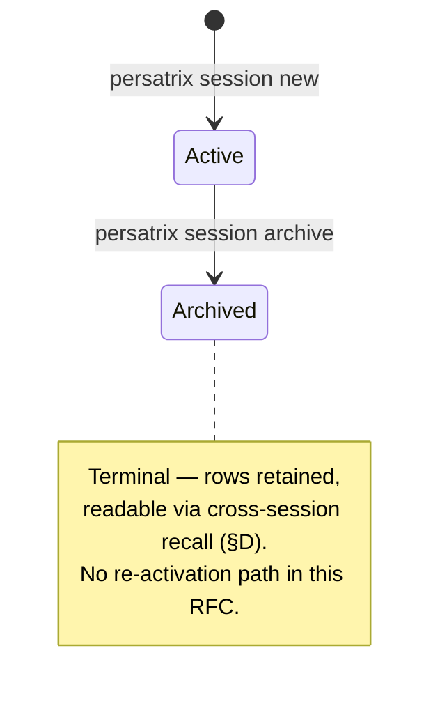

# RFC 0031 — Per-Session Namespacing for Channels and Persona Memory

**Type**: architecture
**Status**: ✅ Implemented (Phase 1 shipped v0.3.1; Phase 2 — session-scoped default recall across all four persona-memory tiers, the F-3 closer — shipped v0.3.5; Phase 3 — `persatrix session …` operator CLI (registry verbs + active-session pointer + `--session` override) — shipped v0.3.5; Phase 4 — operator docs ([`docs/guides/sessions.md`](../guides/sessions.md)) + `make reset` breadcrumb + [ISSUE-0051](../issues/ISSUE-0051-per-session-memory-namespacing-channels.md) closeout — shipped v0.3.5. **Successor work** from the [scope-axes reframing](../memory-scope-axes.md) (§A amendment) — the `epoch` run-isolation axis ([ISSUE-0085](../issues/ISSUE-0085-epoch-axis-run-isolation.md)), subject-scoped facts ([ISSUE-0084](../issues/ISSUE-0084-fact-scope-by-subject-not-uniform-session.md)), and the `--all-sessions` recall verb ([ISSUE-0086](../issues/ISSUE-0086-operator-all-sessions-recall-verb.md)) — is tracked separately, not under this RFC's four phases.)
**Author**: Maksim Khomutov
**Date**: 2026-05-12
**Target**: v0.3.1 (P1) + v0.3.5 (P2–4)
**Depends on**: RFC 0011 (Channels), RFC 0020 (Interaction Lifecycle — §G scope vocabulary)
**Relates to**: RFC 0008 (Memory & Context Optimization), RFC 0029 (Personal/Society Storage Split)
**Spawned from**: [ISSUE-0051](../issues/ISSUE-0051-per-session-memory-namespacing-channels.md) — root-cause fix for F-3 cross-run state bleed; currently mitigated by `make reset` (PR 6 of [v0.3.0 channel test-findings plan](../v0.3.0-test-findings-pr-plan.md))

---

## Table of Contents

- [Summary](#summary)
- [Motivation](#motivation)
- [Goals](#goals)
- [Non-Goals](#non-goals)
- [Design / Implementation](#design--implementation)
  - [A. Vocabulary](#a-vocabulary)
  - [B. Session Lifecycle](#b-session-lifecycle)
  - [C. Storage Model](#c-storage-model)
  - [D. Recall Semantics](#d-recall-semantics)
  - [E. Operator Surface](#e-operator-surface)
  - [F. Interaction with RFC 0020 §G Scope](#f-interaction-with-rfc-0020-g-scope)
  - [G. Interaction with RFC 0029 Storage Split](#g-interaction-with-rfc-0029-storage-split)
- [Security Considerations](#security-considerations)
- [Phased Implementation Plan](#phased-implementation-plan)
- [Files Touched (Estimated)](#files-touched-estimated)
- [Test Strategy](#test-strategy)
- [Open Questions](#open-questions)
- [Decision / Next Steps](#decision--next-steps)
- [Related Documentation](#related-documentation)

---

## Summary

A second test run with the same channel name and the same `--user` identity inherits prior content from `channels.db` and the per-persona `memory.db`. Personas surface old participants and topics from earlier runs, which steers the next conversation off-topic within ~2 turns (F-3 in the [v0.3.0 channel test findings](../v0.3.0-test-findings-pr-plan.md)). Today this is mitigated by `make reset` — an operator workaround that purges Docker volumes between runs. It is ergonomics, not isolation.

This RFC proposes **Session** as a first-class concept: a named, operator-visible scope under which channels are created and persona-memory rows are tagged. Every channel-creation path implicitly attaches the active session id; recall defaults to the current session; cross-session recall is an explicit opt-in read path. Sessions are surfaced through a `persatrix session …` CLI verb so operators can list, create, switch, and (eventually) export them.

The RFC deliberately *proposes* rather than *commits* — Open Question 1 (the dementia-test tension between session isolation and long-arc memory continuity) is a prerequisite for moving to `👍 Accepted`.

## Motivation

Three problems compound today:

1. **Manual test reruns are unreliable without an explicit `make reset`.** Forgetting it produces off-topic persona behaviour that looks like a regression but is actually prior-run carryover. The operator-guide subsection in [channels.md](../guides/channels.md) and [persona-agents.md](../guides/persona-agents.md) names this hazard but does not eliminate it.

2. **CI / automated regression harnesses cannot share volumes across runs.** With state bleed between runs, the only safe pattern is "wipe volumes between every job" — which kills the very property that makes persona memory interesting (continuity). Tests that *want* continuity (a dementia-test-style probe across two days of simulated history) cannot be authored cleanly either, because there is no primitive that separates "same session, two events" from "different sessions, two events."

3. **Channel-id collisions across distinct test scenarios re-attach prior history.** A reused `group:planning` channel name carries forward the membership, messages, and per-persona recall edges from the previous run. The wire-side canonical address is the same string — there is nothing to disambiguate the two scenarios.

What happens if we do nothing: every CI scenario either burns the volume (no continuity tests) or shares the volume (every test sees every other test's debris). The dementia-test suite ([MT-MEMORY-005](../manual-tests/MT-MEMORY-005-dementia-test.md)) — the canonical bar for "memory works" — needs *both* properties on demand. Without a session primitive, the test author has to encode the isolation in the channel name itself (`group:planning-run-2026-05-12-a`), which is exactly the kind of manual hygiene that produces F-3.

## Goals

1. Make every test run **auto-isolated by default**: a second run with the same channel name and same `--user` does not see prior-run content unless the operator explicitly asks for it.
2. Preserve the **dementia-test continuity property**: a single session can span many days and many channel restarts, and persona memory accumulates across that arc. Session isolation must not be a "wipe on restart" hammer.
3. Provide an **operator-visible CLI surface** (`persatrix session …`) so sessions are a first-class, inspectable concept rather than an internal harness primitive.
4. Compose with **RFC 0020 §G scope** without rewriting it. The §G scope is a per-interaction lifecycle boundary; sessions are a coarser per-namespace boundary. The two dimensions must remain orthogonal in the storage model.
5. Provide a **migration path** for the existing `make reset` workaround so operators can keep using it during rollout, with a deprecation breadcrumb once sessions are GA.

## Non-Goals

- **Cross-session merge / fork tooling.** A "fork session B from session A at message M" verb is not in scope. If it lands, it is a separate RFC.
- **Cryptographic isolation between sessions.** Sessions are a namespacing dimension, not a permissions boundary. A compromised process can still read every session's rows. Multi-tenant isolation is RFC 0009 / RFC 0013 territory.
- **Renaming the existing `scope` column (RFC 0020 §D / §G).** §G scope keeps its current per-interaction-lifecycle semantics; sessions are added as a separate dimension. See §F for the rationale.
- **Postgres backend or society-store migration.** Per-session namespacing is a logical-key change; it composes with whatever physical store RFC 0029 lands on (per-agent SQLite in v0.3.x, Postgres in v0.4.0+). The session id is the same string in either backend.
- **Replaying or rewriting historical rows.** Existing episodes, relationships, and channel messages stay untouched. Pre-RFC rows are treated as belonging to a synthetic `legacy` session — see §C and Open Question 3.

---

## Design / Implementation

### A. Vocabulary

| Term | Definition | Storage |
|------|------------|---------|
| **Session** | A named, operator-visible namespace for channels and persona memory. Has a stable `session_id`, a human-readable label, a creation timestamp, and a status (`active` / `archived`). | New `sessions` table (Phase 1) — see §C. |
| **session_id** | A short canonical identifier (kebab-case, e.g. `run-2026-05-12-a`, or a UUIDv7 if unlabeled). The dimension that scopes channels, episodes, and relationships. | Column on every relevant row. |
| **Active session** | The session_id attached to a process at startup (CLI flag, env var, or a `~/.persatrix/active-session` pointer). | Process-local. |
| **Cross-session recall** | An explicit opt-in read path that returns rows from sessions other than the active one. | Recall API flag — see §D. |

The vocabulary intentionally does *not* reuse "scope" — RFC 0020 §G owns that term for per-interaction-lifecycle boundaries. Conflating the two is the single largest source of misimplementation risk this RFC is trying to head off.

**Distinct from RFC 0016 `ChatRequest.session_id`.** A wire-level `session_id` already exists on [`proto/task.proto:93`](../../proto/task.proto#L93) — RFC 0016's per-chat conversation UUID, generated server-side on the first `ChatRequest`. The two concepts are not the same:

| Dimension | RFC 0016 `session_id` (existing wire field) | RFC 0031 `session_id` (this RFC) |
|-----------|---------------------------------------------|----------------------------------|
| Generator | Server, on first `ChatRequest` | Operator, via `persatrix session new` |
| Cardinality | One per chat conversation | One per operator run / test scenario |
| Lifecycle | Implicit until process ends | Explicit (`new` / `archive`) |
| Visibility | Internal token | First-class CLI surface |
| Scope | One human-agent thread | All channels + all persona memory under it |

A row of `episodes` carries *both* a chat-session id (RFC 0016, identifying the conversation that produced it) and an operator-session id (this RFC, identifying the namespace it belongs to). Phase 1 plumbing must surface the two as distinct fields in structured logs (RFC 0018) and OTEL spans (RFC 0019 — see Open Question 7). **Open Question 8 captures whether to rename one of them on the wire before Phase 1 lands** — the name overlap is the single largest source of misimplementation risk this vocabulary section is *also* trying to head off.

> **Amendment — scope-axes reframing (v0.3.x).** A review against multi-party rooms found `session_id` overloaded — the `(recipient-agent, channel, sender)` unit fragments a room by speaker. It is split into four orthogonal axes: **session = room** `(agent, channel)`, **relationship** (cross-room), **epoch** (run/test isolation, where F-3 now lives), **principal** (tenant). Follow-ups: drop the sender axis ([ISSUE-0083](../issues/ISSUE-0083-session-binding-sender-axis-fragments-multiparty-rooms.md)); F-3 moves off `session_id` to `epoch` ([ISSUE-0085](../issues/ISSUE-0085-epoch-axis-run-isolation.md)); relationship confirmed cross-room (validates the §C PK choice); fact scope becomes subject-dependent ([ISSUE-0084](../issues/ISSUE-0084-fact-scope-by-subject-not-uniform-session.md)). OQ 1's single-session default holds *within* session=room. Full model + decisions: [Memory Scope Axes](../memory-scope-axes.md).

### B. Session Lifecycle



Archive is one-way in this RFC. An archived session's rows stay in place and are still surfaced by the `sessions="*"` cross-session recall path; there is no `persatrix session activate` verb (an earlier draft of this diagram had one — removed because re-binding semantics are not actually specified anywhere in §B/§E, and the "still readable via recall" path makes a back-edge unnecessary). If a future RFC adds re-activation, the verb should match the existing CLI vocabulary (`use`), not `activate`.

- **Creation.** `persatrix session new [--label X]` writes a row to the `sessions` table and (optionally) sets it as the active session. If `--label` is omitted, a UUIDv7-derived id is generated. UUIDv7 (not v4) so session ids sort lexicographically by creation time, which matters for default ordering in `persatrix session list`.
- **Activation.** `persatrix session use <id>` flips the active-session pointer. The orchestrator reads this at startup; in-flight processes continue under the session they started with (no live re-bind).
- **Archival.** `persatrix session archive <id>` marks the session inactive but does *not* delete its rows. Archived sessions are still readable via cross-session recall (§D).
- **Deletion.** Out of scope for v0.3.x. Compliance erasure is RFC 0013; session-level deletion piggybacks on that work rather than getting its own one-off path. See Open Question 5.

> **Amendment — [ISSUE-0081](../issues/ISSUE-0081-session-id-process-global-not-task-local.md), v0.3.5 (PR 2).** The lifecycle above models a session as a *process-lifetime constant*: "the orchestrator reads this at startup; in-flight processes continue under the session they started with (no live re-bind)." That assumption is unsafe once **one persona process fields more than one conversation concurrently** — `agents/dispatch.py` hosts many personas behind one gRPC server and a single `agent_id` can serve two DM threads / two channel peers at once, so a process-global session id lets conversation A's writes recall into conversation B's prompt (the intra-process sibling of F-3). PR 2 narrows the binding from per-process to **per request**:
>
> - **Session unit = `(agent, channel, user)`** — the finest grain. Two peers in one channel, or two DM threads with one agent, are distinct sessions even within one process. (Coarser units — channel-only, or agent-only — were rejected: they re-merge exactly the concurrent conversations this fixes.)
> - **Orchestrator-authoritative.** The Go orchestrator owns and *persists* the session id and emits it on every outbound request; it is **not** derived process-side. Authoritative + persisted is what lets the dementia-test multi-day arc survive a persona-process restart (a derived-per-process id would not). The `PERSATRIX_SESSION_ID` env var stays as the construction-time seed / single-session fallback, so CLI / boot / test paths are unchanged when no per-request id is supplied.
> - **Bound task-locally, not process-globally.** The per-request id rides a `contextvars.ContextVar` ([PR 1](#decision--next-steps)) entered for the lifetime of the handler, so concurrent `asyncio` tasks each see only their own session. Transport + binding seam is recorded in the §E amendment below.

> **Amendment — [ISSUE-0082](../issues/ISSUE-0082-orchestrator-per-request-session-principal-emission.md), v0.3.5 (session source landed).** The amendment above specified the Go orchestrator as the **authoritative, persisted** source of the per-request session id but ISSUE-0081 shipped only the persona-side consumer; ISSUE-0082 implements the source. The orchestrator now mints + persists a `(agent, channel, user) → session_id` binding ([`internal/channels/session_binding.go`](../../internal/channels/session_binding.go), migration v4 `session_bindings`) keyed exactly on the §B unit, so the same triple resolves to a stable id across a persona-process restart (the dementia-arc-survives-restart property). The session unit of this amendment is therefore **active**, not just designed. The principal axis (§C/§D amendments) stays armed-not-fed pending [RFC 0039](0039-user-accounts-authentication.md).

### C. Storage Model

**New `sessions` table** (location TBD — depends on RFC 0029 §B/§D, see §G below):

```sql
CREATE TABLE sessions (
    id           TEXT PRIMARY KEY,        -- canonical session_id (kebab or UUIDv7)
    label        TEXT,                    -- optional human-readable name; NULL if unset
    created_at   REAL NOT NULL,           -- epoch seconds, matches episodes.created_at
    archived_at  REAL,                    -- NULL while active
    metadata_json TEXT                    -- JSON for future fields (e.g. operator note)
);
```

**Column additions:**

| Table | New column | Default | Index |
|-------|-----------|---------|-------|
| `channels` (Go, `internal/channels/sqlite.go`) | `session_id TEXT NOT NULL` | `'legacy'` for pre-RFC rows | `idx_channels_session` |
| `messages` (Go) | `session_id TEXT NOT NULL` | inherits from `channels` | new covering index `idx_messages_channel_session(channel_id, session_id, timestamp DESC)` replaces today's [`idx_messages_channel_ts`](../../internal/channels/sqlite_schema.go) — same prefix shape (`channel_id` first), session as the middle key, timestamp tail preserved so existing chronological scans stay covered |
| `episodes` (Python, [`agents/memory/episodic.py`](../../agents/memory/episodic.py)) | `session_id TEXT NOT NULL` | `'legacy'` for pre-RFC rows | `idx_episodes_session` |
| `relationships` (Python, [`agents/memory/relationship_mutations.py`](../../agents/memory/relationship_mutations.py)) | `session_id TEXT NOT NULL` | `'legacy'` for pre-RFC rows | `idx_rel_session` |
| `facts` (Python, [`agents/memory/facts.py`](../../agents/memory/facts.py)) | `session_id TEXT NOT NULL` | `'legacy'` for pre-RFC rows | `idx_facts_session` |
| `notes` (Python, [`agents/memory/notes.py`](../../agents/memory/notes.py)) | `session_id TEXT NOT NULL` | `'legacy'` for pre-RFC rows | `idx_notes_session` |

> **Phase 2 status (v0.3.5).** The six tables above all carry a `session_id` column; the four Python tiers gained theirs across the following migrations: `episodes` + `relationships` at **v7** (RFC 0031 Phase 1), `facts` at **v8** (the tier's introducing migration carries the column), and `notes` at **v9** ([Phase 2 PR 1](0031-phase2-pr-plan.md#pr-1-featurev035-rfc0031p2-notes-coverage--notes-tier-session-coverage), which closed the last tier gap). All four persona-memory tiers — `episodes`, `relationships`, `facts`, `notes` — now filter recall by the active session with the always-visible `'legacy'` carve-out per §D, implemented in v0.3.5 ([Phase 2 PR plan](0031-phase2-pr-plan.md)). The Go `channels` / `messages` columns shipped in Phase 1 (v0.3.1).

All six tables use the **same** column shape — `TEXT NOT NULL` with the `'legacy'` literal as the migration default — so the recall predicate is uniform (§D). An earlier draft of this table had the Python side nullable (`TEXT` / `NULL` default) and the Go side `NOT NULL`; this was tightened during deep review because the asymmetric form forced every recall path to special-case both `IS NULL` and `= 'legacy'`, and there is no design reason for the two stores to disagree on whether "pre-RFC row" is a NULL or a string. SQLite (used by both Go's `internal/channels/sqlite.go` and Python's `agents/memory/*.py`) supports `ALTER TABLE ... ADD COLUMN session_id TEXT NOT NULL DEFAULT 'legacy'` with a constant default since 3.20.0, so the migration is still a one-statement no-backfill change on both sides.

The `legacy` sentinel is *not* a real row in the `sessions` table — recall and list paths treat `session_id = 'legacy'` as a synthetic "before sessions existed" namespace. This keeps the migration zero-cost (no backfill UPDATE on existing rows). See Open Question 3 for the alternative of materialising a `legacy` row.

**Why a new column, not a `scope`-prefix widening.** Reusing RFC 0020 §G's `scope` column to carry session info (e.g. `scope = 'sess:run-a:group:planning'`) was considered and rejected — see §F.

> **Amendment — [ISSUE-0081](../issues/ISSUE-0081-session-id-process-global-not-task-local.md), v0.3.5 (PR 3).** The storage model above keys rows on `(agent_id, session_id)` with **no tenant dimension**. That is a cross-tenant data-bleed surface the moment more than one user is served by one deployment (the §Non-Goals line deferring multi-tenant isolation to RFC 0009 / 0013 covered *cryptographic* isolation; it did not give the storage layer a namespacing dimension to filter on). PR 3 adds the orthogonal **principal / tenant** axis:
>
> - **New column `principal_id TEXT NOT NULL DEFAULT 'local'`** on **all five** Python persona-memory tables — `episodes` / `relationships` / `facts` / `notes` / `interactions` — in one migration (v11), with a per-table `idx_<tier>_principal` index. The scope key becomes `(agent_id, principal_id, session_id)`. The `'local'` default is [`agents.principal_id.DEFAULT_PRINCIPAL_ID`](../../agents/principal_id.py): the principal every single-tenant / unauthenticated deployment uses and the value pre-existing rows backfill to with no UPDATE. In a single-tenant deployment everything is `'local'`, so behaviour is unchanged.
> - **Strict equality, no carve-out** (contrast with the session axis — see the §D amendment). The session predicate always unions the `'legacy'` carve-out; the principal predicate is unconditional `AND principal_id = ?` ([`agents.memory._principal_filter`](../../agents/memory/_principal_filter.py)) with **no** `'*'` bypass and **no** always-visible tenant. A row owned by one principal is invisible to every other, including across the `'local'` boundary once a second tenant exists — that is the entire point of the tenant boundary. The strict filter is applied on **both** the recall *and* the write paths (the facts supersession chain is principal-keyed too, so a tenant-B write can never retract a tenant-A fact).
> - **`relationships` carries `principal_id` *in its primary key*, not just as a column.** Four of the five tables key on a UUID, so the tenant axis is a residual filter there. `relationships` keys on the participant tuple `(participant_id, participant_type, other_participant_id, other_participant_type)`, so a bare column would still admit only one aggregate row per tuple — and a second tenant's `ON CONFLICT DO UPDATE` (in `record_interaction` / `update_trust`) would mutate the first tenant's `trust_score` while the strict-equality recall filter silently masked the bleed. Migration v11 therefore **rebuilds** `relationships` with `principal_id` appended to the primary key, making each `(participant tuple, principal)` a distinct row. `session_id` stays out of the key by design (the aggregate row is cross-session shared, first-seen-tagged; per-session views derive from `interactions`) — only the tenant axis needs physical row isolation.
> - **Same task-local + transport rail as the session axis.** A sibling `contextvars.ContextVar` ([`agents.principal_id.current_principal_id` / `principal_scope`](../../agents/principal_id.py)) carries the per-request principal; the orchestrator emits it as the `persatrix-principal` gRPC header; the server lifts it onto the event envelope and `on_event` binds it via [`request_scope_from_metadata`](../../agents/request_scope.py) alongside the session scope.
> - **Verified-principal source deferred to [RFC 0039](0039-user-accounts-authentication.md) (still *proposed*).** Until auth lands the orchestrator emits nothing on the `persatrix-principal` rail and every request resolves to `'local'` — so PR 3 ships the storage migration + scope key + Python rail (decision-free, no behaviour change), mirroring how PR 2's contextvars enabler shipped ahead of the orchestrator emitting `persatrix-session`. The Go orchestrator emitting a real principal, and PR 4's hardening of the session `'legacy'` carve-out so it cannot bridge tenants, are tracked separately.
> - **Scope boundary of the strict filter (review follow-up).** The strict `AND principal_id = ?` covers every *recall* path and every *per-request* write path — row tagging, the facts supersession chain (the automatic latest-wins chain *and* the manual `FactStore.supersede` retract), the notes mutation/prune surface, and the procedural-reuse `refresh_confidence` (which `store_procedure` opens with: it was matching `(agent_id, key)` only, so a second tenant's re-store refreshed the first tenant's row *and* was dropped by the refresh short-circuit — now principal-scoped, symmetric with `recall_procedures`). It does **not** yet cover the *agent-global background maintenance* sweeps that have no active principal: episode eviction / TTL / size-cap (`agents/memory/eviction.py`), the shared-pool capacity eviction (`agents/memory/shared_pool.py`), retention summarise + delete (`agents/memory/episodic_retention.py`), the interaction-janitor summary backfill (`agents/memory/interaction_janitor.py`), and the superseded-fact prune (`agents/memory/facts.py`). These are **not** read-confidentiality leaks (recall stays principal-filtered); they are cross-tenant *capacity coupling* and cross-tenant deletion of dead rows — one tenant's volume can evict another's episodes. Proper isolation needs **per-principal accounting** (e.g. `GROUP BY principal_id` with a per-tenant budget), a capacity-policy decision deferred to the RFC 0039 multi-tenant work, not a bare predicate add. Likewise the GDPR `delete_by_subject` erasure (`agents/memory/_facts_erasure.py`) is intentionally left agent-global pending an RFC 0013 decision on whether right-to-be-forgotten spans tenants.

### D. Recall Semantics

Default recall is **session-scoped**:

```python
# Pseudocode — actual API stays the existing EpisodicMemory.recall signature
async def recall(query, *, limit, min_importance, min_score, sessions=None):
    if sessions is None:
        sessions = [self._active_session_id]  # default: current session only
    elif sessions == "*":
        sessions = None  # sentinel — drop the IN-clause entirely; see mode 3 below
    elif not sessions:
        # Empty list is almost certainly a caller bug — without this guard the
        # WHERE clause collapses to "session_id = 'legacy'" and silently returns
        # only legacy rows, which an operator passing [] never intends.
        raise ValueError("sessions must be None, '*', or a non-empty list")
    # WHERE session_id IN (sessions) OR session_id = 'legacy'  -- legacy rows always visible
    ...
```

Three modes:

1. **Default (`sessions=None`)** — current session plus `legacy` rows. This is what every existing call site gets without code changes.
2. **Multi-session (`sessions=[a, b]`)** — explicit list. The dementia-test path that wants to assert continuity across simulated days lives here.
3. **All sessions (`sessions="*"`)** — operator/debug path. Surfaced via a CLI flag (`persatrix memory recall --all-sessions`) and gated off the default API. The string sentinel rather than `None` is deliberate — `None` already means "default", and conflating the two is the recall bug this RFC is most worried about. The `session_id = 'legacy'` carve-out applies only to modes 1 and 2; in mode 3 every row is already returned so the carve-out is a no-op.

The `session_id = 'legacy'` carve-out (always visible regardless of the active session) is the load-bearing detail that lets us ship without backfilling old rows. Once a v0.3.x install has run long enough that operators stop caring about pre-RFC episodes, a `persatrix memory legacy-prune` verb can drop them — out of scope for this RFC.

> **Amendment — [ISSUE-0081](../issues/ISSUE-0081-session-id-process-global-not-task-local.md), v0.3.5 (PR 3).** The three recall modes and the `'legacy'` carve-out above describe the **session** axis only. The **principal** axis (§C amendment) composes as an additional, unconditional `AND principal_id = ?` on every mode — including mode 3 (`sessions="*"`), where the session filter is dropped but the principal filter is **not**. There is deliberately no principal equivalent of the `'legacy'` carve-out and no all-principals sentinel: a cross-tenant recall would defeat the boundary, so an admin/debug view across tenants (if ever needed) must be an explicit out-of-band query, never this default path.

> **Amendment — [ISSUE-0081](../issues/ISSUE-0081-session-id-process-global-not-task-local.md), v0.3.5 (PR 4 — carve-out closeout).** Because PR 3 applies the principal predicate **unconditionally** (above), the session `'legacy'` carve-out is already principal-bounded: a `'legacy'` row is visible from every session *within a principal* but never across principals. PR 4 therefore adds **no new mechanism** — it pins the property as the explicit ISSUE-0081 TDD gate ("a foreign tenant can neither read nor write `legacy` rows") across all four tiers' default `sessions=None` recall path, the notes mutation surface, and the facts supersession older-sweep (which itself spans `session_id IN (active, legacy)`): `tests/unit/python/test_principal_legacy_carveout.py`. The carve-out is retained — it remains load-bearing for the within-principal pre-RFC-upgrade dementia-test surface — rather than retired via backfill (the issue's alternative). **Out of scope, deferred to RFC 0039:** agent-global maintenance sweeps (eviction / retention / janitor / facts-prune / GDPR erasure) and the cross-agent shared-pool tier are capacity / erasure / collaboration *policy*, not per-request read-confidentiality surfaces, and stay principal-agnostic for now.

### E. Operator Surface

```
persatrix session new [--label LABEL] [--activate]
persatrix session list [--include-archived]
persatrix session use <id-or-label>
persatrix session archive <id-or-label>
persatrix session current
```

The active-session pointer lives at `~/.persatrix/active-session` (path overridable via `PERSATRIX_ACTIVE_SESSION_FILE`). The orchestrator reads it at startup; an explicit `--session` flag on `persatrix chat` / `persatrix channel publish` / etc. overrides the file for that one invocation.

**Phasing of the three resolution mechanisms.** The full precedence chain in Open Question 6 (`--session` flag > `PERSATRIX_SESSION_ID` env var > `~/.persatrix/active-session` file > built-in `legacy`) does not light up in one phase:

| Mechanism | Available from |
|-----------|----------------|
| `PERSATRIX_SESSION_ID` env var | Phase 1 |
| `~/.persatrix/active-session` file (and `PERSATRIX_ACTIVE_SESSION_FILE` override) | Phase 3 |
| `--session` CLI flag on `persatrix chat` / `persatrix channel …` | Phase 3 |

Between Phase 1 and Phase 3, **the env var is the only way to set a session**. An operator who reads §E after Phase 1 ships but before Phase 3 does, and then creates `~/.persatrix/active-session` by hand, will get silent fallback to `legacy` — the file-reading code isn't there yet. The Phase 1 deliverable list (below) is intentionally narrow for this reason; the operator-guide page (`docs/guides/sessions.md`, Phase 4) lands only after all three mechanisms are wired so the docs never describe a setting that doesn't work yet.

`make reset` is **kept**, and its operator-guide subsection is updated — but the framing is **superseded by the [scope-axes reframing](../memory-scope-axes.md)** (§A amendment) recorded after this section was authored. The original intent ("prefer `persatrix session new --activate` for run isolation; `make reset` is the deprecated nuclear option") no longer holds: a session is now *room continuity* that accumulates, so `session new --activate` switches rooms rather than handing back a clean slate. Run/test isolation moves to the `epoch` axis ([ISSUE-0085](../issues/ISSUE-0085-epoch-axis-run-isolation.md)); until it ships, `make reset` **remains** the supported clean-slate path (not deprecated). The Phase 4 breadcrumb ([channels.md](../guides/channels.md) / [persona-agents.md](../guides/persona-agents.md)) and [`docs/guides/sessions.md`](../guides/sessions.md) carry this corrected framing. Removal of `make reset` is out of scope.

> **Amendment — Phase 3 operator CLI shipped, v0.3.5 ([Phase 3 PR plan](0031-phase3-pr-plan.md), PRs 1–5).** All three resolution mechanisms in the table above are now wired: the `/api/v1/sessions` REST registry + `session new / list / archive` (PRs 1–2), the `~/.persatrix/active-session` pointer file (+ `PERSATRIX_ACTIVE_SESSION_FILE`) + `session use / current / new --activate` (PR 3), and the `--session` override on `chat` / `channel publish / list` (PR 4); the lifecycle is pinned end-to-end by [`tests/integration/test_session_operator_surface.py`](../../tests/integration/test_session_operator_surface.py) (PR 5).
>
> **OQ #6 reconciliation.** The precedence chain governs the *process-lifetime* session; the [ISSUE-0082](../issues/ISSUE-0082-orchestrator-per-request-session-principal-emission.md) per-request auto-binding (keyed `(agent, channel)` after [ISSUE-0083](../issues/ISSUE-0083-session-binding-sender-axis-fragments-multiparty-rooms.md)) is a distinct dispatch-path axis. An explicit `--session` wins **above** the auto-binding for that one invocation; absent it the auto-binding stands, so the Phase 2 + ISSUE-0082 concurrent-isolation guarantee is not regressed (pinned in `channel_session_handler_test.go` + `grpc_dispatcher_test.go`).
>
> **`--all-sessions` deferred** to [ISSUE-0086](../issues/ISSUE-0086-operator-all-sessions-recall-verb.md): the only operator route to `sessions="*"` (§Security Considerations) needs an operator memory-inspection surface that does not exist. Unbuilt is the stronger posture — `"*"` retains **no operator entry point**, so it cannot reach a prompt context.
>
> **Amendment — Phase 4 docs closeout shipped, v0.3.5.** [`docs/guides/sessions.md`](../guides/sessions.md) ships (resolution chain, `legacy` carve-out, the split-volume `make reset` asymmetry, no-secrets-in-labels); the [channels.md](../guides/channels.md) / [persona-agents.md](../guides/persona-agents.md) `make reset` subsections carry the reframed breadcrumb; and [ISSUE-0051](../issues/ISSUE-0051-per-session-memory-namespacing-channels.md) is **closed**. RFC 0031's four phases are complete (`✅ Implemented`); the scope-axes reframing's `epoch` / subject-scoped-facts / `--all-sessions` work is tracked as successor issues, not under this RFC.

> **Amendment — [ISSUE-0081](../issues/ISSUE-0081-session-id-process-global-not-task-local.md), v0.3.5 (PR 2).** The resolution mechanisms above (env var → file → flag) all set a *process-lifetime* session. PR 2 adds a fourth, per-request transport for the concurrency fix recorded in the §B amendment: the orchestrator emits the session id as a gRPC metadata header, `persatrix-session` (the cross-language contract lives at `agents/session_id.py::SESSION_METADATA_GRPC_KEY`). It is lower-case by HTTP/2 convention and lifted case-insensitively server-side.
>
> **Binding seam — event-carried, not a gRPC interceptor.** ISSUE-0081's proposed-fix sketch suggested extending the RFC 0018 correlation interceptor to bind the header into the session ContextVar "for the duration of the call." That does not work for the inbound persona path: `ReceiveChannelMessage` enqueues the event and the `EventLoop` drains it **fire-and-forget in a separate task**, so an interceptor's per-call ContextVar scope has already exited by the time recall runs. The header is therefore lifted in the servicer (`agents/session_metadata.py`), stamped onto `AgentEvent.metadata` under `EVENT_SESSION_METADATA_KEY`, and re-established as a `session_scope` inside `_LLMPersonaAgent.on_event` — the universal chokepoint where recall runs in the *same* task for **both** inbound paths (the synchronous `SendChatMessage` dispatch and the fire-and-forget channel drain). `asyncio.wait_for` spawns a child task that copies the parent's context at creation, so the scope entered in `on_event` propagates into `_on_event_inner` where recall and the write seams resolve it. Absent the header (CLI / tick / single-session), the binding is a `nullcontext` and call-time resolution falls back to the construction snapshot — behaviour-preserving. The scope must also be honoured on the **write** side, not just recall, or the always-on `legacy` carve-out (§D) re-merges every conversation's writes; and the interaction close-path tags rows with the session captured when the interaction *opened* (`Interaction.session_id`), not the scope bound at flush time, because the idle janitor can flush a sibling conversation's stale interaction while a different conversation holds the active scope.

> **Amendment — [ISSUE-0082](../issues/ISSUE-0082-orchestrator-per-request-session-principal-emission.md), v0.3.5 (emission landed).** The PR 2 amendment above described the persona-side rail (header lift → envelope stamp → `on_event` `session_scope`), but the rail shipped **armed and unfed**: the orchestrator still resolved one session id per process at boot and emitted no per-request header, so `_session_from_context` always returned `None` and every handler fell back to its construction snapshot. ISSUE-0082 closes that gap on the **session** axis — `GRPCMessageDispatcher.Dispatch` now resolves the `(agent, channel, user)` binding and injects the `persatrix-session` header ([`internal/observability/grpcmeta`](../../internal/observability/grpcmeta/grpcmeta.go)) on every outbound `ReceiveChannelMessage`. The Go→Python wire is pinned end-to-end by [`tests/integration/test_session_emission_isolation.py`](../../tests/integration/test_session_emission_isolation.py): a `persatrix-session` header on the real gRPC servicer freezes the interaction's session, two concurrent conversations for one agent recall in isolation, and a pre-activation `legacy` row stays visible to both. The `persatrix-principal` rail stays unfed (resolves to `'local'`) until [RFC 0039](0039-user-accounts-authentication.md).

### F. Interaction with RFC 0020 §G Scope

[RFC 0020 §G](0020-interaction-lifecycle.md#g-per-channel-scoping) defines `scope` as a **per-interaction-lifecycle** boundary — the set of turns that belong to the same interaction. The vocabulary table makes this explicit: `dm:a:b`, `group:planning`, `thread:<msg-id>`. The scope is the *smallest natural conversational unit* for the source.

Sessions are a **coarser, orthogonal dimension**. A single session contains many scopes (a session "run-2026-05-12-a" may have dozens of interactions in `group:planning`, `dm:alex:user`, etc.); a single scope can in principle appear in many sessions (the same `group:planning` channel name across two distinct sessions).

Three reasons to keep them as separate columns:

1. **§G's scope already plays a recall role.** [`idx_episodes_scope`](../../agents/memory/_migration_handlers.py) (created at `_migration_handlers.py:297`, declared in [RFC 0020 §G](0020-interaction-lifecycle.md#g-per-channel-scoping)) is sized for `LIKE 'thread:%'` style scans. Prepending `sess:<id>:` to the value invalidates the index shape and requires a parallel migration to a `LIKE 'sess:<id>:thread:%'` predicate.
2. **The semantics drift over time.** §G scope is set by the `BoundaryDetector` at interaction open. session_id is set by the operator at process startup. Tying them to the same column means every future change to one risks rewriting the other.
3. **RFC 0020 §G calls out exactly this risk.** The §G table's "Boundary policy" column is the contract — collapsing session into that column means future boundary-detector work has to special-case the session prefix, which is the regression we are paying upfront cost to avoid.

The cost of two columns is one extra `WHERE` clause and one extra index per table. The benefit is that §G's vocabulary stays load-bearing and this RFC's vocabulary stays load-bearing, and neither has to apologise for the other.

### G. Interaction with RFC 0029 Storage Split

[RFC 0029](0029-personal-society-storage-split.md) draws the personal/society boundary and proposes a `MemoryStore` facade. Sessions sit *inside* that boundary — they are a namespacing dimension on every tier RFC 0029 lists (episodes, notes, relationships, channels). Two places this matters:

1. **The `sessions` table is society state, not personal state.** Multiple agents share a view of "what session is active right now"; this is the same property that pushed channels to `channels.db` (§B of RFC 0029 — channels/messages/memberships are society state). The physical location is decided by §D of RFC 0029 (Society Store: Schema and Backend — Postgres in Phase 3). In v0.3.x Phase 1, `sessions` lives alongside `channels` in the orchestrator-owned SQLite. When RFC 0029 Phase 3 lands its Postgres society store, the `sessions` table moves with `channels` — no re-design required.
2. **The `MemoryStore` facade signature carries `session_id`.** Every read path that RFC 0029 §C exposes — `recall_episodes` (personal episodes), `get_self_trust` (personal outgoing bond), `query_inbound_trust` (society inbound projection), and `read_pool` (society shared pools) — takes a `session_id` filter. The cited names match the §C sketch verbatim; an earlier draft of this paragraph cited `get_episodes` / `get_relationships` / `recall` which do not appear in RFC 0029 §C. This is the load-bearing API choice — Phase 1 of RFC 0029 ships the facade signature; this RFC adds the session_id parameter to that signature before the facade is frozen. Coordinating the two phases is captured in Open Question 4.

---

## Security Considerations

- **Session id as a namespacing primitive, not a permissions boundary.** A process that can read `memory.db` can read every session in it. Hardening this is RFC 0009 (auth) and RFC 0013 (erasure) territory; this RFC neither claims nor provides isolation against an in-process attacker.
- **Operator misconfiguration risk.** A stale `~/.persatrix/active-session` file pointing at an archived session causes new channels to attach to a session the operator thought was done. Mitigation: `persatrix session use` and the startup path log the active session id at INFO; the operator-guide subsection documents the file location explicitly.
- **Session-id leakage in logs and traces.** session_id is non-sensitive by design (it is operator-visible) but appears in many log lines under structured logging (RFC 0018). Confirm the logging schema treats it as a low-cardinality dimension to avoid metrics explosion. The label is operator-supplied — operators must not put secrets in session labels. Documented in §E of the operator guide subsection.
- **Cross-session recall as a footgun.** `sessions="*"` returns every row. A debug verb that defaults to all-sessions and is wired into a prompt context risks reintroducing F-3 against the very fix this RFC ships. Mitigation: the `"*"` sentinel is gated to CLI/debug paths only and is not in the default persona-runtime context path. Pinned by an explicit unit test that asserts `_active_session_id` is consulted at every recall site in `agents/persona_runtime/`.
- **Cross-store referential integrity for `session_id`.** The `sessions` table lives with `channels` in the orchestrator-owned SQLite (§G.1); `episodes` and `relationships` live in per-agent `memory.db` files the orchestrator never opens. The `session_id` columns on `episodes` / `relationships` are therefore foreign-key-shaped references into a table the Python side cannot enforce against — an operator who runs `make reset` on the orchestrator volume but not on `ember-owl-data` leaves persona-memory rows pointing at sessions that no longer exist; conversely, an archived session per §B does not propagate to per-agent stores, so default recall on the persona side continues to surface rows under an archived session id until the active-session pointer changes. Mitigation: (a) `persatrix session list` reads from `sessions` only, so the operator-visible listing matches the orchestrator's view; (b) the `legacy` carve-out in §D means orphaned rows degrade to "always visible" rather than disappearing; (c) Phase 4's operator guide names this asymmetry explicitly so split-volume resets are not a silent footgun. A future Postgres society store (RFC 0029 Phase 3) closes the gap by moving all four tables behind one transaction boundary.

---

## Phased Implementation Plan

Phases are scoped to be independently shippable. Sequencing is the constraint; sizing notes are deliberately absent (see project memory on plan timelines).

### Phase 1: Sessions Table, Column Additions, Default-Session Plumbing

**Summary**: Add the `sessions` table and `session_id` columns, with a hard-coded default session of `legacy`. No CLI, no recall filtering yet — the column exists, every write fills it, but reads ignore it. **F-3 reproduction is not yet mitigated by Phase 1**: every row gets tagged, but every read still surfaces everything. F-3 closes when Phase 2's recall filtering lands.

**Deliverables**:

1. New `sessions` table in [`internal/channels/sqlite_schema.go`](../../internal/channels/sqlite_schema.go) migration (the v2→v3 step under the existing `channelStoreSchemaVersion` runner).
2. `session_id` column added to `channels`, `messages`, `episodes`, `relationships` with `legacy` default. Go side via the same `sqlite_schema.go` runner; Python side via a new handler in [`agents/memory/_migration_handlers.py`](../../agents/memory/_migration_handlers.py) wired through [`agents/memory/migrations.py`](../../agents/memory/migrations.py).
3. Orchestrator boot reads a `PERSATRIX_SESSION_ID` env var (default `legacy`) and threads it through `ChannelStore.CreateChannel` and `PublishMessage`.
4. Python persona runtime reads the same env var and threads it through `EpisodicMemory.store_episode` and `RelationshipMemory.record_interaction` via a new `session_id` kwarg.
5. New telemetry counter: `sessions.writes{session_id}` (low-cardinality — session_id is bucketed at emission).

**Dependencies**: None.

### Phase 2: Recall Filtering and the Dementia-Test Bridge

**Summary**: Default recall becomes session-scoped. Cross-session recall lands as an explicit parameter. Resolve Open Question 1 before this phase opens — without it, this phase ships the wrong default.

**Deliverables**:

1. `EpisodicMemory.recall` gains the `sessions` parameter per §D.
2. Default `sessions=None` resolves to `[active_session_id]` and the recall WHERE clause filters accordingly.
3. `legacy` rows are always visible (the `session_id = 'legacy'` carve-out).
4. Dementia-test ([MT-MEMORY-005](../manual-tests/MT-MEMORY-005-dementia-test.md)) is updated to exercise multi-session continuity explicitly — one session that spans the full test arc, with an explicit `sessions=[<id>]` assertion at the recall site.
5. Same change applied to `RelationshipMemory` query helpers.

**Dependencies**: Phase 1. **Hard gate**: Open Question 1 resolved.

### Phase 3: Operator CLI

**Summary**: `persatrix session new / use / list / archive / current` lands. Active-session pointer file. `--session` flag on existing channel/chat commands.

**Deliverables**:

1. `cli/src/commands/session.rs` with the verbs listed in §E.
2. Active-session file at `~/.persatrix/active-session` plus `PERSATRIX_ACTIVE_SESSION_FILE` override.
3. `persatrix chat` / `persatrix channel publish` / `persatrix channel list` honor `--session` (overriding the file) and default to the file value otherwise.
4. `make reset` operator-guide subsections in [channels.md](../guides/channels.md) and [persona-agents.md](../guides/persona-agents.md) get the "prefer `persatrix session new --activate`" callout.

**Dependencies**: Phase 1.

### Phase 4: Cleanup and Documentation Pass

**Summary**: Operator docs, the F-3 issue close-out, and the legacy-prune verb scoped (not implemented).

**Deliverables**:

1. New `docs/guides/sessions.md` operator guide.
2. [ISSUE-0051](../issues/ISSUE-0051-per-session-memory-namespacing-channels.md) closed with a link to this RFC's `✅ Implemented` row.
3. `persatrix memory legacy-prune` carved out as a follow-up issue (not built here).

**Dependencies**: Phase 3.

---

## Files Touched (Estimated)

| Component | Files | Change |
|-----------|-------|--------|
| Go orchestrator | `internal/channels/sqlite.go`, `internal/channels/channels.go`, `internal/channels/router.go`, `internal/server/channel_handlers.go` | Schema migration; session_id column on channels/messages; thread session_id through publish/create. |
| Python agents | `agents/memory/episodic.py`, `agents/memory/relationship.py`, `agents/memory/relationship_mutations.py`, `agents/memory/migrations.py`, `agents/memory/facade.py`, `agents/persona_runtime/memory_context.py` | session_id kwarg on store/record paths; recall filtering; migration. |
| Rust CLI | `cli/src/commands/session.rs` (new), `cli/src/commands/chat.rs`, `cli/src/commands/channel.rs` | `session` subcommand; `--session` flag on existing verbs. |
| Protos | [`proto/task.proto`](../../proto/task.proto) — `ChannelMessageEvent` message in `persatrix.v1` (may relocate to `proto/orchestrator/v1/` once RFC 0029 Phase 3 reorganises the wire surface; coordinate with that RFC). No `Channel` wire message exists today — channels are storage-only (`internal/channels/sqlite_schema.go`), so the wire surface for this RFC is just `ChannelMessageEvent`. | Additive `session_id` field on `ChannelMessageEvent` only if OQ 3 resolves "add to wire" (current default proposal: storage-side `channels.session_id` is sufficient, defer wire field). See Open Question 8 for the name-collision question against the pre-existing `ChatRequest.session_id` field. |
| Config / docs | `docs/guides/sessions.md` (new), `docs/guides/channels.md`, `docs/guides/persona-agents.md`, `Makefile` | Operator guide; deprecation breadcrumb on `make reset`. |

---

## Test Strategy

- **Unit tests (Go)**: `channels_test.go` — `CreateChannel` writes `session_id`; `PublishMessage` carries it; recall queries filter by session_id; legacy rows (`session_id = 'legacy'`) visible from every session.
- **Unit tests (Python)**: `test_episodic_session_scope.py` — default recall returns active-session rows + legacy; explicit `sessions=[…]` filter; `sessions="*"` returns everything. Mirror tests for `RelationshipMemory`.
- **Unit tests (Rust)**: `cli/src/commands/session.rs` snapshot tests for verb output; active-session-file roundtrip; `--session` flag overrides file.
- **Integration tests**: cross-process — orchestrator and persona runtime started under different `PERSATRIX_SESSION_ID` values; verify no recall bleed; verify shared `legacy` visibility.
- **E2E**: the MT-MEMORY-005 dementia-test arc executed under one session, then a second session, and the persona's recall stays inside its own session arc unless `sessions=*` is passed explicitly. This is the canonical "did we actually fix F-3 without breaking the dementia test" pin.
- **Manual**: the F-3 reproduction in the [v0.3.0 channel test findings](../v0.3.0-test-findings-pr-plan.md) — re-run with the same channel name and `--user` after `persatrix session new --activate`; assert no carryover.

---

## Open Questions

1. **Does session-scoped default recall break the dementia-test continuity contract?**
   The dementia test ([MT-MEMORY-005](../manual-tests/MT-MEMORY-005-dementia-test.md)) is the canonical "memory works" bar for Persatrix (project memory: "persona memory must pass the dementia test"). If every operator-driven `persatrix session new` creates a fresh recall horizon, an operator who runs the dementia-test arc across two sessions will see the persona "forget" — which is exactly the failure the test is designed to catch. Three candidate resolutions:
   - **1a.** Default recall stays single-session and the dementia-test author is responsible for pinning all turns under one session id. Simple; but the test currently has no concept of session id and authoring it via `--session` is fragile.
   - **1b.** Default recall is multi-session for personal memory (episodes, relationships) but single-session for channel state (`channels.db` rows). Asymmetric but matches the natural ownership boundary — personal memory is *about* continuity; channel state is *about* a conversation.
   - **1c.** Sessions get a `parent_session_id` field, and recall walks the parent chain by default. Adds a graph dimension this RFC does not otherwise need.

   **Proposed default: 1a** — because 1b leaves F-3 unfixed on the side that actually produces the symptom. F-3's reproduction (§Motivation item 1) is *personal-memory carryover*: a rerun's persona surfaces old participants and topics from a prior session and steers off-topic within ~2 turns. If default recall stays multi-session for personal memory (1b), the rerun still recalls "Alice" and "yesterday's plan," which is exactly the goal §Goals item 1 commits to eliminating by default. 1a delivers that goal; the dementia-test author pays a small operator-ergonomics cost — one `persatrix session new --label <arc>` at the start of the arc, reused across all runs in that arc (via `persatrix session use` or the `PERSATRIX_SESSION_ID` env var), so default single-session recall *is* the dementia-test recall path because the arc shares one session id. 1b stays on the table only if a future arc shape needs cross-session continuity *without* a shared session id; the §G personal/society asymmetry, while real, is not load-bearing for the default recall predicate because the asymmetry is about *where the row lives*, not about *which sessions a default read spans*. 1c is the right answer only if a `parent_session_id` graph becomes load-bearing for another reason. §D's pseudocode (`sessions = [self._active_session_id]`) already encodes 1a; this OQ asks the reviewer to confirm the §D shape rather than flip it. Resolution still required in the PR thread before Phase 2 opens.

2. **Is the `legacy` sentinel a string constant or a real row in `sessions`, and how is its collision against `--label legacy` prevented?**
   §C proposes the constant form (zero-cost migration). The alternative is a single seed row `INSERT INTO sessions (id, label) VALUES ('legacy', 'Legacy — pre-RFC-0031 rows')`. Materialising it makes `JOIN sessions ON ...` queries trivial and gives `persatrix session list` a stable entry to render. The constant form is two lines simpler in the migration but every read path has to special-case the sentinel. Either way, nothing in §E forbids `persatrix session new --label legacy` today — if an operator does that, the `session_id = 'legacy'` carve-out in §D's WHERE clause silently merges the operator's session into the always-visible pre-RFC namespace, which is a recall-correctness footgun. Two candidate fixes: (a) reject `legacy` as a reserved label/id at `session new` time, or (b) switch the sentinel to a value that cannot collide with kebab-case ids (e.g., `__legacy__` with leading underscores, which `id` validation already forbids by convention). Default proposal: (a) — the reserved-id list stays short and the sentinel value stays human-readable in raw row dumps.

3. **Does the wire-side `session_id` go on `ChannelMessageEvent`, or is the storage-side `channels.session_id` column enough?**
   The storage-side `channels` row already carries `session_id` per §C — `proto/task.proto` has no `Channel` wire message today (channels are storage-only; the wire surface for channel traffic is just [`ChannelMessageEvent`](../../proto/task.proto)), so the question is purely about whether to add an additive `session_id` field on `ChannelMessageEvent`. Adding it lets a session-replay export carry the session id on every message and lets receivers tag traces without a join back to `channels.db`; the cost is a per-message string in protobuf payloads (already non-trivial — see `content` max 4000) and a name-collision footgun against the existing `ChatRequest.session_id` (OQ 8). Default proposal: omit from `ChannelMessageEvent` until a concrete export or trace-tagging use case earns it; the storage-side column is sufficient for §D's recall predicate. If/when added, the field name must reflect OQ 8's resolution.

4. **How does this RFC sequence against RFC 0029 Phase 1 (`MemoryStore` facade)? — ✅ Resolved (back-compat extension; v0.3.5 planning, 2026-05-28).**
   RFC 0029 Phase 1 freezes the facade signature. If this RFC ships first, the facade includes `session_id` on every read path from day one. If RFC 0029 ships first, the facade is back-compat-extended. The cheaper sequencing was this RFC's Phase 1 landing *before* RFC 0029 Phase 1 froze the facade.
   **Outcome:** RFC 0029 Phase 1 merged first (v0.3.2), and Phase 1 of this RFC had added `session_id` only to the facade *write* methods — so there was nothing on the read side for RFC 0029 to carry, and the "facade has `session_id` on reads from day one" path is off the table. Phase 2 therefore takes the **additive back-compat-extension** path: an optional, defaulted, keyword-only `sessions` parameter appended to the frozen `MemoryStore` read signatures, so no existing caller breaks. The decision is the maintainer's to make as RFC 0029's facade owner and is taken here; [Phase 2 PR 4](0031-phase2-pr-plan.md#pr-4-featurev035-rfc0031p2-facade-callsites--facade-read-path-extension--call-site-threading) records the amendment in [RFC 0029 §C](0029-personal-society-storage-split.md#c-memorystore-facade) and is where it physically lands. Detail: [Phase 2 PR plan §Open-question status](0031-phase2-pr-plan.md#open-question-status-carried-from-phase-1).

5. **Should `persatrix session delete` exist, or does compliance erasure (RFC 0013) own that?**
   Argument for a `delete` verb: operators want to clean up CI-run sessions without waiting for the compliance-erasure path. Argument against: deletion is a permanent operation and RFC 0013's right-to-erasure work is the right home. Default proposal: no `delete` verb in this RFC; operators use `archive` and rely on a future bulk-prune verb scoped against RFC 0013.

6. **Active-session resolution order — env var, file, CLI flag — what wins?**
   Proposed: CLI flag `--session` > env var `PERSATRIX_SESSION_ID` > file `~/.persatrix/active-session` > built-in default `legacy`. Confirm before Phase 3.

7. **Does the session_id appear in OTEL trace attributes (RFC 0019)? — ✅ Resolved (yes, on the recall span; v0.3.5 planning, 2026-05-28).**
   Adding it to span attributes makes per-session trace queries trivial in Tempo / Honeycomb.
   **Outcome:** yes — `session_id` is folded into the existing recall span attributes under the `persatrix.*` namespace. Its cardinality grows with the number of operator-created sessions over a deployment's lifetime, which is acceptable on a **trace span** but is exactly why it is **never** added as a metric label. The decision is the maintainer's to make as the observability reviewer and is taken here; it physically lands with the recall path in [Phase 2 PR 2](0031-phase2-pr-plan.md#pr-2-featurev035-rfc0031p2-episodic-recall--episodic--notes-recall-filtering), not Phase 1 — the original "before Phase 1" framing predates the recall span; Phase 1 shipped only the write-side `sessions.writes` counter.

8. **Wire-level name collision against RFC 0016 `ChatRequest.session_id` — rename, disambiguate, or live with it?**
   [`proto/task.proto:93`](../../proto/task.proto#L93) already defines `ChatRequest.session_id` (RFC 0016 §5) — a server-generated per-chat-conversation UUID. This RFC reuses the same identifier name for a per-operator-namespace scope; the §A "Distinct from RFC 0016" table spells out the five-dimension semantic gap. Phase 1's plumbing threads this RFC's `session_id` through structured logs (RFC 0018), OTEL spans (RFC 0019, OQ 7 above), and the future `MemoryStore` facade signature (OQ 4) — every one of those surfaces will then carry two unrelated fields with the same name. Three candidate resolutions:
   - **8a. Rename in this RFC** to `namespace_id` (mirrors the RFC title), `run_id`, or `tenant_id`. Cheapest option; loses the "session" word the operator surface (`persatrix session new`) is built around — would need to rename the CLI verb too (`persatrix namespace new`), which weakens the operator-ergonomics framing.
   - **8b. Rename RFC 0016's field on the wire** to `chat_session_id` in a coordinated proto change. The cleaner long-term answer; pays a proto-breaking-change cost and reaches outside this RFC's scope, so it needs RFC 0016 co-author sign-off and its own migration paragraph.
   - **8c. Keep `session_id` on both, disambiguate by context.** The §A table is the documentation; structured-log fields are namespaced (`persatrix.chat.session_id` vs `persatrix.namespace.session_id`); the `MemoryStore` facade takes the operator-namespace value as `session_id` and the chat value as a different kwarg. Lowest immediate cost; highest ongoing-confusion cost (every new contributor has to read §A to disambiguate).
   **Resolution required before Phase 1 opens.** Phase 1 lands the `session_id` column name in four tables and the env-var name `PERSATRIX_SESSION_ID`; reversing either after Phase 1 ships is a non-additive migration. No default proposal — picking the cheapest option (8c) without paying attention is exactly the failure mode this OQ exists to prevent.

## Decision / Next Steps

**Phase 1 implemented in v0.3.1** ([v0.3.1-plan.md](../v0.3.1-plan.md), [0031-pr-plan.md](0031-pr-plan.md)). Status flipped to `⚠️ Partially Implemented (Phase 1)` on the merge of PR 5 (closeout); RFC remains open until Phases 2–4 land in subsequent v0.3.x patches. Open Questions 1 and 8 were resolved at plan-authoring time before Phase 1 shipped its non-additive column / env-var names ([0031-pr-plan.md §Open-question resolutions](0031-pr-plan.md#open-question-resolutions-locked-at-plan-authoring-time)).

**Phase 2 implemented in v0.3.5** ([v0.3.5-plan.md](../v0.3.5-plan.md), [0031-phase2-pr-plan.md](0031-phase2-pr-plan.md)). Default recall is now session-scoped across all four persona-memory tiers (`episodes`, `relationships`, `facts`, `notes`) — defaulting to the active session plus the always-visible `'legacy'` carve-out, with cross-session recall the explicit `sessions=[…]` / `sessions="*"` opt-in (§D). The notes-tier `session_id` gap (migration v9) and the additive `MemoryStore` facade read-path extension (OQ #4) landed in the same workstream; OQ #7's recall-span `session_id` attribute ships with the episodic recall path. This **closes F-3 cross-run state bleed at the root**: a rerun reusing the same channel name + user under a new session no longer recalls the prior run's participants, topics, or facts. Two correctness gaps that recall filtering exposed in the multi-persona persona-runtime process were closed in the same release before the closeout — the per-request session id was made task-local rather than process-global ([ISSUE-0081](../issues/ISSUE-0081-session-id-process-global-not-task-local.md)) and the orchestrator now **emits** `persatrix-session` per request from a persisted `(agent, channel, user)` binding ([ISSUE-0082](../issues/ISSUE-0082-orchestrator-per-request-session-principal-emission.md) Part 1; see the §B/§E amendments), so the §D recall filter binds to a real per-conversation session rather than one process-global snapshot. The orthogonal principal/tenant axis ([ISSUE-0081](../issues/ISSUE-0081-session-id-process-global-not-task-local.md), §C amendment) ships its storage + rail but stays armed-not-fed pending [RFC 0039](0039-user-accounts-authentication.md). Remaining work: Phase 3 (operator CLI) and Phase 4 (operator docs + [ISSUE-0051](../issues/ISSUE-0051-per-session-memory-namespacing-channels.md) closeout).

**Already resolved (at plan-authoring time, locked by Phase 1's non-additive surface):**

- **Open Question 1** (dementia-test continuity) — single-session default (1a). Load-bearing in Phase 2 recall filtering.
- **Open Question 8** (wire-level name collision against RFC 0016 `ChatRequest.session_id`) — rename RFC 0016 wire field to `chat_session_id` (8b), shipped in RFC 0031 PR 1 ([#333](https://github.com/mkhomutov/Persatrix/pull/333)).

**Resolved at v0.3.5 planning (2026-05-28), clearing the acceptance gate** (see the ✅ Resolved notes inline in §Open Questions):

- **Open Question 4** (RFC 0029 facade sequencing) — RFC 0029 Phase 1 froze the facade first (v0.3.2), so Phase 2 takes the additive back-compat-extension path: an optional, defaulted `sessions` keyword on the frozen read signatures. Facade-owner-confirmed; recorded against Phase 2 PR 4.
- **Open Question 7** (OTEL span attribute) — yes, on the recall span under `persatrix.*`; never a metric label. Observability-reviewer-confirmed; lands in Phase 2 PR 2.

With OQ 4 and OQ 7 resolved, the design acceptance gate is clear. The RFC does **not** flip to a separate `👍 Accepted` row — Phase 1 already shipped, so implementation status (not design status) is now the gating dimension; it advances to `✅ Implemented` when Phases 2–4 land.

Open Questions 2, 3, 5, 6 resolve during Phase 3 implementation review (the CLI / proto surface they touch) without blocking — each carries a standing default proposal in §Open Questions.

## Related Documentation

- [ISSUE-0051 — Per-session memory namespacing for channels + persona memory](../issues/ISSUE-0051-per-session-memory-namespacing-channels.md)
- [v0.3.0 channel test findings — F-3](../v0.3.0-test-findings-pr-plan.md)
- [RFC 0011 — Channels + Bridges](0011-channels-bridges.md)
- [RFC 0020 — Interaction Lifecycle (§G Per-Channel Scoping)](0020-interaction-lifecycle.md#g-per-channel-scoping)
- [RFC 0029 — Personal/Society Storage Split](0029-personal-society-storage-split.md)
- [Channels operator guide](../guides/channels.md)
- [Persona agents operator guide](../guides/persona-agents.md)
- [MT-MEMORY-005 — Dementia test](../manual-tests/MT-MEMORY-005-dementia-test.md)
