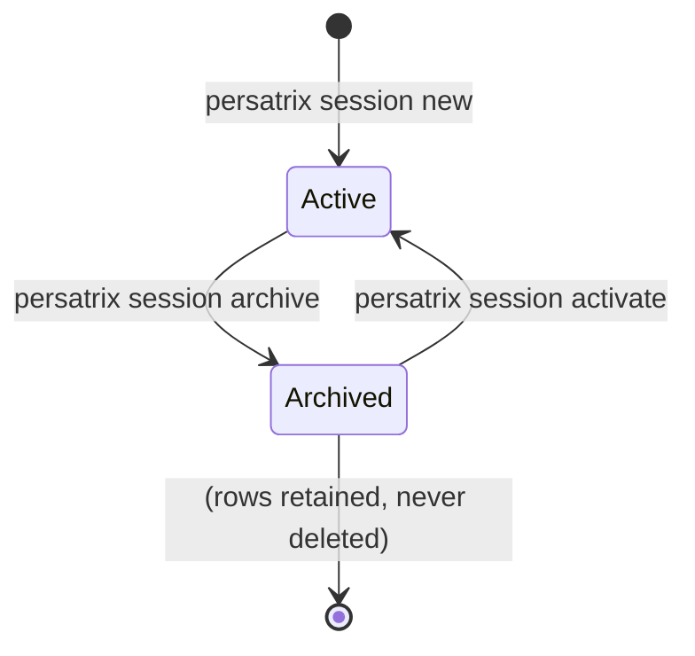

# RFC 0031 — Per-Session Namespacing for Channels and Persona Memory

**Type**: architecture
**Status**: 📋 Proposed
**Author**: Maksim Khomutov
**Date**: 2026-05-12
**Target**: v0.3.x
**Depends on**: RFC 0011 (Channels), RFC 0020 (Interaction Lifecycle — §G scope vocabulary)
**Relates to**: RFC 0008 (Memory & Context Optimization), RFC 0029 (Personal/Society Storage Split)
**Spawned from**: [ISSUE-0051](../issues/ISSUE-0051-per-session-memory-namespacing-channels.md) — root-cause fix for F-3 cross-run state bleed; currently mitigated by `make reset` (PR 6 of [v0.3.0 channel test-findings plan](../v0.3.0-test-findings-pr-plan.md))

---

## Table of Contents

- [Summary](#summary)
- [Motivation](#motivation)
- [Goals](#goals)
- [Non-Goals](#non-goals)
- [Design / Implementation](#design--implementation)
  - [A. Vocabulary](#a-vocabulary)
  - [B. Session Lifecycle](#b-session-lifecycle)
  - [C. Storage Model](#c-storage-model)
  - [D. Recall Semantics](#d-recall-semantics)
  - [E. Operator Surface](#e-operator-surface)
  - [F. Interaction with RFC 0020 §G Scope](#f-interaction-with-rfc-0020-g-scope)
  - [G. Interaction with RFC 0029 Storage Split](#g-interaction-with-rfc-0029-storage-split)
- [Security Considerations](#security-considerations)
- [Phased Implementation Plan](#phased-implementation-plan)
- [Files Touched (Estimated)](#files-touched-estimated)
- [Test Strategy](#test-strategy)
- [Open Questions](#open-questions)
- [Decision / Next Steps](#decision--next-steps)
- [Related Documentation](#related-documentation)

---

## Summary

A second test run with the same channel name and the same `--user` identity inherits prior content from `channels.db` and the per-persona `memory.db`. Personas surface old participants and topics from earlier runs, which steers the next conversation off-topic within ~2 turns (F-3 in the [v0.3.0 channel test findings](../v0.3.0-test-findings-pr-plan.md)). Today this is mitigated by `make reset` — an operator workaround that purges Docker volumes between runs. It is ergonomics, not isolation.

This RFC proposes **Session** as a first-class concept: a named, operator-visible scope under which channels are created and persona-memory rows are tagged. Every channel-creation path implicitly attaches the active session id; recall defaults to the current session; cross-session recall is an explicit opt-in read path. Sessions are surfaced through a `persatrix session …` CLI verb so operators can list, create, switch, and (eventually) export them.

The RFC deliberately *proposes* rather than *commits* — Open Question 1 (the dementia-test tension between session isolation and long-arc memory continuity) is a prerequisite for moving to `👍 Accepted`.

## Motivation

Three problems compound today:

1. **Manual test reruns are unreliable without an explicit `make reset`.** Forgetting it produces off-topic persona behaviour that looks like a regression but is actually prior-run carryover. The operator-guide subsection in [channels.md](../guides/channels.md) and [persona-agents.md](../guides/persona-agents.md) names this hazard but does not eliminate it.

2. **CI / automated regression harnesses cannot share volumes across runs.** With state bleed between runs, the only safe pattern is "wipe volumes between every job" — which kills the very property that makes persona memory interesting (continuity). Tests that *want* continuity (a dementia-test-style probe across two days of simulated history) cannot be authored cleanly either, because there is no primitive that separates "same session, two events" from "different sessions, two events."

3. **Channel-id collisions across distinct test scenarios re-attach prior history.** A reused `group:planning` channel name carries forward the membership, messages, and per-persona recall edges from the previous run. The wire-side canonical address is the same string — there is nothing to disambiguate the two scenarios.

What happens if we do nothing: every CI scenario either burns the volume (no continuity tests) or shares the volume (every test sees every other test's debris). The dementia-test suite ([MT-MEMORY-005](../manual-tests/MT-MEMORY-005-dementia-test.md)) — the canonical bar for "memory works" — needs *both* properties on demand. Without a session primitive, the test author has to encode the isolation in the channel name itself (`group:planning-run-2026-05-12-a`), which is exactly the kind of manual hygiene that produces F-3.

## Goals

1. Make every test run **auto-isolated by default**: a second run with the same channel name and same `--user` does not see prior-run content unless the operator explicitly asks for it.
2. Preserve the **dementia-test continuity property**: a single session can span many days and many channel restarts, and persona memory accumulates across that arc. Session isolation must not be a "wipe on restart" hammer.
3. Provide an **operator-visible CLI surface** (`persatrix session …`) so sessions are a first-class, inspectable concept rather than an internal harness primitive.
4. Compose with **RFC 0020 §G scope** without rewriting it. The §G scope is a per-interaction lifecycle boundary; sessions are a coarser per-namespace boundary. The two dimensions must remain orthogonal in the storage model.
5. Provide a **migration path** for the existing `make reset` workaround so operators can keep using it during rollout, with a deprecation breadcrumb once sessions are GA.

## Non-Goals

- **Cross-session merge / fork tooling.** A "fork session B from session A at message M" verb is not in scope. If it lands, it is a separate RFC.
- **Cryptographic isolation between sessions.** Sessions are a namespacing dimension, not a permissions boundary. A compromised process can still read every session's rows. Multi-tenant isolation is RFC 0009 / RFC 0013 territory.
- **Renaming the existing `scope` column (RFC 0020 §D / §G).** §G scope keeps its current per-interaction-lifecycle semantics; sessions are added as a separate dimension. See §F for the rationale.
- **Postgres backend or society-store migration.** Per-session namespacing is a logical-key change; it composes with whatever physical store RFC 0029 lands on (per-agent SQLite in v0.3.x, Postgres in v0.4.0+). The session id is the same string in either backend.
- **Replaying or rewriting historical rows.** Existing episodes, relationships, and channel messages stay untouched. Pre-RFC rows are treated as belonging to a synthetic `legacy` session — see §C and Open Question 3.

---

## Design / Implementation

### A. Vocabulary

| Term | Definition | Storage |
|------|------------|---------|
| **Session** | A named, operator-visible namespace for channels and persona memory. Has a stable `session_id`, a human-readable label, a creation timestamp, and a status (`active` / `archived`). | New `sessions` table (Phase 1) — see §C. |
| **session_id** | A short canonical identifier (kebab-case, e.g. `run-2026-05-12-a`, or a UUIDv7 if unlabeled). The dimension that scopes channels, episodes, and relationships. | Column on every relevant row. |
| **Active session** | The session_id attached to a process at startup (CLI flag, env var, or a `~/.persatrix/active-session` pointer). | Process-local. |
| **Cross-session recall** | An explicit opt-in read path that returns rows from sessions other than the active one. | Recall API flag — see §D. |

The vocabulary intentionally does *not* reuse "scope" — RFC 0020 §G owns that term for per-interaction-lifecycle boundaries. Conflating the two is the single largest source of misimplementation risk this RFC is trying to head off.

### B. Session Lifecycle



- **Creation.** `persatrix session new [--label X]` writes a row to the `sessions` table and (optionally) sets it as the active session. If `--label` is omitted, a UUIDv7-derived id is generated. UUIDv7 (not v4) so session ids sort lexicographically by creation time, which matters for default ordering in `persatrix session list`.
- **Activation.** `persatrix session use <id>` flips the active-session pointer. The orchestrator reads this at startup; in-flight processes continue under the session they started with (no live re-bind).
- **Archival.** `persatrix session archive <id>` marks the session inactive but does *not* delete its rows. Archived sessions are still readable via cross-session recall (§D).
- **Deletion.** Out of scope for v0.3.x. Compliance erasure is RFC 0013; session-level deletion piggybacks on that work rather than getting its own one-off path. See Open Question 5.

### C. Storage Model

**New `sessions` table** (location TBD — depends on RFC 0029 §G, see §G below):

```sql
CREATE TABLE sessions (
    id           TEXT PRIMARY KEY,        -- canonical session_id (kebab or UUIDv7)
    label        TEXT,                    -- optional human-readable name; NULL if unset
    created_at   REAL NOT NULL,           -- epoch seconds, matches episodes.created_at
    archived_at  REAL,                    -- NULL while active
    metadata_json TEXT                    -- JSON for future fields (e.g. operator note)
);
```

**Column additions:**

| Table | New column | Default | Index |
|-------|-----------|---------|-------|
| `channels` (Go, `internal/channels/sqlite.go`) | `session_id TEXT NOT NULL` | `'legacy'` for pre-RFC rows | `idx_channels_session` |
| `messages` (Go) | `session_id TEXT NOT NULL` | inherits from `channels` | covered by `idx_messages_channel_session` |
| `episodes` (Python, [`agents/memory/episodic.py`](../../agents/memory/episodic.py)) | `session_id TEXT` | `NULL` (treated as `legacy`) | `idx_episodes_session` |
| `relationships` (Python, [`agents/memory/relationship_mutations.py`](../../agents/memory/relationship_mutations.py)) | `session_id TEXT` | `NULL` (treated as `legacy`) | `idx_rel_session` |

The `legacy` sentinel is *not* a real row in the `sessions` table — recall and list paths treat `session_id IS NULL OR session_id = 'legacy'` as a synthetic "before sessions existed" namespace. This keeps the migration zero-cost (no backfill UPDATE on existing rows). See Open Question 3 for the alternative of materialising a `legacy` row.

**Why a new column, not a `scope`-prefix widening.** Reusing RFC 0020 §G's `scope` column to carry session info (e.g. `scope = 'sess:run-a:group:planning'`) was considered and rejected — see §F.

### D. Recall Semantics

Default recall is **session-scoped**:

```python
# Pseudocode — actual API stays the existing EpisodicMemory.recall signature
async def recall(query, *, limit, min_importance, min_score, sessions=None):
    if sessions is None:
        sessions = [self._active_session_id]  # default: current session only
    # WHERE session_id IN (sessions) OR session_id IS NULL  -- legacy rows always visible
    ...
```

Three modes:

1. **Default (`sessions=None`)** — current session plus `legacy` rows. This is what every existing call site gets without code changes.
2. **Multi-session (`sessions=[a, b]`)** — explicit list. The dementia-test path that wants to assert continuity across simulated days lives here.
3. **All sessions (`sessions="*"`)** — operator/debug path. Surfaced via a CLI flag (`persatrix memory recall --all-sessions`) and gated off the default API. The string sentinel rather than `None` is deliberate — `None` already means "default", and conflating the two is the recall bug this RFC is most worried about.

The `legacy IS NULL` carve-out is the load-bearing detail that lets us ship without backfilling old rows. Once a v0.3.x install has run long enough that operators stop caring about pre-RFC episodes, a `persatrix memory legacy-prune` verb can drop them — out of scope for this RFC.

### E. Operator Surface

```
persatrix session new [--label LABEL] [--activate]
persatrix session list [--include-archived]
persatrix session use <id-or-label>
persatrix session archive <id-or-label>
persatrix session current
```

The active-session pointer lives at `~/.persatrix/active-session` (path overridable via `PERSATRIX_ACTIVE_SESSION_FILE`). The orchestrator reads it at startup; an explicit `--session` flag on `persatrix chat` / `persatrix channel publish` / etc. overrides the file for that one invocation.

`make reset` is **kept** but its operator-guide subsection is updated: "Prefer `persatrix session new --activate` for run isolation; `make reset` is now the deprecated nuclear option for clearing all volumes across all sessions." Removal of `make reset` is out of scope; deprecation breadcrumb only.

### F. Interaction with RFC 0020 §G Scope

[RFC 0020 §G](0020-interaction-lifecycle.md#g-per-channel-scoping) defines `scope` as a **per-interaction-lifecycle** boundary — the set of turns that belong to the same interaction. The vocabulary table makes this explicit: `dm:a:b`, `group:planning`, `thread:<msg-id>`. The scope is the *smallest natural conversational unit* for the source.

Sessions are a **coarser, orthogonal dimension**. A single session contains many scopes (a session "run-2026-05-12-a" may have dozens of interactions in `group:planning`, `dm:alex:user`, etc.); a single scope can in principle appear in many sessions (the same `group:planning` channel name across two distinct sessions).

Three reasons to keep them as separate columns:

1. **§G's scope already plays a recall role.** [`idx_episodes_scope`](../../agents/memory/episodic.py) is sized for `LIKE 'thread:%'` style scans. Prepending `sess:<id>:` to the value invalidates the index shape and requires a parallel migration to a `LIKE 'sess:<id>:thread:%'` predicate.
2. **The semantics drift over time.** §G scope is set by the `BoundaryDetector` at interaction open. session_id is set by the operator at process startup. Tying them to the same column means every future change to one risks rewriting the other.
3. **RFC 0020 §G calls out exactly this risk.** The §G table's "Boundary policy" column is the contract — collapsing session into that column means future boundary-detector work has to special-case the session prefix, which is the regression we are paying upfront cost to avoid.

The cost of two columns is one extra `WHERE` clause and one extra index per table. The benefit is that §G's vocabulary stays load-bearing and this RFC's vocabulary stays load-bearing, and neither has to apologise for the other.

### G. Interaction with RFC 0029 Storage Split

[RFC 0029](0029-personal-society-storage-split.md) draws the personal/society boundary and proposes a `MemoryStore` facade. Sessions sit *inside* that boundary — they are a namespacing dimension on every tier RFC 0029 lists (episodes, notes, relationships, channels). Two places this matters:

1. **The `sessions` table is society state, not personal state.** Multiple agents share a view of "what session is active right now"; this is the same property that pushed channels to `channels.db` (§A of RFC 0029). In v0.3.x Phase 1, `sessions` lives alongside `channels` in the orchestrator-owned SQLite. When RFC 0029 Phase 2 lands its Postgres society store, the `sessions` table moves with `channels` — no re-design required.
2. **The `MemoryStore` facade signature carries `session_id`.** Every read path that RFC 0029 §C exposes (`get_episodes`, `get_relationships`, `recall`) takes a `session_id` filter. This is the load-bearing API choice — Phase 1 of RFC 0029 ships the facade signature; this RFC adds the session_id parameter to that signature before the facade is frozen. Coordinating the two phases is captured in Open Question 4.

---

## Security Considerations

- **Session id as a namespacing primitive, not a permissions boundary.** A process that can read `memory.db` can read every session in it. Hardening this is RFC 0009 (auth) and RFC 0013 (erasure) territory; this RFC neither claims nor provides isolation against an in-process attacker.
- **Operator misconfiguration risk.** A stale `~/.persatrix/active-session` file pointing at an archived session causes new channels to attach to a session the operator thought was done. Mitigation: `persatrix session use` and the startup path log the active session id at INFO; the operator-guide subsection documents the file location explicitly.
- **Session-id leakage in logs and traces.** session_id is non-sensitive by design (it is operator-visible) but appears in many log lines under structured logging (RFC 0018). Confirm the logging schema treats it as a low-cardinality dimension to avoid metrics explosion. The label is operator-supplied — operators must not put secrets in session labels. Documented in §E of the operator guide subsection.
- **Cross-session recall as a footgun.** `sessions="*"` returns every row. A debug verb that defaults to all-sessions and is wired into a prompt context risks reintroducing F-3 against the very fix this RFC ships. Mitigation: the `"*"` sentinel is gated to CLI/debug paths only and is not in the default persona-runtime context path. Pinned by an explicit unit test that asserts `_active_session_id` is consulted at every recall site in `agents/persona_runtime/`.

---

## Phased Implementation Plan

Phases are scoped to be independently shippable. Sequencing is the constraint; sizing notes are deliberately absent (see project memory on plan timelines).

### Phase 1: Sessions Table, Column Additions, Default-Session Plumbing

**Summary**: Add the `sessions` table and `session_id` columns, with a hard-coded default session of `legacy`. No CLI, no recall filtering yet — the column exists, every write fills it, but reads ignore it.

**Deliverables**:

1. New `sessions` table in `internal/channels/sqlite.go` migration.
2. `session_id` column added to `channels`, `messages`, `episodes`, `relationships` with `legacy` default.
3. Orchestrator boot reads a `PERSATRIX_SESSION_ID` env var (default `legacy`) and threads it through `ChannelStore.CreateChannel` and `PublishMessage`.
4. Python persona runtime reads the same env var and threads it through `EpisodicMemory.store_episode` and `RelationshipMemory.record_interaction` via a new `session_id` kwarg.
5. New telemetry counter: `sessions.writes{session_id}` (low-cardinality — session_id is bucketed at emission).

**Dependencies**: None.

### Phase 2: Recall Filtering and the Dementia-Test Bridge

**Summary**: Default recall becomes session-scoped. Cross-session recall lands as an explicit parameter. Resolve Open Question 1 before this phase opens — without it, this phase ships the wrong default.

**Deliverables**:

1. `EpisodicMemory.recall` gains the `sessions` parameter per §D.
2. Default `sessions=None` resolves to `[active_session_id]` and the recall WHERE clause filters accordingly.
3. `legacy` rows are always visible (the `IS NULL OR = 'legacy'` carve-out).
4. Dementia-test ([MT-MEMORY-005](../manual-tests/MT-MEMORY-005-dementia-test.md)) is updated to exercise multi-session continuity explicitly — one session that spans the full test arc, with an explicit `sessions=[<id>]` assertion at the recall site.
5. Same change applied to `RelationshipMemory` query helpers.

**Dependencies**: Phase 1. **Hard gate**: Open Question 1 resolved.

### Phase 3: Operator CLI

**Summary**: `persatrix session new / use / list / archive / current` lands. Active-session pointer file. `--session` flag on existing channel/chat commands.

**Deliverables**:

1. `cli/src/commands/session.rs` with the verbs listed in §E.
2. Active-session file at `~/.persatrix/active-session` plus `PERSATRIX_ACTIVE_SESSION_FILE` override.
3. `persatrix chat` / `persatrix channel publish` / `persatrix channel list` honor `--session` (overriding the file) and default to the file value otherwise.
4. `make reset` operator-guide subsections in [channels.md](../guides/channels.md) and [persona-agents.md](../guides/persona-agents.md) get the "prefer `persatrix session new --activate`" callout.

**Dependencies**: Phase 1.

### Phase 4: Cleanup and Documentation Pass

**Summary**: Operator docs, the F-3 issue close-out, and the legacy-prune verb scoped (not implemented).

**Deliverables**:

1. New `docs/guides/sessions.md` operator guide.
2. [ISSUE-0051](../issues/ISSUE-0051-per-session-memory-namespacing-channels.md) closed with a link to this RFC's `✅ Implemented` row.
3. `persatrix memory legacy-prune` carved out as a follow-up issue (not built here).

**Dependencies**: Phase 3.

---

## Files Touched (Estimated)

| Component | Files | Change |
|-----------|-------|--------|
| Go orchestrator | `internal/channels/sqlite.go`, `internal/channels/channels.go`, `internal/channels/router.go`, `internal/server/channel_handlers.go` | Schema migration; session_id column on channels/messages; thread session_id through publish/create. |
| Python agents | `agents/memory/episodic.py`, `agents/memory/relationship.py`, `agents/memory/relationship_mutations.py`, `agents/memory/migrations.py`, `agents/memory/facade.py`, `agents/persona_runtime/memory_context.py` | session_id kwarg on store/record paths; recall filtering; migration. |
| Rust CLI | `cli/src/commands/session.rs` (new), `cli/src/commands/chat.rs`, `cli/src/commands/channel.rs` | `session` subcommand; `--session` flag on existing verbs. |
| Protos | `proto/orchestrator/v1/channels.proto` (additive `session_id` field on channel/message records) | Wire-side session_id surfacing. |
| Config / docs | `docs/guides/sessions.md` (new), `docs/guides/channels.md`, `docs/guides/persona-agents.md`, `Makefile` | Operator guide; deprecation breadcrumb on `make reset`. |

---

## Test Strategy

- **Unit tests (Go)**: `channels_test.go` — `CreateChannel` writes `session_id`; `PublishMessage` carries it; recall queries filter by session_id; legacy rows (`session_id = 'legacy'`) visible from every session.
- **Unit tests (Python)**: `test_episodic_session_scope.py` — default recall returns active-session rows + legacy; explicit `sessions=[…]` filter; `sessions="*"` returns everything. Mirror tests for `RelationshipMemory`.
- **Unit tests (Rust)**: `cli/src/commands/session.rs` snapshot tests for verb output; active-session-file roundtrip; `--session` flag overrides file.
- **Integration tests**: cross-process — orchestrator and persona runtime started under different `PERSATRIX_SESSION_ID` values; verify no recall bleed; verify shared `legacy` visibility.
- **E2E**: the MT-MEMORY-005 dementia-test arc executed under one session, then a second session, and the persona's recall stays inside its own session arc unless `sessions=*` is passed explicitly. This is the canonical "did we actually fix F-3 without breaking the dementia test" pin.
- **Manual**: the F-3 reproduction in the [v0.3.0 channel test findings](../v0.3.0-test-findings-pr-plan.md) — re-run with the same channel name and `--user` after `persatrix session new --activate`; assert no carryover.

---

## Open Questions

1. **Does session-scoped default recall break the dementia-test continuity contract?**
   The dementia test ([MT-MEMORY-005](../manual-tests/MT-MEMORY-005-dementia-test.md)) is the canonical "memory works" bar for Persatrix (project memory: "persona memory must pass the dementia test"). If every operator-driven `persatrix session new` creates a fresh recall horizon, an operator who runs the dementia-test arc across two sessions will see the persona "forget" — which is exactly the failure the test is designed to catch. Three candidate resolutions:
   - **1a.** Default recall stays single-session and the dementia-test author is responsible for pinning all turns under one session id. Simple; but the test currently has no concept of session id and authoring it via `--session` is fragile.
   - **1b.** Default recall is multi-session for personal memory (episodes, relationships) but single-session for channel state (`channels.db` rows). Asymmetric but matches the natural ownership boundary — personal memory is *about* continuity; channel state is *about* a conversation.
   - **1c.** Sessions get a `parent_session_id` field, and recall walks the parent chain by default. Adds a graph dimension this RFC does not otherwise need.
   **Resolution required before Phase 2 opens.** This is the load-bearing question that decides whether sessions are a CI-ergonomics primitive or a memory-architecture primitive.

2. **Is the `legacy` sentinel a string constant or a real row in `sessions`?**
   §C proposes the constant form (zero-cost migration). The alternative is a single seed row `INSERT INTO sessions (id, label) VALUES ('legacy', 'Legacy — pre-RFC-0031 rows')`. Materialising it makes `JOIN sessions ON ...` queries trivial and gives `persatrix session list` a stable entry to render. The constant form is two lines simpler in the migration but every read path has to special-case the sentinel.

3. **Does the wire-side `session_id` go on `Channel` (channel-level), `ChannelMessage` (message-level), or both?**
   Channel-level is sufficient for the storage model (every message inherits its channel's session_id). Message-level is more flexible (a session-replay export could carry the session id on every message) but pays a per-message string in protobuf payloads. Default proposal: channel-level only, with message-level deferred until a concrete export use case earns it.

4. **How does this RFC sequence against RFC 0029 Phase 1 (`MemoryStore` facade)?**
   RFC 0029 Phase 1 freezes the facade signature. If this RFC ships first, the facade includes `session_id` on every read path from day one. If RFC 0029 ships first, the facade is back-compat-extended. The cheaper sequencing is this RFC's Phase 1 lands *before* RFC 0029 Phase 1 freezes the facade — coordinate with the RFC 0029 author before either is `👍 Accepted`.

5. **Should `persatrix session delete` exist, or does compliance erasure (RFC 0013) own that?**
   Argument for a `delete` verb: operators want to clean up CI-run sessions without waiting for the compliance-erasure path. Argument against: deletion is a permanent operation and RFC 0013's right-to-erasure work is the right home. Default proposal: no `delete` verb in this RFC; operators use `archive` and rely on a future bulk-prune verb scoped against RFC 0013.

6. **Active-session resolution order — env var, file, CLI flag — what wins?**
   Proposed: CLI flag `--session` > env var `PERSATRIX_SESSION_ID` > file `~/.persatrix/active-session` > built-in default `legacy`. Confirm before Phase 3.

7. **Does the session_id appear in OTEL trace attributes (RFC 0019)?**
   Adding it to span attributes makes per-session trace queries trivial in Tempo / Honeycomb. Cardinality is bounded by the number of operator-created sessions, which is small in practice. Proposed: yes, as a low-cardinality attribute under the existing `persatrix.*` namespace. Confirm with the observability reviewer before Phase 1.

## Decision / Next Steps

This RFC is `📋 Proposed`. Before moving to `👍 Accepted`:

1. Resolve **Open Question 1** (dementia-test continuity). This is the only question whose answer can invalidate the whole design.
2. Confirm **Open Question 4** sequencing with RFC 0029.
3. Confirm **Open Question 7** with the observability reviewer.

Open Questions 2, 3, 5, 6 may be resolved during phased implementation review without blocking acceptance.

## Related Documentation

- [ISSUE-0051 — Per-session memory namespacing for channels + persona memory](../issues/ISSUE-0051-per-session-memory-namespacing-channels.md)
- [v0.3.0 channel test findings — F-3](../v0.3.0-test-findings-pr-plan.md)
- [RFC 0011 — Channels + Bridges](0011-channels-bridges.md)
- [RFC 0020 — Interaction Lifecycle (§G Per-Channel Scoping)](0020-interaction-lifecycle.md#g-per-channel-scoping)
- [RFC 0029 — Personal/Society Storage Split](0029-personal-society-storage-split.md)
- [Channels operator guide](../guides/channels.md)
- [Persona agents operator guide](../guides/persona-agents.md)
- [MT-MEMORY-005 — Dementia test](../manual-tests/MT-MEMORY-005-dementia-test.md)
