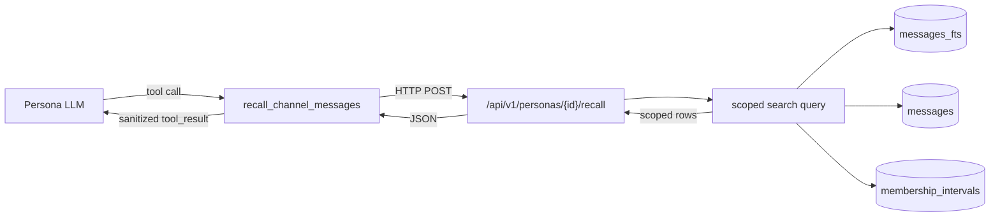

# RFC 0036 — Persona Verbatim Message Recall

**Type**: feature
**Status**: 📋 Proposed
**Author**: Maksim Khomutov
**Date**: 2026-05-16
**Target**: v0.3.9
**Depends on**: RFC 0011 (Channels — the durable `messages` store and the REST channel surface), RFC 0034 (Persona Conversational Working Memory — the conversation window this RFC retrofits, and the `_format_event` delimiter-escape sanitization this RFC reuses), RFC 0035 (Channel Membership Interval Ledger — recall scoping is a SQL join against the `membership_intervals` table)
**Relates to**: RFC 0005 / RFC 0008 (Persona memory tiers — recall is a verbatim sibling of the episodic *summary* tier), RFC 0009 (Agent Identity, Security & Sandboxing — the audit subsystem and the REST-surface auth model), RFC 0026 (Declarative Facts Tier — another consumer of past-conversation content)

---

## Table of Contents

- [Summary](#summary)
- [Motivation](#motivation)
- [Goals](#goals)
- [Non-Goals](#non-goals)
- [Design / Implementation](#design--implementation)
  - [A. Architecture — server-side scoped search](#a-architecture--server-side-scoped-search)
  - [B. FTS5 index over `messages`](#b-fts5-index-over-messages)
  - [C. The scoped search query](#c-the-scoped-search-query)
  - [D. REST endpoint](#d-rest-endpoint)
  - [E. The `recall_channel_messages` persona tool](#e-the-recall_channel_messages-persona-tool)
  - [F. Sanitization of recalled content](#f-sanitization-of-recalled-content)
  - [G. Conversation-window membership filter](#g-conversation-window-membership-filter)
  - [H. Retention horizon and deletions](#h-retention-horizon-and-deletions)
  - [I. Group channels](#i-group-channels)
- [Security Considerations](#security-considerations)
- [Phased Implementation Plan](#phased-implementation-plan)
- [Files Touched (Estimated)](#files-touched-estimated)
- [Test Strategy](#test-strategy)
- [Open Questions](#open-questions)
- [Decision / Next Steps](#decision--next-steps)
- [Related Documentation](#related-documentation)

---

## Summary

A persona can ask its episodic memory *what it concluded* about a past
interaction — the episodic tier stores LLM-generated **summaries**
([`agents/memory/migrations.py:104-117`](../../agents/memory/migrations.py#L104-L117)).
It cannot ask *what was literally said*. The verbatim text of every
message lives in the channel store's `messages` table
([`internal/channels/sqlite_schema.go:109-118`](../../internal/channels/sqlite_schema.go#L109-L118),
`content TEXT NOT NULL`), but the only way to read it is timestamp-
ordered pagination via `GetHistory` — there is no search, and nothing
exposes it to the persona as a tool.

This RFC adds **membership-scoped verbatim message recall**. A new
persona tool, `recall_channel_messages`, searches the verbatim text of
past conversations. The search runs **server-side in the channel
store**, joining a new FTS5 index over `messages` against the
[RFC 0035](0035-channel-membership-interval-ledger.md)
`membership_intervals` ledger, so a persona can only ever recall
messages from **channels it is or was a member of, and only from the
time windows of those membership stints**. A persona added to a group
channel, later removed, later re-added recalls messages from *both* of
its stints — and from neither the pre-join period nor the removal gap.

The same membership filter is retrofitted onto the RFC 0034
conversation window (§G): a re-added persona's *live* prompt stops
showing it messages from the gap when it was not a member, closing an
inconsistency RFC 0034 left open.

## Motivation

### The capability gap

The persona memory tiers (RFC 0005 / RFC 0008) are all
**summarization** tiers — episodic recall, relationship state, facts,
agent notes. They answer "what do I remember concluding." None answers
"what were the exact words." For a persona that needs to quote a prior
decision, resolve a precise reference, or re-read what a user actually
asked three conversations ago, the summary is lossy and the verbatim
text — though durably stored — is unreachable.

The channel store already persists every message verbatim and
indefinitely (no retention policy exists; cap-pruning aside — see §H).
The data is there. What is missing is (1) a way to *search* it and
(2) a way to *expose* it to the persona under the right access rule.

### Why the access rule needs RFC 0035

"The conversations the persona had access to" is not "all channels" and
not "the current channel." It is precisely: **the channels the persona
is or was a member of, restricted to its membership intervals.** The
canonical case — a group channel that predates the persona, a persona
added then removed then re-added — has three regions:

```
channel timeline:  ──●────────●──────────●────────────●──────────▶
                   created   persona   persona      persona
                             joined    removed      re-added
recall scope:               ░░░░░░░░░░         (gap)  ░░░░░░░░░░░░▶
                            stint 1                   stint 2
```

The persona may recall the two shaded stints and nothing else. That is
a per-`(channel, persona)` time-range filter, and it is unimplementable
without a join/leave history — which is exactly why
[RFC 0035](0035-channel-membership-interval-ledger.md) exists and why
this RFC hard-depends on it.

### Why server-side, not in the persona runtime

The naive shape — fetch history into the Python runtime and filter
there — would either pull whole channels over HTTP per query or
duplicate the membership-interval logic in Python. Worse, it would
make the access rule a *client-side* check: a bug or a malicious tool
argument could read outside scope. Putting the search **and** the
scope join in the channel store (Go, co-located with both `messages`
and `membership_intervals`) makes the access rule server-enforced and
the query a single indexed SQL statement. This mirrors how RFC 0034's
channel-scoped history endpoint already enforces channel scope
server-side.

## Goals

1. A persona can call a `recall_channel_messages` tool with a free-text
   query and receive verbatim message rows — `content`, `sender`,
   `channel`, `timestamp` — ranked by relevance.
2. Recall results are **scoped server-side**: only messages inside one
   of the calling persona's `membership_intervals` (RFC 0035) for the
   message's channel are ever returned. Pre-join and removal-gap
   messages are unreachable.
3. A persona removed and re-added to a channel recalls messages from
   **both** membership stints.
4. Recall spans **all** channels the persona had access to by default;
   a caller may narrow to one channel, one sender, or a time range.
5. Recalled verbatim text passes through the same `_format_event`
   delimiter-escape sanitization RFC 0034 §D established before it
   enters the persona's prompt — no new prompt-injection surface.
6. The RFC 0034 conversation window applies the same membership filter:
   a re-added persona's live window no longer shows removal-gap
   messages (§G).
7. Every recall call emits an RFC 0009 audit event, so there is a
   trail of what a persona pulled up.
8. Recall is **best-effort over surviving messages** (§H): it is honest
   about the channel-store retention horizon and never claims to recall
   pruned or deleted content.

## Non-Goals

- **A durable recall store.** Recall reads the live `messages` table.
  Messages removed by the channel cap-prune
  ([`sqlite_messages.go:198-230`](../../internal/channels/sqlite_messages.go#L198-L230))
  or by user deletion are simply gone from recall (§H). Copying
  messages into a separate retention-immune index was considered and
  **rejected** for this RFC — it re-opens the retention/privacy
  question and is not needed for the feature. A future RFC may revisit
  it if a recall horizon longer than the channel cap is ever required.
- **Semantic / vector recall.** Search is FTS5 lexical (BM25), the same
  technology the episodic tier uses. Embedding-based semantic recall is
  a separate, later concern, exactly as RFC 0005 §5 defers it for the
  episodic tier.
- **Cross-persona recall.** A persona recalls *its own* membership
  scope. One persona cannot recall another's channels. The scope
  participant id is closure-bound, not LLM-controllable (§E).
- **Recalling channels the persona was never a member of.** Out of
  scope by construction — the membership-interval join returns nothing
  for them.
- **Changing the episodic summary tier.** Recall is a new, sibling
  capability. Episodic recall, relationship state, facts, and notes are
  untouched. Recall does not write to any memory tier.
- **A retention or TTL policy for `messages`.** Orthogonal; recall
  consumes whatever the channel store keeps.
- **Membership-ledger mechanics.** Owned entirely by
  [RFC 0035](0035-channel-membership-interval-ledger.md).

## Design / Implementation

### A. Architecture — server-side scoped search



The search query, the FTS index, and the membership-interval join all
live in the **channel store** (Go / SQLite) because that is where both
`messages` and `membership_intervals` live. The persona runtime
(Python) reaches it through a new REST endpoint via an HTTP client
modelled on the existing `HttpChannelHistoryFetcher`
([`agents/channel_history_fetcher.py`](../../agents/channel_history_fetcher.py)).
The access rule is therefore enforced **server-side, in SQL**, and the
persona tool is a thin caller.

### B. FTS5 index over `messages`

Channel-store schema migration **v10** (RFC 0035 lands v9; this RFC is
the next step — a `case 10:` arm in `applyMigration`, a `migrateV9ToV10`
function, `channelStoreSchemaVersion` bumped to 10, `user_version`
stamped inside the migration transaction). Both the `case` arm and the
migrate function live in
[`internal/channels/sqlite_migrations.go`](../../internal/channels/sqlite_migrations.go)
— the dedicated migration runner the channel store extracted out of
`sqlite_schema.go` after this RFC was first drafted (RFC 0035 PR 1 has
since taken v9, so v10 is the next free slot as of 2026-06-17 — this
RFC's).

The index mirrors the episodic tier's external-content FTS5 pattern
([`agents/memory/migrations.py:369-389`](../../agents/memory/migrations.py#L369-L389),
`episodes_fts`). `messages` is a normal rowid table, so `content_rowid`
can alias its implicit `rowid`:

```sql
CREATE VIRTUAL TABLE messages_fts USING fts5(
    content,
    content=messages, content_rowid=rowid
);

CREATE TRIGGER messages_ai AFTER INSERT ON messages BEGIN
    INSERT INTO messages_fts(rowid, content) VALUES (new.rowid, new.content);
END;

CREATE TRIGGER messages_ad AFTER DELETE ON messages BEGIN
    INSERT INTO messages_fts(messages_fts, rowid, content)
        VALUES ('delete', old.rowid, old.content);
END;

-- Defensive-symmetric with the episodic pattern; expected never to fire
-- (messages is insert-and-cap-prune only — see below).
CREATE TRIGGER messages_au AFTER UPDATE ON messages BEGIN
    INSERT INTO messages_fts(messages_fts, rowid, content)
        VALUES ('delete', old.rowid, old.content);
    INSERT INTO messages_fts(rowid, content) VALUES (new.rowid, new.content);
END;
```

The migration then backfills the index from every existing message —
an external-content table starts empty and is not populated by the
`CREATE`:

```sql
INSERT INTO messages_fts(messages_fts) VALUES ('rebuild');
```

`messages` has no `UPDATE` path today (it is insert-and-cap-prune
only), so the `messages_au` update trigger shown above is added
defensively-symmetric with the episodic pattern but is expected never
to fire; a reviewer note in the migration records this.

**Rowid stability.** `messages` is keyed `id TEXT PRIMARY KEY`, *not*
`INTEGER PRIMARY KEY`, so its `rowid` is **not** preserved across an
explicit `VACUUM` — a `VACUUM` can renumber the rowids of any table
whose primary key does not alias `rowid`, which would silently desync
the external-content index from `messages`. No code path runs `VACUUM`
on the channel store today, and the episodic tier already ships this
exact pattern on a TEXT-keyed table (`episodes`), so the risk is
latent, not present. It is called out here because adding a
maintenance/compaction `VACUUM` later would corrupt `messages_fts` and
`episodes_fts` together; any such change must follow it with an
`INSERT INTO messages_fts(messages_fts) VALUES ('rebuild')`.

**FTS5 availability.** The migration probes FTS5 the way the memory
tier does (`_fts5_available` —
[`migrations.py:467-476`](../../agents/memory/migrations.py#L467-L476)):
attempt a throwaway virtual table, and if FTS5 is not compiled into the
SQLite build, skip `messages_fts` and record a flag. The search query
(§C) then falls back to a `LIKE`-based scan — slower, correct, and the
same degradation strategy `recall_like` gives the episodic tier. The
delete trigger keeps the index consistent with hard deletes (§H).

The cost is one extra index-insert per published message — bounded,
on the same transaction as the message insert. Noted in Security
Considerations.

### C. The scoped search query

A new `internal/channels/sqlite_search.go` holds the query. The
membership-interval `EXISTS` clause is the load-bearing access control
— it is RFC 0035 §F's in-scope predicate expressed as a join:

```sql
SELECT m.id, m.channel_id, m.sender_id, m.content, m.timestamp
  FROM messages_fts fts
  JOIN messages m ON m.rowid = fts.rowid
 WHERE messages_fts MATCH ?                       -- the (escaped) query
   AND EXISTS (
         SELECT 1 FROM membership_intervals mi
          WHERE mi.channel_id     = m.channel_id
            AND mi.participant_id = ?              -- the calling persona
            AND mi.joined_at <= m.timestamp
            AND (mi.left_at IS NULL OR m.timestamp < mi.left_at)
       )
   -- optional narrowing, each applied only when supplied:
   AND (? = '' OR m.channel_id = ?)               -- channel_id
   AND (? = '' OR m.sender_id  = ?)               -- sender
   AND (? = '' OR m.timestamp >= ?)               -- after
   AND (? = '' OR m.timestamp <  ?)               -- before
 ORDER BY <rank>
 LIMIT ?;
```

- **Scope** — the `EXISTS` subquery is non-optional and the persona's
  `participant_id` is bound server-side from the endpoint path (§D),
  never from the FTS query text. A message is returned only if it
  falls inside one of the persona's membership stints for its channel.
- **Ranking** — FTS5 `rank` (BM25) normalised into `[0,1]` the way the
  episodic tier does
  ([`episodic_queries.py:169` `_normalize_bm25`](../../agents/memory/episodic_queries.py#L169)),
  blended with a recency factor so a strong old hit and a weak fresh
  hit order sensibly. Exact blend weights are an Open Question (#3) —
  tuned when recall-usage data exists, not guessed in this RFC.
- **`MATCH` safety** — the raw query string is escaped/quoted before
  it reaches `MATCH` so FTS5 operator syntax in user/LLM text cannot
  error the statement or change its meaning. This reuses the episodic
  tier's `safe_query` handling rather than re-deriving it.
- **`LIKE` fallback** — when FTS5 is unavailable (§B) the same query
  runs with `m.content LIKE '%' || ? || '%'` in place of the FTS join,
  scope and narrowing clauses unchanged.
- **Run/test-isolation axes** — `messages` carries two scoping columns
  the §C query above omits, for two different reasons. `session_id`
  (migration v3, landed 2026-05-13) **already existed** when this RFC
  was drafted (2026-05-16 — the store was at v3): the query simply never
  accounted for it. `epoch_id` (migration v6) was added *after* the
  draft, so the query genuinely predates that axis. `epoch_id` is the
  strict isolation axis ([`DefaultEpochID`](../../internal/channels/sqlite.go#L42),
  no carry-over), so recall MUST add `AND m.epoch_id = ?` bound to the
  caller's epoch or it would surface messages from a different run /
  post-`reset` epoch — an isolation breach, not just noise. Whether
  recall is *also* session-scoped (like RFC 0031 Phase 2 made
  persona-memory recall) is a deliberate choice, not an oversight.
  Both are settled in **Open Question #6**; the predicate is shown
  unqualified here only because the answer to #6 fixes its exact form.

`limit` is clamped server-side to a hard maximum regardless of what the
caller requests.

### D. REST endpoint

```
POST /api/v1/personas/{participant_id}/recall
Body:  { "query": "...", "channel_id": "", "sender": "",
         "after": null, "before": null, "limit": 10 }
Resp:  { "messages": [ { "message_id", "channel_id", "sender",
                         "timestamp", "content" }, ... ] }
```

The scope participant is the **path segment** `{participant_id}`, not a
body field — the server binds it into the query's `EXISTS` clause. The
endpoint handler lives alongside the existing channel handlers
([`internal/server/channel_handlers.go`](../../internal/server/channel_handlers.go)).

`POST` (not `GET`) because the query carries several structured
parameters and a free-text body; it is a search, and it is audited
(§Security) — semantically a command, not a cacheable fetch.

The `{participant_id}`-in-path scoping raises an authorization
question the existing channel REST surface also has (it is
unauthenticated at the current single-tenant trust level). That is
**Open Question #1** — the endpoint must not ship more permissively
than its neighbours, and inherits RFC 0009's auth model when that
lands.

### E. The `recall_channel_messages` persona tool

A new tool, registered the way `create_memory_tools` registers the
note tools ([`agents/tools/builtin.py:333-481`](../../agents/tools/builtin.py#L333-L481)):
a closure-bound factory `create_recall_tool(http_client, gate, *,
agent_id)`.

```python
@tool(
    name="recall_channel_messages",
    description=(
        "Search the verbatim text of past conversations you have had "
        "access to. Returns exact messages with who said them and when."
    ),
    permissions=["channels:recall"],
    tier="builtin",
)
async def recall_channel_messages(
    query: str,
    channel_id: str = "",
    sender: str = "",
    limit: int = 10,
) -> ToolResult:
    ...
```

- **`agent_id` is closure-bound**, exactly like the episodic memory
  instance in `create_memory_tools` — the LLM supplies `query`,
  `channel_id`, `sender`, `limit` and **cannot** supply or override the
  scope participant. The closure passes `agent_id` as the endpoint
  path segment.
- **Permission** — a new, distinct `channels:recall` permission rather
  than reusing `memory:read`. Verbatim cross-channel recall is more
  sensitive than reading the persona's own episodic summaries; a
  distinct permission lets an operator enable episodic recall while
  leaving verbatim recall off. The tool checks `gate.check(
  "channels:recall")` first, mirroring the `memory:read` /
  `memory:write` checks in the note tools.
- **Result shape** — `ToolResult(success=True, data=[{message_id,
  channel_id, sender, timestamp, content}, ...])`, each `content`
  already sanitized per §F.
- The HTTP client is a small `HttpRecallClient` modelled on
  `HttpChannelHistoryFetcher`, sharing the `aiohttp` session and
  timeout conventions.

The default call — `query` only, no `channel_id` — searches every
channel the persona had access to; the server-side join makes "all
accessible channels" the natural default with no need for the tool to
enumerate channels first.

### F. Sanitization of recalled content

Recalled `content` is **untrusted peer text** — and a recall result is
arguably a *larger* prompt-injection surface than a single live
message, because it pulls in arbitrary historical text on demand. It
gets the exact treatment RFC 0034 §D defined for replayed turns:
every recalled `content` string is passed through the
`_format_event` `CHANNEL_MESSAGE` branch so the
`"<|" → "\\<|"` / `"|>" → "\\|>"` delimiter escape
([`prompt_assembly.py:421-426`](../../agents/persona_runtime/prompt_assembly.py#L421-L426))
is applied before the text reaches the model.

The recall tool result returns to the LLM as a `tool_result` block,
not as a `messages` user turn — so the escape is applied **per
recalled row's `content`** as the tool assembles its `data` payload.
This reuses `conversation_window._format_peer_turn`
([`conversation_window.py:405-438`](../../agents/persona_runtime/conversation_window.py#L405-L438))
— the same RFC 0034 reuse pattern, not a re-implementation. Each
recalled row is also tagged with its origin `channel_id` and `sender`
so the model is explicitly aware it is quoting cross-context material
(see Security Considerations — rebroadcast).

### G. Conversation-window membership filter

RFC 0034's conversation window fetches "the last N messages of
`event.channel_id`" with **no membership filter**
([`conversation_window.py:263-302`](../../agents/persona_runtime/conversation_window.py#L263-L302)).
A persona re-added to a channel therefore sees, *live in its prompt*,
messages from the gap when it was not a member — yet under this RFC it
could not *recall* those same messages later. That is incoherent. This
RFC closes it.

The history endpoint
(`GET /api/v1/channels/{id}/messages`) gains an optional
`?as_participant=<id>` query parameter. When present, the handler adds
the same RFC 0035 `membership_intervals` `EXISTS` clause from §C to the
history query, so the returned rows are restricted to that
participant's membership intervals.

- `conversation_window._fetch_window` and `HttpChannelHistoryFetcher.fetch`
  pass the persona's `agent_id` as `as_participant`. For a persona that
  is a *current* member with one open interval, the filter is a no-op
  on all recent messages — it only ever trims the pre-join prefix and
  the removal gap. The common case is unaffected.
- `channel_catchup.py` — the boot-time replay that seeds episodic
  memory ([RFC 0034 §H](0034-persona-conversational-working-memory.md))
  — also passes `as_participant`, so episodic memory is no longer
  seeded with messages from before the persona joined or from a
  removal gap. This keeps catch-up consistent with the recall scope.
- Non-persona callers (a human in the CLI hitting the history endpoint)
  omit `as_participant`; behaviour is unchanged for them.

### H. Retention horizon and deletions

Recall is **best-effort over surviving messages** — an explicit,
accepted property, not a defect:

- **Cap-pruning.** `pruneExcess` hard-deletes the oldest messages once
  a channel exceeds `maxMessagesPerChannel`
  ([`sqlite_messages.go:198-230`](../../internal/channels/sqlite_messages.go#L198-L230)).
  A pruned message is gone from `messages` and — via the `messages_ad`
  delete trigger (§B) — from `messages_fts`. Recall cannot surface it.
  Recall therefore reaches back only as far as the channel cap allows.
- **User/operator deletion.** Message deletion is a hard `DELETE`.
  Deleted content vanishes from `messages_fts` through the same delete
  trigger. This is a **privacy win** that costs nothing: a message a
  user removed is also unrecallable, automatically and consistently.
- No durable recall copy is kept (see Non-Goals). The tool's
  description does not promise total recall; tests assert a pruned
  message is absent from results.

### I. Group channels

Recall and the §G window filter are channel-type-agnostic. The
`membership_intervals` join keys on `(channel_id, participant_id)`
regardless of whether the channel is a DM, group, or thread. A persona
recalls group-channel messages from its membership stints in that
group exactly as it recalls DM messages — including the join → leave →
rejoin case the Motivation describes, which is inherently a group
scenario.

## Security Considerations

- **Prompt injection via recalled text** — closed by §F: every
  recalled `content` string is delimiter-escaped through the same
  `_format_event` sanitizer RFC 0034 §D established. Recall pulls in
  arbitrary historical text on demand, so this escape is mandatory and
  applied per row.
- **Cross-scope leakage — the central control.** The
  `membership_intervals` `EXISTS` clause (§C) is the load-bearing
  authorization check. It is server-side, in SQL, non-optional, and the
  scope `participant_id` is bound from the request path, never from
  LLM-supplied tool arguments. A persona cannot recall a channel it was
  never in, a stint it was not present for, or another persona's
  scope. Because this clause *is* the access-control decision, its
  correctness depends on the ledger's correctness — RFC 0035's Security
  Considerations carry the matching obligation, and that cross-citation
  is deliberate.
- **Endpoint authorization** — the recall endpoint and the
  `as_participant` history parameter scope by a caller-supplied
  participant id. On the current channel REST surface (unauthenticated,
  single-tenant trust level) any local caller could request any
  persona's scope. This is **Open Question #1**: the recall endpoint
  MUST NOT ship more permissively than the surrounding channel surface,
  and inherits RFC 0009's identity/auth model when it lands. Until
  then it matches the existing surface's trust level — and, unlike the
  existing surface, every call is audited (below), so misuse is at
  least observable.
- **Rebroadcast / cross-context disclosure** — even within its own
  scope, verbatim recall lets a persona lift user A's exact words from
  channel X and repeat them into channel Y. This cannot be fully
  prevented technically; recall *is* read access to that text. The
  mitigations: every recalled row is tagged with its origin
  `channel_id` and `sender` (§F) so the model is aware it is quoting
  cross-context material, and the persona system prompt carries
  guidance that recalled content is reference material, not a licence
  to rebroadcast. Residual risk is documented and accepted.
- **Audit** — every `recall_channel_messages` call emits an RFC 0009
  audit event recording the calling persona, the query string, the
  narrowing parameters, and the result count (not the result content).
  A new audit-event constant is added to
  [`internal/security/audit_event.go`](../../internal/security/audit_event.go).
  The event is emitted **server-side, in the recall endpoint handler**
  ([`channel_handlers.go`](../../internal/server/channel_handlers.go)),
  not in the Python `recall_channel_messages` tool — emitting at the
  endpoint means a misbehaving or bypassed tool client cannot suppress
  the trail, and the audited request is the one the server actually
  scoped and executed. Verbatim recall is a sensitive read; it leaves a
  trail.
- **FTS `MATCH` injection** — FTS5 query syntax in the `query` string
  is escaped/quoted before reaching `MATCH` (§C) so it cannot error the
  statement or alter its scope. The scope `EXISTS` clause is structural
  and unaffected by query text regardless.
- **Cost / DoS** — `limit` is clamped server-side to a hard maximum.
  The FTS index adds one index-insert per published message, on the
  message-insert transaction — bounded write amplification, the same
  order as the existing channel indexes.

## Phased Implementation Plan

### Phase 1: FTS index and the scoped search endpoint

Server-side only; testable end-to-end via REST with no persona
involvement.

1. Channel-store schema migration **v10** (`migrateV9ToV10` + `case 10:`
   arm in `sqlite_migrations.go`): `messages_fts` virtual table +
   insert/update/delete triggers, FTS5-availability probe with `LIKE`
   fallback flag; bump `channelStoreSchemaVersion` to 10 in
   `sqlite_schema.go`.
2. `internal/channels/sqlite_search.go`: the scoped search query (§C),
   including the `membership_intervals` `EXISTS` clause, ranking, query
   escaping, and the `LIKE` fallback path.
3. `POST /api/v1/personas/{id}/recall` endpoint + request/response
   types; the RFC 0009 audit event is emitted here, in the endpoint
   handler (see Security Considerations — Audit), so it lands with the
   server-side endpoint rather than the Phase 2 tool.
4. New recall audit-event constant in `internal/security/audit_event.go`.
5. Unit + migration + integration tests per the Test Strategy.

Dependencies: **RFC 0035 Phase 1** (the `membership_intervals` table
must exist to join against).

### Phase 2: The `recall_channel_messages` persona tool

1. `create_recall_tool` factory + `HttpRecallClient` in the agent
   runtime; closure-bound `agent_id`.
2. The new `channels:recall` permission; wire the tool into the
   persona tool registry and the agent tool allowlist.
3. Per-row `_format_event` sanitization (§F) of recalled content.
4. Integration test: a persona answers a question that requires
   recalling a specific past message.

Dependencies: Phase 1.

### Phase 3: Conversation-window membership filter

1. `?as_participant=<id>` on `GET /api/v1/channels/{id}/messages`,
   applying the §C `EXISTS` clause to the history query.
2. `conversation_window._fetch_window` and `HttpChannelHistoryFetcher`
   pass the persona's `agent_id`.
3. `channel_catchup.py` passes `as_participant` on replay so episodic
   seeding respects membership intervals.
4. Integration test: a re-added persona's live window and catch-up both
   exclude removal-gap messages.

Dependencies: RFC 0035 Phase 1. Independent of Phases 1–2 of this RFC
and separately reviewable.

## Files Touched (Estimated)

| Component | Files | Change |
|-----------|-------|--------|
| Go orchestrator | `internal/channels/sqlite_migrations.go` | `migrateV9ToV10` + `case 10:` arm: `messages_fts` + triggers, FTS5 probe, backfill |
| Go orchestrator | `internal/channels/sqlite_schema.go` | Bump `channelStoreSchemaVersion` to 10; migration-history header comment |
| Go orchestrator | `internal/channels/sqlite_search.go` (new) | Scoped search query + `LIKE` fallback; epoch (and possibly session) predicate per OQ #6 |
| Go orchestrator | `internal/server/channel_handlers.go` | Recall endpoint (incl. server-side RFC 0009 audit emission); `as_participant` on the history handler |
| Go orchestrator | `internal/server/channel_types.go` | Recall request/response types |
| Go orchestrator | `internal/security/audit_event.go` | New recall audit-event constant |
| Python agents | `agents/tools/recall.py` (new) | `create_recall_tool`, `HttpRecallClient` |
| Python agents | `agents/tools/builtin.py` | Register `recall_channel_messages`; `channels:recall` permission |
| Python agents | `agents/channel_history_fetcher.py` | `as_participant` parameter on `fetch` |
| Python agents | `agents/persona_runtime/conversation_window.py` | Pass persona id through `_fetch_window` |
| Python agents | `agents/channel_catchup.py` | Pass `as_participant` on replay |
| Config | `config/agents.yaml`, `schemas/agent.schema.json` | `channels:recall` in the tool/permission allowlist |
| Docs | `docs/guides/persona-agents.md`, `docs/diagrams/memory-architecture.md` | Document the recall tool and the verbatim-vs-summary distinction |
| Tests | `internal/channels/sqlite_search_test.go` (new), `tests/unit/python/tools/test_recall.py` (new), `tests/integration/persona/test_message_recall.py` (new) | Per Test Strategy |

## Test Strategy

- **Unit tests**:
  - The scoped search query: a message inside a membership interval is
    returned; one before the persona's first join, one in a removal
    gap, and one after a re-add classify correctly (the join → leave →
    rejoin fixture from RFC 0035).
  - `channel_id` / `sender` / time-range narrowing each filter as
    expected and compose.
  - FTS5 `MATCH` ranking returns the more relevant hit first; the
    `LIKE` fallback returns the same row set when FTS5 is disabled.
  - A query containing FTS5 operator syntax is escaped and does not
    error or escape its scope.
  - `limit` is clamped to the server-side maximum.
  - A cap-pruned / deleted message is absent from results (§H).
  - The recall tool: `agent_id` is closure-bound and cannot be
    overridden by a tool argument; a `channels:recall` permission
    denial returns a failed `ToolResult`; recalled `content` is
    delimiter-escaped (`<|user_message|>` literal round-trips inert).
- **Migration tests**: v9 → v10 builds `messages_fts` and backfills it
  from existing `messages`; the delete trigger keeps the index
  consistent; `user_version` is stamped inside the migration
  transaction; the migration is idempotent on reopen.
- **Integration tests**:
  - End-to-end recall via REST: seed a channel, add/remove/re-add a
    persona, assert recall returns both stints and excludes the gap.
  - A persona resolves a question requiring recall of a specific past
    message (Phase 2).
  - A re-added persona's conversation window and catch-up both exclude
    removal-gap messages (Phase 3).
- **Manual tests**: a new `MT-PERSONA-RECALL-001` — a persona is added
  to a group channel, removed, re-added; the persona is asked to recall
  something said in its first stint (succeeds), something said during
  the gap (correctly cannot), and something said after re-add
  (succeeds).

## Open Questions

1. **Recall-endpoint authorization.** The recall endpoint and the
   `as_participant` history parameter scope by a caller-supplied
   participant id, on a channel REST surface that is currently
   unauthenticated. Proposed resolution: the recall endpoint inherits
   RFC 0009's identity/auth model when it lands, and until then matches
   the existing surface's trust level while auditing every call. This
   does not block Phase 1 (the scope join is correct regardless of who
   calls); it blocks treating recall as safe on a multi-tenant
   deployment.

2. **Permission granularity.** This RFC proposes a distinct
   `channels:recall` permission rather than reusing `memory:read`, so
   verbatim recall can be disabled independently of episodic recall.
   Proposed resolution: ship the distinct permission — verbatim
   cross-channel recall is materially more sensitive than reading the
   persona's own summaries. Flagged for reviewer confirmation.

3. **Ranking blend.** §C blends normalised BM25 with a recency factor.
   The weights are not specified here. Proposed resolution: ship a
   reasonable default (BM25-dominant, recency as a mild tiebreak) and
   retune once recall-usage data exists — not on a fixed schedule, when
   there is data to tune against.

4. **Conversation-window filter default.** §G makes `as_participant`
   filtering active for persona-runtime callers (window + catch-up) and
   omitted for human/CLI callers. Proposed resolution: this split is
   the intended default — the window fix is the whole point of §G — so
   the filter is on for personas with no operator opt-in. Flagged for
   visibility.

5. **Recall vs. the episodic tier.** A recall hit and an episodic
   summary may describe the same conversation. Should recall results
   be cross-referenced against episodic episodes (dedupe, or annotate
   "you already summarised this")? Out of scope for this RFC; noted as
   a possible follow-up once both surfaces are in use.

6. **Epoch / session scoping of recall.** The §C query addresses
   neither of the two scoping columns now on `messages`, but they
   arrived on opposite sides of this RFC's draft. `session_id`
   (channel-store migration v3, RFC 0031) **already existed** at draft
   (the store was at v3 on 2026-05-16) — the query just never accounted
   for it. `epoch_id` (migration v6, ISSUE-0085) was added *after* the
   draft, so for it the query genuinely predates the axis. Two
   sub-questions:
   - **Epoch (proposed resolution: scope, non-optional).** `epoch_id`
     is the strict run/test-isolation axis with no carry-over. Recall
     MUST add `AND m.epoch_id = ?` bound to the caller's epoch;
     omitting it lets a persona recall a *different* run's or a
     post-`reset` epoch's messages — an isolation breach. This is the
     load-bearing half and should be treated as a correctness
     requirement, not an option.
   - **Session (open).** `session_id` is the room-continuity axis;
     RFC 0031 Phase 2 made persona *episodic-memory* recall
     session-scoped. Whether verbatim recall should match that
     (search only the caller's session) or span sessions within an
     epoch (a persona's whole history in a channel, the membership
     ledger already bounding access) is a genuine product choice. Lean:
     span sessions within the epoch — verbatim recall's value is
     cross-conversation, and the membership interval is the intended
     access boundary — but flagged for an explicit decision in the
     v0.3.9 plan, where it changes the §C predicate and the
     `as_participant` history clause (§G) together.

## Decision / Next Steps

1. Land this RFC alongside [RFC 0035](0035-channel-membership-interval-ledger.md)
   — RFC 0035 is the hard dependency and should be reviewed first.
2. Implement RFC 0035 Phase 1 (the `membership_intervals` ledger).
   RFC 0036 Phase 1 cannot begin until that table and its write hooks
   exist.
3. Implement RFC 0036 Phase 1 (FTS index + scoped search endpoint),
   then Phase 2 (the persona tool), then Phase 3 (the conversation-
   window membership filter). Phase 3 is independent of Phases 1–2 and
   may be sequenced flexibly once RFC 0035 Phase 1 has merged.
4. Resolve Open Question #1 (endpoint authorization) in the review
   thread before recall is exposed on any non-single-tenant
   deployment.
5. Regenerate `docs/rfcs/INDEX.md` via `make rfcs` (auto-generated from
   front-matter — do not hand-edit).

## Related Documentation

- [RFC 0035 — Channel Membership Interval Ledger](0035-channel-membership-interval-ledger.md) — the hard dependency; recall scoping joins its `membership_intervals` table.
- [RFC 0034 — Persona Conversational Working Memory](0034-persona-conversational-working-memory.md) — the conversation window retrofitted in §G; the `_format_event` sanitization reused in §F.
- [RFC 0011 — Channels & Internal Agent Messaging](0011-channels-bridges.md) — the durable `messages` store and the REST channel surface.
- [RFC 0005 — Persona Agent & Memory System](0005-persona-agent-memory.md) / [RFC 0008 — Agent Memory and Context Optimization](0008-agent-memory-context-optimization.md) — the episodic *summary* tier recall is the verbatim sibling of.
- [RFC 0009 — Agent Identity, Security & Sandboxing](0009-security-sandboxing.md) — the audit subsystem and the REST-surface auth model Open Question #1 defers to.
- [RFC 0026 — Declarative Facts Tier](0026-declarative-facts-tier.md) — another consumer of past-conversation content.
- [Architecture spec](../ai-agents-orchestration-spec.md), [Extension spec](../persatrix-extension-spec.md).
