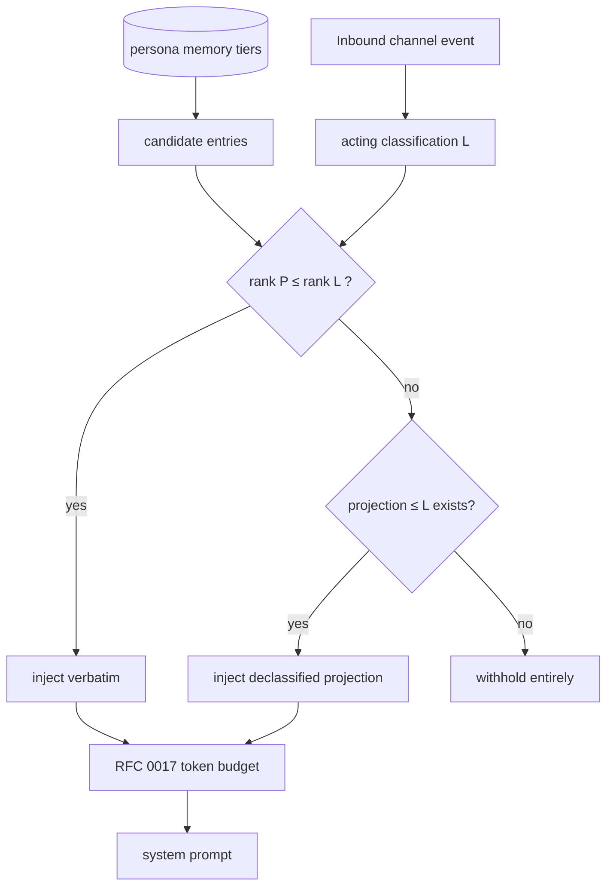

# RFC 0037 — Memory Confidentiality & Channel Classification

**Type**: feature
**Status**: ✅ **Implemented** — v0.3.12, all three phases (the keystone; [PR plan](0037-pr-plan.md) PRs 1–8: lattice + channel classification → wire → memory substrate → the §D hard gate + notes leg + tick floor + §B guard → the §F recall filter ══ the RFC 0049 merge gate → §E projections → the §G tripwire → this closeout, which also decided the two [ISSUE-0115](../issues/ISSUE-0115-rfc0037-section-c-stamping-residuals.md) §C residuals in-place). Live acceptance [MT-PERSONA-CONFIDENTIALITY-001](../manual-tests/MT-PERSONA-CONFIDENTIALITY-001.md) runs at v0.3.12 release-prep; the deterministic backbone is CI-pinned (the confidentiality integration suites + the `EVAL-MEMORY-004` golden).
**Author**: Maksim Khomutov
**Date**: 2026-05-16
**Target**: v0.3.12 (cross-channel persona experience). **Pulled forward** from the v0.4.0 on-ramp per the 2026-07-15 planning decision — this restores the RFC's own original intent (its Motivation §"Why this is a v0.3.x RFC" argues confidentiality is local and v0.3.x-shippable; the [2026-06-04 amendment](../v0.3.x-sequencing.md#amendment-2026-06-04--re-sequence-the-v03x-tail-for-conversation-realism--usefulness-ahead-of-v040) had deferred it to make room for conversation-realism work, now shipped).
**Depends on**: RFC 0011 (Channels — the `channels` table and the `channels.yaml` config surface a classification is added to), RFC 0036 (Persona Verbatim Message Recall — §F retrofits its server-side scoped-search query with the acting-channel classification filter)
**Relates to**: RFC 0034 (Persona Conversational Working Memory — the conversation window, shown in §H to be classification-safe by construction), RFC 0017 (Persona Memory Injection Token Budget — the injection layer the §D hard gate extends), RFC 0005 / RFC 0008 / RFC 0026 (the episodic, notes, and facts memory tiers that gain a protection level), RFC 0020 / RFC 0027 (Interaction Lifecycle / Reflection-Driven Consolidation — where protection levels are stamped and §E projections are generated), RFC 0009 (Agent Identity, Security & Sandboxing — the audit subsystem), RFC 0029 (Personal/Society Storage Split — protection levels must survive the migration to the society store), RFC 0012 (Protocols & Organizations — the *authority* axis and the enforced egress gate that this RFC's logging-only tripwire becomes), RFC 0038 (Persona Concurrent-Context Awareness & Cross-Channel Relay — its §B single-channel-turn guard, which §D and §H rely on, is carved into this RFC's Phase 1 step 6 per Decision #3; its v0.4.0 relay gives cross-channel flow a §D-gated path)

---

## Table of Contents

- [Summary](#summary)
- [Motivation](#motivation)
- [Goals](#goals)
- [Non-Goals](#non-goals)
- [Design / Implementation](#design--implementation)
  - [A. The classification lattice](#a-the-classification-lattice)
  - [B. Channel classification](#b-channel-classification)
  - [C. Memory provenance and protection level](#c-memory-provenance-and-protection-level)
  - [D. The hard gate at memory injection](#d-the-hard-gate-at-memory-injection)
  - [E. Declassification projections](#e-declassification-projections)
  - [F. Recall classification filter](#f-recall-classification-filter)
  - [G. The leak tripwire](#g-the-leak-tripwire)
  - [H. The conversation window is classification-safe by construction](#h-the-conversation-window-is-classification-safe-by-construction)
  - [I. Forward-compatibility with the storage split](#i-forward-compatibility-with-the-storage-split)
- [Security Considerations](#security-considerations)
- [Phased Implementation Plan](#phased-implementation-plan)
- [Files Touched (Estimated)](#files-touched-estimated)
- [Test Strategy](#test-strategy)
- [Open Questions](#open-questions)
- [Decision / Next Steps](#decision--next-steps)
- [Related Documentation](#related-documentation)

---

## Summary

A persona that belongs to several channels accumulates memory derived from
all of them. [RFC 0036](0036-persona-message-recall.md) controls what a
persona may **recall from the channel store** — reads are scoped to the
channels and membership intervals the persona had access to. Nothing
controls what a persona may **say** with what it legitimately learned: a
persona that learned something in a confidential channel can paraphrase
or quote it into a public one. Recall is gated on the way *in*; egress is
not gated on the way *out*.

This RFC adds a **confidentiality axis**:

1. An ordered **classification** (`public` < `internal` < `restricted` <
   `secret`) on every channel — declared in `config/channels.yaml` for
   group channels, defaulted for DMs and threads, and stored on the
   channel store's `channels` table.
2. A **protection level** stamped onto every persona memory entry derived
   from channel content (episodes, facts, notes) — equal to the maximum
   classification across the entry's provenance.
3. A **deterministic hard gate** in the memory-injection layer: when a
   turn's prompt is assembled for a channel of classification `L`, no
   memory entry with a protection level above `L` is injected in
   **verbatim** form.

Because a persona turn is **single-channel** — one inbound event, one
channel, one prompt, one set of candidate actions, all addressed to that
channel (§H) — the hard gate makes *"verbatim confidential memory never
reaches a lower-classified channel's prompt"* a **structural guarantee**,
not a behavioural request that depends on the model complying.

A **declassification projection** mechanism (§E) lets a protected memory
still *inform* the persona at lower classifications in abstracted form —
"you have reason to be cautious about Project X" without the reason — so
the persona can **learn from a confidential channel without leaking it**.
A logging-only **leak tripwire** (§G) observes the residual paraphrase
path.

This RFC is the **confidentiality** half of a two-axis model. The
**authority / integrity** half — a persona reasoning about whether a
*directive* from one context should influence its behaviour in another,
and accepting / adapting / refusing it — is [RFC 0012](0012-protocols-organizations.md),
because authority is only rankable against an organization structure.
Confidentiality is enforceable now, inside a single persona's own memory
store plus channel config, with no organizations, no shared society
store, and no policy engine — which is why it ships in v0.3.x.

## Motivation

### The capability gap

Personas are multi-channel. The demo set alone (`config/agents.yaml`)
puts three personas on a shared `planning` channel, and DM channels open
on demand between any pair. Every channel is first-class and
**unclassified** — `config/channels.yaml` has no notion that one channel
might be more sensitive than another. A persona that discusses an
unannounced reorganization in a leadership DM, then answers a question in
a public channel an hour later, carries the first conversation in its
episodic memory and has no signal that repeating it is a disclosure.

RFC 0036 closed the *read-in* side of channel access: a persona can only
recall channels it was a member of, scoped to its membership intervals,
enforced server-side in SQL. But RFC 0036 is explicit that **rebroadcast
is out of scope** — see its Security Considerations: "verbatim recall
lets a persona lift user A's exact words from channel X and repeat them
into channel Y … recall *is* read access to that text." RFC 0036 leaves
the *say-out* side open by design. This RFC closes it.

### The single-channel-turn property makes this enforceable

A persona turn is driven by exactly one inbound event with exactly one
`channel_id` ([`action_loop.py` `_on_event_inner`](../../agents/persona_runtime/action_loop.py)).
The prompt is assembled once, for that channel; the candidate actions a
turn can emit (`SEND_CHANNEL_MESSAGE`, `USE_TOOL`, `DO_NOTHING`, …) all
resolve against that same channel. A turn cannot read channel A and, in
the same turn, publish to channel B. Information crosses a channel
boundary only by being **written to memory in one turn and read back in a
later turn** — and that later turn re-assembles its prompt from scratch.

That is the property that makes a confidentiality gate *deterministic*
rather than aspirational. If the memory-injection layer withholds
verbatim protected memory whenever the turn's channel is too low, then a
persona acting in a public channel **physically does not have** the
confidential text in its context window. It cannot quote what it was
never shown. The gate does not depend on the model choosing to be
discreet.

### "Learn from it without leaking it"

A hard gate that simply withholds protected memory is *safe* but blunt:
the persona acting in a public channel becomes unable to be *influenced*
at all by what it learned in confidence. The intent is finer — the
persona should be able to *act on* a confidential belief without
*disclosing* it. If it learned in a leadership DM that a project is
likely to be cancelled, it should be able to be appropriately cautious
about that project in a public channel without saying why. That is what
the §E declassification projection delivers: a lower-classified,
abstracted form of a protected memory that carries the *bearing* without
the *content*.

### Why this is a v0.3.x RFC

Confidentiality is **local**. Every mechanism here lives inside one
persona's own `memory.db` (the protection level and projections) or in
channel configuration and the channel store (the classification). It
needs no organization graph, no shared society store, and no decision
policy engine. It is the same class of change as RFC 0034 / 0035 / 0036:
schema columns plus an injection-layer rule.

The **authority** axis is not local — "a directive from context A
outranks a directive from context B" is meaningless without roles and a
hierarchy to rank A and B. That axis, and the *enforced* (blocking)
egress gate, depend on the organization model and ship in
[RFC 0012](0012-protocols-organizations.md) for v0.4.0. This RFC and
RFC 0012 are deliberately split along the line of *what is enforceable
without organizations*.

## Goals

1. An ordered, four-level **classification** is declarable per group
   channel in `config/channels.yaml`, defaulted for DMs and threads, and
   persisted on the channel store's `channels` table.
2. Every persona memory entry derived from channel content (episodes,
   facts, notes) carries a **protection level** equal to the maximum
   classification across its provenance.
3. A **deterministic hard gate** in the memory-injection layer withholds
   verbatim protected memory from any prompt assembled for a channel
   whose classification is below the entry's protection level.
4. Given the single-channel-turn property (§H), the hard gate is a
   **structural guarantee**: verbatim protected memory cannot enter the
   prompt for a lower-classified channel, independent of model behaviour.
5. **Declassification projections** let a protected memory inform the
   persona at lower classifications in abstracted form, so the persona
   can learn from a confidential channel without leaking it.
6. RFC 0036 verbatim recall is retrofitted with an **acting-channel
   classification filter** (§F): recall cannot return a `secret`-channel
   message verbatim into a turn acting in a `public` channel.
7. A logging-only **leak tripwire** (§G) makes the residual paraphrase
   path observable, without blocking — the enforced gate is RFC 0012.
8. No new prompt-injection surface: classified content reaching the model
   still passes the RFC 0034 / RFC 0036 `_format_event` delimiter-escape.

## Non-Goals

- **The authority / integrity axis.** Whether a *directive* issued in one
  context should influence the persona's behaviour in another — and the
  persona accepting, adapting, or refusing it — is
  [RFC 0012](0012-protocols-organizations.md). This RFC governs what
  flows *out* of a context; RFC 0012 governs what flows *in*.
- **An enforced, blocking egress gate.** v0.3.x ships the tripwire as
  **observability only** (§G). Promoting it to a gate that blocks or
  routes a publish to human review is an organizational-policy decision
  (whose policy, what escalation path) and ships in RFC 0012.
- **Persona clearance and membership-time checks.** *Which* channels a
  persona may join — a clearance derived from organizational role — is
  RFC 0012. This RFC classifies channels and protects derived memory; it
  does not change who is configured into a channel.
- **Encryption or at-rest cryptography.** A classification is an
  access-control *label*, not a cryptographic boundary. The channel
  store and `memory.db` are unencrypted as today.
- **Classifying relationship trust *scores*.** A bond's *numeric* trust
  score is not classified; the episodic detail *behind* a bond inherits
  the protection level of its source episode like any other episode. The
  tier's *textual* identity fields are **not** exempt — they follow the
  §C write-through rule (≤ `internal` only), since they cross rooms by
  design.
- **Operator-defined custom lattice levels.** The lattice is the fixed
  four levels of §A in v0.3.x. Extensibility is Open Question #1.
- **Retroactive reclassification.** Changing a channel's classification
  applies going forward. Backfill of pre-existing memory is a one-time
  migration default (§C); re-deriving historical protection levels after
  a later reclassification is out of scope.
- **Recall-store / membership mechanics.** Owned by RFC 0035 / RFC 0036.

## Design / Implementation

### A. The classification lattice

A fixed, totally ordered lattice of four levels:

| Level | Rank | Meaning |
|-------|:----:|---------|
| `public` | 0 | No confidentiality expectation. The safe floor. |
| `internal` | 1 | Ordinary in-org conversation. **The default.** |
| `restricted` | 2 | Sensitive; need-to-know within a subset. |
| `secret` | 3 | Highly sensitive; disclosure is a material harm. |

The only operations the system needs are the total order (`a ≤ b`) and
`max`. A canonical helper — `classification_rank(level) -> int` — is the
single source of the ordering: a Go helper and a Python helper, plus the
SQL-side form §F needs (a registered SQLite function or an inline
`CASE`). All three encode this one ordering and every comparison goes
through one of them; no code compares level strings directly. *(Revised 2026-07-19 — v0.3.12 review items 5/8: "restrictive" flips
direction across the rank helper's uses, so one blanket rule is unsafe.)*
The default splits into **three explicit rules**:

- **(a) Stamping/labeling** — a channel or entry with an *absent* (by
  policy) classification is labeled `internal`, never `public`: a channel
  the operator forgot to classify is confidential-by-default.
- **(b) Acting level at gate/recall time** — an *unknown or absent*
  acting classification resolves to the **`public` floor** (inject/return
  less). This also closes the version-skew window where an older
  orchestrator omits the proto field (proto3 `""`).
- **(c) Entry protection level unknown/unparseable** — the entry is
  **withheld and logged** (treated as above-`secret`): never injectable on
  a corrupted label.

### B. Channel classification

**Config.** `config/channels.yaml` gains an optional `classification`
field per group channel; `schemas/channel.schema.json` gains a matching
`enum` (`public` | `internal` | `restricted` | `secret`) with
`default: internal`. Absent ⇒ `internal`.

```yaml
channels:
  - name: planning
    description: "engineering + product planning discussion"
    classification: internal          # new; default if omitted
    members:
      - id: ember-owl
        respond: when_mentioned
  - name: leadership
    classification: restricted        # need-to-know
    members: [ember-owl]
```

**Channel store.** A channel-store schema migration adds a
`classification TEXT NOT NULL DEFAULT 'internal'` column to the
`channels` table ([`internal/channels/sqlite_schema.go`](../../internal/channels/sqlite_schema.go)):
a new `case` arm in `applyMigration` with its own `migrateV(N-1)ToVN`
function, `channelStoreSchemaVersion` bumped, and `user_version` stamped
inside the migration transaction. RFC 0035 and RFC 0036 have both landed, so the store is at **v10**
today; this RFC's migration is the **next** version (**v11** as of
v0.3.11 — re-verify `channelStoreSchemaVersion` at PR time). If the
ordering shifts, the version number follows; the migration discipline
does not. The migration
backfills every existing channel to `internal`.

- **Group channels** load their declared classification into the
  `channels` row when config is applied.
- **DM channels** (`dm:<a>:<b>`, created on demand by `GetOrCreateDM`)
  are stamped from a new operator knob **`dm_default_classification`**
  in `config/channels.yaml` (default `internal`), and an existing DM may
  be **reclassified** through the same audited reclassification machinery
  as any channel (§Security). *(Added 2026-07-19 — v0.3.12 review item 8:
  with an unconditional `internal` default, the RFC's own leadership-DM
  scenario is protected only against `public` channels and flows freely
  into every `internal` group — the realistic leak. Operators running
  sensitive DMs should raise the default or reclassify per-DM;
  clearance-derived DM levels remain Open Question #2 / RFC 0012.)*
- **Thread replies** (`thread:<message_id>` in the address grammar) need
  no stamping mechanism today: no production path creates a separate
  thread-channel row — replies are rows in the *parent* channel (the
  `thread_id` FK) and carry its classification by construction. The
  store's `CreateChannel` contract does admit a `thread:` row; if one is
  ever created, it copies the parent's classification at creation.
  Either way a thread is never more or less confidential than the
  conversation it forks from.

**On the wire.** The persona runtime needs the acting channel's
classification to run the §D gate. Rather than have the runtime fetch
channel metadata per turn, the orchestrator stamps it onto the channel
event: `ChannelMessageEvent` (`proto/task.proto`) gains a
`classification` string field, populated from the `channels` row when
the event is dispatched. The runtime reads it straight off the event.
**Both delivery paths carry the field** *(added 2026-07-19 — item 8)*: the
proto dispatch path above **and** the REST history responses that feed
on-startup catch-up replay (`agents/channel_catchup.py` builds
`CHANNEL_MESSAGE` events from history JSON and stores episodes directly)
— the message/history response gains the same `classification`, threaded
through catch-up event construction. An event arriving with no
classification on either path takes the §D floor (rule (b) of §A), never
`internal`. A persona's own *autonomous tick* event carries no channel —
covered by the same §D floor rule.

### C. Memory provenance and protection level

Every memory entry that is **derived from channel content** carries a
**protection level**: the maximum classification across the channels its
content came from. A new `agents/memory/migrations.py` migration adds, to
the episodic, facts, and notes tiers:

- `protection_level TEXT NOT NULL DEFAULT 'internal'`
- `source_channel_id TEXT` — the channel the entry was derived from,
  where a single one applies (nullable for synthesized notes).

Where each tier gets its protection level:

- **Interactions** (RFC 0020). An interaction is scoped to exactly one
  channel ([RFC 0020 §G](0020-interaction-lifecycle.md)). The interaction
  record (`agents/memory/interactions.py`) captures the channel's
  classification **at interaction-open** from the channel event (§B). The
  interaction is the single point of truth that the episodic and facts
  tiers below inherit from — so classification is read once per
  interaction, not re-derived per episode or per fact.
- **Episodes** (RFC 0005 / RFC 0008). An episode consolidates one
  interaction; its `protection_level` is the interaction's captured
  classification.
- **Facts** (RFC 0026). A fact is extracted from one interaction; its
  `protection_level` is likewise the interaction's classification. The
  extractor stamps it unconditionally — there is no path that writes a
  fact without a protection level.
- **Notes** (agent-authored prose). A note is written *during a turn*. By
  the §D hard gate, a turn acting in a channel of classification `L` only
  ever has memory with protection level `≤ L` in its context, plus that
  channel's own content (`= L`). A note authored in that turn therefore
  cannot contain anything above `L`, and is stamped `protection_level =
  L`. This is a clean consequence of the gate — **and it presumes the
  gate covers the tool path too** (§D read surfaces; an ungated
  `recall_notes` would let an above-`L` note enter the turn's context and
  break this argument). **`update_note` re-stamps** to
  `max(existing protection_level, acting L)` — an edit never lowers a
  note's level *(added 2026-07-19 — item 6)*.
- **Relationship identity fields** (name/role/prefs and `rel.notes`
  prose, written by the F-7 identity write-through and rendered into
  *every* room's prompt). *(Added 2026-07-19 — item 8: this tier is
  deliberately cross-room and previously carried no protection level —
  an ungated egress surface: a role learned in a `secret` channel would
  surface everywhere.)* Rule: the **write-through proceeds only when the
  acting classification is ≤ `internal`**; in a `restricted`/`secret`
  turn it falls back to a room-scoped note (which *is* stamped and
  gated). The smallest rule that preserves the structural guarantee
  without stamping the relationship schema; revisit under RFC 0012.
- **Relationship bonds (trust scores).** Out of scope (see Non-Goals).
  The numeric trust score is unclassified; the episodic detail behind it
  is an episode and is protected as one.

**Migration backfill.** *(Revised 2026-07-29 — PR 8 closeout,
[ISSUE-0115](../issues/ISSUE-0115-rfc0037-section-c-stamping-residuals.md)
residual (b). The draft specified backfilling each entry from its
recorded source channel's classification where resolvable, with the
facts leg joining through the episode's interaction; **the shipped v16
migration performs no such join** — it applies a blanket `internal`
column DEFAULT. The two are provably equivalent, and the shipped form is
better argued: channel classification lives in the orchestrator's
channel store, which the persona-memory database cannot reach, and
channel-store migration v11 backfills every pre-existing channel to
`internal` — so the join would have resolved `internal` for every row it
could resolve at all.)* Pre-existing memory has no protection level; the
migration backfills every row to the `internal` default. That resolves
the pre-existing case consistently — neither silently `public` (a
disclosure) nor silently `secret` (which would withhold a persona's
entire history from itself). **Notes are the honest exception** *(item
8)*: notes carry no channel provenance at all today, so *every*
pre-existing note backfills to `internal` — including notes authored in
`restricted`/`secret` turns. That residual under-protection is an
**accepted, documented risk** (superseded as notes are rewritten under
the gate); operators with sensitive histories may use the one-time
`PERSATRIX_NOTES_BACKFILL_PROTECTION_LEVEL` flag (shipped with the PR 4
notes leg — honoured only at the migration moment, vocabulary-validated,
inert afterwards) to backfill all pre-migration notes at a chosen level
instead.

**Upward reclassification across an open interaction.** *(Decided
2026-07-29 — PR 8 closeout,
[ISSUE-0115](../issues/ISSUE-0115-rfc0037-section-c-stamping-residuals.md)
residual (c).)* The frozen-at-open capture means an interaction open
across an **upward** reclassification consolidates its post-raise turns
into rows stamped at the *pre-raise* level — a live case the
retroactive-reclassification Non-Goal (rows written *before* the raise)
does not cover. **v0.3.12 accepts and documents this posture**: the
stamp is the level the participants were *promised when the conversation
began*, the window is bounded by the interaction-close triggers (idle
gap, turn cap, vote/rotation close), operators raising a level
mid-conversation can close the open interaction first (an idle gap or
any bridge turn), and the §G tripwire audit trail is the detection path
for the residue. The alternative that makes the stamp truthful —
**close-on-reclassify**, splitting the interaction at the boundary via
the RFC 0030 wire-rotation seam so each half stamps at its own level —
is recorded here as the upgrade path if operational evidence (tripwire
hits attributable to this window) ever justifies the machinery; it is
deliberately not built speculatively.

**Synthesized (multi-source) entries.** *(Added 2026-07-19 — v0.3.12
review decision item 3.)* The mechanics above are single-interaction; the
[RFC 0049](0049-memory-consolidation-gradient.md) §F cross-scope pump
(v0.4.0, Phase 2 of that RFC) synthesizes one L2 entry from **many**
interactions across rooms. **This section owns the stamping rule for both
arities**; RFC 0049 §F and the [RFC 0027 amendment](0027-amendment-cross-scope-consolidation.md)
cite it rather than restating it:

1. **Single-source** (unchanged): the source interaction's captured
   classification; scalar `source_channel_id`.
2. **Consolidation-derived**: `protection_level = max` over *all*
   contributing sources' levels, **enforced at the memory write API** —
   never left to the pump's LLM call. `source_channel_id` is `NULL`;
   provenance is recorded in a nullable **`provenance_json`** column
   (list of contributing channel ids) added by this same §C migration so
   the v0.4.0 pump needs no second schema pass.
3. **Supersession restamps.** The implemented facts tier is
   latest-asserted-wins (`_facts_supersede.py`); that extends to
   classification — a superseding assertion restamps the row from *its
   own* source, up or down. **Reinforcement** (`_facts_reinforce.py`)
   never lowers a level.
4. **Independent corroboration does not ratchet.** `max` applies to what
   a synthesis *derived from its inputs*. A proposition independently
   asserted in a lower-classified channel may be captured as a distinct
   entry stamped at that lower level — one `restricted` corroboration
   must not permanently ratchet public knowledge upward.

### D. The hard gate at memory injection

The memory-injection layer ([`memory_context.py`](../../agents/persona_runtime/memory_context.py),
budgeted per [RFC 0017](0017-persona-memory-injection-budget.md)) gains
one filter, applied to every tier that injects channel-derived memory
(episodic recall, channel-history summary, facts, notes) **before** the
RFC 0017 token budget is applied:

```
let L = classification of the turn's acting channel        (from §B)
for each candidate memory entry E with protection level P:
    if rank(P) <= rank(L):   inject E in full
    else:                    inject the best declassification
                             projection of E with level <= L (§E),
                             or — if none exists — withhold E entirely
```



The filter is **deterministic** and runs in the runtime before any LLM
call. The model never sees withheld content and cannot request it — there
is no tool or argument that overrides the acting classification, exactly
as RFC 0036 binds the recall scope server-side and not from LLM input.

**The gate covers every persona-side read surface** *(added 2026-07-19 —
v0.3.12 review item 6: the always-dispatchable `recall_notes` tool
searched all notes unfiltered, returning protected notes verbatim into a
public turn's tool result — straight past this gate)*: (1) the
prompt-assembly tiers (`memory_context.py`, this section); (2)
**`recall_notes`** — the notes query gains a non-optional
`protection_level ≤ rank(L)` predicate reading the
`classification_scope`; (3) `recall_channel_messages` (§F). A read
surface added later joins this list or it is a gate bypass by
construction.

**The structural guarantee.** Combine the gate with the single-channel-
turn property (§H): a turn acting in channel `C` assembles exactly one
prompt, gated to `C`'s classification, and can publish only to `C`.
Therefore verbatim memory of protection level `P` can reach a channel of
classification `L < P` only across *separate* turns — and every separate
turn re-runs this gate. There is no path by which verbatim protected
memory enters the prompt of a lower-classified channel. This is the
load-bearing guarantee of the RFC.

> **Implementation note — single-channel-turn is assumed, not yet
> enforced.** The clause "can publish only to `C`" describes the
> *intended* runtime, not the code today: `SEND_CHANNEL_MESSAGE` carries
> its own `channel_id` payload and `validate_action_payload`
> ([`action_validation.py`](../../agents/persona_runtime/action_validation.py))
> checks only that it is non-empty — not that it equals the turn's
> inbound channel. A turn can therefore publish to any channel the
> persona belongs to, and this gate — which keys on the *inbound*
> channel — would not catch a leak on that path.
> [RFC 0038](0038-concurrent-context-awareness-relay.md) §B promotes
> single-channel-turn to a code-enforced invariant. **Per the 2026-07-19
> decision, that §B guard is carved into this RFC's own v0.3.12 plan**
> (Phase 1 step 6; Decision #3) — so the guarantee is delivered by this
> RFC's Phase 1, not deferred to RFC 0038. The §G tripwire remains the
> destination-aware backstop for the residual paraphrase path.

**The acting-classification scope — total coverage.** *(Restated
2026-07-19 — v0.3.12 review item 5: the original text defined an acting
level for only 2 of the 9 `EventType` members, while
`_inject_memory_context` runs for every one.)* The rule is by
acting-context **class**, not event name:

- **(a)** the event carries a `channel_id` and a §B classification → `L`
  is read off the event;
- **(b)** *any* turn without a classified acting channel — `TICK`,
  `TASK_ASSIGNED` (workflow tasks), `SUB_AGENT_COMPLETED`, `APPROVAL_*`,
  `AGENT_JOINED`/`AGENT_LEFT`, chat-façade events with
  `channel_id=None`, and replayed events missing classification — takes
  the **`public` floor**. These are exactly the tick-shaped turns that
  can emit a `SEND_CHANNEL_MESSAGE` anywhere, so the tick rationale
  applies to the whole class.

**Mechanism.** `on_event` enters a **`classification_scope(L)`** —
a turn-scoped contextvar, the same shape as the shipped ISSUE-0081
`session_scope` — set from the trusted event/floor resolution and
**never from LLM input**. Every consumer reads it: the §D injection
filter, the §F recall binding, `recall_notes` gating, `store_note` /
`update_note` stamping (§C), and the §G manifest. (The RFC 0036
per-process closure cannot carry a per-turn value — `wire_recall_tools`
binds `agent_id` once at startup; the contextvar is the seam that
preserves the not-LLM-controllable property per turn.)

A positive-list unit test asserts **every `EventType` member resolves to
a defined acting level** (the `episode_routing` frozenset precedent), so
a future event type forces a conscious choice. Open Question #3's
floor-softening now applies to this whole channel-less class.

### E. Declassification projections

A hard gate alone makes a persona *amnesiac* below a memory's level. A
**declassification projection** restores the *bearing* without the
*content*: a lower-classified, abstracted restatement of a protected
memory.

A new `memory_projections` table (same `agents/memory/migrations.py`
migration) holds zero or more projections per protected memory entry:

| Column | Meaning |
|--------|---------|
| `entry_id`, `entry_tier` | The protected episode / fact / note. |
| `level` | The projection's own (lower) classification. |
| `text` | The abstracted restatement, safe at `level`. |

The §D gate, when it must withhold an entry `E`, selects the projection
of `E` with the **highest `level` that is still `≤ L`** and injects that
instead; if `E` has no projection at or below `L`, `E` is withheld
entirely.

**Where projections come from.** Interaction consolidation already makes
an LLM call to summarize an interaction (RFC 0020 close;
[RFC 0027](0027-reflection-driven-consolidation.md) reflection). For a
protected interaction, that same call is asked to *also* produce a
one-line declassified projection at each lower level — no new LLM call,
one extra structured field on a call that already happens. A projection
is therefore best-effort: it is generated by the model, and a model can
abstract imperfectly.

**The honest boundary.** The deterministic guarantee of this RFC is §D's
withholding of **verbatim** protected memory. A projection is *not* part
of that guarantee — it is a best-effort affordance so the persona is
informed rather than amnesiac. A projection that over-discloses is a soft
failure, caught (not prevented) by the §G tripwire. This split is stated
plainly so reviewers do not over-trust projections: **verbatim text is
gated; abstractions are best-effort.** Phase 2 ships projections; Phase 1
ships §D with withhold-only behaviour and is already correct and safe
without them — just blunter.

### F. Recall classification filter

[RFC 0036](0036-persona-message-recall.md) gives a persona a
`recall_channel_messages` tool whose server-side query returns verbatim
messages from every channel the persona was a member of. That scope is
correct for *read access* but is **blind to the acting channel**: a
persona acting in a `public` channel could recall, verbatim, a message
from a `secret` channel it legitimately belongs to — a direct egress of
classified text into a lower context, straight past §D (which gates
*memory*, while recall reads the *channel store*).

This RFC retrofits the RFC 0036 scoped-search query
(`internal/channels/sqlite_search.go` §C — created by RFC 0036's implementation)
with one additional, non-optional clause:

```sql
   -- ... existing membership-interval EXISTS clause (RFC 0036 §C) ...
   AND (SELECT classification_rank(c.classification)
          FROM channels c WHERE c.id = m.channel_id)
       <= classification_rank(?)        -- the acting channel's level
```

`classification_rank` here is the §A lattice ordinal evaluated SQL-side.
It is **not** the Go/Python helper called from SQL — SQLite has no
implicit access to that. It is realised as either a SQLite
application-defined function registered on the channel-store connection
at open time, or, equivalently, an inline `CASE` expression over the four
level strings. Whichever form is chosen, it encodes the *same* §A
ordering as the Go and Python `classification_rank` helpers — the order
is defined once conceptually (§A) and no code path, SQL included,
compares level strings directly.

**The retrofit point** *(specified 2026-07-19 — item 8)*: the clause is
appended in `RecallMessages` (alongside the existing `narrow` filter, on
**both** the FTS and LIKE paths) — **not** inside the shared
`membershipEpochScope` fragment, which the scoped history-window query
deliberately shares "so the two cannot drift". The window consumer is
exempt by §H (it reads only the turn's own channel, always `= L`), so
gating it would be wrong; the shared-fragment comment in
`sqlite_search.go` is updated to say the *membership+epoch* predicate
stays provably identical while recall alone adds classification.

The acting channel's classification is bound server-side from a new
required parameter on the recall endpoint
(`POST /api/v1/personas/{participant_id}/recall`), and the
`recall_channel_messages` tool reads the **turn's
`classification_scope`** (§D) when binding it — the RFC 0036 closure
binds `agent_id` once per process and cannot carry a per-turn value, so
the contextvar is the binding seam; it is set from the trusted
event/floor resolution and never LLM-supplied, preserving RFC 0036's
trust property *(mechanism corrected 2026-07-19 — item 8)*. A recall result
can never be more confidential than the channel the persona is acting in.

Recall while acting on an autonomous **tick** uses the §D `public` floor.

### G. The leak tripwire

§D and §F close the *verbatim* paths. The residual path is the persona
**paraphrasing** — restating a protected memory, or over-sharing a §E
projection, in its own generated words. This cannot be prevented
deterministically (it is the model's output, in novel wording) and a
*blocking* response to it is an organizational-policy decision deferred
to RFC 0012. v0.3.x ships **observability**:

**The plumbing** *(specified 2026-07-19 — item 8: the injected-entry set
was previously discarded at injection time and the transport publisher
has no turn context)*: `MemoryInjectionResult` widens into a per-turn
**injection manifest** — `(tier, entry_id, protection_level,
normalized-span hashes)` — populated by `_inject_memory_context`,
carried on the turn's `classification_scope`, and threaded via
`DispatchContext` to **`ActionExecutor`**, where the tripwire runs
(the shared `channel_publisher.py` HTTP transport stays context-free by
design). Target-classification resolution is simple **because of the §B
single-channel-turn guard** (Phase 1 step 6): a non-tick turn publishes
only to its acting channel (target `L` = acting `L`, already known), and
a tick/channel-less turn's context is `public`-floor-gated so its
manifest can contain nothing above any target — the cross-channel case
is vacuous by construction.

For each manifest entry with protection level above the target
channel's classification, the tripwire checks the outgoing text for a
verbatim span of that entry's content (a normalized substring match over
spans above a length threshold — lexical, not semantic). On a hit, emit an RFC 0009
audit event (`channel.confidentiality_tripwire`) recording the persona,
the target channel and its classification, and the implicated entry's
protection level — **not** the leaked text itself. The message is **not
blocked**. The tripwire is a smoke detector, not a lock.

Because §D already keeps verbatim protected memory out of the prompt, a
*true* verbatim tripwire hit on a sub-`L` channel indicates a **bug** —
an entry stamped with the wrong protection level, a projection that
copied source text verbatim, or a missed injection path — which is
exactly the class of defect this RFC most needs surfaced in early
operation. Tuning the span threshold waits until tripwire telemetry from
real workloads exists; it is not guessed here and not put on a calendar.

### H. The conversation window is classification-safe by construction

[RFC 0034](0034-persona-conversational-working-memory.md)'s conversation
window reconstructs the LLM `messages` array from the **last N messages
of the turn's own channel** — `event.channel_id` and no other. A turn
acting in channel `C` therefore only ever sees `C`'s own transcript in
its window, and `C`'s transcript is by definition at `C`'s
classification. The window can neither raise nor lower the confidentiality
of what the turn sees; it needs **no gate and no change**. This section
exists to record that the analysis was done — the window is the obvious
place to suspect a cross-channel leak, and it is in fact safe because it
is single-channel, the same property §D and §H depend on throughout.

### I. Forward-compatibility with the storage split

[RFC 0029](0029-personal-society-storage-split.md) moves persona memory
toward a personal/society split with a Postgres society backend in
v0.4.0. The `protection_level`, `source_channel_id`, and
`memory_projections` columns introduced here are ordinary tier columns
and travel with the episodic / facts / notes tiers through that
migration unchanged — protection level is **a property of the memory
entry**, not of the storage engine. RFC 0029's facade work must carry
these columns; this is noted so the storage split does not silently drop
them. No society-store schema beyond what RFC 0029 already plans is
required by this RFC.

## Security Considerations

- **The verbatim guarantee is deterministic; the abstraction is not.**
  §D withholding of verbatim protected memory, combined with the
  single-channel-turn property (§H), is a structural guarantee that does
  not depend on model behaviour. §E declassification projections are
  LLM-generated and **best-effort** — a projection may abstract
  imperfectly. Reviewers must not conflate the two: *verbatim text is
  gated; abstractions are best-effort and observed by the §G tripwire.*
- **Fail-closed on misconfiguration — in the right direction.** The §A
  three-way rule: absent-by-policy labels → `internal`
  (confidential-by-default); unknown *acting* level → the `public` floor
  (inject less); unknown *entry* level → withhold and log. "Restrictive"
  means less disclosure on the labeling side and less injection on the
  gate side.
- **The gate is not LLM-controllable.** The acting classification comes
  from the channel event (§B), bound in the runtime; the recall filter's
  acting classification is bound server-side (§F). There is no tool, no
  argument, and no prompt phrasing that raises a turn's effective
  classification. This mirrors RFC 0036's closure-bound scope.
- **Recall egress is closed (§F).** Before this RFC, RFC 0036 verbatim
  recall could return `secret`-channel text into a `public`-channel turn.
  The §F classification clause is non-optional and server-side; recall
  output can never exceed the acting channel's classification.
- **Residual paraphrase risk is documented, not eliminated.** A persona
  can still restate a protected memory in novel words (§G). v0.3.x makes
  this **observable** via the tripwire; *blocking* it is RFC 0012's
  enforced egress gate. This residual risk is explicitly accepted for
  v0.3.x and is the reason RFC 0012 exists.
- **Correctness depends on the protection level being stamped right.**
  The gate is only as good as the `protection_level` on each entry. §C
  routes channel-derived memory through **two stamped write choke
  points** — the interaction record's captured classification
  (single-source entries) and the consolidation write API's enforced
  `max` (synthesized entries, §C "Synthesized (multi-source) entries") —
  so there are two places to audit, not one per tier. The tripwire (§G)
  is the backstop that surfaces a mis-stamp in operation.
- **Prompt injection is unchanged.** Classified content that *is*
  injected (at or below the acting level, or as a projection) still
  passes the RFC 0034 / RFC 0036 `_format_event` delimiter-escape
  ([`prompt_assembly.py`](../../agents/persona_runtime/prompt_assembly.py)).
  This RFC narrows *what* is injected; it does not change the sanitization
  *of* what is injected.
- **Audit.** Channel reclassification and every tripwire hit emit RFC 0009
  audit events. Reclassification is a security-relevant configuration
  change and leaves a trail; the tripwire trail records metadata only,
  never the implicated text, so the audit log does not itself become a
  confidentiality sink.
- **Backfill is conservative-neutral.** The §C migration backfills to
  `internal`, not `public` — pre-existing memory is never silently
  declassified to the public floor by the act of upgrading.

## Phased Implementation Plan

### Phase 1: Classification, protection level, the hard gate, and the recall filter

The complete **deterministic** confidentiality boundary. Safe and correct
on its own; §E projections only make it less blunt.

1. **Lattice helper** — `classification_rank` in Go and Python, single
   source each side; fail-closed on unknown input.
2. **Channel classification** — `classification` field in
   `config/channels.yaml` + `schemas/channel.schema.json`; the channel-store
   classification migration (next version, v11 — §B) adding
   `channels.classification`; DM-creation stamping from
   `dm_default_classification` + the thread inheritance rule (§B);
   `classification` on `ChannelMessageEvent`
   (`proto/task.proto`) and the dispatch path.
3. **Protection level** — `agents/memory/migrations.py` migration adding
   `protection_level` / `source_channel_id` / nullable `provenance_json`
   (the §C multi-source shape, created now so the v0.4.0 pump needs no
   second migration) to the episodic, facts, and notes tiers, plus the
   `memory_projections` table (created here, used in Phase 2);
   interaction-open classification capture (§C); episodic and facts
   consolidation stamping; migration backfill.
4. **The hard gate** — the §D filter in `memory_context.py`, with
   withhold-only behaviour (no projections yet); the autonomous-tick
   `public` floor.
5. **Recall classification filter** — the §F clause in
   `internal/channels/sqlite_search.go`, the new required acting-channel
   parameter on the recall endpoint, and the `recall_channel_messages`
   tool passing the event classification.
6. **Single-channel-turn guard (carved from RFC 0038 §B — Decision #3)**
   — an event-aware post-parse check in `_on_event_inner` (sibling of
   `synthesize_channel_reply`; the pure `validate_action_payload` cannot
   see the event): a non-tick `SEND_CHANNEL_MESSAGE` whose `channel_id`
   differs from the acting channel is replaced with `DO_NOTHING` +
   WARNING log (audit event wire-up is a tracked follow-up). Tick turns
   may publish anywhere — their injection is already gated to the §D
   `public` floor. Lands with/after step 4, which its tick exception
   presumes.
7. Unit, migration, and integration tests per the Test Strategy.

**PR-ordering rule** *(item 8)*: note-stamping (step 3's notes leg) lands
in the same PR as — or after — the §D gate **and** the `recall_notes`
gating (§D read surfaces), because the §C note-stamp soundness argument
presumes both. No channel may be operator-classified above `internal`
before the full Phase-1 set ships (all steps land dark within one
release, so the window is development-only).

Dependencies: **RFC 0011** (the `channels` table). **RFC 0036 is
Implemented (v0.3.9)**, so step 5 retrofits the existing scoped-search
query (`internal/channels/sqlite_search.go`) and the existing recall
endpoint directly; steps 1–4 are independent of RFC 0036.

### Phase 2: Declassification projections

1. `memory_projections` writes: the interaction-consolidation LLM call
   (RFC 0020 close / RFC 0027 reflection) extended to emit one-line
   projections at each lower level.
2. The §D gate's projection-selection branch (highest projection `≤ L`).
3. Integration test: a persona acting in a `public` channel is correctly
   *informed* by — but does not verbatim-disclose — a `restricted`
   memory, via its projection.

Dependencies: Phase 1.

### Phase 3: The leak tripwire

1. The §G tripwire in `channel_publisher.py`; the
   `channel.confidentiality_tripwire` RFC 0009 audit event in
   `internal/security/audit_event.go`.
2. Tripwire-rate instrumentation alongside the existing persona metrics.
3. Integration test: a deliberate verbatim paraphrase is detected and
   audited; a benign message produces no hit.

Dependencies: Phase 1. Independent of Phase 2 and separately reviewable.

## Files Touched (Estimated)

| Component | Files | Change |
|-----------|-------|--------|
| Go orchestrator | `internal/channels/sqlite_schema.go` (version const + history) + `internal/channels/sqlite_migrations.go` (the `migrateV10ToV11` arm) | classification migration (next version, v11 — §B): `channels.classification` column + backfill; bump `channelStoreSchemaVersion` |
| Go orchestrator | `internal/channels/sqlite_dm.go` (`GetOrCreateDM`) | Stamp the §B `dm_default_classification` knob (default `internal`) on DM creation; thread replies are rows in the parent channel — no production path creates a separate thread-channel row — so they inherit the parent classification by construction (§B) |
| Go orchestrator | `internal/channels/sqlite_search.go` | §F acting-channel classification clause on the RFC 0036 scoped query |
| Go orchestrator | `internal/server/persona_recall_handlers.go`, `channel_types.go` | Required acting-channel parameter on the recall endpoint (`channel_handlers.go` is at the size cap — the recall handler was carved into `persona_recall_handlers.go`) |
| Go orchestrator | `internal/channels/` (event dispatch), `internal/security/audit_event.go` | `classification` on dispatched channel events; reclassification + `channel.confidentiality_tripwire` audit events |
| Go orchestrator | `internal/channels/classification.go` (new) | `classification_rank` helper, fail-closed |
| Protos | `proto/task.proto` | `classification` field on `ChannelMessageEvent` |
| Python agents | `agents/memory/migrations.py` | `protection_level` / `source_channel_id` on episodic/facts/notes; `memory_projections` table |
| Python agents | `agents/memory/interactions.py` + `agents/memory/interaction_types.py` | Capture channel classification at interaction-open (frozen-at-open, in-memory until close — mirrors the `session_id` precedent) |
| Python agents | `agents/memory/episodic.py`, `agents/memory/facts.py`, `agents/memory/notes.py` | Stamp / read `protection_level` |
| Python agents | `agents/persona_runtime/memory_context.py` | The §D hard gate + projection selection; `MemoryInjectionResult` → injection manifest (§G) |
| Python agents | `agents/persona_runtime/action_loop.py` | Enter `classification_scope(L)` per turn (§D); thread the injection manifest |
| Python agents | `agents/tools/builtin.py`, `agents/memory/_notes_recall.py` | Gated `recall_notes` (§D read surfaces); `update_note` re-stamp (§C) |
| Python agents | `agents/tools/identity_write_through.py` | §C ≤-`internal` write-through rule (room-scoped-note fallback) |
| Python agents | `agents/action_executor.py`, `agents/channel_wire_metadata.py` | §G tripwire re-sited in `ActionExecutor`; manifest on `DispatchContext` |
| Python agents | `agents/server_servicers.py`, `agents/channel_catchup.py` | Classification lifted off both delivery paths (§B); catch-up replay stamping |
| Go orchestrator | REST message/history response builder (`internal/server/`) | `classification` on history responses for catch-up replay (§B) |
| Python agents | `agents/persona_runtime/classification.py` (new) | Python `classification_rank` helper |
| Python agents | `agents/channel_publisher.py` | §G leak tripwire |
| Python agents | `agents/tools/recall.py` | Pass acting-channel classification to the recall endpoint |
| Python agents | `agents/persona_runtime/summarize_close.py` (+ `fact_envelope.py` / `fact_extractor.py`) | Emit §E projections during the RFC 0020 close-consolidation LLM call (RFC 0027 reflection is a future second producer — proposed, not shipped) |
| Config / schema | `config/channels.yaml`, `schemas/channel.schema.json` | `classification` field + `enum`; the `dm_default_classification` knob (§B) |
| Docs | `docs/guides/persona-agents.md`, `docs/diagrams/memory-architecture.md` | Document classification, protection levels, the two-axis model |
| Tests | `internal/channels/*_test.go`, `tests/unit/python/`, `tests/integration/` | Per Test Strategy (+ an RFC 0044 golden-trace recipe for MT-PERSONA-CONFIDENTIALITY-001) |

## Test Strategy

- **Unit tests**:
  - `classification_rank` total order and fail-closed-to-`internal` on
    unknown input, both Go and Python.
  - The §D gate: an entry with `protection_level` at, below, and above
    the acting classification is injected fully, injected fully, and
    withheld respectively; with a projection present, the highest
    projection `≤ L` is selected; the autonomous-tick `public` floor.
  - The §C stamping: an episode and a fact from a `restricted`
    interaction are stamped `restricted`; a note authored in an
    `internal` turn is stamped `internal`.
  - The §F query: a `secret`-channel message is excluded from a recall
    acting in a `public` channel and included from one acting in a
    `secret` channel; the clause composes with the RFC 0036 membership
    join.
  - The §G tripwire fires on a verbatim span and not on a benign
    message; the audit event carries metadata and not the text.
  - *(v0.3.12 review items 5/6/8)*: a positive-list test that every
    `EventType` member resolves to a defined acting level; tool-path
    gating (`recall_notes` withholds an above-`L` note; `update_note`
    re-stamps upward); the §A three-way fail directions (unknown acting
    → `public` floor; unknown entry level → withheld+logged); catch-up
    replay stamps replayed `secret`-channel episodes correctly.
- **Migration tests**: the classification migration (next version,
  vN → vN+1 — §B) adds `channels.classification` and
  backfills to `internal`; the memory migration adds the columns and
  `memory_projections` table and backfills `protection_level` from
  recorded source channels where present, `internal` otherwise; both
  migrations are idempotent on reopen and stamp `user_version` inside the
  transaction.
- **Integration tests**:
  - A persona learns a fact in a `restricted` channel, then acts in a
    `public` channel: the verbatim fact is absent from the public-turn
    prompt; with Phase 2, its projection is present.
  - End-to-end recall: a persona that belongs to a `secret` channel
    cannot recall its messages while acting in a `public` channel, and
    can while acting in the `secret` channel.
- **Manual tests**: a new `MT-PERSONA-CONFIDENTIALITY-001` — a persona on
  both a `restricted` leadership channel and the `public` `planning`
  channel is asked, in `planning`, a question whose answer it knows only
  from the leadership channel; it must decline to disclose while still
  acting consistently with what it knows (the §E "learn from it without
  leaking it" behaviour).

## Open Questions

1. **Operator-defined lattice levels.** The lattice is fixed at four
   levels (§A). Proposed resolution: ship the fixed lattice — four levels
   cover the v0.3.x channel use case, and a configurable lattice is
   complexity with no current consumer. Revisit if RFC 0012's
   organizational clearances need finer gradations.
2. **DM classification.** DMs are stamped `internal` at creation (§B).
   Once RFC 0012 introduces per-persona clearance, a DM could instead
   take `min` of its two participants' clearances. Proposed resolution:
   `internal` in v0.3.x; revisit in RFC 0012 when clearance exists.
3. **Channel-less-turn gate floor.** §D gates every channel-less turn
   (the whole class — ticks, workflow tasks, approvals, chat-façade
   events; item 5) to `public`. A softer rule — the `min` classification
   across the persona's channels — is less amnesiac but needs a
   persona→channels mapping those events do not carry today. Proposed
   resolution: ship the `public` floor; reconsider if over-withholding
   is observed to matter.
4. **Projection generation cost.** §E adds structured output to the
   consolidation LLM call. If a future consolidation path is made
   non-LLM, projections would need another source. Proposed resolution:
   acceptable while consolidation is LLM-based; flagged for whoever
   revisits consolidation.
5. **Tripwire span threshold.** §G matches verbatim spans above a length
   threshold. The threshold is not specified here. Proposed resolution:
   ship a conservative default and tune when tripwire telemetry from real
   workloads exists — not on a fixed schedule.

## Decision / Next Steps

1. Review this RFC alongside [RFC 0012](0012-protocols-organizations.md):
   the two are the confidentiality and authority halves of one model and
   should be read together, even though they ship in different versions.
2. ✅ **Satisfied** — [RFC 0036](0036-persona-message-recall.md) is
   Implemented (v0.3.9); the §F recall filter retrofits its existing
   query and endpoint. Phase 1 steps 1–4 have no RFC 0036 dependency.
3. ✅ **Resolved 2026-07-19 — the [RFC 0038](0038-concurrent-context-awareness-relay.md)
   §B single-channel-turn guard is carved INTO this RFC's v0.3.12 plan**
   (Phase 1 step 6 below), since RFC 0038 as a whole stays out of
   v0.3.12. §D's structural guarantee is contingent on the guard, so it
   lands with/after the §D-gate PR. The guard follows the 0038 §B spec
   exactly (reject a non-tick `SEND_CHANNEL_MESSAGE` whose `channel_id`
   differs from the acting channel; tick exception per the §D `public`
   floor) so the eventual RFC 0038 relay (§E, v0.4.0+) extends rather
   than amends it. The `channel.cross_channel_publish_rejected` audit
   event ships **WARNING-log-first** — the agent-side RFC 0009 audit
   emission path is not yet wired (`action_loop.py` notes it as the
   orchestrator's responsibility); the audit wire-up is a tracked
   follow-up, not silent PR growth.
4. Implement Phase 1 (the deterministic boundary), then Phase 2
   (projections — the "learn from it" affordance), then Phase 3 (the
   tripwire). Phase 1 is safe and shippable without Phases 2–3.
5. Create `docs/rfcs/0037-pr-plan.md` with PR slices once this RFC is
   accepted.
6. Regenerate [INDEX.md](INDEX.md) via `make rfcs`.

## Related Documentation

- [RFC 0012 — Protocols & Organizations](0012-protocols-organizations.md) — the *authority / integrity* axis and the enforced egress gate; the other half of the two-axis model.
- [RFC 0036 — Persona Verbatim Message Recall](0036-persona-message-recall.md) — the recall query §F retrofits; the egress side this RFC closes.
- [RFC 0034 — Persona Conversational Working Memory](0034-persona-conversational-working-memory.md) — the conversation window, shown classification-safe in §H.
- [RFC 0038 — Persona Concurrent-Context Awareness & Cross-Channel Relay](0038-concurrent-context-awareness-relay.md) — enforces the single-channel-turn property §D and §H assume; routes deliberate cross-channel flow through the §D gate.
- [RFC 0011 — Channels & Internal Agent Messaging](0011-channels-bridges.md) — the `channels` table and `channels.yaml` config surface.
- [RFC 0017 — Persona Memory Injection Token Budget](0017-persona-memory-injection-budget.md) — the injection layer the §D gate extends.
- [RFC 0020 — Interaction Lifecycle](0020-interaction-lifecycle.md) / [RFC 0027 — Reflection-Driven Consolidation](0027-reflection-driven-consolidation.md) — where protection levels are stamped and projections generated.
- [RFC 0026 — Declarative Facts Tier](0026-declarative-facts-tier.md) / [RFC 0005](0005-persona-agent-memory.md) / [RFC 0008](0008-agent-memory-context-optimization.md) — the memory tiers that gain a protection level.
- [RFC 0029 — Personal/Society Storage Split](0029-personal-society-storage-split.md) — protection levels must survive the migration to the society store (§I).
- [RFC 0009 — Agent Identity, Security & Sandboxing](0009-security-sandboxing.md) — the audit subsystem.
- [Architecture spec](../ai-agents-orchestration-spec.md), [Extension spec](../persatrix-extension-spec.md).
