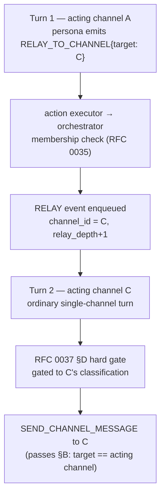

# RFC 0038 — Persona Concurrent-Context Awareness & Cross-Channel Relay

**Type**: architecture
**Status**: 📋 Proposed
**Author**: Maksim Khomutov
**Date**: 2026-05-16
**Target**: v0.4.0 (on-ramp — cross-channel substrate for organizations; deferred from v0.3.x per the [2026-06-04 sequencing amendment](../v0.3.x-sequencing.md#amendment-2026-06-04--re-sequence-the-v03x-tail-for-conversation-realism--usefulness-ahead-of-v040))
**Depends on**: RFC 0011 (Channels — the channel surface, the event/action types, and the durable message store), RFC 0034 (Persona Conversational Working Memory — the conversation window this RFC generalises to multi-channel), RFC 0035 (Channel Membership Interval Ledger — the membership roster the awareness section is computed from), RFC 0037 (Memory Confidentiality & Channel Classification — the hard gate every relay turn re-runs; this RFC enforces the single-channel-turn property RFC 0037 §D/§H assume)
**Relates to**: RFC 0012 (Protocols & Organizations — the *authority* axis that decides whether a relay *request* binds; the obligation half of this RFC's mechanism), RFC 0028 (Agent Decision Policy Engine — a relay request evaluated through accept/adapt/refuse, v0.4.0), RFC 0017 (Persona Memory Injection Token Budget — the awareness section is a budgeted prompt section), RFC 0022 (Persona Prompt Section Templating — the awareness section is a templated section), RFC 0024 (Event-Driven Agent Scheduling — the relay event rides the orchestrator's event-delivery path RFC 0024 may later generalise), RFC 0021 (Persona Temporal Awareness — a relay request received from a peer is a commitment), RFC 0009 (Agent Identity, Security & Sandboxing — the audit subsystem)

---

## Table of Contents

- [Summary](#summary)
- [Motivation](#motivation)
- [Goals](#goals)
- [Non-Goals](#non-goals)
- [Design / Implementation](#design--implementation)
  - [A. Where this sits in the concurrent-context model](#a-where-this-sits-in-the-concurrent-context-model)
  - [B. The single-channel-turn invariant, made explicit and enforced](#b-the-single-channel-turn-invariant-made-explicit-and-enforced)
  - [C. Multi-channel awareness — the contexts section](#c-multi-channel-awareness--the-contexts-section)
  - [D. Cross-channel live content](#d-cross-channel-live-content)
  - [E. The cross-channel relay](#e-the-cross-channel-relay)
  - [F. Relay requests, authority, and RFC 0012](#f-relay-requests-authority-and-rfc-0012)
  - [G. Why this strengthens RFC 0037](#g-why-this-strengthens-rfc-0037)
  - [H. Storage, audit, and loop safety](#h-storage-audit-and-loop-safety)
- [Security Considerations](#security-considerations)
- [Phased Implementation Plan](#phased-implementation-plan)
- [Files Touched (Estimated)](#files-touched-estimated)
- [Test Strategy](#test-strategy)
- [Open Questions](#open-questions)
- [Decision / Next Steps](#decision--next-steps)
- [Related Documentation](#related-documentation)

---

## Summary

A persona belongs to many channels at once. The original
*concurrent-context awareness* concept is that a persona maintains
awareness of all of those contexts and can reason about how information
in one bears on its behaviour in another. Two RFCs already carve out
slices of it:

- [RFC 0037](0037-memory-confidentiality-channel-classification.md) — the
  **confidentiality** axis: what may flow *out* of a context.
- [RFC 0012](0012-protocols-organizations.md) — the **authority** axis:
  what may flow *in*, and how much it binds.

Both assume a persona that *is aware of its contexts* and can *move
information between them*. Neither RFC defines that mechanism. This RFC
is the third slice — the **flow and awareness substrate** the other two
build on:

1. **The single-channel-turn invariant, enforced.** A persona turn is
   driven by one inbound event with one `channel_id`, and may publish
   only to that channel. RFC 0037 §D/§H lean on this as a *structural
   guarantee* — but the runtime does not enforce it today (§B). This RFC
   makes it a code-enforced invariant.
2. **Multi-channel awareness (§C).** A bounded *contexts section* in the
   persona's prompt lists every channel it belongs to, with each
   channel's classification and lightweight activity metadata — the
   cognitive substrate for "I have a back-channel with the CEO; channel
   C is waiting on me."
3. **The cross-channel relay (§E).** A sanctioned way for a persona to
   *actively push* information into another channel — modelled not as an
   inline cross-channel publish, but as a new action that **schedules a
   fresh, ordinary single-channel turn** on the destination channel.
   That turn re-assembles its prompt and re-runs RFC 0037's §D hard gate
   against the *destination's* classification.

Because the relay is a separate single-channel turn, confidentiality is
preserved **for free**: relaying *up* flows unrestricted; relaying *down*
is gated exactly as if the persona were acting in the lower channel
directly — it cannot relay down what it could not have said there. This
RFC therefore does not weaken RFC 0037; it *strengthens* it, by closing
the gap where a turn could publish cross-channel ungated.

The relay *mechanism* is organization-independent — peer-to-peer
information flow needs no role graph — so it ships in v0.3.x. Whether a
relay *request* from one persona to another carries *obligation* is the
RFC 0012 authority axis and ships in v0.4.0 (§F).

## Motivation

### The third axis of concurrent-context awareness

A persona on the demo `planning` channel, a DM, and a hypothetical
leadership channel is "in" three contexts simultaneously. RFC 0037 made
it safe to *learn* from a confidential context without leaking it;
RFC 0012 will make it safe to be *directed* across contexts. But a
persona today has **no model of its own contexts at all**: every turn,
its prompt is assembled from exactly one channel
([`action_loop.py` `_on_event_inner`](../../agents/persona_runtime/action_loop.py)),
and it has no representation of the other channels it belongs to, no way
to know one of them is waiting on a reply, and no sanctioned way to put
information into one of them on its own initiative.

That gap is the missing substrate. RFC 0037's "learn from a confidential
channel" and RFC 0012's "cross-context directive" both presuppose a
persona that can perceive multiple contexts and act across them. This
RFC supplies the perception (§C/§D) and the action (§E).

### The single-channel-turn property is assumed but not enforced

RFC 0037's load-bearing guarantee (its §D) is stated as: *"a turn acting
in channel `C` … can publish only to `C`. Therefore verbatim protected
memory can reach a lower-classified channel only across separate turns —
and every separate turn re-runs this gate."*

The clause **"can publish only to `C`"** is a property of the *intended*
runtime, not one the code enforces. The `SEND_CHANNEL_MESSAGE` action
carries its own `channel_id` payload, and
[`validate_action_payload`](../../agents/persona_runtime/action_validation.py)
checks only that the field is a non-empty string — never that it equals
the turn's inbound channel. An LLM that emits the explicit JSON action
schema can therefore publish to **any channel the persona belongs to**,
in the same turn it read a different one. RFC 0037 §D gates the *prompt*
by the *inbound* channel; a cross-channel publish on that path is an
**ungated egress**. RFC 0037's structural guarantee is, today, contingent
on an enforcement that does not exist.

(In practice the personas in `config/agents.yaml` are not prompt-trained
on the JSON action schema and reply in plain text, which
[`synthesize_channel_reply`](../../agents/persona_runtime/channel_reply.py)
binds to the inbound channel — so cross-channel publish is latent, not
active. That is exactly the right time to close it: before anything
depends on it.)

§B of this RFC promotes single-channel-turn to a code-enforced invariant,
and §E gives deliberate cross-channel flow a *sanctioned* path that runs
through the §D gate instead of around it.

### Why this is a v0.3.x RFC

The relay and the awareness section are **local** mechanisms: new action
and event types, a prompt section, and a guard in the action loop — all
within the persona runtime and the orchestrator's existing
event-delivery path. They need no organization graph, no society store,
and no decision-policy engine. A persona relaying a message from
channel A to channel C on behalf of channel B is pure peer-to-peer flow.

What *does* need organizations is the question of **obligation** — when
persona A *asks* B to relay, is B *bound* to comply? That is the RFC 0012
authority axis (§F). This RFC ships the mechanism in v0.3.x alongside
RFC 0037; RFC 0012 layers obligation on top in v0.4.0. The split line is
the same one that separated RFC 0037 from RFC 0012: *what is enforceable
without organizations ships first.*

## Goals

1. The **single-channel-turn invariant** is enforced in the runtime: a
   `SEND_CHANNEL_MESSAGE` whose destination is not the turn's acting
   channel is rejected, fail-closed, and audited (§B).
2. A bounded **contexts section** in the persona prompt makes the persona
   aware of every channel it belongs to, each channel's classification
   (RFC 0037), and lightweight activity metadata (§C).
3. A persona can **actively push** information into another channel it
   belongs to via a new `RELAY_TO_CHANNEL` action that schedules a fresh
   single-channel turn on the destination (§E).
4. A relay turn re-runs RFC 0037's §D hard gate against the
   **destination** channel's classification — so cross-channel flow is
   confidentiality-safe by construction, with no new gate code (§E, §G).
5. The relay carries an **intent / reference**, never verbatim payload
   text — so raw source-channel text cannot ride the relay event past
   the §D gate (§E).
6. Relay chains are **depth-bounded** and member-scoped: a persona can
   relay only into channels it belongs to, and a relay-of-a-relay is
   capped to prevent relay storms (§E, §H).
7. The confidentiality model is **strengthened, not weakened**: §B closes
   the ungated cross-channel publish path RFC 0037 silently assumed
   away (§G).
8. The relay *mechanism* is organization-independent and ships in
   v0.3.x; the relay *obligation* model is explicitly deferred to
   RFC 0012 (§F).

## Non-Goals

- **The confidentiality lattice and the hard gate.** Owned by
  [RFC 0037](0037-memory-confidentiality-channel-classification.md). This
  RFC *consumes* the §D gate and the classification; it does not
  redefine them.
- **Relay obligation / authority.** Whether a relay *request* from one
  persona binds another is the [RFC 0012](0012-protocols-organizations.md)
  authority axis (§F). This RFC ships the *capability* to relay; a
  persona always decides for itself whether to exercise it.
- **An enforced, blocking egress gate on relayed content.** A relay turn
  is gated by §D like any other turn; the residual paraphrase path is
  observed by RFC 0037 §G's tripwire and *blocked* only by RFC 0012 §H's
  enforced egress gate. This RFC adds no new egress enforcement.
- **Cross-channel publish in a single turn.** Deliberately *not*
  supported — §B forbids it. The relay (§E) is the sanctioned
  alternative, and it is a separate turn precisely so the §D gate runs
  against the destination.
- **A general inter-agent message bus.** The relay schedules a turn for
  the *same persona* on another of *its own* channels. Routing a message
  to a *different* persona is ordinary channel messaging (RFC 0011); it
  is not a relay.
- **Real-time / simultaneous multi-channel turns.** A persona still
  processes one event at a time. "Concurrent-context awareness" is
  awareness of concurrent contexts, not concurrent *execution*; the
  relay is interleaved, with a one-turn scheduling latency.
- **Group-channel governance.** Reply-budget and termination semantics
  for multi-persona channels are RFC 0030; unchanged here.

## Design / Implementation

### A. Where this sits in the concurrent-context model

A persona's relationship to a channel has three independent facets, each
owned by one RFC:

| Facet | RFC | Question |
|-------|-----|----------|
| **Confidentiality** | 0037 | May content from this context flow *out* to that one? |
| **Authority** | 0012 | Should a directive from this context *bind* me in that one? |
| **Flow & awareness** | 0038 (this RFC) | *Am I aware of* this context, and *how* do I move information into it? |

RFC 0037 and RFC 0012 are *policies*; this RFC is the *mechanism* they
both presuppose. Concretely, this RFC delivers two capabilities that
compose but are independent — an operator may use either or both:

- **Observe (pull)** — the contexts section (§C) and, later, gated
  cross-channel content (§D): the persona *perceives* its other
  channels.
- **Push (relay)** — the `RELAY_TO_CHANNEL` action (§E): the persona
  *acts into* another of its channels.

The canonical worked example is supervised work: a *negotiator* persona
talks to a customer in channel A while a *CEO* persona supervises. The
CEO **observes** channel A (it is a member; channel A sits at or below
the CEO's clearance, so §C surfaces it in full); the negotiator
**pushes** status updates into a CEO back-channel via the relay. Two
mechanisms, one scenario — and §C and §E are exactly those two
mechanisms.

### B. The single-channel-turn invariant, made explicit and enforced

**The invariant.** A persona turn is driven by exactly one inbound event.
The turn's **acting channel** is:

- `event.channel_id` for a `CHANNEL_MESSAGE` event;
- `event.channel_id` for a `RELAY` event (§E) — the relay's
  `target_channel`;
- *none* for a channelless `TICK` event.

A turn may emit a `SEND_CHANNEL_MESSAGE` **only to its acting channel.**

**The enforcement.** A new event-aware guard runs in `_on_event_inner`
immediately after `_parse_actions` — a sibling of the existing
[`synthesize_channel_reply`](../../agents/persona_runtime/channel_reply.py)
post-parse step (which already needs the event in scope; the pure
[`validate_action_payload`](../../agents/persona_runtime/action_validation.py)
does not see the event and so cannot host this check). For every parsed
`SEND_CHANNEL_MESSAGE`:

- If its `channel_id` equals the acting channel — allow.
- If it differs — **reject**: replace with `DO_NOTHING`, log a
  `WARNING`, and emit an RFC 0009 audit event
  (`channel.cross_channel_publish_rejected`). Fail-closed, the same
  discipline `validate_action_payload` already uses for malformed
  payloads.

**The tick exception.** A `TICK` turn has no acting channel. RFC 0037 §D
already gates tick memory injection to the **`public` floor**, so a tick
turn's prompt contains only `public`-protection-level memory by
construction. A tick may therefore emit a `SEND_CHANNEL_MESSAGE` to any
channel the persona belongs to: the content is public, and publishing
public content into any channel is "writing up", which confidentiality
permits. The guard allows `SEND_CHANNEL_MESSAGE` from a tick turn to any
member channel, and *only* from a tick turn. This is not a relay bypass —
a tick did not read channel A, so it carries no channel-A intent to leak.

With §B in place, RFC 0037 §D's clause "can publish only to `C`" becomes
true by enforcement rather than by assumption, and the relay (§E) is the
*only* way a non-tick turn affects a channel other than its own.

### C. Multi-channel awareness — the contexts section

A new templated prompt section (RFC 0022) — the **contexts section** —
is assembled each turn and injected into the system prompt. It is the
persona's map of its own concurrent contexts:

```
## Your channels

- planning        (internal)   — 4 messages since you last acted here
- dm:max:ember    (internal)   — you are up to date
- ceo-sync        (restricted) — 1 message since you last acted here
```

Per channel it carries: the channel id / name, its RFC 0037
`classification` (and, once RFC 0012 lands, its authority level), and a
lightweight **activity** indicator (unread-since-last-acted count or a
"up to date" marker). It carries **no channel content** — only the
existence, label, and activity level of each channel.

**Why this is metadata, not a confidentiality concern.** RFC 0037 §C
classifies *memory derived from channel content*. A persona's knowledge
of *which channels it belongs to* is membership-roster metadata
(RFC 0035), not content — it is not classified, and the contexts section
is listed in full in every turn regardless of the acting classification.
The persona must know its whole context map for concurrent-context
reasoning to be possible at all, and for the relay (§E) to have nameable
targets. *Content* awareness — what was actually said in another channel
— is a separate, gated capability (§D).

The contexts section is what turns "concurrent-context awareness" from a
slogan into a prompt fact: a persona can reason "channel `ceo-sync` is
waiting on me" or "I should carry this to `planning`" only if it can see
that those channels exist and are active.

**Source and budget.** The section is computed per turn from the
RFC 0035 membership ledger (which channels, with interval scoping) and
the channel store (classification, last-message id vs. the persona's
last-acted watermark). It is a small, fixed-shape section and is
budgeted as an ordinary RFC 0017 prompt section — it competes for, and
yields to, the same token budget as every other section, never starving
the long-term memory tiers.

### D. Cross-channel live content

§C surfaces that other channels *exist and are active*. A persona may
also benefit from the *recent content* of another channel while acting
in this one — RFC 0034's conversation window, generalised from
single-channel to multi-channel.

This is the **confidentiality-sensitive** half of awareness and is gated
exactly like memory. A multi-channel content slice is, in RFC 0037 §D's
own words, *"another tier that injects channel-derived memory"*: each
other-channel slice passes the §D hard gate against the **acting**
channel's classification. A slice from a channel above the acting level
contributes only its §E declassification projection (RFC 0037 §E), or
nothing. The gate is RFC 0037's; this RFC only adds a new caller.

Because cross-channel content is the heaviest piece — token cost, a
per-channel fetch, and the most exposure if the gate is wrong — it is
**opt-in per agent** (`config/agents.yaml`), defaults **off**, is
bounded by its own sub-budget (the RFC 0034 window discipline), and
ships **last** (Phase 3). Phases 1–2 deliver awareness-of-existence (§C)
and the relay (§E) without it; §D is the enrichment, not the foundation.

### E. The cross-channel relay

A persona that wants to put information into another of its channels on
its own initiative uses a new action — it does **not** publish across
channels (forbidden by §B). The relay is modelled as *scheduling a fresh
single-channel turn* on the destination.

**The action.** A new `ActionType.RELAY_TO_CHANNEL`
([`persona_types.py`](../../agents/persona_types.py)), payload:

| Field | Required | Meaning |
|-------|:--------:|---------|
| `target_channel` | yes | A channel the persona is a member of. |
| `topic` | yes | What the relay turn should address. |
| `memory_refs` | no | Ids of memory entries the relay turn should seed recall from. |
| `directive_to_self` | no | A short instruction the persona writes for its own relay turn ("give the CEO a status update; flag the pricing concern"). |

There is **deliberately no verbatim `content` field.** The relay carries
*intent*, not text. If raw source-channel text rode the relay payload,
it would enter the relay turn's prompt as inbound content and bypass the
§D gate on a down-relay. The relaying turn expresses *what to relay*; the
gated destination turn composes *the actual words*. This is the
load-bearing discipline of the relay, and `validate_action_payload`
enforces it: the `RELAY_TO_CHANNEL` arm accepts the fields above and
nothing resembling a content body.

**The mechanism.** The action does not publish. The action executor
([`agents/action_executor.py`](../../agents/action_executor.py), a new
`_handle_relay_to_channel`) asks the orchestrator to enqueue a new
inbound event — `EventType.RELAY` — for **the same persona**, with
`channel_id = target_channel` and the relay intent in the payload. The
orchestrator validates, fail-closed, that the persona is a current
member of `target_channel` (RFC 0035) before enqueuing; a relay into a
non-member channel is rejected and audited.



**Why confidentiality holds for free.** The `RELAY` event drives an
*ordinary* turn through `_on_event_inner`. Because it carries
`channel_id = target_channel`, every downstream mechanism operates
against the destination automatically and unchanged:

- the RFC 0034 conversation window reconstructs *channel C's* transcript;
- the RFC 0037 §D hard gate gates memory injection to *channel C's*
  classification;
- the RFC 0037 §F recall filter scopes recall to *channel C's*
  classification.

So relaying **up** (`L(source) ≤ L(target)`) flows unrestricted — the
relay turn at the higher classification sees all the relevant memory.
Relaying **down** (`L(source) > L(target)`) is gated: source-channel
memory carries `protection_level = L(source) > L(target)`, so §D
withholds it verbatim or substitutes a §E projection. The persona
**structurally cannot relay down what it could not have said in the
destination channel anyway.** If §D withholds everything and no
projection exists, the relay turn simply produces `DO_NOTHING` — the
relay fizzles safely; it can never *manufacture* disclosure.

**The relay event is trusted and ungated for response.** The relay
intent is self-authored — produced by the *same persona* in its prior
turn — so `_format_event` formats it as a trusted instruction-to-self,
not wrapped in the `<|user_message|>` delimiter-escape used for
untrusted peer content. (The *memory* the relay turn then injects still
passes the RFC 0034/0036 `_format_event` escape and the §D gate — only
the short self-authored intent string is trusted.) The `RELAY` event
also **bypasses the RFC 0011 response gate**: it is the persona's own
scheduled work, not inbound traffic to decide whether to answer.

### F. Relay requests, authority, and RFC 0012

The relay *action* (§E) is something a persona does on its **own
initiative** — it always controls whether to emit `RELAY_TO_CHANNEL`.

A separate thing is a relay **request**: persona A, in a channel, asks
persona B to carry something to channel C — the `A ↔ B ↔ C` topology
where A and C share no channel. In v0.3.x this is just an ordinary
message from A to B. B decides, **entirely by its own policy**, whether
to honour it by emitting a `RELAY_TO_CHANNEL` action. There is no
obligation: a relay request is a request.

Whether a relay request *binds* B is the [RFC 0012](0012-protocols-organizations.md)
authority axis. Under RFC 0012, if A `directs` B (§C of that RFC) and the
asking channel is `operational` or higher, the relay request is a
**directive**; otherwise it is a request B may decline. The request,
as a cross-context influence, rides RFC 0012's cross-context influence
record and is resolved **accept / adapt / refuse** through the RFC 0028
decision engine. A directive to relay something whose protection level
exceeds the destination is **adapted** (relay only the declassifiable
substance) or caught by RFC 0012 §H's enforced egress gate.

The split is exact and intentional: **relay mechanism — this RFC,
v0.3.x; relay obligation — RFC 0012, v0.4.0.** The same line that
separated RFC 0037 (confidentiality, local, v0.3.x) from RFC 0012
(authority, relational, v0.4.0).

### G. Why this strengthens RFC 0037

RFC 0037's structural guarantee is *"verbatim protected memory cannot
enter the prompt for a lower-classified channel."* With single-channel
turns, that is airtight. The risk RFC 0037 did not enforce against is a
turn that reads a high channel and **publishes to a low one**: §D gated
the prompt by the *inbound* channel, so such a publish is ungated egress
(see Motivation).

This RFC removes that risk on both fronts:

1. **§B forecloses the unsanctioned path.** A non-tick turn can no
   longer publish to any channel but its own. The ungated cross-channel
   publish path simply ceases to exist.
2. **§E gives the sanctioned path the gate.** Deliberate cross-channel
   flow goes through a *separate turn* that re-runs the §D gate against
   the destination. The relay does not move text past the gate — it
   moves *intent*, and the gated destination turn regenerates the text
   under the destination's classification.

Net: after this RFC, *every* path by which information reaches a channel
— a normal turn, a tick, or a relay — has the §D gate applied against
*that channel's* classification. RFC 0037's guarantee stops being
contingent on an unstated assumption and becomes a property of the
runtime. This RFC is, in effect, RFC 0037's missing enforcement PR plus
the affordance that makes the enforcement non-restrictive.

### H. Storage, audit, and loop safety

**No new persistent schema.** The contexts section (§C) is computed per
turn from the RFC 0035 membership ledger and the channel store. The
relay (§E) is a transient in-flight event. This RFC adds **no migration**
— a deliberate contrast with RFC 0035/0036/0037, and a reason it is a
light v0.3.x change.

**Loop safety.** A relay turn can itself emit a `RELAY_TO_CHANNEL`
action, which would allow relay chains and relay storms. The `RELAY`
event carries a `relay_depth` counter in `event.metadata` — the same
pattern as the existing `cascade_depth` field already propagated on
`AgentEvent.metadata` (see
[RFC 0011 cascade-depth amendment](0011-amendment-cascade-depth-wire-propagation.md)).
Each relay hop increments `relay_depth`; a `RELAY_TO_CHANNEL` action
emitted from a turn whose `relay_depth` is at the cap is rejected
(`DO_NOTHING` + audit). The cap is small (proposed default 2 — *origin →
relay → relay-of-relay*); transitive relay beyond that is Open Question
#4.

**Audit.** Every relay emits an RFC 0009 audit event
(`channel.relay`) — the relaying persona, source and target channels and
their classifications, and `relay_depth`, but **not** the relayed
content. Every §B rejection and every membership-failed relay is audited
likewise. The relay leaves an operator-legible trail of cross-context
flow without the audit log itself becoming a confidentiality sink (the
same metadata-only discipline as RFC 0037 §G).

## Security Considerations

- **§B is the load-bearing fix.** Enforcing single-channel-turn closes
  the ungated cross-channel publish path RFC 0037 §D silently assumed
  away. Until §B Phase 1 lands, RFC 0037's structural guarantee is
  contingent; after it, it holds by enforcement.
- **The relay never moves text past the gate.** The relay payload
  carries `topic` / `memory_refs` / `directive_to_self` and *no verbatim
  content field* (§E). The destination turn regenerates the message
  under the destination's §D gate. Raw source-channel text cannot ride
  the relay event into a lower-classified turn.
- **A down-relay cannot manufacture disclosure.** If §D withholds all
  relevant memory and no projection exists, the relay turn produces
  `DO_NOTHING`. The relay can carry down only what is already
  declassifiable to the destination.
- **Relays are member-scoped, fail-closed.** The orchestrator validates
  current membership (RFC 0035) before enqueuing a `RELAY` event; a
  persona cannot relay into a channel it does not belong to.
- **Relay storms are depth-bounded.** `relay_depth` caps relay chains
  (§H); a relay-of-a-relay past the cap is rejected and audited.
- **The contexts section is metadata, not content.** §C surfaces channel
  *existence, classification, and activity level* — never channel
  content. Channel content awareness (§D) is §D-gated like any other
  memory tier.
- **Residual: a channel name can itself be sensitive.** §C lists every
  member channel by name in every turn. A channel whose *name* leaks
  intent ("`acme-acquisition`") is a residual exposure — Open Question
  #3. Mitigation available today: give such a channel an opaque id. The
  *content* of that channel remains fully protected by RFC 0037
  regardless.
- **Residual paraphrase is unchanged.** A relay turn is an ordinary
  turn; the persona can still paraphrase. That residual is observed by
  RFC 0037 §G's tripwire and blocked only by RFC 0012 §H's enforced
  egress gate. This RFC adds no new egress enforcement and claims none.
- **The relay event is self-authored and trusted.** The relay intent is
  produced by the same persona; it is formatted as a trusted
  instruction. It is not an injection surface — but the *memory* the
  relay turn injects still passes the RFC 0034/0036 delimiter-escape and
  the §D gate.
- **Audit.** Relays and §B rejections are audited metadata-only (§H), so
  cross-context flow is reviewable without the trail leaking content.

## Phased Implementation Plan

### Phase 1: Enforce single-channel-turn + the contexts section

The confidentiality-correctness fix plus awareness-of-existence. Safe and
useful on its own; no relay yet.

1. **§B enforcement** — the event-aware post-parse guard in
   `_on_event_inner` rejecting a `SEND_CHANNEL_MESSAGE` whose
   destination is not the acting channel; the tick exception; the
   `channel.cross_channel_publish_rejected` RFC 0009 audit event.
2. **The contexts section (§C)** — a new templated prompt section
   (RFC 0022) computed from the RFC 0035 membership ledger and the
   channel store; channel id, RFC 0037 classification, and activity
   metadata; budgeted as an RFC 0017 section.
3. Unit and integration tests per the Test Strategy.

Dependencies: RFC 0011, RFC 0035 (membership roster), RFC 0037 §B
(channel classification to display). Independent of RFC 0034.

### Phase 2: The cross-channel relay

1. `ActionType.RELAY_TO_CHANNEL` and `EventType.RELAY`
   ([`persona_types.py`](../../agents/persona_types.py)); the
   `validate_action_payload` arm for `RELAY_TO_CHANNEL` (intent fields
   only, no content body).
2. `_handle_relay_to_channel` in `agents/action_executor.py`; the
   orchestrator path that enqueues a membership-checked `RELAY` event
   for the same persona; `relay_depth` in event metadata and the
   depth-cap guard.
3. `_format_event` `RELAY` branch (trusted self-instruction); `RELAY`
   events bypass the RFC 0011 response gate.
4. The `channel.relay` RFC 0009 audit event.
5. Unit, integration, and security tests per the Test Strategy.

Dependencies: Phase 1, RFC 0011 (event-delivery path), RFC 0037
(the §D gate the relay turn re-runs).

### Phase 3: Cross-channel live content

1. Generalise the RFC 0034 conversation window
   ([`conversation_window.py`](../../agents/persona_runtime/conversation_window.py))
   to optionally include slices of other channels the persona belongs
   to.
2. Route each cross-channel slice through the RFC 0037 §D gate against
   the acting channel's classification
   ([`memory_context.py`](../../agents/persona_runtime/memory_context.py)).
3. Opt-in per agent (`config/agents.yaml`, schema addition), default
   off, bounded by a dedicated sub-budget.
4. Integration test: a persona acting in a `public` channel is informed
   by — but does not verbatim-disclose — `restricted` content from
   another of its channels.

Dependencies: Phase 1, RFC 0034 (the window this generalises), RFC 0037
§D / §E (the gate and projections). Independent of Phase 2 and
separately reviewable.

## Files Touched (Estimated)

| Component | Files | Change |
|-----------|-------|--------|
| Python agents | `agents/persona_types.py` | `ActionType.RELAY_TO_CHANNEL`, `EventType.RELAY` |
| Python agents | `agents/persona_runtime/action_loop.py` | §B post-parse guard; `_format_event` `RELAY` branch; `RELAY` gate-bypass |
| Python agents | `agents/persona_runtime/action_validation.py` | `RELAY_TO_CHANNEL` payload arm (intent fields, no content body) |
| Python agents | `agents/action_executor.py` | `_handle_relay_to_channel` |
| Python agents | `agents/persona_runtime/contexts_section.py` (new) | The §C contexts prompt section |
| Python agents | `agents/persona_runtime/conversation_window.py` | Phase 3: optional multi-channel slices |
| Python agents | `agents/persona_runtime/memory_context.py` | Phase 3: §D gate applied to cross-channel content slices |
| Go orchestrator | `internal/channels/` (event dispatch) | Enqueue a membership-checked `RELAY` event; `relay_depth` propagation |
| Go orchestrator | `internal/security/audit_event.go` | `channel.relay`, `channel.cross_channel_publish_rejected` audit events |
| Protos | `proto/task.proto` | `RELAY` event variant on the agent event envelope; `relay_depth` |
| Config / schema | `config/agents.yaml`, `schemas/agents.schema.json` | Phase 3: opt-in cross-channel-content flag; relay depth-cap override |
| Docs | `docs/ai-glossary.md`, `docs/guides/persona-agents.md`, `docs/diagrams/` | *concurrent-context awareness*, *contexts section*, *cross-channel relay*, *single-channel-turn invariant* |
| Tests | `tests/unit/python/persona_runtime/`, `tests/integration/persona/` | Per Test Strategy |

## Test Strategy

- **Unit tests**:
  - §B guard: a `SEND_CHANNEL_MESSAGE` to the acting channel passes; one
    to a different channel is replaced with `DO_NOTHING` and audited; a
    `SEND_CHANNEL_MESSAGE` from a `TICK` turn to any member channel
    passes.
  - `validate_action_payload` for `RELAY_TO_CHANNEL`: missing
    `target_channel` / `topic` → `DO_NOTHING`; a payload carrying a
    verbatim content body is rejected.
  - The contexts section renders member channels with classification and
    activity; an empty-membership persona renders an empty section; the
    section yields to the RFC 0017 budget.
  - `relay_depth` increments per hop; a `RELAY_TO_CHANNEL` at the cap is
    rejected.
- **Integration tests**:
  - A persona emits `RELAY_TO_CHANNEL`; a `RELAY` event is enqueued on
    the target and drives a turn that publishes there.
  - Up-relay: a persona relays from an `internal` channel to a
    `restricted` one; the full content flows.
  - Down-relay: a persona relays from a `restricted` channel to a
    `public` one; the relay turn's prompt withholds the protected memory
    (verbatim absent), and with RFC 0037 Phase 2 present, the projection
    is relayed instead.
  - A relay into a channel the persona does not belong to is rejected at
    the orchestrator.
- **Security tests**: a turn cannot publish to a non-acting channel
  (§B); a relay payload cannot smuggle verbatim source text; a
  down-relay of fully-protected content with no projection yields an
  empty relay turn.
- **Manual tests**: a new `MT-PERSONA-RELAY-001` — the `A ↔ B ↔ C`
  topology: A and C share no channel; A asks B to relay; B relays; C
  receives. A second leg classifies the A–B channel above the B–C
  channel and asserts the down-relay is gated.

## Open Questions

1. **`RELAY` as a distinct `EventType` vs. a flagged `CHANNEL_MESSAGE`.**
   §E adds `EventType.RELAY`. Proposed resolution: keep it distinct — the
   response gate, the conversation window, and `_format_event` all need
   to branch on "this is self-scheduled relay work", and a distinct
   enum member is clearer than a metadata flag every consumer must
   check.
2. **Relay payload: `memory_refs` vs. re-derivation from `topic`.**
   Should the relay turn pull exactly the referenced entries, or
   re-recall from `topic`? Proposed resolution: `topic` is required and
   drives recall; `memory_refs` is an optional precision hint. Either
   way the §D gate runs — refs cannot widen what the destination turn
   may see.
3. **Sensitive channel names in the contexts section.** §C lists every
   member channel by name in every turn; a channel name can itself be
   intent-revealing. Proposed resolution: list all in v0.3.x (membership
   is unclassified metadata; the persona needs the full map); document
   the opaque-id mitigation; revisit a per-channel "hide name below
   classification L" option if real configs need it.
4. **Transitive relay depth.** §H caps `relay_depth` at a small default.
   Is relay-of-a-relay (`A→B→C→D`) ever desirable? Proposed resolution:
   ship the cap at 2; treat deeper transitive relay as a request that
   re-originates (resetting depth) only under RFC 0012 authority, not as
   an uncapped chain.
5. **Relay scheduling latency.** A `RELAY` event is enqueued and
   processed on a later tick of the event loop, so a relay is not
   instantaneous. Proposed resolution: accept interleaved (not
   simultaneous) semantics for v0.3.x; if relay latency proves to matter,
   priority scheduling is an RFC 0024 concern, not this RFC's.

## Decision / Next Steps

1. Review this RFC alongside
   [RFC 0037](0037-memory-confidentiality-channel-classification.md) and
   [RFC 0012](0012-protocols-organizations.md): the three are the
   confidentiality, authority, and flow/awareness slices of one
   concurrent-context model and are coherent only together.
2. Accept the §B framing as a **correctness fix for RFC 0037**, not only
   a feature: RFC 0037's structural guarantee is contingent until §B
   Phase 1 lands. RFC 0037 §D carries a note pointing here.
3. Sequence Phase 1 in v0.3.x — it depends only on RFC 0011, RFC 0035,
   and RFC 0037 §B, and is the load-bearing confidentiality fix. Phases 2
   and 3 follow within v0.3.x and are independently reviewable.
4. Create `docs/rfcs/0038-pr-plan.md` once this RFC is accepted; PR 1
   must add the glossary entries for *concurrent-context awareness*,
   *contexts section*, *cross-channel relay*, and *single-channel-turn
   invariant*.
5. Regenerate [INDEX.md](INDEX.md) via `make rfcs`.

## Related Documentation

- [RFC 0037 — Memory Confidentiality & Channel Classification](0037-memory-confidentiality-channel-classification.md) — the confidentiality axis; the §D hard gate every relay turn re-runs; the single-channel-turn property §B enforces.
- [RFC 0012 — Protocols & Organizations](0012-protocols-organizations.md) — the authority axis; decides whether a relay *request* binds (§F).
- [RFC 0034 — Persona Conversational Working Memory](0034-persona-conversational-working-memory.md) — the conversation window §D generalises to multi-channel.
- [RFC 0035 — Channel Membership Interval Ledger](0035-channel-membership-interval-ledger.md) — the membership roster the contexts section is computed from.
- [RFC 0011 — Channels & Internal Agent Messaging](0011-channels-bridges.md) — the channel surface, event/action types, and message store.
- [RFC 0028 — Agent Decision Policy Engine](0028-agent-decision-policy-engine.md) — a relay request evaluated accept/adapt/refuse (v0.4.0, via RFC 0012).
- [RFC 0017 — Persona Memory Injection Token Budget](0017-persona-memory-injection-budget.md) — the budget the contexts section lives within.
- [RFC 0022 — Persona Prompt Section Templating](0022-persona-prompt-section-templating.md) — the templating the contexts section uses.
- [RFC 0024 — Event-Driven Agent Scheduling](0024-event-driven-scheduling.md) — the event-delivery path the relay event rides.
- [RFC 0009 — Agent Identity, Security & Sandboxing](0009-security-sandboxing.md) — the audit subsystem.
- [Architecture spec](../ai-agents-orchestration-spec.md), [Extension spec](../persatrix-extension-spec.md).
