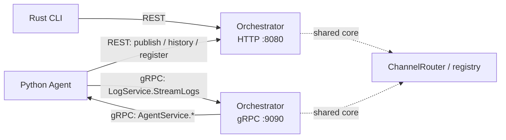
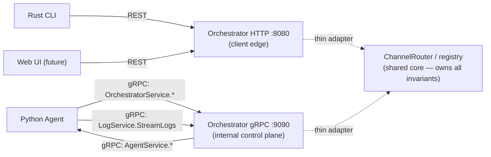

# RFC 0040 — Agent–Orchestrator Transport Unification

**Type**: protocol
**Status**: 🔨 Draft
**Author**: Maksim Khomutov
**Date**: 2026-05-17
**Target**: v0.3.x (Phase 1) + v0.4.0 (Phases 2–4)
**Depends on**: RFC 0002 (REST API Server — the surface this RFC re-scopes to clients-only), RFC 0004 (Python Agent gRPC Server — the existing `AgentService` this RFC mirrors in the reverse direction), RFC 0011 (Channels & Bridges — the channel publish/history endpoints being migrated)
**Relates to**: RFC 0023 (LLM Call Leasing — already adds a gRPC `WalletService` round-trip on the agent→orchestrator path; the wallet proto and this RFC's `OrchestratorService` share a transport story), RFC 0029 (Personal/Society Storage Split — Phase 2 capability tokens are wire-auth on the agent→orchestrator path; co-sequencing target — see §Open Questions 4), RFC 0039 (User Accounts & Authentication — the REST surface's auth story, which this RFC narrows to the client edge), RFC 0032 (Wire-Level Channel Interaction Layer — an *orthogonal* channel-wire change: it adds a conversation `interaction_id` to the message payload, this RFC changes the *transport* the payload travels over; the two compose without conflict), RFC 0006 (Efficiency & Execution Limits — mesh/multi-node territory, explicitly out of scope here)

---

## Table of Contents

- [Summary](#summary)
- [Motivation](#motivation)
- [Goals](#goals)
- [Non-Goals](#non-goals)
- [Design / Implementation](#design--implementation)
  - [A. Current State — three transports, tangled by build order](#a-current-state--three-transports-tangled-by-build-order)
  - [B. Target Shape — two audience-specific surfaces over one core](#b-target-shape--two-audience-specific-surfaces-over-one-core)
  - [C. Proto Surface — `OrchestratorService`](#c-proto-surface--orchestratorservice)
  - [D. Shared-Core Invariant Enforcement](#d-shared-core-invariant-enforcement)
  - [E. Agent-Side Client Migration](#e-agent-side-client-migration)
  - [F. Failure Modes](#f-failure-modes)
- [Security Considerations](#security-considerations)
- [Migration Path](#migration-path)
- [Phased Implementation Plan](#phased-implementation-plan)
- [Files Touched (Estimated)](#files-touched-estimated)
- [Test Strategy](#test-strategy)
- [Open Questions](#open-questions)
- [Decision / Next Steps](#decision--next-steps)
- [Related Documentation](#related-documentation)

---

## Summary

Persatrix's two long-lived processes — the Go orchestrator and the Python agents — talk over three transports today, and the split is **directional**: orchestrator→agent is gRPC (`AgentService`), agent→orchestrator log shipping is gRPC (`LogService`), but agent→orchestrator *control-plane* calls — channel publish, channel-history fetch, agent registration — go over **REST**. That last path is not a designed choice; it is an artifact of build order (RFC 0002's REST API existed first for the CLI, RFC 0011's channel endpoints were built REST for the CLI/chat surface, and agents reused them). This RFC migrates the agent→orchestrator control-plane calls to gRPC and re-scopes REST to its real audience — the CLI and a future Web UI. The orchestrator's inbound surface ends up cleanly split: a gRPC API whose only callers are agents, and a REST API whose only callers are clients, both thin adapters over one shared business-logic core.

## Motivation

The agent→orchestrator REST path works, and at v0.3.x traffic volumes it is not a performance problem. The cost is **structural**, and it compounds as v0.4.0 work lands on top of it.

Four concrete problems:

1. **No shared typed contract on the agent→orchestrator path.** The orchestrator→agent direction has [`proto/task.proto`](../../proto/task.proto) — both sides generate types from one schema and a mismatch is a build error. The agent→orchestrator channel-publish payload is a hand-built JSON dict assembled in [`agents/channel_publisher.py`](../../agents/channel_publisher.py) (`{"sender_id": ..., "content": ..., "metadata": {...}}`) and decoded loosely on the Go side. Drift between what the agent sends and what the orchestrator's handler expects is caught only at runtime, in whatever environment first exercises the path.

2. **One REST surface serves two audiences.** The orchestrator's channel endpoints (`POST /api/v1/channels/{id}/messages`, `GET /api/v1/channels/{id}/messages`) are consumed by *both* the CLI/chat surface *and* agents. Neither audience-specific policy (auth posture, rate limiting, payload shape) nor independent evolution of the two is possible while they share one surface.

3. **Two transport stacks inside the agent process.** Each agent runs a gRPC *server* (`AgentService`) and an aiohttp *client* (channel publish/history, registration), with separate timeout knobs that must be kept in sync — [`agents/channel_publisher.py`](../../agents/channel_publisher.py) carries a comment documenting a past footgun where two unrelated 10-second timers had to be reconciled by hand.

4. **A non-obvious directional protocol rule.** "gRPC downstream, REST upstream, between the same two processes" is a rule every new contributor has to learn, and it has no principled basis — only a historical one.

**What happens if we do nothing.** v0.4.0 reopens exactly this surface: RFC 0012 (Protocols & Organizations) adds org/hierarchy traffic on the agent→orchestrator path, and [RFC 0029](0029-personal-society-storage-split.md) Phase 2 introduces capability tokens — wire-level auth — on that same path. Both would be built on the untyped REST surface and then migrated. The migration cost is lowest now and rises with every consumer added to the REST agent path.

Note that [RFC 0023](0023-llm-call-leasing.md) already commits the agent→orchestrator direction to gRPC for one new call class — the `WalletService` lease round-trip. After RFC 0023 ships, the agent→orchestrator path is *already* mixed (gRPC for leasing, REST for channels/registration). This RFC removes the remaining REST control-plane calls so the path is uniform.

## Goals

1. All agent→orchestrator **control-plane** calls — channel publish, channel-history fetch, agent registration/deregistration — use gRPC against a protobuf-defined contract.
2. REST remains the **dedicated client edge** (CLI and a future Web UI) and becomes the *only* audience the REST surface is designed for.
3. The channel publish/history endpoints **remain available over REST for clients** — they become *dual-surface* (REST for clients + gRPC for agents), not REST-removed.
4. For any dual-surface operation, both transports are **thin adapters over one shared business-logic core** — no duplicated validation, fan-out, or persistence logic.
5. Security-critical invariants — `sender_id` trust, channel membership, cascade-depth clamp — are enforced **in the shared core, below both transports**, so neither transport can bypass them.
6. The migration is **incremental and backwards-compatible** — no flag day; the REST agent path keeps working until each call is migrated and verified.

## Non-Goals

- **Migrating the CLI off REST.** Browsers cannot speak native gRPC (it requires HTTP/2 trailer access the browser `fetch` API does not expose); a future Web UI therefore mandates that REST stays. With REST permanent for the browser, moving the Rust CLI to gRPC buys nothing and is explicitly excluded.
- **A gRPC-Web gateway / Envoy translation proxy.** Out of scope precisely because REST stays as the client edge — there is nothing to translate.
- **Changing the orchestrator→agent gRPC contract.** `AgentService` ([`proto/task.proto`](../../proto/task.proto)) is unchanged.
- **Changing log shipping.** `LogService` ([`proto/log_service.proto`](../../proto/log_service.proto)) is already gRPC and is untouched.
- **Introducing a message broker or any multi-node message routing.** The horizontal-scale rework of the in-process reply-correlation table ([`internal/channels/waiter.go`](../../internal/channels/waiter.go)) is RFC 0006 mesh territory and is tracked separately.
- **Capability-token authentication itself.** That is [RFC 0029](0029-personal-society-storage-split.md) Phase 2. This RFC provides the typed gRPC transport that capability tokens will ride on (as call metadata); it does not define the tokens.
- **Authenticating the REST client edge.** That is [RFC 0039](0039-user-accounts-authentication.md). This RFC only narrows *who* the REST surface serves.

## Design / Implementation

### A. Current State — three transports, tangled by build order



Three observations:

1. The orchestrator **already runs both** an HTTP listener (`:8080`) and a gRPC listener (`:9090`, currently `LogService` only). Adding agent-facing RPCs is *new RPCs on an existing listener*, not a new server.
2. The agent→orchestrator direction is **already mixed** — gRPC for logs today, gRPC for the `WalletService` lease once [RFC 0023](0023-llm-call-leasing.md) ships, REST for channels/registration. This RFC makes it uniform rather than introducing gRPC where there was none.
3. `ChannelRouter` ([`internal/channels/router.go`](../../internal/channels/router.go)) is **already the shared core** — its doc-comment names it "the publish-and-fanout entry point used by the REST handler *and* the `SEND_CHANNEL_MESSAGE` action executor." The business logic is already factored; what is missing is a second thin adapter.

The agent-side REST callers being migrated:

| Call | Today | Source |
|------|-------|--------|
| Publish a channel message | `POST /api/v1/channels/{id}/messages` | [`agents/channel_publisher.py`](../../agents/channel_publisher.py) — `HTTPChannelPublisher` |
| Fetch channel history | `GET /api/v1/channels/{id}/messages?limit=N` | [`agents/channel_history_fetcher.py`](../../agents/channel_history_fetcher.py) — `HttpChannelHistoryFetcher` |
| Register / deregister | `POST` / `DELETE /api/v1/agents/register` | [`agents/server.py`](../../agents/server.py) — `_self_register` / `_self_deregister` |

### B. Target Shape — two audience-specific surfaces over one core



The end state is two surfaces with disjoint audiences:

- **REST/HTTP `:8080`** — the **client edge**. CLI, future Web UI, scripts, humans. Channel publish/history endpoints stay here for clients.
- **gRPC `:9090`** — the **internal control plane**. Agents only. `AgentService` (orchestrator→agent), `LogService` (logs), the RFC 0023 `WalletService` (leasing), and the new `OrchestratorService` (this RFC).

Channel publish and history are **dual-surface**: reachable over REST (clients) *and* gRPC (agents). They are not removed from REST. Registration is **agent-only** and its REST endpoint can be retired (Phase 4).

### C. Proto Surface — `OrchestratorService`

A new proto file `proto/orchestrator.proto` defines a single service hosted by the orchestrator:

```proto
service OrchestratorService {
  // Publish a channel message. The orchestrator stamps the authoritative
  // sender_id from the call's authenticated identity — the field in the
  // request is advisory and cross-checked, never trusted blind.
  rpc PublishChannelMessage(PublishChannelMessageRequest) returns (PublishChannelMessageResponse);

  // Fetch the last N messages of a channel (catch-up / conversation window).
  rpc GetChannelHistory(GetChannelHistoryRequest) returns (GetChannelHistoryResponse);

  // Agent self-registration and deregistration.
  rpc RegisterAgent(RegisterAgentRequest) returns (RegisterAgentResponse);
  rpc DeregisterAgent(DeregisterAgentRequest) returns (DeregisterAgentResponse);
}
```

Design notes:

- **New service, not an extension of `LogService` or `AgentService`.** `LogService` is logs-only; `AgentService` is the *opposite* direction (orchestrator→agent). A dedicated `OrchestratorService` keeps each service's direction and concern singular. (See §Open Questions 1.)
- **Field parity with the REST body.** The request messages mirror the existing JSON bodies (`sender_id`, `content`, `mentions`, `metadata.cascade_depth`) so the migration is a transport swap, not a semantics change. The `cascade_depth` carried in `metadata` today becomes a typed field.
- **The `503 channels-disabled` signal** that [`agents/channel_publisher.py`](../../agents/channel_publisher.py) handles today maps to a gRPC `UNAVAILABLE` status with a typed detail, preserving the existing sticky-disable behaviour.

### D. Shared-Core Invariant Enforcement

The load-bearing rule: once channel publish is reachable over *two* transports, every security-critical invariant must be enforced **below both adapters**, in `ChannelRouter`, not in either transport handler.

The invariants:

- **`sender_id` trust** — the orchestrator stamps the authoritative sender from the call's identity; an agent's LLM cannot spoof a message "from" another participant. Today this is asserted at the REST boundary ([`agents/channel_publisher.py`](../../agents/channel_publisher.py) documents the RFC 0011 amendment §"DM gate-bypass" invariant).
- **Channel membership** — only members may publish/read.
- **Cascade-depth clamp** — `ChannelRouter.Publish` already clamps inbound `cascade_depth` to `[0, maxCascadeDepth]` before the store commit ([`internal/channels/router.go`](../../internal/channels/router.go)).

Cascade clamp is *already* in the core. The Phase 2 work is auditing `sender_id` and membership enforcement: any check currently living in the REST handler layer ([`internal/server/channel_handlers.go`](../../internal/server/channel_handlers.go)) must be relocated into `ChannelRouter` so the gRPC adapter inherits it for free. This is a prerequisite, not a side effect — a gRPC handler that bypasses a REST-handler-resident check is a security regression.

### E. Agent-Side Client Migration

The agent side already has the right seams — the migration swaps *implementations*, not call sites:

- [`agents/channel_publisher.py`](../../agents/channel_publisher.py) defines `ChannelPublisher` as a `typing.Protocol`. A new `GRPCChannelPublisher` is simply another implementation of that Protocol; the `ActionExecutor` call site is unchanged.
- [`agents/channel_history_fetcher.py`](../../agents/channel_history_fetcher.py) defines `ChannelHistoryFetcher` as a `Protocol` for the same reason; a `GRPCChannelHistoryFetcher` slots in identically.
- [`agents/server.py`](../../agents/server.py) `_self_register` / `_self_deregister` are private methods with a single call site each — a localized change.

The agent already depends on generated gRPC stubs (`agents/generated/`) and runs a gRPC server, so the gRPC *client* introduces no new dependency class. Once migration completes, the aiohttp client dependency can be dropped from the agent process (Phase 4).

### F. Failure Modes

| Failure | Behaviour | Mitigation |
|---------|-----------|------------|
| Orchestrator gRPC endpoint unreachable mid-rollout | Agent control-plane calls fail | Phase 3 keeps the REST path as a configured fallback until Phase 4; transport selection is sticky per process (mirrors the existing `_disabled` sticky flag in `HTTPChannelPublisher`) |
| gRPC handler bypasses an invariant still resident in the REST handler | Security regression (e.g. spoofable `sender_id`) | §D — invariant relocation into `ChannelRouter` is a Phase 2 *prerequisite*, gated by a test that drives both transports through the same invariant assertions |
| REST and gRPC payload schemas drift during the dual-surface window | Agent and orchestrator disagree on a field | Phase 1 ships a shared schema + contract test *before* any transport change, so the dual-surface window starts from a pinned contract |
| Channel-history fetch fails over gRPC | Catch-up returns no history | Same best-effort contract as today — `HttpChannelHistoryFetcher` already returns `None` on error and callers branch on it; the gRPC fetcher preserves the `None`-on-failure contract |
| Registration race — agent dials orchestrator gRPC before the listener is up | Registration fails at boot | Retry-with-backoff at the agent's self-register call site; the orchestrator gRPC listener already starts before agents are expected to connect |

## Security Considerations

- **No weakening of the `sender_id` trust boundary.** The orchestrator remains authoritative for `sender_id` on publish. §D *strengthens* the guarantee by relocating the check into the shared core, where it covers both transports, rather than leaving it transport-resident.
- **New inbound gRPC surface, same trust zone.** `OrchestratorService` is internal-only — its only intended callers are agents, on the same gRPC listener that already hosts `LogService`. It introduces no client-facing surface and no new network trust boundary beyond what `LogService` already established.
- **Auth posture is inherited, not invented.** The agent→orchestrator path is unauthenticated today (both REST and gRPC). This RFC does not change that; it makes the path *uniform* so that [RFC 0029](0029-personal-society-storage-split.md) Phase 2 (capability tokens) and [RFC 0039](0039-user-accounts-authentication.md) (REST client auth) each have a single, typed surface to attach to. gRPC call metadata is the natural carrier for a capability token — a cleaner attachment point than a REST header.
- **Reduced attack surface at the client edge.** Narrowing the REST surface to clients-only means agent-specific endpoints (registration) leave the public HTTP API entirely (Phase 4), shrinking what an unauthenticated REST caller can reach.
- **Input encoding.** The REST path today must URL-encode an LLM-supplied `channel_id` to prevent path injection ([`agents/channel_publisher.py`](../../agents/channel_publisher.py) Must-Fix #1). gRPC carries `channel_id` as a typed field with no URL-path interpolation, removing that injection class for the agent path.

## Migration Path

The migration is structured so the codebase is shippable after every phase and no phase requires a flag day.

1. **Contract before transport (Phase 1).** A shared payload schema + contract test pins the agent↔orchestrator channel-publish/history contract over *today's* REST path. This closes the drift risk (Motivation 1) immediately and means the later dual-surface window begins from a verified contract. Phase 1 carries no proto change and is small enough to ride any open v0.3.x patch as hygiene.
2. **Add the new surface without removing the old (Phase 2).** `OrchestratorService` and its orchestrator-side handlers land while the REST endpoints stay fully functional. No agent uses gRPC yet. The orchestrator serves both.
3. **Flip agents per call, with fallback (Phase 3).** The agent-side `Protocol` implementations switch to gRPC. Transport selection is a sticky per-process choice; the REST path remains as a configured fallback so a rollout problem degrades rather than breaks.
4. **Retire the agent-only REST surface (Phase 4).** Once agents are verified on gRPC, the agent-only REST endpoints (registration) are removed. Channel publish/history REST endpoints **stay** — they are the client edge. The agent's aiohttp client dependency is dropped.

Backwards compatibility: an agent build from before Phase 3 talks REST to a post-Phase-2 orchestrator unchanged (REST endpoints unremoved until Phase 4). A post-Phase-3 agent against a pre-Phase-2 orchestrator falls back to REST. The only hard ordering constraint is orchestrator-Phase-2 before agent-Phase-3.

## Phased Implementation Plan

### Phase 1: Contract Hardening (v0.3.x)

**Summary.** Pin the agent↔orchestrator channel-publish/history contract over the existing REST path — no transport change.

**Deliverables.**
1. A shared schema for the channel-publish and channel-history payloads (JSON Schema, validated on both the agent send side and the orchestrator decode side).
2. A contract test asserting the agent's request shape against the orchestrator's REST handler expectation.
3. No proto change, no RFC-blocking dependency — small enough to ride whichever v0.3.x patch is open, in the manner of the [v0.3.x-sequencing.md](../v0.3.x-sequencing.md) MQ follow-ups.

**Dependencies.** None.

### Phase 2: `OrchestratorService` Proto + Orchestrator Handlers (v0.4.0)

**Summary.** Introduce the gRPC surface; the orchestrator serves both transports.

**Deliverables.**
1. `proto/orchestrator.proto` (new) with `OrchestratorService`; regenerate Go + Python stubs.
2. Orchestrator-side gRPC handlers — thin adapters over `ChannelRouter` and the registry — registered on the existing `:9090` listener.
3. Relocation of any `sender_id` / membership enforcement currently resident in the REST handler into `ChannelRouter` (§D prerequisite).
4. REST endpoints unchanged and fully functional.

**Dependencies.** Phase 1 (verified contract to mirror into proto).

### Phase 3: Agent-Side gRPC Migration (v0.4.0)

**Summary.** Agents use gRPC for control-plane calls; REST remains a fallback.

**Deliverables.**
1. `GRPCChannelPublisher` and `GRPCChannelHistoryFetcher` — new implementations of the existing `ChannelPublisher` / `ChannelHistoryFetcher` Protocols.
2. `_self_register` / `_self_deregister` migrated to `OrchestratorService` RPCs.
3. Sticky per-process transport selection with REST fallback.

**Dependencies.** Phase 2 (orchestrator must serve gRPC first).

### Phase 4: Retire the Agent-Only REST Surface (v0.4.0)

**Summary.** Remove what is now unused; document the final shape.

**Deliverables.**
1. Remove the `POST`/`DELETE /api/v1/agents/register` endpoints.
2. Remove the agent's aiohttp client dependency for control-plane calls.
3. Documentation: the orchestrator's two-surface model (REST = client edge, gRPC = internal control plane).

**Dependencies.** Phase 3 verified in a release.

## Files Touched (Estimated)

| Component | Files | Change |
|-----------|-------|--------|
| Protos | `proto/orchestrator.proto` (new) | New `OrchestratorService` definition (Phase 2) |
| Go orchestrator | `internal/generated/orchestratorpb/` (new, generated) | Regenerated stubs (Phase 2) |
| Go orchestrator | `cmd/orchestrator/` startup, new `internal/server/` gRPC handler file | Register `OrchestratorService` on the `:9090` listener; thin handlers (Phase 2) |
| Go orchestrator | [`internal/channels/router.go`](../../internal/channels/router.go), [`internal/server/channel_handlers.go`](../../internal/server/channel_handlers.go) | Relocate `sender_id` / membership enforcement into the shared core (Phase 2) |
| Python agents | `agents/generated/` | Regenerated stubs (Phase 2) |
| Python agents | [`agents/channel_publisher.py`](../../agents/channel_publisher.py), [`agents/channel_history_fetcher.py`](../../agents/channel_history_fetcher.py) | New `GRPC*` Protocol implementations (Phase 3) |
| Python agents | [`agents/server.py`](../../agents/server.py) | `_self_register` / `_self_deregister` over gRPC (Phase 3) |
| Go orchestrator | `internal/server/` REST routes | Remove agent-only `register` endpoints (Phase 4) |
| Config / schemas | shared channel-payload schema (Phase 1); agent config for transport selection (Phase 3) | Phase 1 + Phase 3 |
| Tests | `tests/` — contract test (Phase 1), gRPC integration tests (Phase 2–3) | All phases |
| Docs | architecture diagrams, `docs/diagrams/`, observability docs | Phase 4 |

## Test Strategy

- **Unit tests.** `OrchestratorService` handler adapters in isolation (each delegates correctly to `ChannelRouter` / registry); the `GRPCChannelPublisher` / `GRPCChannelHistoryFetcher` Protocol implementations against a stubbed channel.
- **Integration tests.** Agent → gRPC → orchestrator → `ChannelRouter` → fanout, end to end; the dual-transport invariant test (§D / Failure Modes) — the *same* `sender_id` / membership assertions exercised through both the REST and gRPC adapters, proving neither bypasses the core.
- **Contract test.** Phase 1 deliverable — the shared schema pins the payload shape; runs in CI on changes to the publish/history path.
- **E2E / smoke tests.** The chat-as-DM round-trip (publish-and-await) still completes after agents move to gRPC; channel catch-up on agent restart still replays history.
- **Manual tests.** A new `MT-*` entry for the two-surface model — verify the CLI (REST) and an agent (gRPC) can both publish to the same channel and the orchestrator treats them identically.

## Open Questions

1. **New `OrchestratorService` vs. extending an existing service.** This RFC proposes a new service. The alternative — folding the RPCs into a broadened service — was rejected to keep each service single-direction and single-concern. Confirm at review.
2. **Transport selection mechanism during the Phase 3 rollout.** Options: (a) explicit agent config flag; (b) capability detection (try gRPC, fall back to REST on `UNIMPLEMENTED`). Recommend (a) — explicit, observable, no per-call probe cost. Decide at `0040-pr-plan.md` authoring time.
3. **Does `GetChannelHistory` need to move at all?** History fetch is read-only and lower-stakes than publish. One option is to migrate publish + registration to gRPC and leave history on REST. Recommend migrating it too, for a uniform agent path — but flag it as the most droppable scope if Phase 3 needs trimming.
4. **Co-sequencing with [RFC 0029](0029-personal-society-storage-split.md) Phase 2.** RFC 0029 Phase 2 adds capability tokens — wire auth on this exact path. Phases 2–3 here and RFC 0029 Phase 2 touch the same proto/handlers. Should they share one v0.4.0 PR train so the surface is touched once? Resolve when the v0.4.0 plan opens.
5. **Registration over gRPC — bootstrap ordering.** The agent must know the orchestrator's gRPC address to register; that is config either way (the agent already has `orchestrator_url`). Confirm a gRPC address/port config field is added cleanly alongside the existing REST URL.

## Decision / Next Steps

**Status: 🔨 Draft.** This RFC is opened for review. Before it can advance to Proposed → Accepted:

1. Resolve Open Questions 1 and 2 (service shape, transport selection) in the review thread — both are non-additive once the proto ships.
2. Confirm the §D invariant-relocation audit scope — which `sender_id` / membership checks are REST-handler-resident today.
3. Decide the co-sequencing with RFC 0029 Phase 2 (Open Question 4) when the v0.4.0 plan opens.

If accepted: file `docs/rfcs/0040-pr-plan.md` with Phase 1 as a standalone v0.3.x hygiene PR and Phases 2–4 as a v0.4.0 PR train, modeled on the [RFC 0017 PR plan](0017-pr-plan.md) structure.

## Related Documentation

- [RFC 0002 — REST API Server](0002-rest-api-server.md) — the REST surface this RFC re-scopes to the client edge.
- [RFC 0004 — Python Agent gRPC Server](0004-python-agent-grpc-server.md) — `AgentService`, the orchestrator→agent direction this RFC mirrors.
- [RFC 0011 — Channels & Bridges](0011-channels-bridges.md) — the channel publish/history surface being migrated.
- [RFC 0023 — LLM Call Leasing](0023-llm-call-leasing.md) — already commits the agent→orchestrator path to gRPC for the `WalletService` lease.
- [RFC 0029 — Personal/Society Storage Split](0029-personal-society-storage-split.md) — Phase 2 capability tokens ride this RFC's gRPC transport; co-sequencing target.
- [RFC 0039 — User Accounts & Authentication](0039-user-accounts-authentication.md) — authenticates the REST client edge.
- [v0.3.x-sequencing.md](../v0.3.x-sequencing.md) — the one-story-per-version discipline that places Phase 1 in v0.3.x and Phases 2–4 in v0.4.0.
- [`internal/channels/router.go`](../../internal/channels/router.go) — `ChannelRouter`, the shared business-logic core.
- [`agents/channel_publisher.py`](../../agents/channel_publisher.py) · [`agents/channel_history_fetcher.py`](../../agents/channel_history_fetcher.py) — the agent-side REST callers being migrated.
