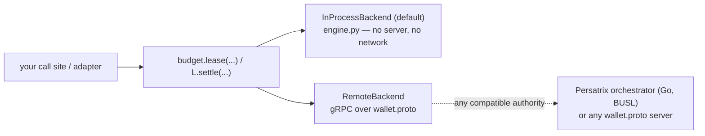

# RFC 0046 — Budget-Lease Library Extraction (`persatrix-budget`)

**Type**: architecture  
**Status**: 📋 Proposed  
**Author**: Maksim Khomutov  
**Date**: 2026-05-25  
**Target**: v0.4.0+ (gated on RFC-0045 acceptance + the MIT↛BUSL boundary CI gate)  
**Depends on**: RFC 0045 (Open-Core Library Extraction Policy — the governing policy this RFC inherits and, in §H/§B, refines), RFC 0023 (LLM Call Leasing — the subsystem being extracted), RFC 0024 (Event-Driven Agent Scheduling — the idle-loop whose placement RFC 0045 deferred here)

---

## Table of Contents

- [Summary](#summary)
- [Motivation](#motivation)
  - [M-1. The flagship funnel asset is locked in BUSL](#m-1-the-flagship-funnel-asset-is-locked-in-busl)
  - [M-2. The audience is Python and in-process; the embeddable engine must be too](#m-2-the-audience-is-python-and-in-process-the-embeddable-engine-must-be-too)
  - [M-3. It is a library, not a framework — and a single-language one](#m-3-it-is-a-library-not-a-framework--and-a-single-language-one)
  - [M-4. RFC 0045 deferred the event-loop placement decision to this RFC](#m-4-rfc-0045-deferred-the-event-loop-placement-decision-to-this-rfc)
- [Goals](#goals)
- [Non-Goals](#non-goals)
- [Design / Implementation](#design--implementation)
  - [A. Audience → artifact: what `persatrix-budget` actually is](#a-audience--artifact-what-persatrix-budget-actually-is)
  - [B. What ships (MIT): the Python package](#b-what-ships-mit-the-python-package)
  - [C. Two backends behind one API: in-process and remote](#c-two-backends-behind-one-api-in-process-and-remote)
  - [D. What stays BUSL, and the proto as the shared contract](#d-what-stays-busl-and-the-proto-as-the-shared-contract)
  - [E. Framework adapters](#e-framework-adapters)
  - [F. Dependency-direction proof](#f-dependency-direction-proof)
  - [G. Sync model and dogfooding](#g-sync-model-and-dogfooding)
  - [H. Event-loop placement resolution](#h-event-loop-placement-resolution)
  - [I. Relationship to RFC 0045 (the refinement)](#i-relationship-to-rfc-0045-the-refinement)
- [Security Considerations](#security-considerations)
- [Phased Implementation Plan](#phased-implementation-plan)
- [Files Touched (Estimated)](#files-touched-estimated)
- [Test Strategy](#test-strategy)
- [Open Questions](#open-questions)
- [Decision / Next Steps](#decision--next-steps)
- [Related Documentation](#related-documentation)

---

## Summary

This is the **first per-extraction RFC** under the [RFC 0045](0045-open-core-extraction-policy.md) open-core policy, and the flagship one. It carves the [RFC 0023](0023-llm-call-leasing.md) LLM budget-lease — a *gate* that reserves budget before every model call and settles actuals after, fail-closed, multi-scope, provider-agnostic — into the standalone **MIT `persatrix-budget`** package.

The key decision this RFC makes — and which an earlier draft skipped — is **what the extracted thing actually is**. The lease lives in Persatrix as a Go budget authority (`internal/cost` + `internal/wallet`) that Python agents call over gRPC. That polyglot shape is an artifact of *Persatrix's* topology, not a property of a budget gate, and it is the wrong shape for an external library: the audience that most wants a budget gate is **Python agent developers who want in-process control with no infrastructure**, and they cannot embed a Go engine. So `persatrix-budget` ships as a **single-language Python library**, not a polyglot bundle:

- an **in-process budget engine** — the default, zero-server path (`pip install`, wrap your call sites);
- a **remote backend** behind the same API that speaks `wallet.proto` to any compatible authority, for distributed deployments;
- **ADK and LiteLLM adapters** so it bolts onto the popular frameworks.

The Go `internal/cost` + `internal/wallet` **stay BUSL** as the reference server; `wallet.proto` is published as the shared wire contract; and Persatrix's own Python agents **dogfood the library in remote mode** against that server. This single-language choice **obviates the `internal/cost` split** the earlier draft required, moves the MIT↛BUSL boundary enforcement to the Python side, and **refines [RFC 0045 §H/§B](#i-relationship-to-rfc-0045-the-refinement)**. Per the policy, **no code moves until [RFC 0045](0045-open-core-extraction-policy.md) is Accepted and its boundary CI gate is green** ([Decision](#decision--next-steps)).

## Motivation

### M-1. The flagship funnel asset is locked in BUSL

[RFC 0045 §M-1](0045-open-core-extraction-policy.md#m-1-reusable-infrastructure-is-locked-inside-a-non-permissive-repo) identifies the budget-lease as the clearest reusable primitive trapped behind a non-permissive license. The fear it answers is universal — the [README Cost Warning](../../README.md#%EF%B8%8F-cost-warning--read-before-running) opens with a real $35 incident, and [RFC 0023](0023-llm-call-leasing.md#motivation) calls cost "the recurring failure class on this project." The existing market is mostly *after-the-fact dashboards*; a *pre-call gate* is differentiated, with an audience far larger than Persatrix. Of the [RFC 0045 §H candidate set](0045-open-core-extraction-policy.md#h-the-candidate-set-and-the-per-extraction-rfc-requirement), it is the one chosen to launch the funnel.

### M-2. The audience is Python and in-process; the embeddable engine must be too

The funnel only pays off if the first five minutes are trivial — a solo developer with a LangChain or ADK script wants to `pip install` something and wrap their calls, not stand up a server. But the budget *engine* in Persatrix is Go (`internal/cost`), and `agents/wallet_client.py` is **only a gRPC client** with no budget logic of its own. So if the extracted artifact is "the Go engine + the gRPC service + a Python client," a Python developer **still has to run the Go service** to use it at all — which defeats the trivial-first-five-minutes premise the funnel depends on.

The resolution is to recognise that the accounting core — scope counters, a model-keyed pricing table, the `estimate → reserve → settle → reconcile` state machine — is small and language-independent. Reimplementing it in **pure Python** gives the target audience a true in-process, zero-infrastructure gate. The Go engine remains the authoritative server for distributed use; it does not need to be the public artifact.

### M-3. It is a library, not a framework — and a single-language one

A *framework* inverts control: you build your agent inside it and it calls you (ADK's `Runner`, LangGraph, Django). The budget gate never owns your control flow — you bolt it onto whatever loop you already run. So `persatrix-budget` is a **library** (you call it), optionally backed by a **service** (you talk to it over a wire protocol) for the distributed case, plus **adapters** (plugins into other frameworks). Bundling a Go engine, a Go server, a proto, and a Python client into one repo conflates three concepts with different audiences and cadences and produces a project with no clear language identity. A single-language Python package — with the proto as a published contract and the server kept in Persatrix — is the legible, adoptable shape.

### M-4. RFC 0045 deferred the event-loop placement decision to this RFC

[RFC 0045 Open Questions](0045-open-core-extraction-policy.md#open-questions) records, under *"Deferred to successor RFCs"*, that whether the [RFC 0024](0024-event-driven-scheduling.md) idle loop folds into the budget-lease repo, ships standalone, or stays internal "is a seam-cut decided in the flagship extraction RFC." This RFC owns that decision ([§H](#h-event-loop-placement-resolution)).

## Goals

1. **Decide what `persatrix-budget` is** — a single-language Python library, not a polyglot bundle, not a framework ([§A](#a-audience--artifact-what-persatrix-budget-actually-is)).
2. **Ship a pure-Python in-process engine** as the default, zero-infrastructure path, preserving the fail-closed invariant ([§B](#b-what-ships-mit-the-python-package), [§C](#c-two-backends-behind-one-api-in-process-and-remote)).
3. **Provide one API with two backends** — in-process and remote-over-`wallet.proto` — so the same call sites scale from a script to a distributed deployment without code change ([§C](#c-two-backends-behind-one-api-in-process-and-remote)).
4. **Keep the Go authority BUSL** and publish `wallet.proto` as the shared contract; have Persatrix agents dogfood the library in remote mode ([§D](#d-what-stays-busl-and-the-proto-as-the-shared-contract), [§G](#g-sync-model-and-dogfooding)).
5. **Ship ADK + LiteLLM adapters** as the launch set, backend-agnostic ([§E](#e-framework-adapters)).
6. **Prove the dependency direction** on the Python side ([§F](#f-dependency-direction-proof)).
7. **Resolve event-loop placement** ([§H](#h-event-loop-placement-resolution)).
8. **Refine RFC 0045 §H/§B** to match the single-language artifact ([§I](#i-relationship-to-rfc-0045-the-refinement)).

## Non-Goals

- **No code moves under this RFC.** The move is gated on [RFC 0045](0045-open-core-extraction-policy.md) Accepted *and* its boundary CI gate green ([Decision](#decision--next-steps)).
- **No change to the lease semantics.** The `estimate → reserve → settle → reconcile` model, the fail-closed posture, and (in remote/server mode) the TTL reaper are exactly as [RFC 0023](0023-llm-call-leasing.md) ships them.
- **The Go engine and service are not extracted to MIT.** `internal/cost` and `internal/wallet` stay BUSL as the reference server ([§D](#d-what-stays-busl-and-the-proto-as-the-shared-contract)). This RFC therefore does **not** perform the `internal/cost` split the earlier draft required.
- **No Go in-process library now.** A second-language in-process engine is demand-gated future work, not this RFC ([Open Question 2](#open-questions)).
- **No Private tier, no billing.** The pluggable budget-policy / pricing seam real metering will attach to ([RFC 0045 §C](0045-open-core-extraction-policy.md#c-the-private-tier-reserved-seams-and-the-no-retraction-rule)) is *reserved*, not built.
- **Not every adapter.** Only ADK + LiteLLM at launch; others follow demand.
- **No Option-B flip now.** `persatrix-budget` starts monorepo-canonical ([§G](#g-sync-model-and-dogfooding)).

## Design / Implementation

### A. Audience → artifact: what `persatrix-budget` actually is

There are three ways anyone consumes a budget gate, and they are different products:

| Mode | Concept | How it's used | Who wants it |
|------|---------|---------------|--------------|
| In-process | **Library** | `import`, wrap call sites, no server | Python agent devs (the community) |
| Out-of-process | **Service + SDK** over a protocol | run a budget authority, call it over gRPC from any language | distributed / multi-language deployments |
| Inside a host framework | **Plugin / adapter** | `pip install`, auto-wire into ADK/LiteLLM | framework users |

The earlier draft tried to be all three at once by being polyglot, and ended up serving the in-process mode *only for Go users* — almost nobody in the target community. This RFC commits to a **primary audience (Python agent developers) and therefore a primary artifact (a Python library)**. The distributed mode is served by the **same library** through a remote backend ([§C](#c-two-backends-behind-one-api-in-process-and-remote)); the authority it talks to is the Go server kept in Persatrix ([§D](#d-what-stays-busl-and-the-proto-as-the-shared-contract)). The result has one language, one identity, and a trivial first five minutes.

### B. What ships (MIT): the Python package

```
persatrix-budget/                # MIT, Python
  persatrix_budget/
    engine.py                    # in-process: pricing table, scope counters,
                                 #   estimate_cost, reserve/settle/reconcile
    lease.py                     # the lease context manager + BudgetExceeded
    backends/
      in_process.py              # default backend (engine.py); no server
      remote.py                  # gRPC backend (from agents/wallet_client.py)
    proto/wallet.proto           # the published wire contract
    adapters/
      adk.py                     # before_model_callback / after_model_callback
      litellm.py                 # covers the LiteLLM-backed long tail (incl. CrewAI)
  examples/                      # in-process quickstart; ADK walkthrough
  LICENSE  NOTICE  CHANGELOG  CONTRIBUTING(DCO)  README
```

- **`engine.py` is new MIT code** — a faithful Python port of the [RFC 0023](0023-llm-call-leasing.md) accounting: a `{model → (input_per_1M, output_per_1M)}` pricing table, `estimate_cost`, multi-scope spend counters (global and optional named scopes such as agent/session), and the provisional-charge / reconcile bookkeeping. It is owner-authored, satisfying [RFC 0045 §A](0045-open-core-extraction-policy.md#a-the-three-tier-boundary) provenance.
- **`lease.py`** exposes the one public surface: `with budget.lease(model=…, est_input=…, est_output=…) as L: … ; L.settle(input_tokens=…, output_tokens=…)`. On enter it estimates worst-case cost, checks it against remaining budget across scopes, and raises `BudgetExceeded` **before** the call if over (fail-closed). On settle it reconciles provisional → actual.
- **`backends/remote.py`** is the existing `agents/wallet_client.py` logic — already zero domain coupling — recast as a backend implementing the same `lease`/`settle` surface over `wallet.proto`.
- **`proto/wallet.proto`** travels as the published contract ([§D](#d-what-stays-busl-and-the-proto-as-the-shared-contract)).

### C. Two backends behind one API: in-process and remote



One API, a pluggable backend chosen at construction:

- **In-process (default).** The process owns its own leases; a lease is a context manager that records a provisional charge and reconciles on settle. **No TTL reaper is needed** — there is no cross-process lease to leak; if the process dies, its budget state dies with it. Fail-closed means "deny before the call if over budget." This is the funnel path.
- **Remote.** The same surface, backed by gRPC calls to a `wallet.proto` authority. Behavior matches [RFC 0023 §E–F](0023-llm-call-leasing.md#e-python-client-integration) exactly, including fail-closed on an unreachable wallet and the server-side reaper for abandoned leases. This is the scale-out path and the one Persatrix itself uses ([§G](#g-sync-model-and-dogfooding)).

Switching modes is a construction-time choice, not a call-site change — so a script can start in-process and graduate to a shared authority without touching its instrumented code.

### D. What stays BUSL, and the proto as the shared contract

- **The Go authority stays BUSL.** `internal/cost` (the authoritative accounting) and `internal/wallet` (the gRPC `WalletService`, lease state machine, and TTL reaper) remain in the monorepo under BUSL as the **reference server**. They are not relicensed and not retracted — consistent with the [RFC 0045 §C](0045-open-core-extraction-policy.md#c-the-private-tier-reserved-seams-and-the-no-retraction-rule) no-retraction rule.
- **`wallet.proto` is the shared contract.** Under [RFC 0045 §F](0045-open-core-extraction-policy.md#f-naming-versioning-and-release-conventions) it is versioned as public API in its own right (a breaking proto change is a major bump independent of the implementation). It is published with the MIT library; the BUSL Go server regenerates its stubs from the same contract. BUSL consuming an MIT-published contract is a legal down-tier dependency ([RFC 0045 §B](0045-open-core-extraction-policy.md#b-the-dependency-direction-invariant)).
- **No duplicate-authority hazard.** In remote mode the *server* is authoritative; the library is a client. The Python `engine.py` only governs in-process users, who never touch the Go server. The one real duplication — the pricing table existing in both Go and Python — is small and is a candidate to share later as published pricing data ([Open Question 4](#open-questions)).

### E. Framework adapters

Adapters are the [RFC 0045 §G](0045-open-core-extraction-policy.md#g-repo-structure-core-plus-adapters) adoption lever and are **backend-agnostic** — they call `lease`/`settle` regardless of in-process vs remote:

- **`adapters/adk.py` (launch).** Google ADK's callback model is a native fit: `before_model_callback` acquires the lease and, on denial, returns a short-circuit `LlmResponse` so no tokens are spent; `after_model_callback` settles from `llm_response.usage_metadata`. A Plugin variant wires it once across a `Runner`.
- **`adapters/litellm.py` (launch).** Hooking LiteLLM transitively covers CrewAI and the LiteLLM-backed long tail for one adapter's effort.
- **Usage normalization lives in the adapter.** Each framework surfaces token counts differently; the adapter maps the host's usage object onto `settle(input_tokens=…, output_tokens=…)`. The library core carries no framework imports.

### F. Dependency-direction proof

[RFC 0045 §H](0045-open-core-extraction-policy.md#h-the-candidate-set-and-the-per-extraction-rfc-requirement) requires an explicit proof that the [§B invariant](0045-open-core-extraction-policy.md#b-the-dependency-direction-invariant) holds for the moved set. Because the MIT artifact is **Python-only**, the boundary to enforce is **MIT Python ↛ BUSL Python**:

| Unit | Upward imports into BUSL? | Evidence |
|------|---------------------------|----------|
| `engine.py`, `lease.py` | None | New code; depends only on stdlib (and `tiktoken`-style optional token counting) |
| `backends/remote.py` (from `agents/wallet_client.py`) | None | Confirmed zero domain coupling; depends on `grpc` + stubs generated from the bundled proto |
| `adapters/*` | None | Depend on the library core + the host framework SDK; no Persatrix imports |

**Mechanical enforcement.** The [RFC 0045 §B](0045-open-core-extraction-policy.md#b-the-dependency-direction-invariant) Python `import-linter` contract already lists the wallet client as a forbidden-upward layer; this RFC extends that contract to the whole `persatrix_budget` package and wires it into the lint stage as a hard gate. **No Go deny-rule change is required for this extraction** — there is no MIT Go code — which is why the `internal/cost` split the earlier draft treated as a prerequisite is no longer needed ([§I](#i-relationship-to-rfc-0045-the-refinement)). The proof is *that the import-linter gate is green with the package added*, not a prose assertion.

### G. Sync model and dogfooding

Per [RFC 0045 §D](0045-open-core-extraction-policy.md#d-source-of-truth-and-sync-model), `persatrix-budget` starts on **Option A — monorepo-canonical, mirror-out**: the library source and `wallet.proto` live in the monorepo, the public repo is a generated mirror, and the boundary check runs in the same CI that builds everything.

Dogfooding is what makes this honest: **Persatrix's own Python agents migrate off `agents/wallet_client.py` to consume the library's `RemoteBackend`**, pointed at the Go orchestrator (BUSL). So the in-tree library is exercised in production via the remote path, and the BUSL server is the authority — the public API is proven against a real consumer before any Option-B flip. The **Option-B flip** (repo-canonical; published PyPI package; external PRs land directly) is recorded but deferred, taken only once the API has stabilized and external contribution demand is real — the [evolvable-over-back-compat](../development-workflow.md) stance.

### H. Event-loop placement resolution

**Decision: the [RFC 0024](0024-event-driven-scheduling.md) idle loop stays internal to Persatrix (BUSL). It is not folded into `persatrix-budget` and not spun out.**

Rationale:

1. **It is a runtime, not a primitive.** The idle loop is a per-agent asyncio supervisor that *owns the execution loop*; host frameworks own theirs, so a second runtime competes rather than composes. The budget gate bolts onto whatever loop the host runs — which is why it is the funnel asset and the loop is not.
2. **It is coupled to BUSL salience.** The loop's `SalienceWake` path subscribes to the `agents/memory` write bus (BUSL); extracting it cleanly means severing that and stripping its motivation.
3. **The narrative survives without shipping it.** "$0-when-idle, gated-when-active" is a *property of using the gate* (an idle agent issues no leases) and can be told in docs/examples without shipping a runtime.
4. **It keeps the library single-language and coherent** — the whole point of [§A](#a-audience--artifact-what-persatrix-budget-actually-is).

Open to review pushback; a future standalone-runtime demand would earn its own extraction RFC.

### I. Relationship to RFC 0045 (the refinement)

[RFC 0045](0045-open-core-extraction-policy.md) is the governing policy and explicitly leaves the precise composition of each extraction to its per-extraction RFC. This RFC exercises that latitude and **refines two spots** that were written assuming the polyglot composition:

- **[§H candidate row](0045-open-core-extraction-policy.md#h-the-candidate-set-and-the-per-extraction-rfc-requirement)** described the budget-lease as `internal/cost` + `internal/wallet` + proto + `wallet_client.py` + adapters. This RFC narrows the **MIT artifact** to the Python library + the published proto, and keeps the Go engine/service BUSL ([§D](#d-what-stays-busl-and-the-proto-as-the-shared-contract)).
- **[§B](0045-open-core-extraction-policy.md#b-the-dependency-direction-invariant)** deferred adding `internal/cost` to the Go gate until it was split. With the Go engine staying BUSL, that split is **not required for this extraction**; the boundary is enforced by the Python `import-linter` ([§F](#f-dependency-direction-proof)). RFC 0045's Go deny-rule seeding remains valid as forward-looking hygiene for any future MIT Go code.

Both edits are applied to RFC 0045 alongside this RFC so the two documents stay consistent; neither changes the policy's principles (the three-tier boundary, the invariant, the no-retraction rule, the sync default, governance).

## Security Considerations

- **Fail-closed must hold in the in-process engine.** The budget-lease is safety-relevant ([RFC 0045 §Security](0045-open-core-extraction-policy.md#security-considerations)): over budget → deny before the call. The new `engine.py` must enforce this exactly as the remote path does, with the [RFC 0023 §F](0023-llm-call-leasing.md#f-failure-modes) failure-mode tests ported into the library and run in standalone CI. The in-process simplification (no TTL reaper) is sound only because there is no cross-process lease to leak — documented and tested, not assumed.
- **License-leak control.** The [§F](#f-dependency-direction-proof) Python `import-linter` gate is the primary control: a `persatrix_budget` module importing BUSL `agents/*` would distribute BUSL source under MIT terms on the next mirror. Merge-blocking, per [RFC 0045 §B](0045-open-core-extraction-policy.md#b-the-dependency-direction-invariant).
- **No secrets, fixtures, or internal config leave the tree.** The mirror carries only the library source + tests + scaffolding — not `config/`, env files, or monorepo fixtures. The per-repo third-party inventory is regenerated from the library's own closure ([RFC 0045 §F](0045-open-core-extraction-policy.md#f-naming-versioning-and-release-conventions)).
- **Proto as attack surface.** Unchanged from [RFC 0023 §C](0023-llm-call-leasing.md#c-proto-surface); the remote backend keeps the server-side token-count validation (rejecting negative/oversized estimates) as a hard `InvalidArgument` gate.
- **Reserved private seam, not built.** The pluggable budget-policy / pricing surface real billing would attach to is *reserved* ([RFC 0045 §C](0045-open-core-extraction-policy.md#c-the-private-tier-reserved-seams-and-the-no-retraction-rule)); this RFC ships no metering.

## Phased Implementation Plan

Ordered, condition-gated steps — no calendar commitments; each gates the next on an *event*, mirroring [RFC 0045 §Phased Rollout](0045-open-core-extraction-policy.md#phased-rollout).

### Phase 0: Prerequisites (owned by RFC 0045)

[RFC 0045](0045-open-core-extraction-policy.md) Accepted; the MIT↛BUSL boundary CI gate merged green. For this extraction the load-bearing gate is the Python `import-linter` contract ([§F](#f-dependency-direction-proof)); the Go deny rule is not a prerequisite. **Hard gate: nothing below begins until this holds.**

### Phase 1: The in-process Python engine

Port the [RFC 0023](0023-llm-call-leasing.md) accounting into `engine.py` + `lease.py` as new MIT code, in-tree: pricing table, `estimate_cost`, scope counters, reserve/settle/reconcile, fail-closed `BudgetExceeded`. Carry the ported failure-mode tests. Deliverable: a working in-process gate with no server.

### Phase 2: Stand up the `persatrix-budget` skeleton

Create the repo + mirror tooling (`git subtree split`), the package layout, MIT `LICENSE`/`NOTICE`/`CHANGELOG`, the DCO `CONTRIBUTING` scaffold, and standalone CI (build + test + the import-linter boundary check). No product code yet beyond Phase 1.

### Phase 3: Remote backend + published proto

Recast `agents/wallet_client.py` as `backends/remote.py`; bundle and version `wallet.proto`; wire in-repo codegen. Confirm the remote path matches [RFC 0023 §E–F](0023-llm-call-leasing.md#e-python-client-integration).

### Phase 4: Adapters, examples, and Persatrix dogfood

Add `adapters/adk.py` + `adapters/litellm.py` with usage-normalization tests; add `examples/` (in-process quickstart + ADK walkthrough); migrate Persatrix's agents to consume the library's `RemoteBackend` against the Go orchestrator ([§G](#g-sync-model-and-dogfooding)).

### Phase 5: Option-A→B flip (deferred)

Considered later, gated on API stability + real external contribution demand ([§G](#g-sync-model-and-dogfooding)).

## Files Touched (Estimated)

| Component | Files | Change |
|-----------|-------|--------|
| New MIT library (in monorepo, mirrored out) | `persatrix_budget/engine.py`, `lease.py`, `backends/in_process.py`, `backends/remote.py`, `adapters/adk.py`, `adapters/litellm.py`, `proto/wallet.proto` (bundled), `examples/*`, `LICENSE`, `NOTICE`, `CHANGELOG`, `CONTRIBUTING`(DCO), per-repo third-party inventory, CI | Created; `backends/remote.py` is recast from `agents/wallet_client.py` |
| Python agents (BUSL) | `agents/wallet_client.py` and its call sites | Migrated to consume the library's `RemoteBackend` (dogfood); the standalone client module is retired in favor of the library |
| Go orchestrator (BUSL, unchanged) | `internal/cost/*`, `internal/wallet/*`, `internal/generated/walletpb/*` | **Stay BUSL** as the reference server; no split, no relicense |
| Protos | `proto/wallet.proto` | Becomes the published shared contract; the Go server regenerates from it |
| CI (monorepo) | Python `import-linter` contract | Extended to guard the whole `persatrix_budget` package ([§F](#f-dependency-direction-proof)) |
| Policy | `docs/rfcs/0045-open-core-extraction-policy.md` §H, §B | Refined to the single-language artifact ([§I](#i-relationship-to-rfc-0045-the-refinement)) |

## Test Strategy

- **Unit tests**: the ported accounting (`engine.py`) gets the [RFC 0023](0023-llm-call-leasing.md) cost/budget/estimate/provisional/reconcile coverage, re-expressed in Python; `lease.py` gets fail-closed and reconcile tests.
- **Integration tests**: the in-process backend proves lease→settle→reconcile end-to-end with **no server**, and proves denial short-circuits before the call. The remote backend keeps the [RFC 0023 §F](0023-llm-call-leasing.md#f-failure-modes) failure-mode coverage (unreachable-wallet fail-closed, reaper-at-granted on the server).
- **Adapter tests**: each launch adapter gets a usage-normalization test (host usage object → `settle`) and a denial-path test (gate denies → no spend), run against both backends.
- **Boundary test**: the [§F](#f-dependency-direction-proof) `import-linter` gate is itself the proof — CI fails if `persatrix_budget` gains an upward import into BUSL.
- **Dogfood regression**: Persatrix's existing wallet-path integration tests must stay green after agents migrate to the library's `RemoteBackend` ([§G](#g-sync-model-and-dogfooding)).
- **Manual tests**: an `examples/` quickstart that wraps a real provider call in-process and observes a lease/settle, plus the ADK `before_model_callback` walkthrough.

## Open Questions

1. **Event-loop placement.** Resolved in [§H](#h-event-loop-placement-resolution): keep internal (BUSL). Open to review pushback.
2. **A second-language in-process engine.** Whether to later ship a Go (or other) in-process library beside the Python one is demand-gated future work; the published proto already enables a third party to build one. Not in scope here.
3. **Pricing-table duplication.** The pricing table exists in both the BUSL Go server and the MIT Python `engine.py` ([§D](#d-what-stays-busl-and-the-proto-as-the-shared-contract)). Accepted as a small cost for now; sharing it as published pricing data is a candidate follow-up, not a blocker.
4. **Repo/package naming.** Branded `persatrix-budget` per [RFC 0045 §F](0045-open-core-extraction-policy.md#f-naming-versioning-and-release-conventions); a neutral name is the policy's per-extraction override path only if adoption friction is shown to dominate the funnel benefit.
5. **Retire vs. thin-shim `agents/wallet_client.py`.** Whether the migration deletes the module outright or leaves a deprecation shim is a Phase 4 mechanical detail under the [evolvable-over-back-compat](../development-workflow.md) stance (lean toward outright, pre-1.0).
6. **Codegen toolchain in-repo.** Which `protoc`/`buf` setup the standalone repo uses to regenerate Python stubs — a Phase 2 detail.

## Decision / Next Steps

**Proposed decision:** extract the budget-lease as a **single-language Python library** `persatrix-budget` — the [§A](#a-audience--artifact-what-persatrix-budget-actually-is) audience→artifact choice; the [§B](#b-what-ships-mit-the-python-package) package with a pure-Python in-process engine; the [§C](#c-two-backends-behind-one-api-in-process-and-remote) one-API/two-backend design; the Go authority kept BUSL with `wallet.proto` as the shared contract ([§D](#d-what-stays-busl-and-the-proto-as-the-shared-contract)); ADK + LiteLLM launch adapters ([§E](#e-framework-adapters)); the Python-side dependency-direction proof ([§F](#f-dependency-direction-proof)); Option A sync with Persatrix dogfooding the library in remote mode ([§G](#g-sync-model-and-dogfooding)); the idle loop kept internal ([§H](#h-event-loop-placement-resolution)); and the [§I](#i-relationship-to-rfc-0045-the-refinement) refinement of RFC 0045 §H/§B.

**Hard prerequisites before any code moves** (Phase 0):

1. [RFC 0045](0045-open-core-extraction-policy.md) reaches **Accepted** (with the §H/§B refinements [§I](#i-relationship-to-rfc-0045-the-refinement) applies).
2. The MIT↛BUSL boundary CI gate is merged green — for this extraction, the Python `import-linter` contract.

**On those holding**, execute Phase 1 (the in-process engine) first; the repo stand-up, remote backend, adapters, and dogfood migration follow.

**Sequence (ordered, no timelines):** RFC 0045 (policy) → **this RFC (budget-lease extraction)** → the low-coupling batch RFC (prompt-safety kit + mock provider + schemas), reserved as RFC 0047 per [RFC 0045 §H](0045-open-core-extraction-policy.md#h-the-candidate-set-and-the-per-extraction-rfc-requirement). The commercial-architecture (Private) RFC remains named-but-deferred until a forcing function.

## Related Documentation

- [RFC 0045 — Open-Core Library Extraction Policy](0045-open-core-extraction-policy.md) — the governing three-tier policy this RFC inherits and refines in [§I](#i-relationship-to-rfc-0045-the-refinement)
- [RFC 0023 — LLM Call Leasing](0023-llm-call-leasing.md) — the subsystem being extracted; its lease lifecycle, proto surface, and failure modes are the unchanged substance the Python engine ports and the remote backend preserves
- [RFC 0024 — Event-Driven Agent Scheduling](0024-event-driven-scheduling.md) — the idle loop whose placement is resolved in [§H](#h-event-loop-placement-resolution)
- [RFC 0029 — Personal/Society Storage Split](0029-personal-society-storage-split.md) — the boundary-lint precedent one level down
- [LICENSE](../../LICENSE), [THIRD_PARTY_NOTICES.md](../../THIRD_PARTY_NOTICES.md), [NOTICE](../../NOTICE) — the BUSL terms and attribution conventions the extracted MIT package re-bases
- [development-workflow.md](../development-workflow.md), [BRANCHING.md](../BRANCHING.md) — the evolvable-over-back-compat stance behind the Option-A default and the migration choices
- [RFC README](README.md) — RFC process, reserved numbers, and format
