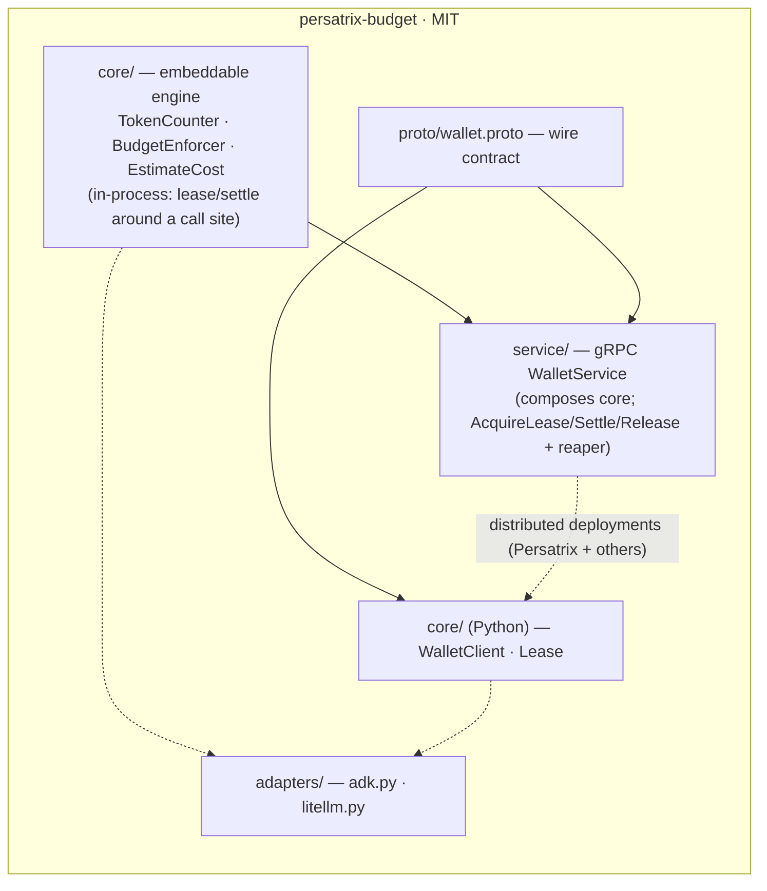

# RFC 0046 — Budget-Lease Library Extraction (`persatrix-budget`)

**Type**: architecture  
**Status**: 📋 Proposed  
**Author**: Maksim Khomutov  
**Date**: 2026-05-25  
**Target**: v0.4.0+ (gated on RFC-0045 acceptance + the dependency-direction CI gate)  
**Depends on**: RFC 0045 (Open-Core Library Extraction Policy — the governing policy this RFC inherits), RFC 0023 (LLM Call Leasing — the subsystem being extracted), RFC 0024 (Event-Driven Agent Scheduling — the idle-loop whose placement RFC 0045 deferred here)

---

## Table of Contents

- [Summary](#summary)
- [Motivation](#motivation)
  - [M-1. The flagship funnel asset is locked in BUSL](#m-1-the-flagship-funnel-asset-is-locked-in-busl)
  - [M-2. `internal/cost` cannot join the dependency-direction gate until it is split](#m-2-internalcost-cannot-join-the-dependency-direction-gate-until-it-is-split)
  - [M-3. Adoption needs an embeddable path, not only a gRPC service](#m-3-adoption-needs-an-embeddable-path-not-only-a-grpc-service)
  - [M-4. RFC 0045 deferred the event-loop placement decision to this RFC](#m-4-rfc-0045-deferred-the-event-loop-placement-decision-to-this-rfc)
- [Goals](#goals)
- [Non-Goals](#non-goals)
- [Design / Implementation](#design--implementation)
  - [A. What moves: the artifact inventory](#a-what-moves-the-artifact-inventory)
  - [B. The `internal/cost` split — the load-bearing seam-cut](#b-the-internalcost-split--the-load-bearing-seam-cut)
  - [C. Two-layer packaging: embeddable engine + gRPC service](#c-two-layer-packaging-embeddable-engine--grpc-service)
  - [D. The wire contract as public API](#d-the-wire-contract-as-public-api)
  - [E. Python client + framework adapters](#e-python-client--framework-adapters)
  - [F. Dependency-direction proof](#f-dependency-direction-proof)
  - [G. Sync model and how the core re-consumes the library](#g-sync-model-and-how-the-core-re-consumes-the-library)
  - [H. Event-loop placement resolution](#h-event-loop-placement-resolution)
- [Security Considerations](#security-considerations)
- [Phased Implementation Plan](#phased-implementation-plan)
- [Files Touched (Estimated)](#files-touched-estimated)
- [Test Strategy](#test-strategy)
- [Open Questions](#open-questions)
- [Decision / Next Steps](#decision--next-steps)
- [Related Documentation](#related-documentation)

---

## Summary

This is the **first per-extraction RFC** under the [RFC 0045](0045-open-core-extraction-policy.md) open-core policy, and the flagship one. It carves the [RFC 0023](0023-llm-call-leasing.md) LLM budget-lease — a *gate* that acquires a server-issued token lease before every model call and settles actuals after, fail-closed, multi-scope, provider-agnostic — out of the BUSL monorepo and into the standalone **MIT `persatrix-budget`** repository.

The lease *protocol* is already designed, shipped, and proven ([RFC 0023](0023-llm-call-leasing.md), implemented in v0.3.2). This RFC therefore designs **no new behavior**. It is pure seam-cutting under the policy: the exact files that move; the `internal/cost` split that lets the cost engine join the [RFC 0045 §B](0045-open-core-extraction-policy.md#b-the-dependency-direction-invariant) dependency-direction CI gate; a two-layer packaging that adds an **embeddable, no-gRPC** engine alongside the existing gRPC service; the explicit dependency-direction proof the policy's per-extraction contract requires; the [Option-A](0045-open-core-extraction-policy.md#d-source-of-truth-and-sync-model) sync model; the ADK + LiteLLM launch adapter set; and the resolution of the [RFC 0024](0024-event-driven-scheduling.md) event-loop placement question that RFC 0045 explicitly deferred here.

Per the policy, **no code moves under this RFC until [RFC 0045](0045-open-core-extraction-policy.md) is Accepted and its dependency-direction CI gate is merged green.** This RFC is authored ahead of that gate so the seam-cut design can be reviewed in parallel; its [Decision](#decision--next-steps) records the hard prerequisites.

## Motivation

### M-1. The flagship funnel asset is locked in BUSL

[RFC 0045 §M-1](0045-open-core-extraction-policy.md#m-1-reusable-infrastructure-is-locked-inside-a-non-permissive-repo) identifies the budget-lease as the clearest example of reusable infrastructure trapped behind a non-permissive license. The cost-control fear it answers is universal — the [README Cost Warning](../../README.md#%EF%B8%8F-cost-warning--read-before-running) opens with a real $35 incident, and [RFC 0023](0023-llm-call-leasing.md#motivation) documents that "cost is the recurring failure class on this project." The existing market is mostly *after-the-fact dashboards*; a *pre-call gate* is a differentiated primitive with an audience far larger than Persatrix itself. Of the [RFC 0045 §H candidate set](0045-open-core-extraction-policy.md#h-the-candidate-set-and-the-per-extraction-rfc-requirement), this is the one chosen to launch the funnel — so it is the one whose seams get cut first.

### M-2. `internal/cost` cannot join the dependency-direction gate until it is split

[RFC 0045 §B](0045-open-core-extraction-policy.md#b-the-dependency-direction-invariant) seeds the Go dependency-direction deny rule only on packages that are *already* leaf — `internal/wallet` and `internal/generated/walletpb` — and explicitly carries `internal/cost` as a deferred join, because Go deny rules match whole packages and one file in `internal/cost` reaches up into the orchestrator:

```
internal/cost/context_package_metrics.go
  → imports github.com/mkhomutov/persatrix/internal/executor/packaging
```

That single edge means `internal/cost` cannot be added to the gate while keeping CI green. The policy names the fix as *this* RFC's responsibility: "a seam-cut deferred to RFC 0023's extraction RFC and carried in its dependency-direction proof." Separating the embeddable cost engine from the orchestrator-coupled metrics path ([§B](#b-the-internalcost-split--the-load-bearing-seam-cut)) is therefore not optional polish — it is the load-bearing precondition for the cost engine to be MIT-eligible at all.

### M-3. Adoption needs an embeddable path, not only a gRPC service

Today the wallet is a Go gRPC service with Python agent clients ([RFC 0023 §D–E](0023-llm-call-leasing.md#d-go-wallet-service)). That topology is correct for a distributed deployment, but a solo developer bolting cost control onto a single LangChain or ADK script will not stand up a gRPC server. The funnel argument ([M-1](#m-1-the-flagship-funnel-asset-is-locked-in-busl)) only pays off if the *first five minutes* are trivial. So the extraction must expose **two layers**: an in-process engine anyone wraps a call site with, and the gRPC service for the distributed case ([§C](#c-two-layer-packaging-embeddable-engine--grpc-service)). The in-process layer is what earns stars; the service layer is what proves it scales — and quietly advertises the Persatrix architecture.

### M-4. RFC 0045 deferred the event-loop placement decision to this RFC

[RFC 0045 Open Questions](0045-open-core-extraction-policy.md#open-questions) records, under *"Deferred to successor RFCs"*: whether the [RFC 0024](0024-event-driven-scheduling.md) idle loop folds into the budget-lease repo (one "$0-when-idle, gated-when-active" story), ships as its own repo, or stays internal "is a seam-cut decided in the flagship extraction RFC." This RFC owns that decision ([§H](#h-event-loop-placement-resolution)).

## Goals

1. **Fix the exact artifact set** that moves into `persatrix-budget` ([§A](#a-what-moves-the-artifact-inventory)).
2. **Specify the `internal/cost` split** — which symbols form the embeddable engine and which stay BUSL with the orchestrator — so `internal/cost` (or its extracted successor) becomes leaf and joins the [RFC 0045 §B](0045-open-core-extraction-policy.md#b-the-dependency-direction-invariant) Go gate ([§B](#b-the-internalcost-split--the-load-bearing-seam-cut)).
3. **Define the two-layer packaging** — embeddable engine + gRPC service — with the embeddable path preserving the fail-closed invariant ([§C](#c-two-layer-packaging-embeddable-engine--grpc-service)).
4. **Treat `wallet.proto` as versioned public API** in its own right ([§D](#d-the-wire-contract-as-public-api)).
5. **Ship the core-plus-adapters structure** ([RFC 0045 §G](0045-open-core-extraction-policy.md#g-repo-structure-core-plus-adapters)) with ADK + LiteLLM as the launch adapters ([§E](#e-python-client--framework-adapters)).
6. **Provide the dependency-direction proof** the [RFC 0045 §H](0045-open-core-extraction-policy.md#h-the-candidate-set-and-the-per-extraction-rfc-requirement) per-extraction contract mandates ([§F](#f-dependency-direction-proof)).
7. **Adopt Option A** (monorepo-canonical, mirror-out) as the initial sync model, with the Option-B flip documented as a future step ([§G](#g-sync-model-and-how-the-core-re-consumes-the-library)).
8. **Resolve event-loop placement** ([§H](#h-event-loop-placement-resolution)).

## Non-Goals

- **No code moves under this RFC.** The move is gated on [RFC 0045](0045-open-core-extraction-policy.md) Accepted *and* its CI gate green ([Decision](#decision--next-steps)). This RFC designs the cut; it does not execute it.
- **No change to the lease protocol.** The AcquireLease / SettleLease / ReleaseLease semantics, the TTL reaper, the provisional/reconcile accounting, and the failure modes are exactly as [RFC 0023](0023-llm-call-leasing.md) ships them. Re-litigating them is out of scope.
- **No relicensing of the BUSL core.** The orchestrator, persona runtime, memory tiers, and the orchestrator-coupled cost paths that stay behind ([§B](#b-the-internalcost-split--the-load-bearing-seam-cut)) remain BUSL-1.1.
- **No Private tier, no billing.** The pluggable budget-policy / pricing seam that real metering will one day attach to ([RFC 0045 §C](0045-open-core-extraction-policy.md#c-the-private-tier-reserved-seams-and-the-no-retraction-rule)) is *reserved*, not built. The in-app wallet remains a simulation.
- **Not every adapter.** Only the launch set (ADK, LiteLLM) is in scope; LangChain/LangGraph and others follow demand, not this RFC.
- **No Option-B flip now.** `persatrix-budget` starts on Option A; the flip to repo-canonical is a future, demand-gated step ([§G](#g-sync-model-and-how-the-core-re-consumes-the-library)).

## Design / Implementation

### A. What moves: the artifact inventory

`persatrix-budget` is polyglot but tells one story — "a spending gate for LLM agents." The moved set, mapped to its destination layer:

| Source (monorepo) | Destination in `persatrix-budget` | Notes |
|-------------------|-----------------------------------|-------|
| `internal/cost` embeddable engine (TokenCounter, BudgetEnforcer, CostConfig + pricing, `EstimateCost`, provisional/reconcile) | `core/` (Go) — the in-process engine | Extracted via the [§B](#b-the-internalcost-split--the-load-bearing-seam-cut) split; the orchestrator-coupled files stay BUSL |
| `internal/wallet` (`wallet.go` servicer + lease state machine + reaper, `config.go`) | `service/` (Go) — the gRPC wrapper | Composes the `core/` engine |
| `proto/wallet.proto` | `proto/` — versioned wire contract | Public API in its own right ([§D](#d-the-wire-contract-as-public-api)) |
| `internal/generated/walletpb` | regenerated from `proto/` in-repo | Not copied as generated stubs; regenerated so the repo owns its codegen |
| `agents/wallet_client.py` (`WalletClient`, `Lease`, `BudgetExceededError`) | `core/` (Python) — the client | Already zero domain coupling |
| existing wallet + cost test suites (the `*_test.go` and `test_wallet_client*` files) | mirrored alongside their sources | Safety invariants travel with the code ([Test Strategy](#test-strategy)) |
| **new** | `adapters/adk.py`, `adapters/litellm.py` | The adoption lever ([§E](#e-python-client--framework-adapters)) |
| **new** | `examples/`, `LICENSE` (MIT), `NOTICE`, `CHANGELOG`, per-repo third-party inventory, CI | Per [RFC 0045 §F](0045-open-core-extraction-policy.md#f-naming-versioning-and-release-conventions) release hygiene |

### B. The `internal/cost` split — the load-bearing seam-cut

`internal/cost` is a single Go package today with 13 files. Exactly one production file, `context_package_metrics.go`, imports `internal/executor/packaging` to surface RFC 0008 context-packaging metrics through the orchestrator's cost endpoint ([M-2](#m-2-internalcost-cannot-join-the-dependency-direction-gate-until-it-is-split)). The split partitions the package by **whether a symbol is meaningful without the orchestrator**:

**Moves to `persatrix-budget/core` (MIT-eligible — passes the [RFC 0045 §A](0045-open-core-extraction-policy.md#a-the-three-tier-boundary) test):**
- `cost.go` — `TokenCounter` (three-scope totals: global / per-workflow / per-agent), `BudgetEnforcer.CheckBudget`, and the RFC 0023 `RecordProvisional` / `Reconcile` primitives.
- `config.go` — `CostConfig`, the model-name-keyed pricing table, and `EstimateCost` (pure math on `(model, input_tokens, output_tokens)`).
- The cost/budget/estimate/provisional/counter unit tests.

**Stays BUSL in the orchestrator (orchestrator-coupled — fails criterion 2 "leaf position"):**
- `context_package_metrics.go` + its test — the `internal/executor/packaging` dependency lives here. This is the orchestrator's RFC 0008 packaging-metrics surface, not a budget primitive.
- `reporter.go` — the orchestrator-side `/costs` reporting endpoint. Recommended disposition: stays BUSL ([Open Question 2](#open-questions)), since it is an orchestrator HTTP surface, not an embeddable primitive.
- `cache.go` — disposition decided at split time ([Open Question 2](#open-questions)); if it is a pure estimate cache with no orchestrator coupling it may move with `core`, otherwise it stays.

**Why this ordering is safe.** The orchestrator keeps depending *down-tier* on the extracted engine (BUSL → MIT is allowed by [RFC 0045 §B](0045-open-core-extraction-policy.md#b-the-dependency-direction-invariant)); only the orchestrator-coupled files are left behind, and they continue to import `internal/executor/packaging` from inside BUSL where that edge is legal. Once the split lands, the extracted engine package has no upward import and is added to the Go deny rule — closing the [RFC 0045 §B](0045-open-core-extraction-policy.md#b-the-dependency-direction-invariant) deferral. This mirrors the boundary-lint precedent [RFC 0029](0029-personal-society-storage-split.md) set one level down.

### C. Two-layer packaging: embeddable engine + gRPC service



- **Embeddable engine (`core`, Go).** The single-process path: acquire a provisional charge, run the call, reconcile actuals — no network, no server. Target consumer: a script that wants the *gate* without infrastructure. The fail-closed invariant ([Security](#security-considerations)) holds here exactly as in the service path: if a budget check denies, the call does not proceed.
- **gRPC service (`service`, Go).** The existing [RFC 0023 §D](0023-llm-call-leasing.md#d-go-wallet-service) `WalletService`, unchanged in behavior, now composing the extracted `core` engine. Target consumer: distributed deployments (Persatrix among them) where many agent processes share one budget authority.
- **Relationship.** The service is a thin server wrapper over the engine. A consumer picks the layer that matches their topology; the engine is the dependency, the service is the optional front.

### D. The wire contract as public API

Per [RFC 0045 §F](0045-open-core-extraction-policy.md#f-naming-versioning-and-release-conventions), `wallet.proto` is versioned as **public API in its own right**: a breaking proto change is a major version bump independent of the implementation version. Concretely:

- `proto/wallet.proto` is the source of truth in-repo; Go and Python stubs are **regenerated** from it (not copied from the monorepo's `internal/generated`), so the library owns its codegen and the contract is auditable in one place.
- The three RPCs (`AcquireLease`, `SettleLease`, `ReleaseLease`) and their messages are the frozen surface. The `Cause` enum's forward-compatible values travel as-is.
- Backward-incompatible changes follow SemVer-major; additive fields are minor. The contract version is documented in the repo `CHANGELOG` distinctly from the engine/service version.

### E. Python client + framework adapters

The Python client (`WalletClient`, `Lease`, `BudgetExceededError`) already has zero domain coupling and moves to `core/` as-is. The adapters are the [RFC 0045 §G](0045-open-core-extraction-policy.md#g-repo-structure-core-plus-adapters) adoption lever:

- **`adapters/adk.py` (launch).** Google ADK's callback model is a native fit: `before_model_callback` acquires the lease and, on denial, returns a short-circuit `LlmResponse` so no tokens are spent; `after_model_callback` settles from `llm_response.usage_metadata`. A Plugin variant wires it once across a `Runner`.
- **`adapters/litellm.py` (launch).** Hooking LiteLLM transitively covers CrewAI and the LiteLLM-backed long tail for one adapter's effort — the highest-leverage second adapter.
- **Usage normalization lives in the adapter.** Each framework surfaces token counts differently (ADK `usage_metadata`, LiteLLM standardized `usage`, raw SDK `response.usage`); the adapter maps the host's usage object onto the client's `settle(input_tokens=…, output_tokens=…)` signature. The `core` carries no framework imports.
- LangChain/LangGraph and others are **out of scope** for this RFC ([Non-Goals](#non-goals)); they follow observed demand.

### F. Dependency-direction proof

The [RFC 0045 §H](0045-open-core-extraction-policy.md#h-the-candidate-set-and-the-per-extraction-rfc-requirement) per-extraction contract requires an explicit proof that the [§B](0045-open-core-extraction-policy.md#b-the-dependency-direction-invariant) check passes for the moved set. For `persatrix-budget`:

| Moved unit | Upward imports after the cut? | Evidence |
|-----------|-------------------------------|----------|
| `core` Go engine (post-[§B](#b-the-internalcost-split--the-load-bearing-seam-cut) split) | None | The only upward edge (`context_package_metrics.go → internal/executor/packaging`) is left behind in BUSL; engine depends on stdlib + the pricing config only |
| `service` Go (`internal/wallet`) | None | Already leaf per [RFC 0045 §B](0045-open-core-extraction-policy.md#b-the-dependency-direction-invariant); depends on `core` (down-tier) + `walletpb` + `oklog/ulid`, `zap`, `grpc` |
| `walletpb` | None | Generated from the in-repo proto; the shared `internal/generated` (holding BUSL `logpb`/`taskpb`) is **not** moved |
| `WalletClient` (Python) | None | Confirmed zero domain coupling; depends on `grpc` + regenerated stubs |

**Mechanical enforcement.** After the split, the Go `depguard`/`go list` deny rule ([RFC 0045 §B](0045-open-core-extraction-policy.md#b-the-dependency-direction-invariant)) adds the extracted engine package to the list it already guards (`internal/wallet`, `internal/generated/walletpb`); the Python `import-linter` contract keeps `wallet_client` forbidden from importing orchestrator-coupled modules. Both run in the existing lint stage as hard gates. The proof is *that the gate is green with the engine added* — not a prose assertion.

### G. Sync model and how the core re-consumes the library

Per [RFC 0045 §D](0045-open-core-extraction-policy.md#d-source-of-truth-and-sync-model), `persatrix-budget` starts on **Option A — monorepo-canonical, mirror-out**: the monorepo stays the single source of truth, the public repo is a generated mirror (`git subtree split` to a read-only repo), and the dependency-direction check runs in the same CI that builds everything. While on Option A the BUSL core keeps the in-tree copy and does **not** depend on the mirror — there is no second source of truth to depend on.

The **Option-B flip** (repo-canonical; the monorepo consumes a published Go module + PyPI package; external PRs land directly; dogfooding becomes real) is a future, demand-gated step recorded here but not taken: it happens only once the public API has stabilized *and* external contribution demand is real, and the flip itself is documented when it occurs. This is the [evolvable-over-back-compat](../development-workflow.md) stance — no cross-repo coordination cost before the API earns it.

### H. Event-loop placement resolution

**Decision: the [RFC 0024](0024-event-driven-scheduling.md) event-driven idle loop stays internal to Persatrix (BUSL) for now. It is *not* folded into `persatrix-budget` and is *not* spun out as its own MIT repo.**

Rationale:

1. **It is a runtime, not a primitive.** The idle loop is a per-agent asyncio supervisor that *owns the execution loop*. Host frameworks (ADK's `Runner`, LangGraph's executor, CrewAI's kickoff) own theirs; a second runtime competes rather than composes. The budget-lease, by contrast, *bolts onto* whatever loop the host already runs — which is exactly why it is the funnel asset and the loop is not.
2. **It is coupled to BUSL salience.** The loop's `SalienceWake` path subscribes to `agents/memory`'s write bus — the BUSL memory tier. Extracting the loop cleanly means severing or stubbing that, which strips the feature of its motivation.
3. **The narrative survives without shipping the loop.** The "$0-when-idle, gated-when-active" story can be told in `persatrix-budget` docs and examples (an idle agent issues no leases, so it spends nothing) without shipping the runtime. The story is a *property of using the gate*, not a second artifact to maintain.
4. **Keeps the repo coherent.** `persatrix-budget` is a Go engine + service + proto + a thin Python client. Adding a Python asyncio runtime muddies the "one primitive" identity that makes the funnel legible.

This resolution is open to review pushback ([Open Question 1](#open-questions)); if a future forcing function (e.g. genuine external demand for a standalone idle-runtime) appears, it earns its own extraction RFC under the [RFC 0045](0045-open-core-extraction-policy.md) policy rather than riding this one.

## Security Considerations

- **Fail-closed invariant must survive the embeddable path.** The budget-lease is a safety-relevant artifact ([RFC 0045 §Security](0045-open-core-extraction-policy.md#security-considerations)): if a budget check denies or the authority is unreachable, the call must not proceed. The new in-process engine ([§C](#c-two-layer-packaging-embeddable-engine--grpc-service)) must preserve this exactly as the gRPC path does, with the [RFC 0023 §F](0023-llm-call-leasing.md#f-failure-modes) failure-mode tests carried into the repo and exercised in standalone CI. Weakening the guarantee to fit an embeddable form is not an acceptable simplification.
- **License-leak control.** The [§F](#f-dependency-direction-proof) dependency-direction proof and the merge-blocking gate are the primary control: an MIT package importing the BUSL orchestrator would distribute BUSL source under MIT terms. The `internal/cost` split ([§B](#b-the-internalcost-split--the-load-bearing-seam-cut)) is what makes the proof passable; until it lands, the cost engine is not MIT-eligible.
- **No secrets, fixtures, or internal config leave the tree.** The `git subtree split` mirror must carry only the moved source + tests + the new repo scaffolding — not `config/`, environment files, or monorepo fixtures. The per-repo third-party inventory is regenerated from the library's own dependency closure ([RFC 0045 §F](0045-open-core-extraction-policy.md#f-naming-versioning-and-release-conventions)), not partitioned from the monorepo's.
- **Proto as attack surface.** The wire contract is unchanged from [RFC 0023 §C](0023-llm-call-leasing.md#c-proto-surface); the existing token-count validation (rejecting negative/oversized estimates at the RPC boundary) travels with the service and stays a hard `InvalidArgument` gate.
- **Reserved private seam, not built.** The pluggable budget-policy / pricing surface that real billing would attach to is *reserved* per [RFC 0045 §C](0045-open-core-extraction-policy.md#c-the-private-tier-reserved-seams-and-the-no-retraction-rule); this RFC ships no metering. The no-retraction rule applies: nothing published here is later clawed back.

## Phased Implementation Plan

Ordered, condition-gated steps — no calendar commitments; each gates the next on an *event*, mirroring [RFC 0045 §Phased Rollout](0045-open-core-extraction-policy.md#phased-rollout).

### Phase 0: Prerequisites (owned by RFC 0045, not this RFC)

[RFC 0045](0045-open-core-extraction-policy.md) Accepted; the dependency-direction CI gate merged green on the already-leaf packages (`internal/wallet`, `internal/generated/walletpb`). **Hard gate: nothing below begins until this holds.**

### Phase 1: Split `internal/cost`

Partition the package per [§B](#b-the-internalcost-split--the-load-bearing-seam-cut) — embeddable engine separated from the `context_package_metrics.go` orchestrator path — entirely in-tree, behavior-preserving. Deliverable: the engine package is leaf and is added to the Go deny rule; CI green with it guarded. No repo exists yet; this is the cut that makes the engine MIT-eligible.

### Phase 2: Stand up the `persatrix-budget` skeleton

Create the repo and its mirror tooling (`git subtree split` target), the core-plus-adapters layout, MIT `LICENSE`, `NOTICE`, `CHANGELOG`, the DCO `CONTRIBUTING` scaffold, and standalone CI (build + test + the dependency-direction check). No product code yet.

### Phase 3: Move the Go engine + service + contract

Mirror the extracted `core` engine, the `service` gRPC wrapper, and `proto/wallet.proto`; wire in-repo codegen for `walletpb`. Land the in-process engine API and confirm the fail-closed tests pass standalone.

### Phase 4: Move the Python client + launch adapters

Mirror `WalletClient`/`Lease`; add `adapters/adk.py` and `adapters/litellm.py` with per-adapter usage-normalization tests; add `examples/` (embeddable-engine quickstart + one adapter walkthrough).

### Phase 5: Option-A→B flip (deferred)

Considered later, gated on API stability + real external contribution demand ([§G](#g-sync-model-and-how-the-core-re-consumes-the-library)). Out of scope to schedule here.

## Files Touched (Estimated)

| Component | Files | Change |
|-----------|-------|--------|
| Go orchestrator (cost) | `internal/cost/cost.go`, `internal/cost/config.go` + cost/budget/estimate/provisional/counter tests | Split out as the embeddable engine ([§B](#b-the-internalcost-split--the-load-bearing-seam-cut)); mirrored to `persatrix-budget/core` |
| Go orchestrator (cost, stays BUSL) | `internal/cost/context_package_metrics.go`, `reporter.go`, (`cache.go` TBD) + their tests | Remain in the orchestrator; keep the `internal/executor/packaging` edge inside BUSL |
| Go orchestrator (wallet) | `internal/wallet/wallet.go`, `config.go` + wallet tests | Mirrored to `persatrix-budget/service` (composes `core`) |
| Protos | `proto/wallet.proto` | Mirrored as the repo's versioned wire contract; stubs regenerated in-repo |
| Generated | `internal/generated/walletpb/*` | Regenerated in `persatrix-budget`; the shared `internal/generated` is **not** moved |
| Python agents | `agents/wallet_client.py` + `test_wallet_client*` | Mirrored to `persatrix-budget/core` (Python) |
| New (extracted repo) | `adapters/adk.py`, `adapters/litellm.py`, `examples/*`, `LICENSE`, `NOTICE`, `CHANGELOG`, `CONTRIBUTING` (DCO), CI config, per-repo third-party inventory | Created in `persatrix-budget` |
| CI (monorepo) | Go deny rule (`depguard`/`go list`), Python `import-linter` contract | Extended to guard the extracted engine package ([§F](#f-dependency-direction-proof)) |

## Test Strategy

- **Unit tests**: the existing `internal/cost` and `internal/wallet` Go suites and the `test_wallet_client*` Python suites travel with their sources and must pass in the standalone repo's CI — including the [RFC 0023 §F](0023-llm-call-leasing.md#f-failure-modes) failure-mode and reaper tests, which encode the fail-closed safety claim ([Security](#security-considerations)).
- **Integration tests**: the embeddable-engine path ([§C](#c-two-layer-packaging-embeddable-engine--grpc-service)) gets new tests proving lease→settle→reconcile end-to-end *without* the gRPC server, and proving denial short-circuits the call. The gRPC service path keeps its existing integration coverage.
- **Adapter tests**: each launch adapter ([§E](#e-python-client--framework-adapters)) gets a unit test for usage-normalization (host usage object → `settle` signature) and a denial-path test (gate denies → no spend).
- **Dependency-direction test**: the [§F](#f-dependency-direction-proof) gate is itself the proof — CI fails if the extracted engine gains an upward import. This runs in both the monorepo lint stage and the standalone repo CI.
- **Manual tests**: a quickstart smoke (`examples/`) that wraps a real provider call with the embeddable engine and observes a lease/settle, plus the ADK `before_model_callback` walkthrough.

## Open Questions

1. **Event-loop placement.** Resolved in [§H](#h-event-loop-placement-resolution): keep the [RFC 0024](0024-event-driven-scheduling.md) idle loop internal (BUSL) — it is a runtime that competes with host frameworks and is coupled to BUSL salience. Open to review pushback; a future standalone-runtime demand would earn its own extraction RFC.
2. **`cache.go` / `reporter.go` disposition.** `reporter.go` (the orchestrator `/costs` endpoint) is recommended to **stay BUSL**; `cache.go` moves with `core` only if it has no orchestrator coupling. Final partition confirmed at Phase 1 split time, carried in the dependency-direction proof.
3. **Repo naming.** Branded `persatrix-budget` per [RFC 0045 §F](0045-open-core-extraction-policy.md#f-naming-versioning-and-release-conventions). A neutral name is the [RFC 0045](0045-open-core-extraction-policy.md) per-extraction override path only if adoption friction is shown to dominate the funnel benefit; default is branded.
4. **Adapter breadth.** ADK + LiteLLM at launch ([§E](#e-python-client--framework-adapters)); LangChain/LangGraph and others are demand-gated, not specified here.
5. **Codegen toolchain in-repo.** Which `protoc`/`buf` setup the standalone repo uses to regenerate `walletpb` and the Python stubs — a Phase 2 mechanical detail, not a design choice.

## Decision / Next Steps

**Proposed decision:** adopt this seam-cut design for the flagship `persatrix-budget` extraction — the [§A](#a-what-moves-the-artifact-inventory) artifact set, the [§B](#b-the-internalcost-split--the-load-bearing-seam-cut) `internal/cost` split as the precondition for the cost engine to join the dependency-direction gate, the [§C](#c-two-layer-packaging-embeddable-engine--grpc-service) embeddable-engine + gRPC-service two-layer packaging, the [§D](#d-the-wire-contract-as-public-api) proto-as-public-API treatment, the [§E](#e-python-client--framework-adapters) core-plus-adapters structure with ADK + LiteLLM at launch, the [§F](#f-dependency-direction-proof) dependency-direction proof, [§G](#g-sync-model-and-how-the-core-re-consumes-the-library) Option A as the initial sync model, and the [§H](#h-event-loop-placement-resolution) decision to keep the idle loop internal.

**Hard prerequisites before any code moves** (Phase 0):

1. [RFC 0045](0045-open-core-extraction-policy.md) reaches **Accepted**.
2. The [RFC 0045 §B](0045-open-core-extraction-policy.md#b-the-dependency-direction-invariant) dependency-direction CI gate is merged green on the already-leaf packages.

**On those holding**, execute Phase 1 (the `internal/cost` split) first — it is the load-bearing cut and is the only step that touches the monorepo's component boundaries; the repo stand-up and mirroring follow.

**Sequence (ordered, no timelines):** RFC 0045 (policy) → **this RFC (budget-lease extraction)** → the low-coupling batch RFC (prompt-safety kit + mock provider + schemas), reserved as RFC 0047 per [RFC 0045 §H](0045-open-core-extraction-policy.md#h-the-candidate-set-and-the-per-extraction-rfc-requirement). The commercial-architecture (Private) RFC remains named-but-deferred until a forcing function.

## Related Documentation

- [RFC 0045 — Open-Core Library Extraction Policy](0045-open-core-extraction-policy.md) — the governing three-tier policy, dependency-direction invariant, sync model, governance, and reserved seams this RFC inherits
- [RFC 0023 — LLM Call Leasing](0023-llm-call-leasing.md) — the subsystem being extracted; its lease lifecycle, proto surface, wallet service, client integration, and failure modes are the unchanged substance
- [RFC 0024 — Event-Driven Agent Scheduling](0024-event-driven-scheduling.md) — the idle loop whose placement is resolved in [§H](#h-event-loop-placement-resolution)
- [RFC 0029 — Personal/Society Storage Split](0029-personal-society-storage-split.md) — the boundary-lint precedent the [§B](#b-the-internalcost-split--the-load-bearing-seam-cut) split mirrors one level up
- [LICENSE](../../LICENSE), [THIRD_PARTY_NOTICES.md](../../THIRD_PARTY_NOTICES.md), [NOTICE](../../NOTICE) — the BUSL terms and attribution conventions the extracted MIT repo re-bases
- [development-workflow.md](../development-workflow.md), [BRANCHING.md](../BRANCHING.md) — the evolvable-over-back-compat stance behind the Option-A default and how this RFC moves through its lifecycle
- [RFC README](README.md) — RFC process, reserved numbers, and format
