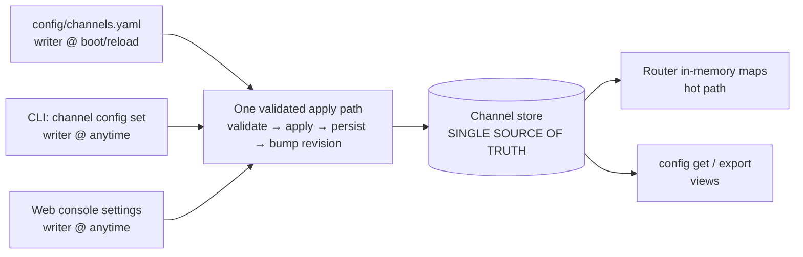

# RFC 0050 — Extensible Channel Configuration (Operator-Editable, Single Source of Truth)

**Type**: architecture  
**Status**: ✅ Accepted — **Phase 1 + Phase 2 (web settings panel) delivered**; RFC stays open (ISSUE-0103, the member-threshold slice, and Open item 4 — see [Progress](#progress) / [Phased Implementation Plan](#phased-implementation-plan))  
**Author**: Maksim Khomutov  
**Date**: 2026-06-14  
**Target**: v0.3.x (unscheduled)  
**Depends on**: RFC 0030 (multi-agent conversation governance), RFC 0048 (operator/tester web console)

---

## Progress

- **Phase 1 — code-complete** (2026-06-14). All 5 PRs of the
  [Phase 1 PR plan](0050-phase1-pr-plan.md) merged across 6 GitHub PRs (plan PR 5
  landed as two — the core verbs then the YAML follow-up): storage + migration
  v7→v8 (#640), apply path + boot repoint (#641), revision-gated YAML
  reconciliation + drift detection (#642), REST `PATCH/GET …/config` +
  `config_edit_enabled` toggle (#643), CLI `channel config get/set/unset` (#645)
  and `export/import/diff` (#646). Six of the seven governance knobs are
  runtime-editable; **interaction budget is store-persisted but not yet
  router-wired** (Open item 4 — live application deferred). Live G1 acceptance:
  [MT-CHANNEL-CONFIG-001](../manual-tests/MT-CHANNEL-CONFIG-001.md) — **first
  live run passed 2026-06-14** (all steps + edge cases green).
- **Phase 2 (web settings panel) — delivered** (2026-06-15). All 3 PRs of the
  [Phase 2 PR plan](0050-phase2-pr-plan.md) merged: capability threading +
  channel-config API client (#652), the `ChannelSettings.svelte` panel nested in
  `ChannelTimeline` (#653), and docs + the live web manual test + this status bump
  (PR 3). The slice is **web-only — zero Go changes**: it renders over the Phase 1
  `GET`/`PATCH …/config` endpoint behind the same `config_edit_enabled` toggle,
  which ships **off** so the panel lands dark. Live G4 (single-source-of-truth)
  acceptance: [MT-CHANNEL-CONFIG-002](../manual-tests/MT-CHANNEL-CONFIG-002.md) —
  edit a knob in the browser, the running channel honors it, and the CLI
  `channel config get` reads back the same value.
- **The RFC stays open past Phase 2.** Three items keep it from closing, none of
  them web-rendering work (RFC 0050 Phase 2 PR plan
  [Prerequisite + cross-phase dependencies](0050-phase2-pr-plan.md#prerequisite--cross-phase-dependencies-reconciling-with-the-rfc)):
  1. **Prerequisite —**
     [ISSUE-0103](../issues/ISSUE-0103-first-config-edit-detaches-yaml-seeded-knobs.md)
     (first-edit detachment of YAML-seeded knobs). Bounded today (the surface
     ships dark; only `planning` carries a non-default chair) but a silent-data-loss
     footgun once a UI invites operators to edit YAML-configured channels — **must
     be fixed before `config_edit_enabled` is flipped on in any real deployment.**
  2. **Editable member threshold** — the RFC's Phase 2 summary lists it, but it
     needs a member-config mutation endpoint that does not exist, so it was
     **deferred** out of the web-only workstream (a backend+web "Phase 2.5" slice).
  3. **Open item 4** — `interaction_budget_tokens` is store-persisted but not
     router-wired, so its inherited value reads back `null`; the panel renders it
     correctly but the knob is not yet live end-to-end.
- **Phase 3 (schema-driven generic config / profiles)** — future RFC.

## Table of Contents

- [Summary](#summary)
- [Motivation](#motivation)
- [Goals](#goals)
- [Non-Goals](#non-goals)
- [Design / Implementation](#design--implementation)
  - [Truth model: store-canonical, one apply path, three writers](#truth-model-store-canonical-one-apply-path-three-writers)
  - [Revision-gated YAML loader](#revision-gated-yaml-loader)
  - [The four mechanics](#the-four-mechanics)
  - [Migration](#migration)
- [Rejected Alternatives](#rejected-alternatives)
- [Security Considerations](#security-considerations)
- [Phased Implementation Plan](#phased-implementation-plan)
- [Files Touched (Estimated)](#files-touched-estimated)
- [Test Strategy](#test-strategy)
- [Open Questions](#open-questions)
- [Decision / Next Steps](#decision--next-steps)
- [Related Documentation](#related-documentation)

---

## Summary

Per-channel governance — floor control, end-vote quorum (K/W), reply budgets,
salience caps, idle timeouts, escalation chairs, member dispositions and
thresholds — is configured today only by hand-editing `config/channels.yaml`
and restarting the orchestrator so the `Resolve*` methods re-seed the router's
in-memory maps. The CLI can create a channel and send messages but cannot
change a knob; the web console can create a channel and add/remove members but
cannot edit governance after creation.

This RFC makes channel configuration **operator-editable at runtime from both
the CLI and the web console**, while keeping a **single source of truth**. It
adopts a store-canonical model in which the YAML loader, the CLI, and the web
console are all *writers* through one validated apply path, ordered by a
**per-channel revision**. At boot the YAML loader is **revision-gated**: a YAML
channel block applies only if its declared revision is newer than what the
store already holds. This lets config-as-code (GitOps) and live edits coexist
without either silently clobbering the other.

## Motivation

Two concrete pains, established while scoping this work:

1. **No live tuning (operator pain).** Changing any governance knob means edit
   YAML → restart orchestrator → wait for `ReconcileConfig` / `Resolve*`. There
   is no way for an operator to nudge `end_vote_window` or disable
   `floor_control` on a running channel. The router already exposes setters
   (`SetFloorControl` in `internal/channels/router.go`;
   `SetSalienceMaxChannelMembers`, `SetReplyBudget`, `SetEndVoteParams`,
   `SetEscalationChair` in the sibling `internal/channels/router_salience.go`,
   `reply_budget.go`, `end_vote.go`, `chair_escalation.go`); nothing wires them
   to a runtime request.

2. **Per-knob extension cost (developer pain).** Adding one governance knob
   today touches ~6 layers: YAML field → `ChannelConfig` struct
   (`internal/channels/config.go`) → `Resolve*` resolver → router field + mutex
   + setter/getter → `schemas/channel.schema.json` → REST DTO
   (`internal/server/channel_types.go`). And after all that, the knob is still
   unreachable from CLI or web.

If we do nothing, every new RFC-0030-style governance layer repeats the
six-layer cost and ships dark to operators until someone hand-edits YAML and
restarts a fleet.

This RFC scopes the **truth model and the editing surface**. Making new knobs
*cheap* (schema-driven generic config) and *organized* (profiles/inheritance)
are natural follow-ons that hang off the apply path defined here — see
[Non-Goals](#non-goals) and [Open Questions](#open-questions).

## Goals

Primary (the two drivers this RFC commits to):

1. **G1 — Operator self-service.** An operator changes a live channel's
   governance from the CLI or web console, without editing YAML, restarting the
   orchestrator, or redeploying. The change takes effect immediately and
   survives restart.
2. **G4 — One source of truth.** The CLI, the web console, and
   `config/channels.yaml` never present competing truths. All three read and
   write the same store through one validated path; no surface can express a
   value another cannot see.

Supporting (served as a consequence, not separately optimized here):

3. **G3 — Safe to change (partial).** Every config mutation is validated
   against the schema before apply, carries a revision, and is therefore
   ordered, diffable, and reversible. Full change-authorization and audit
   lineage are flagged as open questions.
4. **G5 — Discoverable.** `config get` surfaces the effective value of each
   knob *with provenance* (fleet default → channel → member), so "one source of
   truth" is visible, not merely asserted.

Deferred (named here so the [Non-Goals](#non-goals) references resolve; these
belong to the same goal family but are explicitly out of scope for this RFC):

- **G2 — Cheap to extend.** Adding a knob today touches ~6 layers; a
  schema-driven generic config would collapse the per-knob plumbing. Deferred
  (see Non-Goals).
- **G6 — Organized.** Reusable named profiles / presets with
  fleet→channel→member inheritance. Deferred (see Non-Goals).

## Non-Goals

- **Schema-driven generic config (G2 / cheap-to-extend).** Replacing the typed
  router maps with a single schema-validated settings document is the obvious
  next step and the apply path here is designed to host it, but this RFC does
  *not* re-architect the per-knob plumbing. Knobs stay typed for now.
- **Profiles / named presets (G6).** Inheritance beyond fleet→channel→member
  (e.g. reusable `debate-room` presets) is deferred to a follow-up RFC.
- **Unifying the RFC-0020 (interaction lifecycle / episode granularity) and
  RFC-0030 (governance interaction) id producers.** Out of scope, as in
  [ISSUE-0102](../issues/ISSUE-0102-closed-summary-episode-id-diverges-from-governance-interaction-id.md).
- **Free-form key/value config.** Config remains schema-validated and typed;
  "extensible" here means *editable and single-sourced*, not *untyped*.
- **A new governance layer.** No new knob is introduced; this is about how
  existing and future knobs are edited and reconciled.

## Design / Implementation

### Truth model: store-canonical, one apply path, three writers

The framing question — "when live edits and YAML disagree, who wins?" —
presupposes two competing truths. The design dissolves that: there is **one**
truth and everything else writes to it or views it.

The single truth is the **channel store (SQLite)**, because channels already
persist there and the router's runtime state is already seeded from it at
startup — YAML is *already not* the runtime truth, only a boot-time seed read
once by `Resolve*`.

All three writers funnel through **one apply path**:
`validate (schema) → apply (router setters) → persist (store) → bump revision`.
With one store, "who wins" stops being philosophical and becomes mechanical:
**the higher revision wins** (a revision-ordered last-writer-wins register).
Equal revisions are *not* a silent overwrite either way — they are treated as a
conflict and surfaced as drift (mechanic 4). G4 holds (one store); G1 holds (live
edits persist and survive restart, because they are written to the canonical
store, not just the in-memory maps).

### Revision-gated YAML loader

The only genuinely open behavioral choice is what the **YAML loader does at
boot** when the file differs from the store. **Decision: revision-gated.**

Each channel's config carries a monotonic **revision** owned by the store and
bumped on every apply (from any writer). A YAML channel block carries the
`revision:` it was exported at. At boot (and on reload) the loader applies a
YAML block **only if its `revision` is strictly greater than the store's
current revision** for that channel. GitOps pushes a change by exporting (which
stamps `store + 1`); live edits also bump the revision. Both paths coexist under
revision ordering (higher revision wins; equal-revision collisions surface as
drift, mechanic 4), and `config export` regenerates YAML from the store so the
committed file never silently lies.

### The four mechanics

1. **Granularity → per-channel revision.** A channel is already the unit of
   config and the unit of governance lineage (RFC 0030). File-level is too
   coarse (an edit to channel A would gate an unrelated change to channel B);
   per-key is too fine to reason about. One monotonic revision per channel.

2. **Authorship → store bumps on every write; YAML carries its exported
   revision.** The store owns the counter and bumps it on *any* writer's apply.
   Rollback is **write an older config as a new, higher revision** — never
   decrement. (State this explicitly; otherwise someone will try to set the
   revision backwards.)

3. **Foot-gun mitigation → export-first.** `config/channels.yaml` is
   hand-authored today, so humans *will* forget to bump `revision:`. The normal
   loop is therefore **export → edit → apply**, where `channel config export`
   stamps `revision: store + 1` automatically. Hand-editing still works but is
   the advanced path. **Caveat:** `export` *reads* the counter and does not
   reserve it, so if another writer bumps the store between export and the next
   boot, the committed `store + 1` is no longer strictly greater — it ties (→
   drift, mechanic 4) or loses (→ ignored). Export-first narrows the window but
   does not guarantee a committed GitOps change applies; see
   [Open Question 6](#open-questions).

4. **Drift detection → warn loudly, store stays authoritative.** If a YAML
   block's `revision` equals the store's but the *content hash* differs (someone
   live-edited without re-exporting, or edited YAML without bumping), the loader
   does **not** silently apply and does **not** silently ignore: it logs a drift
   warning and the divergence is surfaced in `config diff`. This is what keeps
   G4 honest — "one source of truth" only holds if divergence is *visible*.

### Migration

Existing `config/channels.yaml` entries have no `revision:` field. **Treat
absent revision as `0` / seed-only:** such a block applies only to a channel the
store has never seen (first-boot seeding) and never overrides an existing
store revision. Real revisions are introduced going forward (first `export`
stamps them). No flag-day, no rewrite of the committed config required.

## Rejected Alternatives

- **Config-as-code wins (YAML canonical; live edits are ephemeral overrides
  reconciled away on restart).** Cleanest for reproducibility but fails G1: an
  operator's live change vanishes on the next restart, which is not
  "self-service."
- **Live-edits-win without a revision (store canonical, YAML seed-only
  forever).** Satisfies G1 but quietly breaks G4 in the other direction: a
  committed YAML edit silently does nothing after first boot, so the file in git
  lies and GitOps has no way to push a change. Drift becomes invisible.
- **File-level or per-key revision granularity.** File-level couples unrelated
  channels under one counter; per-key explodes the bookkeeping and the diff
  surface. Per-channel is the right unit (mechanic 1).
- **Free-form key/value settings now.** Tempting for cheap extension (G2) but
  trades away typed validation; deferred so safety (G3) is not undercut before
  the editing surface exists.

## Security Considerations

- **Who may change governance.** Editing channel governance changes autonomous
  agent behavior (who may speak, when an interaction ends, how much budget is
  spent). The apply path needs an authorization gate; `governance.exempt_principals`
  already exists in config and is the natural seam. Scoping this gate is an
  [open question](#open-questions).
- **Blast radius.** Schema validation in the apply path bounds *malformed*
  config; it does not bound *hostile-but-valid* config (e.g. disabling floor
  control fleet-wide). Revision + `config diff` + drift warnings give detection;
  rollback gives recovery.
- **Auditability.** Every mutation bumps a revision and could mint / reference a
  governance interaction id, giving an attributable trail (reuses the ISSUE-0102
  lineage pattern). Whether config changes are recorded as governance
  interactions is an open question.

## Phased Implementation Plan

### Phase 1: Single apply path + per-channel revision + CLI get/set — ✅ delivered

**Summary.** Establish the canonical apply path and make existing knobs
editable from the CLI. No web work yet. **Delivered** across the 5 PRs of the
[Phase 1 PR plan](0050-phase1-pr-plan.md) (#640–#646); see
[Progress](#progress). One refinement the plan added during implementation: the
per-channel `revision` column alone was insufficient because the governance
knobs were not persisted in the store at all — so Phase 1 also persists the
sparse overrides themselves (a single `config_overrides_json` column), changing
the boot flow from *YAML → router* to *YAML →(revision-gated)→ store → router*.

Deliverables:
1. Per-channel `revision` column in the channel store; bumped on every apply.
2. One internal `ApplyChannelConfig(channelID, sparsePatch, expectedRevision?)`
   that validates against the schema, calls the existing router setters,
   persists, and bumps the revision.
3. `PATCH /api/v1/channels/{id}/config` (sparse `{key: value}`, `null` =
   unset→inherit) backed by that path, with optimistic concurrency via the
   revision (etag-style).
4. CLI: `channel config get <id>` (effective values + provenance),
   `channel config set <id> <key>=<value>…`, `channel config unset`,
   `channel config export <id>` / `import`, `channel config diff <id>`.
5. Drift detection in the boot loader (mechanic 4) + revision-gating (per the
   [Revision-gated YAML loader](#revision-gated-yaml-loader)) +
   absent-revision-as-seed migration (per [Migration](#migration)).

Dependencies: none beyond current RFC-0030 plumbing.

### Phase 2: Web console settings panel — ✅ delivered (web slice)

**Summary.** A settings panel alongside `ChannelMembers.svelte`, reading and
writing the Phase 1 endpoint; inherit/override toggles per knob. **Delivered**
across the 3 web-only PRs of the [Phase 2 PR plan](0050-phase2-pr-plan.md)
(#652, #653, + docs/closeout PR 3); see [Progress](#progress). The slice ships
**zero Go changes** — it renders over the landed Phase 1 endpoint behind the
default-off `config_edit_enabled` toggle, so the panel lands dark.

**Narrowed from the RFC's original Phase 2 scope:** **editable member
thresholds** were **deferred** — no member-config mutation endpoint exists, so
making thresholds editable is a backend+web slice ("Phase 2.5"), not a
render-over-landed-endpoints change. Closing RFC 0050 still requires that slice
(or an RFC amendment moving member-threshold editing out of Phase 2), plus
ISSUE-0103 and Open item 4 — see [Progress](#progress).

Dependencies: Phase 1.

### Phase 3 (future RFC): schema-driven generic config + profiles

Out of scope here; tracked as Non-Goals. The Phase 1 apply path is the host for
both.

## Files Touched (Estimated)

| Component | Files | Change |
|-----------|-------|--------|
| Go orchestrator | `internal/channels/router.go`, `internal/channels/config.go`, `internal/channels/config_validate.go` | Single apply path; revision-gated reconcile; drift detection |
| Go orchestrator | `internal/server/channel_handlers.go`, `internal/server/channel_types.go` | `PATCH …/config` endpoint + DTOs; optimistic concurrency |
| Storage | channel store (SQLite) + migration | Per-channel `revision` column (additive nullable) |
| Config / schema | `config/channels.yaml`, `schemas/channel.schema.json` | `revision:` field; export-stamped |
| Rust CLI | `cli/src/commands/channel_manage.rs` (+ new `channel_config.rs`) | `config get/set/unset/export/import/diff` |
| Web console | `web/src/panels/` (new settings panel; `ChannelMembers.svelte`) | Settings UI (Phase 2) |

## Test Strategy

- **Unit tests**: apply-path validation (reject malformed patch); revision bump
  monotonicity; revision-gating decision table (YAML newer / equal+same-hash /
  equal+diff-hash / older / absent); rollback-as-new-revision.
- **Integration tests**: `PATCH …/config` round-trips and persists across
  restart (G1); optimistic-concurrency conflict (two writers, stale revision
  rejected); `export → edit → import` round-trip; drift warning emitted on
  equal-revision content mismatch.
- **E2E / smoke**: CLI `config set` changes live channel behavior (e.g. flip
  `floor_control`, observe dispatch change) without restart.
- **Manual tests**:
  [MT-CHANNEL-CONFIG-001](../manual-tests/MT-CHANNEL-CONFIG-001.md) — live-edit a
  router-held governance knob (`interaction_idle_timeout_seconds`) from the CLI,
  confirm the running channel honors it without restart, and confirm it survives
  one (G1). *(Authored + first live run passed 2026-06-14 — all steps + edge
  cases green; the run also hardened three MT-procedure details: the
  join/restart membership-divergence hazard, the toggle-off GET gate, and the
  `channel create` syntax.)*

## Open Questions

1. **Authorization.** ✅ **Resolved for Phase 1** — gate the config-edit surface
   behind a feature toggle (`config_edit_enabled` on `channel_timeline` in
   `config/ui.yaml`, default off), mirroring the web-console `create_enabled`
   mechanism; it gates CLI and web uniformly. No dedicated operator role in
   Phase 1. (A non-UI toggle home, and a per-principal gate, remain revisitable —
   PR plan Open item 1.)
2. **Config-change lineage.** ✅ **Reserved (dormant) in Phase 1** — the nullable
   `config_change_lineage` column ships in the v7→v8 migration but is not
   populated; activating it (minting/referencing a governance interaction id per
   the ISSUE-0102 pattern) is a later additive change needing no migration. The
   revision counter + `config diff` carry v1.
3. **Profiles (G6).** Deferred — separate RFC. Does the Phase 1 store schema
   need a `profile_ref` seam reserved now to avoid a later migration?
4. **Schema-driven generic config (G2).** When (and whether) to collapse the
   typed router maps into a single schema-validated settings document hosted on
   this apply path.
5. **Reload trigger.** Is YAML re-evaluated only at process start, or also on a
   SIGHUP / `reconcile` command? Revision-gating works for both; this only
   decides *when* the loader runs.
6. **Export/apply revision collision.** Because `export` stamps `store + 1`
   without reserving it (mechanic 3), a writer that bumps the store between
   export and the next boot makes the committed GitOps revision tie or lose, so
   it does not apply — only a drift warning fires. Is the drift warning + manual
   re-export an acceptable v1 resolution, or does GitOps need a reserve-on-export
   (allocate the revision at export time) or a content-hash fast-forward (apply
   an equal-revision YAML block when its hash supersedes the store's)?

## Decision / Next Steps

**Decided** (this RFC records the decision, captured 2026-06-14):

- Primary goals: **G1 (operator self-service)** and **G4 (one source of truth)**.
- Truth model: **store-canonical; one validated apply path; three writers (YAML
  loader, CLI, web); higher per-channel revision wins (revision-ordered
  last-writer-wins), equal revisions surface as drift.**
- Boot rule: **revision-gated YAML loader.**
- The four mechanics (per-channel granularity; store-owned counter with
  export-stamped YAML revision; export-first to avoid the hand-bump foot-gun;
  loud drift detection with the store authoritative) and the absent-revision-as-
  seed migration.

**Open before implementation:** the [Open Questions](#open-questions) above —
chiefly authorization (Q1) and whether config changes carry governance lineage
(Q2). Neither blocks Phase 1's store schema if a `revision` column and an
optional lineage column are reserved up front (retrofitting revisions later is
the expensive part — include the column from day one even if the loader is
seed-only initially).

**Next step:** on acceptance, write the Phase 1 PR plan
(`0050-pr-plan.md`) — single apply path + per-channel revision + `config
get`/`set`.

## Related Documentation

- [RFC 0030 — Multi-Agent Conversation Governance](0030-multi-agent-conversation-governance.md) *(governance knobs this RFC makes editable)*
- [RFC 0048 — Operator/Tester Web Console](0048-operator-tester-web-console.md) *(console surface the settings panel extends)*
- [ISSUE-0102 — closed-summary episode id vs governance interaction id](../issues/ISSUE-0102-closed-summary-episode-id-diverges-from-governance-interaction-id.md) *(the revision/lineage pattern reused here)*
- [Channels guide](../guides/channels.md)
- [`config/channels.yaml`](../../config/channels.yaml), [`schemas/channel.schema.json`](../../schemas/channel.schema.json)
