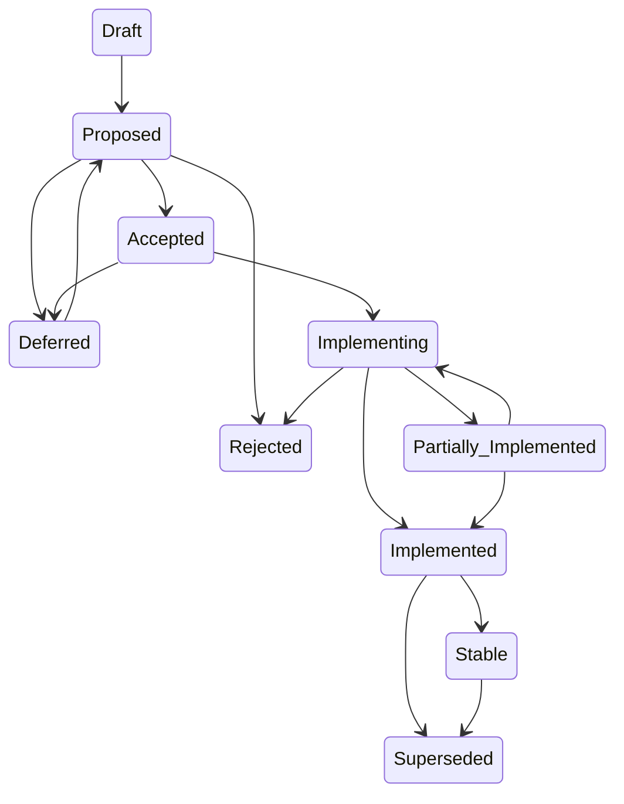

# RFC Process & Format Specification

> **Spec version**: 1.0  
> **Last updated**: 2026-04-25

> **Purpose:** Define the types, lifecycle, structure, and conventions for
> Request for Comments (RFC) documents in the Persatrix project. RFCs
> capture significant design decisions, architectural changes, and feature
> proposals that need cross-cutting review before implementation.
> "Cross-cutting" means touching multiple components (Go/Python/Rust),
> affecting the security model, changing protobuf contracts, or requiring
> input from multiple contributors or domain experts.
>
> **See also:** [Development Workflow](../development-workflow.md) — how RFCs fit into the broader version planning → implementation → closure lifecycle.

---

## Table of Contents

- [When to Write an RFC](#when-to-write-an-rfc)
- [When NOT to Write an RFC](#when-not-to-write-an-rfc)
- [RFC Types](#rfc-types)
- [RFC Lifecycle](#rfc-lifecycle)
- [File Naming Convention](#file-naming-convention)
- [Required Document Structure](#required-document-structure)
- [Frontmatter Reference](#frontmatter-reference)
- [Section Reference](#section-reference)
- [Cross-Referencing Rules](#cross-referencing-rules)
- [Divergence Tracking](#divergence-tracking)
- [Checklist for New RFCs](#checklist-for-new-rfcs)
- [Checklist for Updating an Existing RFC](#checklist-for-updating-an-existing-rfc)

---

## When to Write an RFC

An RFC is **required** when a change:

- Introduces or modifies the **protobuf contract** between orchestrator and agents.
- Changes **agent permission model** or security gates.
- Adds a **new component** or fundamentally changes component boundaries (Go/Python/Rust).
- Proposes a **new protocol** (A2A, MCP bridge changes, mesh networking).
- Introduces **cross-cutting architectural changes** that touch multiple layers.
- Changes **workflow execution semantics** (DAG scheduling, state management).
- Adds **external service dependencies** (cloud APIs, LLM providers).
- Advances the project to a **new development phase** (v0.1 → v0.2 → v0.3).

## When NOT to Write an RFC

- Bug fixes, refactors, or test additions that don't change public behavior.
- Adding a new tool to an agent that follows established patterns.
- Documentation-only changes.
- Dependency version bumps (unless they change security posture).
- Config changes that stay within existing schema definitions.

---

## RFC Types

Every RFC declares exactly one **type** in its frontmatter.

| Type | Code | Purpose | Examples |
|------|------|---------|----------|
| **Feature** | `feature` | Propose a new user-facing capability | Persona agents, memory tiers, sub-agent spawning |
| **Architecture** | `architecture` | Change component boundaries, data flow, or system topology | New internal package, async runtime switch, mesh networking |
| **Protocol** | `protocol` | Modify or introduce communication protocols | Protobuf changes, A2A protocol, MCP bridge |
| **Process** | `process` | Change development, release, or operational processes | CI pipeline redesign, release cadence change |

### Required Sections by Type

| Section | Feature | Architecture | Protocol | Process |
|---------|:-------:|:------------:|:--------:|:-------:|
| Summary | ✅ | ✅ | ✅ | ✅ |
| Motivation | ✅ | ✅ | ✅ | ✅ |
| Goals | ✅ | ✅ | ✅ | ✅ |
| Non-Goals | ✅ | ✅ | ✅ | ⬚ |
| Design / Implementation | ✅ | ✅ | ✅ | ✅ |
| Security Considerations | ✅ | ✅ | ✅ | ⬚ |
| Migration Path | ⬚ | ⬚ | ✅ | ⬚ |
| Phased Implementation Plan | ✅ | ✅ | ✅ | ⬚ |
| Files Touched (Estimated) | ✅ | ✅ | ✅ | ⬚ |
| Test Strategy | ✅ | ✅ | ✅ | ⬚ |
| Open Questions | ✅ | ✅ | ✅ | ✅ |
| Decision / Next Steps | ✅† | ✅† | ✅† | ✅† |
| Related Documentation | ⬚ | ⬚ | ⬚ | ⬚ |

✅ = Required | ⬚ = Optional (include if relevant) | — = Not applicable

† **Decision / Next Steps** is required for Draft through Implemented statuses. Once an RFC reaches **Stable**, this section may be removed.

---

## RFC Lifecycle



| Status | Marker | Meaning |
|--------|--------|---------|
| **Draft** | 🔨 Draft | Author is still writing; not ready for review. |
| **Proposed** | 📋 Proposed | Complete and open for review. No implementation yet. |
| **Accepted** | 👍 Accepted | Reviewed, approved, ready to implement. |
| **Implementing** | 🚧 Implementing | Implementation is actively in progress. |
| **Implemented** | ✅ Implemented | Fully implemented, tested, and merged. |
| **Partially Implemented** | ⚠️ Partially Implemented | Some phases are complete; others remain. |
| **Rejected** | ❌ Rejected | Reviewed and declined. Keep the file for historical record. |
| **Deferred** | 🔮 Deferred | Valid proposal but postponed. Record reason. |
| **Stable** | 🚀 Stable | Fully proven in production. Planning sections may be removed. |
| **Superseded** | 🔄 Superseded | Replaced by a newer RFC. |

### Status Transition Rules

1. Only the **author or a project maintainer** may advance status.
2. Moving from **Proposed → Accepted** requires explicit review approval.
3. Moving to **Implemented** requires all phases in the implementation plan to be complete and tested.
4. **Rejected** and **Deferred** RFCs keep their file — do not delete them.
5. When an RFC is **Superseded**, the old RFC must reference the replacement.

---

## File Naming Convention

```
docs/rfcs/NNNN-kebab-case-short-title.md
```

- **NNNN**: Zero-padded four-digit sequence number, monotonically increasing.
- **kebab-case-short-title**: Concise, descriptive, kebab-case slug (3–7 words).
- Next available number: check the highest existing RFC number and increment, **skipping any reserved numbers** (see below).

### Reserved RFC Numbers

Some RFC numbers are reserved for previously scoped topics that do not yet have a written document. When picking the next available number, skip these:

| RFC | Reserved for | Target version |
|-----|--------------|----------------|
| 0010 | Sub-Agent Spawning | v0.4.0 |
| 0011 | Channels + Bridges | v0.3.0 (internal) + v0.5.0 (external) |
| 0012 | Protocols + Organizations | v0.4.0 (partial) + v0.5.0 (remainder) |
| 0023 | Episodic Memory Quality (JSON summary schema only — narrowed scope; recency boost moved to [0008 calibration review](0008-calibration-review.md), `key_facts` carved out into [RFC 0026](0026-declarative-facts-tier.md)) | v0.3.x |
| 0024 | Episodic Vector Recall — deferred; gated on [MT-MEMORY-005](../manual-tests/MT-MEMORY-005-dementia-test.md) data showing BM25 misses on multi-turn summaries | v0.3.x or v0.4.0 |
| 0025 | Thematic Episode Clustering — superseded by [RFC 0027 — Reflection-Driven Consolidation](0027-reflection-driven-consolidation.md) per the [memory-quality roadmap](../memory-quality-roadmap.md#e-reflection-driven-consolidation-not-llm-clustering); slot retained for historical record | superseded |

This is why the current sequence on disk is 0001–0009 + 0013–0022 + 0026–0027 — RFC 0015 (Process Automation) was written after the 0010–0012 reservations were already in place; RFCs 0023–0025 are reserved per the memory-quality assessment in [memory-quality-roadmap.md](../memory-quality-roadmap.md). Source of truth for reservations is the [ROADMAP.md RFC Master Index](../../ROADMAP.md#rfc-master-index).

Examples:
- `0001-persona-agent-architecture.md`
- `0002-mesh-networking-protocol.md`

---

## Frontmatter Reference

| Field | Required | Format | Example |
|-------|:--------:|--------|---------|
| **Type** | ✅ | One of: `feature`, `architecture`, `protocol`, `process` | `feature` |
| **Status** | ✅ | `[emoji] [Label]` from the lifecycle table | `📋 Proposed` |
| **Author** | ✅ | Name or GitHub handle | `Maksim Khomutov` |
| **Date** | ✅ | `YYYY-MM-DD` (creation date) | `2026-04-08` |
| **Target** | ✅ | Development phase or timeline | `v0.2` |
| **Depends on** | ⬚ | Comma-separated `RFC NNNN` references | `RFC 0001` |
| **Superseded by** | ⬚ | Single `RFC NNNN` reference | `RFC 0008` |

---

## Divergence Tracking

When implementation diverges from the RFC design, add a `## Divergence from RFC NNNN` section:

```markdown
### D[N]. [Short description]

- **RFC expectation**: [What the RFC specified]
- **Current behavior**: [What the code actually does]
- **Impact**: [Who/what is affected; severity]
- **Resolution**: [Accepted divergence / planned fix / canonical source]
```

---

## Checklist for New RFCs

- [ ] File name follows `NNNN-kebab-case-short-title.md` convention.
- [ ] Frontmatter includes all required fields (Type, Status, Author, Date, Target).
- [ ] All required sections for the declared type are present.
- [ ] Table of Contents matches actual headings.
- [ ] Status is set to `📋 Proposed` (or `🔨 Draft` if incomplete).
- [ ] Links to canonical docs use relative paths.
- [ ] Security Considerations section is substantive (not just "N/A").
- [ ] Open Questions are numbered.

---

## Checklist for Updating an Existing RFC

- [ ] Status marker updated to reflect current state.
- [ ] Divergences documented using the standard `D[N]` format.
- [ ] Table of Contents still accurate after edits.
- [ ] If superseded, old RFC references the new one.
